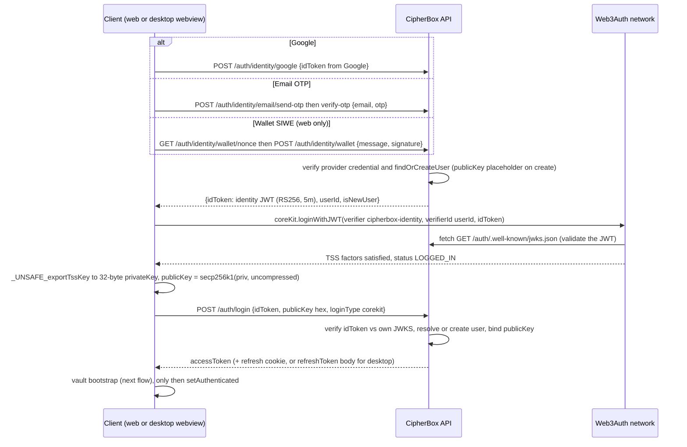
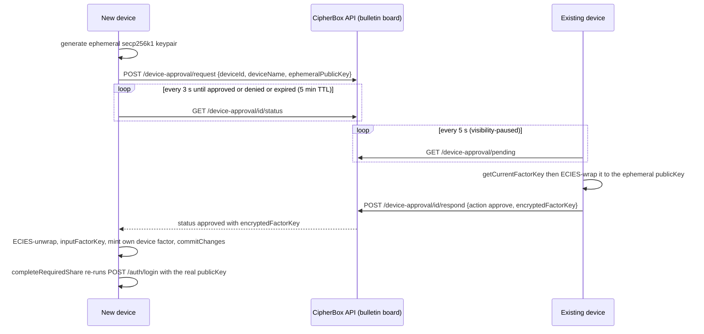

# Auth and key derivation

| | |
| --- | --- |
| **Kind** | flow |
| **Sources** | `apps/api/src/auth/` (auth.controller, auth.service, controllers/identity.controller, services/jwt-issuer, services/token, services/web3auth-verifier, services/siwe, services/email-otp, services/google-oauth, services/test-auth, services/auth-method, strategies/jwt.strategy, guards/jwt-auth.guard, entities, dto), `apps/api/src/device-approval/`, `apps/api/src/vault/` (vault.controller, vault.service, entities/vault.entity, dto/init-vault.dto), `apps/web/src/lib/web3auth/` (core-kit, core-kit-provider, hooks), `apps/web/src/hooks/useAuth.ts`, `apps/web/src/hooks/useMfa.ts`, `apps/web/src/hooks/useDeviceApproval.ts`, `apps/web/src/stores/` (auth.store, vault.store, mfa.store), `apps/web/src/lib/api-config.ts`, `apps/web/src/lib/clear-user-stores.ts`, `apps/web/src/lib/device/identity.ts`, `packages/api-client/src/instance.ts`, `packages/core/src/vault/` (blob, init, types), `packages/crypto/src/vault/derive-ipns.ts`, `packages/crypto/src/keys/derive.ts`, `packages/sdk/src/client.ts` (vault facades), `packages/sdk-core/src/vault/index.ts`, `apps/desktop/src/auth.ts`, `apps/desktop/src/main.ts`, `apps/desktop/src-tauri/src/` (main.rs, commands/auth.rs, commands/debug.rs, commands/oauth.rs, commands/vault.rs, commands/util.rs, keychain.rs, state.rs, fuse/mod.rs), `crates/sdk/src/state.rs`, `crates/fuse/src/fs.rs`, `docs/AUTHENTICATION_ARCHITECTURE.md`, `.planning/adr/001-external-wallet-key-derivation.md` |
| **Verified against** | cipher-box `27c4abec5` |
| **Status** | draft |

## Purpose and scope

Every secret in CipherBox chains up to one secp256k1 keypair per user: `privateKey`
decrypts the vault-key blob (and, through it, every folder/file key), `publicKey` is the
user's server-side identity and the ECIES wrapping target for everything owed to them.
This flow covers how that keypair comes to exist and where it lives: the CipherBox
backend acting as its own OIDC issuer for a Web3Auth custom verifier, MPC Core Kit login
and TSS key reconstruction, the CipherBox access/refresh token lifecycle, MFA factor
management and cross-device approval, the vault bootstrap where a fresh keypair becomes a
vault (VaultKeyBlob v3 + root node), and per-client session lifecycle and key-material
residency (web and desktop, including the `--dev-key` path).

It does **not** cover the folder metadata the bootstrap publishes
([flows/metadata-sync.md](metadata-sync.md), [parts/core-codecs.md](../parts/core-codecs.md)),
TEE enrollment mechanics beyond where auth hands them off
([flows/republish-liveness.md](republish-liveness.md)), or the API's non-auth surface
([parts/api.md](../parts/api.md)). The ECIES/HKDF primitives belong to
[parts/crypto.md](../parts/crypto.md).

One framing note: the token exchange is often described as "challenge/verify". As built
it is not a generic challenge/verify pair — it is **method-specific identity endpoints**
(phase 1) followed by a single generic `POST /auth/login` (phase 2), with Web3Auth's
network in between.

## Vocabulary

- **`privateKey` / `publicKey`** — the user's secp256k1 keypair. `privateKey` is 32
  bytes, reconstructed client-side each session; `publicKey` is the 65-byte uncompressed
  (`04`-prefixed) form, hex on the wire, and is the user's unique identity in the DB.
- **Identity JWT** — a short-lived RS256 JWT *issued by the CipherBox API itself*
  (`iss: cipherbox`, `aud: web3auth`, `sub: userId`, 5-minute expiry) that proves to
  Web3Auth's network that CipherBox authenticated this user.
- **Custom verifier `cipherbox-identity`** — the Web3Auth verifier registered against
  CipherBox's JWKS; `(verifier, verifierId=userId)` deterministically maps to one TSS
  keypair, regardless of which login method produced the identity JWT.
- **TSS / factor** — Web3Auth MPC Core Kit splits the keypair into threshold shares
  ("factors"). CipherBox does not use distributed signing: it calls
  `_UNSAFE_exportTssKey()` every session to reconstruct the full `privateKey` in client
  memory.
- **hashedShare** — the pre-MFA cloud-custodial factor on Web3Auth's metadata server,
  deleted by `enableMFA()`.
- **Device share / recovery share** — post-MFA user-controlled factors: a factor key in
  browser `localStorage`, and a 24-word BIP-39 mnemonic.
- **`pending-core-kit-{userId}`** — placeholder `publicKey` stored on a user row before
  the first successful Core Kit login resolves the real key; also used as a literal
  `publicKey` value for scoped temp auth during `REQUIRED_SHARE`.
- **Access / refresh token** — CipherBox session tokens: HS256 JWT (15 min) and an
  opaque rotating refresh token (7 days, argon2-hashed at rest).
- **VaultKeyBlob v3** — the binary recovery blob (`0x03` version byte) holding
  `rootReadKey` and `rootWriteKey`, each ECIES-wrapped to the owner `publicKey`,
  published on a dedicated HKDF-derived IPNS name.
- **`--dev-key`** — desktop debug-build flag that swaps the whole Web3Auth stack for the
  API's deterministic test-login.

## Actors and trust boundaries

| Actor | Sees | Must never see |
| --- | --- | --- |
| Web client (browser JS) | `privateKey` and all derived keys in memory for the session; identity JWT; access token; Core Kit factor shares in `localStorage` | — (it is the trust root) |
| Desktop client (Tauri webview JS) | identity JWT, `privateKey` transiently (handed to Rust via `invoke`), Core Kit factor shares in webview `localStorage` | — |
| Desktop Rust process (incl. in-process FUSE thread) | `privateKey`, `publicKey`, root keys, access token in memory; refresh token in OS keychain | — |
| CipherBox API | `publicKey`, hashed auth identifiers, argon2-hashed refresh tokens, hashed OTPs, SIWE nonces, ECIES ciphertexts (vault blob relayed as opaque bytes, device-approval factor-key ciphertext) | `privateKey`, any factor key plaintext, `rootReadKey`/`rootWriteKey`, OTPs/refresh tokens in plaintext at rest |
| Web3Auth network (DKG nodes + metadata server) | TSS shares it custodies (JWT-verifier share always; hashedShare pre-MFA); the identity JWT during verification | the reconstructed `privateKey` post-MFA (threshold 2, it holds 1 factor); anything about the vault |
| Google / SendGrid | OAuth identity / OTP email delivery | anything past the identity phase |
| Postgres / Redis | what the API stores (hashes, ciphertexts, bookkeeping) | plaintext secrets |

Trust structure: CipherBox's backend is the *identity* authority (it decides which
`userId` a Google account, email, or wallet maps to — and therefore which TSS key), but
never a *key* authority. Pre-MFA the key custody is effectively "trust Web3Auth" (both
required factors live in their infrastructure); post-MFA Web3Auth alone cannot
reconstruct the key (`docs/AUTHENTICATION_ARCHITECTURE.md` §5). The API authenticates
requests by JWT possession; it binds `publicKey` to `userId` at login and never sees the
private half.

## Data structures

### Identity JWT (API → client → Web3Auth, transient)

Minted by `JwtIssuerService.signIdentityJwt` (`apps/api/src/auth/services/jwt-issuer.service.ts:57-76`):
header `{alg: 'RS256', kid: 'cipherbox-identity-1'}` (KID constant `:5`), claims
`sub: userId`, optional `email`, optional `providerSubject`, `iss: 'cipherbox'`,
`aud: 'web3auth'`, `exp: 5m` (`:69-75`). Signing key from `IDENTITY_JWT_PRIVATE_KEY`
(base64-encoded PKCS8 PEM, `:18-24`); required in production, otherwise an **ephemeral**
RS256-2048 keypair is generated at boot (`:31-46`) — dev identity JWTs die with the API
process. Public JWK served at `GET /auth/.well-known/jwks.json`
(`controllers/identity.controller.ts:55-69`, `Cache-Control: public, max-age=3600`).
Note the path: it is under the `auth` controller prefix, **not** root
`/.well-known/jwks.json` as `docs/AUTHENTICATION_ARCHITECTURE.md:56` claims.

### `LoginDto` (client → `POST /auth/login`)

`apps/api/src/auth/dto/login.dto.ts`:

| Field | Validation | Meaning |
| --- | --- | --- |
| `idToken` | non-empty string | the CipherBox identity JWT, replayed back after Core Kit login |
| `publicKey` | `/^(04[0-9a-fA-F]{128}\|pending-core-kit-.+)$/` (`:23`) | TSS-derived uncompressed key hex, or the placeholder for `REQUIRED_SHARE` temp auth |
| `loginType` | `@IsIn(['corekit'])` — the only value (`:4`, `:35-37`) | historical discriminator |

Response `LoginResponseDto`: `{accessToken, isNewUser}` for web (refresh token set as a
cookie); `{accessToken, refreshToken, isNewUser}` when the request carries
`X-Client-Type: desktop` (`auth.controller.ts:77-97`).

### CipherBox access token (HS256 JWT, memory-only)

Signed with `JWT_SECRET` (`auth.module.ts:29`), TTL `ACCESS_TOKEN_TTL` env, default
`'15m'` (`services/token.service.ts:32-33`). Claims: `{sub: userId, publicKey}` plus an
optional `scope: string[]` (`:47-50`). `JwtStrategy.validate` loads the full `User` row
by `sub` and attaches it (plus `scope`) as `req.user`
(`strategies/jwt.strategy.ts:35-46`). `JwtAuthGuard` enforces scope: an unscoped token
passes everywhere; a scoped token passes only routes decorated with a matching
`@AllowScope(...)` — scoped token on an undecorated route → 403
(`guards/jwt-auth.guard.ts:21-44`). The only scope in use is `'device-approval'`.

### `refresh_tokens` (DB table) + cookie

`entities/refresh-token.entity.ts`: `id`, `userId` (FK CASCADE), `tokenHash` (argon2),
`tokenPrefix` varchar(16) — first 16 chars in plaintext for candidate lookup —
`expiresAt`, `revokedAt`, `createdAt`. The token itself is 32 random bytes hex, stored
**only argon2-hashed** (`token.service.ts:61-75`); TTL 7 days
(`REFRESH_TOKEN_EXPIRY_DAYS = 7`, `:24`). **Write discipline**: rotation-on-use — refresh
verifies by prefix + argon2, revokes the matched row, mints a new pair
(`auth.service.ts:257-316`); logout revokes all of the user's live rows
(`token.service.ts:128-130`); expired rows are skipped lazily, there is no purge job.
Web cookie: `refresh_token`, `httpOnly`, `secure` in production, `sameSite: 'lax'`,
`path: '/auth'`, `maxAge` 7 days (`auth.controller.ts:38-44`).

### `users` + `auth_methods` (DB tables)

`entities/user.entity.ts`: `id` uuid PK, **`publicKey` unique** (`:17-18`) — either the
real 130-hex-char uncompressed key or a `pending-core-kit-*` placeholder. No
`derivation_version` column exists (ADR-001 claims backend version tracking; it was
never in this schema — see Known gaps). `entities/auth-method.entity.ts`:
`type: 'google'|'apple'|'github'|'email'|'wallet'` (string-literal union, `:11`),
`identifier_hash` (SHA-256 of the canonical identifier: Google `sub`, normalized email,
EIP-55 wallet address), `identifier_display` (human-readable, `'[redacted]'` fallback),
`lastUsedAt`. Linking is explicit-only — no cross-method auto-merge; a hash collision
with another account's method → 400 (`services/auth-method.service.ts:164-177`); the
last method cannot be unlinked (`:103-105`). No DB-level unique constraint backs the
collision check — it is application-level.

### Core Kit factor model (Web3Auth-side, summarized)

Per `docs/AUTHENTICATION_ARCHITECTURE.md` §3–4 (verified behaviorally by
`useMfa.ts`): pre-MFA `totalFactors: 2` (internal JWT-verifier share + hashedShare),
threshold 2, both inside Web3Auth — semi-custodial. `enableMFA()` deletes the
hashedShare and creates a device share (browser `localStorage`, module `DeviceShare`)
plus a recovery share (module `SeedPhrase`, surfaced as a 24-word mnemonic); threshold
stays 2 of now-3. MFA status is detected purely client-side as
`getKeyDetails().totalFactors > 2` (`apps/web/src/hooks/useMfa.ts:48-49`); the CipherBox
backend has no MFA state.

### `device_approvals` (DB bulletin board)

`apps/api/src/device-approval/device-approval.entity.ts` +
`device-approval.service.ts`: rows `{deviceId, deviceName, ephemeralPublicKey, status,
encryptedFactorKey?, respondedByDeviceId?, expiresAt}`. TTL 5 minutes
(`TTL_MS = 5 * 60 * 1000`, `device-approval.service.ts:9`); pending rows past
`expiresAt` auto-flip to `expired` on read (`:72-74`). The server stores only the ECIES
ciphertext of the factor key — end-to-end encrypted between the two devices.

### VaultKeyBlob v3 (IPFS blob, the auth↔vault seam)

Codec `packages/core/src/vault/blob.ts` — raw binary, no JSON/CBOR, designed to port to
Rust (`:9-13`):

```text
0x03 | u16_BE(readLen) | ECIES(rootReadKey → publicKey) | u16_BE(writeLen) | ECIES(rootWriteKey → publicKey)
```

`BLOB_V3_VERSION = 0x03` (`:17`). Deserialize rejects anything whose first byte is not
`0x03` (`'Not a v3 vault blob'`, `:95-97`) — Phase 62 was a hard cut; v1/v2 blobs are
rejected, never migrated. Returned key buffers are `.slice()` copies so zeroizing the
source blob cannot corrupt them (`:109-112`). The root Ed25519/IPNS material is **not**
in the blob — it is re-derived from `privateKey` on every load (below). The blob lives
as an IPFS blob whose CID is published on the HKDF-derived vault-key `ipnsName`; the DB
never stores it. Ownership structures of what the keys unlock belong to
[parts/core-codecs.md](../parts/core-codecs.md).

### Deterministic HKDF derivations (from `privateKey`)

`packages/crypto/src/vault/derive-ipns.ts`, all HKDF-SHA256, 32-byte output
(`packages/crypto/src/keys/derive.ts:62-71`), shared salt `'CipherBox-v1'` (`:28`),
per-purpose info (`:29-32`):

| Function | `info` | Yields |
| --- | --- | --- |
| `deriveVaultIpnsKeypair` | `'cipherbox-vault-ipns-v1'` | root folder Ed25519 seed → `ipnsName` |
| `deriveVaultKeyIpnsKeypair` | `'cipherbox-vault-key-ipns-v1'` | vault-key blob `ipnsName` |
| `deriveByoConfigIpnsKeypair` | `'cipherbox-byo-ipfs-config-v1'` | BYO pinning config name |
| `deriveVaultSettingsIpnsKeypair` | `'cipherbox-vault-settings-v1'` | vault settings name |

Consequence: whoever reconstructs `privateKey` can recover the entire vault with no
server-side key material at all — the basis of
[flows/vault-export-recovery.md](vault-export-recovery.md).

### `vaults` (DB table) + `POST /vault/init`

`apps/api/src/vault/entities/vault.entity.ts`: `id`, `ownerId` (unique index — one vault
per user, `:18-20`), `ownerPublicKey` bytea (65-byte uncompressed), `rootIpnsName`,
`isByoUser`, `createdAt`, `initializedAt` (null until first upload). `InitVaultDto`
carries only `ownerPublicKey` (hex) + `rootIpnsName`
(`dto/init-vault.dto.ts:9-26`) — zero crypto crosses this endpoint. Every vault response
(`toVaultResponse`, `vault.service.ts:390-399`) attaches `teeKeys: TeeKeysDto | null`
(owned by [flows/republish-liveness.md](republish-liveness.md)). There is no vault
DELETE endpoint; rows die only via user CASCADE.

### Key-material residency

The "never in localStorage" rule, as implemented (verified by full grep: no
`sessionStorage` writes, no zustand `persist` anywhere in `apps/web/src`):

| Material | Web | Desktop | At rest anywhere? |
| --- | --- | --- | --- |
| `privateKey` (TSS export) | memory only: `auth.store.ts` `vaultKeypair` (plain `create()`, comment "NOT localStorage" `:44`); zero-filled on logout (`:71-92`); SDK keeps a defensive copy `internalVaultKeypair`, `.fill(0)` in `destroy()` (`packages/sdk/src/client.ts:327-350`, `:600-622`) | JS transient → Rust via `invoke` (`handle_auth_complete` / `handle_session_restore` / `handle_test_login_complete`); retained in `crates/sdk/src/state.rs:42` `KeyState.private_key` (plain `Vec<u8>`, manually zeroized in `clear()` `:118-123`) and in the in-process FUSE thread's `CipherBoxFS.private_key: Zeroizing<Vec<u8>>` (`crates/fuse/src/fs.rs:33`) | **never** |
| TSS factor shares | Core Kit `storage: window.localStorage` (`core-kit.ts:24`) holds the device share + session — a threshold *share*, not the key | same, in the Tauri webview `localStorage` (`apps/desktop/src/auth.ts:81`) | hashedShare on Web3Auth's server pre-MFA; mnemonic on paper |
| `rootReadKey` / `rootWriteKey` / root Ed25519 | memory: `vault.store.ts` (zero-filled in `clearVaultKeys`, `:74-103`) + SDK internal copies | `KeyState` `Zeroizing` fields (`crates/sdk/src/state.rs:48-71`) + root inode of the FUSE mount (`fuse/mod.rs:224-233`) | only as VaultKeyBlob v3 ECIES ciphertext on IPFS |
| Access token | memory: `auth.store.ts` `accessToken`; injected per-request by the shared axios interceptor (`packages/api-client/src/instance.ts:40-46`) | Rust API-client memory (`state.sdk.api.set_access_token`, `commands/auth.rs:105`) | never |
| Refresh token | httpOnly cookie, `path: '/auth'` — JS-invisible | OS keychain, service `com.cipherbox.desktop`, keyed by userId + a `last_user_id` entry (`keychain.rs:10-13,31-60`); skipped in debug builds | argon2 hash in `refresh_tokens` |
| Device Ed25519 identity key | IndexedDB `cipherbox-device`/`keys`/`device-ed25519` — private key AES-256-GCM-encrypted under an HKDF of `privateKey` (`apps/web/src/lib/device/identity.ts:24-29,143-173`) | n/a (ephemeral UUIDs in debug) | encrypted only |
| Ephemeral approval keys / factor keys in flight | memory, `.fill(0)` after use (`useDeviceApproval.ts:80-85,133,363`) | same pattern (`apps/desktop/src/auth.ts:509-603`) | ECIES ciphertext in `device_approvals` for ≤ 5 min |

## Flows

### Login — identity phase, Core Kit, token exchange

- **Trigger** — user picks a method on the login screen (web: `Login.tsx`; desktop:
  `main.ts` — Google and email only, see Runtime variants).
- **Preconditions** — none (this *is* the entry).



- **Steps (normative detail)**
  1. **Identity phase** (`controllers/identity.controller.ts`). Google:
     `GoogleOauthService.verifyGoogleToken` — Google JWKS
     (`https://www.googleapis.com/oauth2/v3/certs`), RS256, issuer
     `https://accounts.google.com`, audience checked only when `GOOGLE_CLIENT_ID` is
     set (required in production, warned-and-skipped otherwise), requires verified
     email + `sub` (`services/google-oauth.service.ts:45-83`); identity hash is the
     Google `sub`, not the email. Email: 6-digit OTP, argon2-hashed in Redis
     `otp:{email}` with 300 s TTL, 5 sends / 15 min, 5 verify attempts, single-use
     (`services/email-otp.service.ts:15-22,58-104,114-149`); the code is logged to
     console in dev instead of emailed. Wallet: nonce = 16 random bytes hex in Redis
     `siwe:nonce:{nonce}` (300 s, single-use); SIWE message validated against domains
     parsed from `CORS_ALLOWED_ORIGINS`, then viem `verifyMessage` (EOA only, no RPC);
     identity hash = SHA-256 of the EIP-55 address (`services/siwe.service.ts:13-94`).
     Each endpoint runs `findOrCreateUserByIdentifier`
     (`identity.controller.ts:290-331`): a **new** user is created with
     `publicKey = 'pending-core-kit-{userId}'` (`:312-318`) — the real key does not
     exist yet.
  2. **Core Kit phase** (`apps/web/src/lib/web3auth/hooks.ts:145-237`). `loginWithJWT`
     with the fixed triple; on `LOGGED_IN`, `commitChanges()` (manualSync). On
     `REQUIRED_SHARE` the hook first tries the local device factor
     (`getDeviceFactor()` → `inputFactorKey`, `:210-213`); if none, login parks and
     the MFA recovery flows below take over. SIWE users take exactly this same path —
     the wallet only ever proves identity to the API (the ADR-001 signature-derived
     keypair is gone; see Known gaps).
  3. **Key export** (`hooks.ts:74-96`): `_UNSAFE_exportTssKey()` → hex → 32-byte
     `privateKey`; `publicKey = secp256k1.getPublicKey(privateKey, false)` (65 bytes).
     Memory only, stored in `auth.store` as `vaultKeypair`.
  4. **Token exchange** (`useAuth.ts:452-489` → `auth.service.ts:43-169`). The API
     verifies the replayed identity JWT against **its own** JWKS (issuer `cipherbox`,
     audience `web3auth`, RS256; `:175-197`), then resolves the user in order:
     (a) row with this `publicKey`; (b) row with placeholder
     `pending-core-kit-{verifierId}` — updated in place to the real key
     (**first-login completion**, `:68-86`); (c) if the *incoming* key is a
     placeholder (REQUIRED_SHARE temp auth), row by `id = sub` (`:91-101`); (d) create
     new. Auth-method bookkeeping stamps `lastUsedAt` and safety-net-creates a method
     row (`:111-151`). Placeholder logins get tokens scoped `['device-approval']` with
     `skipRefreshToken` (`:154-162`) — enough to reach the bulletin board, nothing
     else (guard behavior in Data structures).
  5. Client stores `accessToken` (memory), runs the **vault bootstrap** (next flow),
     and only after it succeeds calls `setAuthenticated()` (`useAuth.ts:480-484`) —
     an un-bootstrappable vault means the user is never marked logged in.
- **Postconditions** — `users.publicKey` is bound to the TSS key; client holds
  `privateKey` + access token in memory, refresh token in cookie/keychain; Core Kit
  session persisted in `localStorage`.
- **Failure modes** — identity endpoints throttled (OTP/wallet-verify 5 / 15 min,
  login 10 / min; `BypassableThrottlerGuard`, bypassable outside production via
  `X-Throttle-Bypass`). Identity JWT older than 5 min → login 401 (user retries the
  identity phase). Web3Auth outage → Core Kit never reaches `LOGGED_IN`, no CipherBox
  session is created. A user whose Core Kit login dies after the identity phase leaves
  a placeholder-`publicKey` row behind indefinitely (see Known gaps).

### Vault bootstrap — where auth meets VaultKeyBlob v3

Orchestrated by `initializeOrLoadVault` (`apps/web/src/hooks/useAuth.ts:114-444`),
deduplicated by a module-level promise (`:43-48,440-442`); all crypto runs through a
throwaway `bootstrapClient` that is `destroy()`-ed (key copies zero-filled) in
`finally` (`:371-376`).

- **Trigger** — `completeBackendAuth` after token exchange, and the session-restore
  effect (below).
- **Branch point** — `GET /vault`: a **404** (and only a 404 — anything else rethrows,
  `:146-155`) means new user.
- **Steps — first login (404 branch, `:188-237`)**
  1. `bootstrapVaultKeys(privateKey)` → `VaultInit`: two independent random 32-byte
     AES keys (`rootReadKey`, `rootWriteKey`) + the HKDF-derived root Ed25519
     `rootIpnsKeypair` (`packages/core/src/vault/init.ts:43-60`).
  2. `serializeVault` → ECIES-wrap both keys to `publicKey`, VaultKeyBlob v3 bytes
     (`packages/sdk/src/client.ts:4602-4606`).
  3. Upload blob to IPFS; publish its CID on the derived vault-key `ipnsName` at
     sequence 1 (`publishConfigBlob`; failure throws
     `'Failed to publish vault key blob to IPNS'`, `useAuth.ts:208-210`).
  4. `publishEmptyRootNode({rootIpnsKeypair, rootReadKey, rootWriteKey})` — builds the
     empty `node/v3` root, seals it, publishes the first IPNS record with embedded
     sequence 1 (`packages/sdk-core/src/vault/index.ts:119-196`; structure owned by
     [parts/core-codecs.md](../parts/core-codecs.md) /
     [flows/metadata-sync.md](metadata-sync.md)). `teeKeys` is deliberately
     `undefined` here — a brand-new user has never seen a vault response, so **the
     root is published un-enrolled** for TEE republishing and is only enrolled by a
     later key-carrying publish
     ([flows/republish-liveness.md](republish-liveness.md) enrollment flow).
  5. `POST /vault/init {ownerPublicKey, rootIpnsName}` — 409 if a vault already
     exists; the service also upserts the root `ipns_records` row with
     `isRoot: true`, 409-ing if the name belongs to someone else
     (`apps/api/src/vault/vault.service.ts:66-122`).
  6. No compensating rollback exists: a mid-sequence crash leaves orphaned IPFS/IPNS
     artifacts, but every derivation is deterministic and first-publishes are
     idempotent at sequence 1, so a retry re-converges.
- **Steps — returning user (`:157-187`)**
  1. Store `teeKeys` from the vault response.
  2. `deriveVaultKeyIpnsKeypair(privateKey)` → resolve the vault-key `ipnsName`
     (Ed25519-verified, fail-closed); **null resolution throws**
     `'Vault key IPNS name not found'` (`:166-167`).
  3. Download the blob, `deserializeVault(blob, privateKey)` — v3 parse + two
     `unwrapKey`s; if the second unwrap fails the already-recovered `rootReadKey` is
     zeroed before rethrow (`client.ts:4625-4640`); a wrong key yields the generic
     non-oracle `KEY_UNWRAPPING_FAILED`.
  4. `deriveVaultIpnsKeypair(privateKey)` re-derives the root Ed25519 keypair — never
     read from storage.
  5. `setVaultKeys(...)`; the real SDK client is constructed only once
     `rootReadKey/rootWriteKey/rootIpnsKeypair/rootIpnsName` are all present
     (`:296-350`), wired with `getAccessToken` reading the in-memory store and the
     shared axios instance.
- **Postconditions** — vault keys live in `vault.store` (web) and the SDK's internal
  copies; downstream flows (sync, sharing, rotation) can start.
- **Failure modes** — any throw propagates out of `initializeOrLoadVault`;
  `setAuthenticated()` is never reached and the UI stays on login. This is the
  fail-closed seam: no vault, no session.

### Session lifecycle — web

- **Request auth** — one shared axios instance (`apps/web/src/lib/api-config.ts:52`)
  serves the app, the orval-generated client, and the SDK; its request interceptor
  injects `Authorization: Bearer` from `useAuthStore` memory
  (`packages/api-client/src/instance.ts:40-46`).
- **Refresh** — on a 401 (not already retried, not `/auth/refresh` itself) the response
  interceptor runs a **single deduped** `POST /auth/refresh` (cookie-authenticated),
  swaps the in-memory token, and replays the original request (`instance.ts:54-88`).
  The server rotates the refresh token on every use. Refresh failure →
  `clearAllUserStores()` (forced logout).
- **Page refresh / resume** — `ck.init()` re-hydrates the Core Kit session from
  `localStorage`; when `coreKitLoggedIn && !isAuthenticated` an effect
  (`useAuth.ts:715-765`) runs cookie refresh → `initializeOrLoadVault()` (which
  re-exports the TSS key — `privateKey` is *recomputed*, never restored from storage) →
  `setAuthenticated()`. If the backend session is dead the effect calls
  `coreKitLogout()` so the two session systems cannot desync.
- **Logout** (`useAuth.ts:672-705`) — ordered: `POST /auth/logout` (revokes all refresh
  tokens, clears cookie; errors ignored) → `coreKit.logout()` (drops the Core Kit
  session from `localStorage`) → `clearAllUserStores()`
  (`apps/web/src/lib/clear-user-stores.ts`): destroy SDK client first (zero-fills its
  key copies), clear crypto-key stores, auth store last — `logout()` zero-fills
  `vaultKeypair.privateKey/publicKey` before nulling (`auth.store.ts:71-92`).
  `lastAuthMethod` intentionally survives (UX preselect).

### Session lifecycle — desktop

The desktop is a **parallel implementation**, not a shared package: same npm deps
(`@web3auth/mpc-core-kit`, `@toruslabs/tss-dkls-lib`), own code in
`apps/desktop/src/auth.ts` (config mirror of web at `:78-84`).

- **Login** — Google and email OTP only (wallet login is fully implemented at
  `auth.ts:192-252` but unreachable: never imported by `main.ts`, and the Tauri webview
  has no `window.ethereum`). Google OAuth runs through a Tauri **popup webview**
  (allowlisted to `accounts.google.com`) plus a Rust localhost callback server on ports
  14200/14201/14202 with nonce- and state-checked, port-scoped events
  (`src-tauri/src/commands/oauth.rs:18-51,62-134,319-342`) — not the system browser,
  not deep links (the registered `cipherbox` deep-link scheme has no handler).
- **Key handoff** — after Core Kit login the JS side exports the TSS key and calls
  `invoke('handle_auth_complete', {idToken, privateKey})` (`auth.ts:345-348`); Rust
  runs `POST /auth/login` itself, stores tokens, derives `publicKey`
  (`commands/util.rs:38-43`), populates `KeyState`, fetches/decrypts the vault blob
  **in Rust** (`commands/vault.rs:640-658`, or `initialize_vault` for new users), and
  mounts FUSE (`commands/auth.rs:94-157,165-333`). `privateKey`, `publicKey`,
  `rootReadKey`, `rootWriteKey`, and the root IPNS key all cross into the mount
  (`fuse/mod.rs:96-110`) — the FUSE filesystem is an in-process thread, so this is one
  process's memory throughout.
- **Tokens** — access token in the Rust API client (memory); refresh token in the OS
  keychain (`keychain.rs`), written on login and rotated on refresh, **skipped** in
  debug/dev-key/session-restore paths.
- **Restart** — `try_silent_refresh` (keychain → `POST /auth/refresh` with the token in
  the body, desktop branch) restores API auth but *not* keys
  (`commands/auth.rs:400-476`); if Core Kit's webview-`localStorage` session is alive,
  `restoreSession()` re-exports the TSS key and `invoke('handle_session_restore',
  {privateKey})` skips `/auth/login` (`main.ts:109-123`, `auth.ts:363-378`). Either
  half missing → full re-login.
- **Logout** — unmount FUSE, `POST /auth/logout`, keychain delete, vault-journal purge,
  `state.clear_keys()` zeroize (`commands/auth.rs:479-537`), then `coreKit.logout()` JS-side.

### MFA enrollment and recovery

- **Enable** (`apps/web/src/hooks/useMfa.ts:66-119`): `commitChanges()` **first**
  (manualSync hygiene), capture `preMfaTssPub`, `enableMFA({shareDescription:
  SeedPhrase})` (creates device + recovery factors, deletes the hashedShare),
  `commitChanges()`, then the **stability check**: post-MFA `tssPubKey` must equal
  pre-MFA or the hook throws (MFA-04, `:94-105`) — a changed keypair would orphan the
  vault. Returns `keyToMnemonic(backupFactorKeyHex)` (24 words) for the user to write
  down.
- **Recover on a new device** (`:148-173`): mnemonic → factor key → `inputFactorKey`;
  then mint a fresh device factor (`createFactor(DEVICE)` + `setDeviceFactor` +
  `commitChanges`).
- **Factor management** — `deleteFactor`, `regenerateRecoveryPhrase` (delete + recreate
  the SeedPhrase factor), `getFactors` parsing `shareDescriptions` (`:179-301`).
- **Failure modes** — `enableMFA` succeeded but `commitChanges` failed is the known
  manualSync inconsistency window (`docs/AUTHENTICATION_ARCHITECTURE.md` §5.3);
  CipherBox mitigates by always committing and verifying, not by any server-side state.

### Cross-device approval (REQUIRED_SHARE)

- **Trigger** — MFA-enabled user logs in on a device with no device share; Core Kit
  parks at `REQUIRED_SHARE`. The client obtains a **scoped temp session** by calling
  `POST /auth/login` with the placeholder `publicKey: pending-core-kit-{userId}`
  (`useAuth.ts:546-557`) — scope `['device-approval']`, no refresh token.



Client details: `apps/web/src/hooks/useDeviceApproval.ts` (requester `:116-271`,
approver `:334-409`); the approver needs its persisted device identity, which requires
`vaultKeypair.privateKey` (`:366-373`). Every factor-key and ephemeral-key buffer is
zero-filled after use. The alternative is mnemonic recovery (previous flow). Desktop
implements the same protocol (`apps/desktop/src/auth.ts:509-603`).

- **Postconditions** — the new device holds its own device factor in `localStorage`;
  the temp scoped session is replaced by a real one via `completeRequiredShare`
  (`useAuth.ts:497-523`).
- **Failure modes** — 5-minute expiry surfaces as `status: 'expired'`; deny ends the
  poll; the scoped token cannot touch any non-`device-approval` route (403).

## Runtime variants

- **Web3Auth network** — web maps `VITE_ENVIRONMENT` local/ci/staging → `DEVNET`,
  production → `MAINNET` (`apps/web/src/lib/web3auth/core-kit.ts:6-11`). Desktop maps
  **all four to `DEVNET`, including production** (`apps/desktop/src/auth.ts:54-59`) —
  a desktop production build talks to a different Web3Auth network than web, i.e. the
  same user would derive a **different keypair** (see Known gaps).
- **Test login** — `POST /auth/test-login {email, secret}`: refused when
  `NODE_ENV === 'production'` or `TEST_LOGIN_SECRET` unset; secret compared
  `timingSafeEqual` (`services/test-auth.service.ts:32-57`). It bypasses Web3Auth
  entirely: the server derives a deterministic keypair from
  `SHA-256('cipherbox-test-keypair:{email}')` reduced into curve range (`:115-135`)
  and returns `privateKeyHex` in the response body — plaintext private key over HTTP,
  by design, dev/staging only.
- **Desktop `--dev-key`** — debug builds only (`#[cfg(debug_assertions)]` throughout;
  release hardcodes `None`, `src-tauri/src/main.rs:78-79`). The flag's hex value is
  **ignored** (`_devKeyHex` unused, `main.ts:573`); presence triggers a test-login as
  `dev-key@cipherbox.local` with `VITE_TEST_LOGIN_SECRET`, and the server-returned
  keypair feeds `complete_auth_setup(skip_keychain=true)` — the server's deterministic
  key must be used or vault ECIES would not decrypt (`main.ts:564-619`,
  `commands/debug.rs:42-83`).
- **Identity JWT key in dev** — no `IDENTITY_JWT_PRIVATE_KEY` → ephemeral per-boot
  RS256 key; an API restart invalidates in-flight identity JWTs (harmless at 5-min TTL)
  and changes the JWKS.
- **Google audience check** — enforced only when `GOOGLE_CLIENT_ID` is set (mandatory
  in production, skipped with a warning in dev/staging).

## Invariants

1. **INV-1** — `privateKey` (the exported TSS key) and the derived
   `rootReadKey`/`rootWriteKey`/root Ed25519 key MUST exist only in process memory on
   every client. They MUST never be written to `localStorage`, `sessionStorage`,
   IndexedDB (unencrypted), cookies, disk, or logs. The only durable form of the root
   keys is the ECIES-wrapped VaultKeyBlob v3.
2. **INV-2** — The mapping `(verifier 'cipherbox-identity', verifierId userId)` →
   TSS keypair MUST be stable across login methods and across MFA enrollment; the
   client MUST verify `tssPubKey` is unchanged after `enableMFA()` and abort otherwise.
3. **INV-3** — Identity JWTs MUST be RS256 with `iss 'cipherbox'`, `aud 'web3auth'`,
   `kid 'cipherbox-identity-1'`, expiry 5 minutes; `POST /auth/login` MUST verify them
   against the API's own JWKS with exactly those constraints.
4. **INV-4** — `users.publicKey` MUST be unique. A real key MUST match
   `^04[0-9a-fA-F]{128}$`; a placeholder MUST match `^pending-core-kit-.+` and MUST be
   replaced in place by the first real-key login for that `verifierId`.
5. **INV-5** — A login with a placeholder `publicKey` MUST yield only a
   `['device-approval']`-scoped access token with no refresh token; a scoped token MUST
   be rejected (403) on any route not decorated with a matching `@AllowScope`.
6. **INV-6** — Refresh tokens MUST be stored only argon2-hashed (plaintext prefix ≤ 16
   chars for lookup), MUST rotate on every use (used token revoked in the same
   operation), and MUST all be revoked on logout and account deletion.
7. **INV-7** — Vault key recovery MUST require only `privateKey`: the vault-key
   `ipnsName`, the root folder Ed25519 keypair, and (via ECIES-unwrap of the blob) both
   root keys are all derivable with the fixed salt `'CipherBox-v1'` and the four
   published info strings. No root Ed25519 private key may be stored in the blob or DB.
8. **INV-8** — VaultKeyBlob parsing MUST reject any version byte other than `0x03`
   (no v1/v2 migration path exists).
9. **INV-9** — A client MUST NOT mark the session authenticated before the vault
   bootstrap completes (blob resolved and decrypted, or created and registered); a
   bootstrap failure MUST leave the user unauthenticated.
10. **INV-10** — Zero crypto material may cross `POST /vault/init` — only
    `ownerPublicKey` and `rootIpnsName`.
11. **INV-11** — Cross-device factor transfer MUST be end-to-end ECIES to a
    single-use ephemeral `publicKey`; the server MUST store only the ciphertext, with a
    5-minute TTL. Factor-key and ephemeral-key buffers MUST be zero-filled after use.
12. **INV-12** — Every long-lived key copy MUST have an owner responsible for
    zeroization on logout/dispose: the auth/vault stores (web), the SDK client's
    internal copies (`destroy()`), and desktop `KeyState::clear()` + `Zeroizing` FUSE
    fields.
13. **INV-13** — Test login MUST be refused in production and whenever
    `TEST_LOGIN_SECRET` is unset; the secret comparison MUST be constant-time.
14. **INV-14** — Auth-method linking MUST be explicit (no auto-merge by email), MUST
    reject identifiers already linked to another account, and MUST refuse to unlink
    the last method.

## Known gaps and quirks

- **ADR-001 describes a deleted mechanism.** The EIP-712 signature-derived keypair path
  (`signatureKeyDerivation.ts`, HKDF over a low-S-normalized wallet signature) has
  **zero remnants** in the tree — repo-wide grep for
  `signatureKeyDerivation`/`EIP-712`/`deriveKeypairFromWallet` is empty. External
  wallets now authenticate via SIWE to `POST /auth/identity/wallet` and derive the
  **same MPC key** as every other method; wagmi disconnects immediately after the
  signature (`WalletLoginButton.tsx:78`). The artifact inventory rates ADR-001 STABLE;
  it is in fact superseded. Corollary: the `user.derivationVersion` backend tracking
  ADR-001 claims was implemented does not exist — `users` has no such column.
- **Desktop production uses Web3Auth DEVNET** (`apps/desktop/src/auth.ts:58` vs web
  `core-kit.ts:10` MAINNET). Since the network is part of the key-derivation context, a
  production desktop login would derive a different keypair than production web for the
  same user — desktop production is effectively unshipped/unreconciled.
- **Stale docs.** `docs/AUTHENTICATION_ARCHITECTURE.md:56` gives the JWKS path as
  `/.well-known/jwks.json` (actual: `/auth/.well-known/jwks.json`).
  `.planning/codebase/INTEGRATIONS.md:110` says the backend consumes a 1-hour
  "Web3Auth ID Token" — the primary flow consumes CipherBox's own 5-minute identity
  JWT; `Web3AuthVerifierService` (Web3Auth JWKS, ES256) is live code with **no
  issuer/audience check** (`services/web3auth-verifier.service.ts:38-65`) but is not
  called anywhere on the primary login path. The 2026-06-26 flows-walkthrough Flow 1
  still references `folder_ipns` and a v2 blob; the as-built path is `ipns_records` +
  blob v3.
- **New-user root is TEE-un-enrolled at birth.** `publishEmptyRootNode` runs before the
  client has ever seen `teeKeys` (`useAuth.ts:216-221`), so the first root publish
  carries no `encryptedIpnsPrivateKey`; enrollment waits for the next key-carrying
  publish — the silent-decay family documented in
  [flows/republish-liveness.md](republish-liveness.md).
- **Placeholder rows can persist.** A user who completes the identity phase but never
  finishes Core Kit login leaves a `users` row with `publicKey =
  'pending-core-kit-{userId}'` forever; nothing reaps them.
- **`_UNSAFE_exportTssKey` is called an extra time** inside `doLoginWithCoreKit` as a
  login-time smoke test with the result discarded (`hooks.ts:190`) — one more full-key
  materialization per login than strictly needed.
- **Test-login ships `privateKeyHex` over HTTP** (`test-auth.service.ts:101-107`) —
  intentional for E2E, but it means staging private keys are derivable by anyone
  holding `TEST_LOGIN_SECRET` (the keypair is deterministic from the email alone once
  past the gate).
- **Desktop dead code:** wallet login (`auth.ts:192-252`) is unreachable (no
  `window.ethereum` in the webview, not imported by `main.ts`); the `cipherbox`
  deep-link scheme is registered with no handler; `public/google-callback.html` is
  unreferenced (the live callback page is generated in Rust).
- **Rust `KeyState.private_key` is a plain `Vec<u8>`**, not `Zeroizing`
  (`crates/sdk/src/state.rs:42`) — zeroization relies on `clear()` being called rather
  than drop semantics, unlike its sibling fields.
- **`auth_methods` collision guard is application-level only** — no DB unique
  constraint on `(type, identifier_hash)`; a race could create duplicate method rows.
- **`lastAuthMethod` survives logout** in the auth store (deliberate, memory-only, but
  an asymmetry in the "clear everything" story).
- **Alternate vault facade unused:** `packages/sdk-core/src/vault/index.ts` exports
  bundled `publishVaultKeyBlob`/`loadVaultKeyBlob`, but the web flow composes
  lower-level client facades instead — two parallel surfaces for the same seam.

## Rewrite notes

- **TSS buys little as used.** The system pays for MPC threshold custody (DKG login
  round-trips, factor management, `REQUIRED_SHARE` UX, a whole approval protocol) and
  then calls `_UNSAFE_exportTssKey()` every session, reducing the model to "a
  deterministic secp256k1 key reachable after OIDC login". The genuinely valuable
  properties — deterministic derivation from a backend-controlled `userId`, post-MFA
  non-custodiality, cross-device recovery — could be specified directly; a redesign
  should decide whether distributed *signing* will ever be used, and if not, treat
  Web3Auth as a replaceable key-custody backend behind a narrow interface.
- **The backend-as-OIDC-issuer inversion is the load-bearing design** (identity
  endpoints → 5-min RS256 JWT → custom verifier) and it works well: CipherBox owns
  account linking and method-to-key mapping entirely. Keep it. But the residue of the
  earlier direct-Web3Auth design (`Web3AuthVerifierService`, `loginType: 'corekit'`,
  ADR-001) should be deleted rather than carried.
- **Two client implementations have already diverged** (desktop DEVNET-in-production;
  web-only wallet login; separate copies of the Core Kit flow). Auth is exactly the
  code that must not fork — extract one shared auth package with per-platform
  adapters (OAuth transport, storage, token custody).
- **The placeholder-`publicKey` machinery** (`pending-core-kit-*` rows, 4-branch user
  resolution, scoped temp tokens keyed off a magic string in a key field) encodes a
  state machine in a unique column. Model "identity proven, key not yet bound" as an
  explicit state instead of a sentinel `publicKey` value.
- **Key residency is enforced by convention only** — comments and discipline, no
  mechanical gate. A rewrite should make the residency table checkable: a lint/test
  that fails on any `persist`/Web Storage touch of key-bearing stores, and a single
  owner type for zeroizable buffers on each platform (the plain-`Vec` slip in
  `KeyState` shows why).
- **Fail-closed bootstrap is right, but all-or-nothing.** One IPNS resolution failure
  on the vault-key blob locks the user out of an otherwise healthy session
  (`'Vault key IPNS name not found'`). The recovery story
  ([flows/vault-export-recovery.md](vault-export-recovery.md)) exists precisely
  because everything hangs off one key — a redesign should give the bootstrap a
  degraded mode (authenticated but vault-unavailable) instead of coupling login
  liveness to IPNS liveness.
