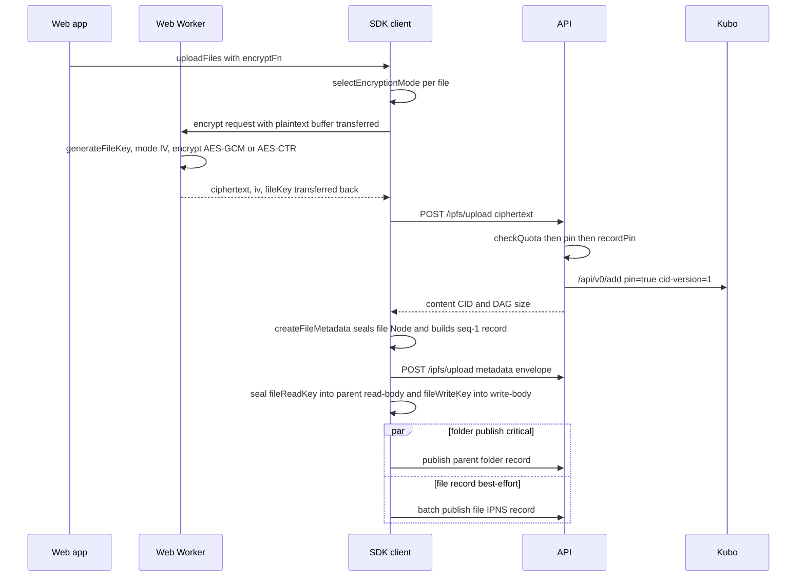

# Content storage and versioning

| | |
| --- | --- |
| **Kind** | flow |
| **Sources** | `packages/sdk-core/src/` (upload, file, encryption-mode, ipfs, rotation/engine), `packages/sdk/src/` (client.ts, share/shared-write.ts, bin/index.ts), `packages/core/src/node/` (types, encode, seal), `packages/crypto/src/aes/` (encrypt, encrypt-ctr, decrypt-ctr, constants), `apps/web/src/` (hooks/useDropUpload, hooks/useFileOperations, hooks/useFileVersions, hooks/useStreamingPreview, lib/version-transforms, workers/encrypt.worker, workers/decrypt-sw, services/encrypt-worker.service, services/download.service), `apps/api/src/ipfs/` (ipfs.controller, providers/local.provider, pending-unpin/), `apps/api/src/vault/vault.service.ts`, `crates/fuse/src/` (journal_helpers, content_ops, helpers, constants, read_ops, write_ops/implementation/file_data, dir_ops), `crates/sdk/src/queue.rs`, `crates/sdk/src/rotation/engine.rs`, `docs/METADATA_SCHEMAS.md`, `docs/FILESYSTEM_SPECIFICATION.md`, `docs/CAPACITY.md`, `docs/adr/0002-read-revocation-protects-future-content-only.md` |
| **Verified against** | cipher-box `27c4abec5` |
| **Status** | draft |

## Purpose and scope

This flow covers the life of file *content*: how plaintext bytes become an encrypted,
content-addressed IPFS blob; how the blob's decryption context (`fileKey`, IV, mode)
travels inside the file node's sealed metadata; how versions accumulate, prune, restore,
and delete; how content is read back on each client; how CIDs are pinned, refcounted, and
physically reclaimed; what happens to content keys during read-key rotation; and where
quota is enforced, with the measured infrastructure bottlenecks.

It does **not** cover: the folder-metadata publish plane and CAS/sequence discipline
([flows/metadata-sync.md](metadata-sync.md)), grant issuance/revocation
([flows/sharing-grants.md](sharing-grants.md)), the rotation walk itself
([flows/rotation.md](rotation.md)), FUSE mount/inode/replay generality
([parts/desktop.md](../parts/desktop.md)), AEAD/ECIES primitive parameters
([parts/crypto.md](../parts/crypto.md)), the full node/v3 schema tables
([parts/core-codecs.md](../parts/core-codecs.md)), or the API's endpoint/DB reference
([parts/api.md](../parts/api.md)). Where those specs own a structure, this one states
only the constraints the content flow imposes on it.

## Vocabulary

- **`fileKey`** — per-revision random 32-byte AES-256 key. In node/v3 it is a **raw**
  `Uint8Array` inside the sealed read-body (`NodeContent.fileKey`, each
  `VersionEntry.fileKey`), never ECIES-wrapped (`docs/METADATA_SCHEMAS.md` §10).
- **`fileIv`** — base64 IV in metadata: 12 bytes for GCM, 16 bytes for CTR (8-byte nonce
  ‖ 8-byte big-endian counter) (`packages/crypto/src/constants.ts:11,38`).
- **`encryptionMode`** — `'GCM' | 'CTR'` string literal, mandatory on `NodeContent` and
  every `VersionEntry`.
- **Content CID** — CIDv1 of the encrypted content blob. **Metadata CID** — CIDv1 of the
  `PublishedNode` JSON envelope. Both are pinned via the same `POST /ipfs/upload` and
  both count against quota.
- **Content self-seal** — the content descriptor lives inside the *file node's own*
  sealed read-body (phase 62, design §2.9), so a single file is shareable/movable
  without re-encrypting parent metadata.
- **`pinned_cids` row** — per-`(userId, cid)` pin bookkeeping; `isByoUser` advisory rows
  track BYO-IPFS claims the hosted Kubo does not hold. Owned by
  [parts/api.md](../parts/api.md).
- **`guardedUnpin`** — the API's transactional unpin: ownership check, row delete
  (= quota decrement), cross-user refcount, `pending_unpins` outbox.
- **`pending_unpins`** — outbox table drained by a BullMQ cron; the only path to a
  physical Kubo `pin/rm`.
- **Version cooldown** — client-side minimum age of the newest `VersionEntry` before a
  replace folds the superseded content into history (default 15 min).
- **`prunedCids`** — CIDs dropped by the version cap, returned up the stack for the
  *caller* to unpin; the SDK never unpins them itself.
- **`contentRekeyPending`** — ADR-0002 design term for lazy content re-key after
  rotation. In code it exists only as a doc comment (TS) and an unconsumed result flag
  (Rust) — see Known gaps.

## Actors and trust boundaries

| Actor | Sees | Must never see |
| --- | --- | --- |
| Web app (main thread) | plaintext, `fileKey`, all node keys | — |
| Web Worker (`encrypt.worker.ts`) | plaintext + freshly minted `fileKey` transiently (zeroed after post, buffers transferred) | node read/write keys |
| Service Worker (`decrypt-sw.ts`) | `fileKey` (hex, registered per stream), full ciphertext cache, decrypted ranges | node read/write keys, IPNS keys |
| Desktop (FUSE + Tauri) | plaintext, `fileKey`, node keys; journals **ciphertext only** (sidecar) | — |
| CipherBox API | ciphertext, blob sizes, CIDs, `pinned_cids` rows, upload timing | plaintext, `fileKey`, filenames, `mimeType` |
| Kubo | ciphertext blobs + encrypted metadata envelopes | anything else |
| Postgres | what the API sees, at rest | key material |

Two load-bearing boundary facts:

- **`GET /ipfs/:cid` has no per-CID authorization** — any authenticated full-scope user
  can fetch any CID (`apps/api/src/ipfs/ipfs.controller.ts:186-234`; JWT class guard at
  `:47`, no ownership lookup). Content confidentiality rests *entirely* on client-side
  encryption; the CID space is effectively public to logged-in users.
- **CTR blobs carry no authentication tag** — integrity rides solely on IPFS content
  addressing (the CID is the hash of the ciphertext), stated explicitly in
  `packages/crypto/src/aes/encrypt-ctr.ts:10-12`. A tampered blob would change CID; a
  correct-CID blob decrypting to garbage is undetectable at the crypto layer.

## Data structures

### `NodeContent` and `VersionEntry` (owned by [parts/core-codecs.md](../parts/core-codecs.md))

Schema tables live in the codec spec and `docs/METADATA_SCHEMAS.md` §6–7. Constraints
this flow imposes:

- `encryptionMode` is **mandatory** on both, so every revision records the mode it was
  encrypted with and the reader never guesses.
- `fileKey` is a raw 32-byte `Uint8Array` (base64 on the JSON wire,
  `packages/core/src/node/encode.ts:35-54`); the decoder asserts
  `instanceof Uint8Array && length === 32`.
- `versions` is newest-first, deduped by `cid` (first occurrence wins), capped; each
  entry carries its **full independent decrypt context** (`cid`, `fileIv`, `fileKey`,
  `encryptionMode`, `size`) so any version is decryptable without the live descriptor
  (`packages/sdk-core/src/file/index.ts:105-127`).
- `VersionEntry.createdAt` is stamped with the **supersession** time (`createdAt: now`
  at `packages/sdk-core/src/file/index.ts:472`), not the time the content was originally
  written — the schema doc's "when this version was created" reads ambiguously; the
  cooldown gate depends on this stamp.
- The whole descriptor is sealed **inside the role-`0x01` read-body** via `sealNode`
  (`packages/core/src/node/encode.ts:98-110`,
  `packages/core/src/node/seal.ts:78-108`). The standalone role-`0x03` content seal
  exists but is dead on the live path (see Known gaps).

### Content blob wire format

| Mode | Blob bytes | IV | Where IV lives |
| --- | --- | --- | --- |
| GCM | `ciphertext ‖ 16-byte tag` | 12 bytes, random per revision | `NodeContent.fileIv` (base64) — **not** prepended to the blob |
| CTR | XOR stream, same size as plaintext | 16-byte counter block (8-byte nonce ‖ 8-byte BE counter), random per revision | same |

Unlike node-metadata seals (`IV ‖ ct ‖ tag` in one base64 blob), content blobs never
embed their IV — blob and IV reunite only inside the sealed metadata. Range decryption
for CTR computes `counter = baseCounter + floor(startByte/16)` and decrypts only the
block-aligned window (`packages/crypto/src/aes/decrypt-ctr.ts:82-162`). Because every
revision mints a fresh `fileKey` (all producers: web, shared-write, desktop), nonce reuse
across revisions is structurally impossible.

### Encryption-mode policy

Single policy function `selectEncryptionMode(mimeType, size)`
(`packages/sdk-core/src/encryption-mode.ts:33-38`): CTR iff the MIME type is in the
8-entry streaming set (`video/mp4`, `video/webm`, `audio/mpeg`, `audio/mp4`,
`audio/webm`, `audio/ogg`, `audio/aac`, `audio/flac`) **and** size > 256 KiB
(`CTR_SIZE_THRESHOLD = 256 * 1024`, `:22`); otherwise GCM. `normalizeEncryptionMode`
coerces any non-`'CTR'` value to `'GCM'` (`:46-48`). The policy is applied on the owner
web/SDK upload paths (`packages/sdk/src/client.ts:3195,3436`) but **bypassed** by two
producers that hardcode `'GCM'`: shared-folder writes
(`packages/sdk/src/share/shared-write.ts:473,729`) and every desktop FUSE write
(`crates/fuse/src/write_ops/implementation/file_data.rs:235`,
`crates/fuse/src/journal_helpers.rs` — `encryption_mode: "GCM"`).

### Pin bookkeeping (`pinned_cids`, `pending_unpins` — owned by [parts/api.md](../parts/api.md))

Constraints from this flow:

- One row per `(userId, cid)` (unique pair), `size_bytes` = **Kubo DAG size** of the
  pinned blob, `recordPin` is `.orIgnore()` (idempotent re-upload)
  (`apps/api/src/vault/vault.service.ts:224-236`).
- Deleting the row **is** the quota decrement, and happens *before* physical unpin.
- The refcount that gates physical unpin counts rows across **all** users, including BYO
  advisory rows (WR-07, `docs/CAPACITY.md` §7) — a CID stays pinned in Kubo while anyone
  references it.
- `pending_unpins` is a plain outbox: inserted at refcount 0 inside the `guardedUnpin`
  transaction, drained by a 5-minute BullMQ cron in FIFO batches of 50, each row
  re-refcounted under an advisory lock before `pin/rm` (a re-pinned CID is skipped)
  (`apps/api/src/ipfs/pending-unpin/pending-unpin.processor.ts`). Kubo "not pinned" is
  treated as idempotent success. Gauge: `cipherbox_pending_unpins_total`
  (`apps/api/src/metrics/metrics.service.ts:191`).

### Version-policy settings

Two user-tunable knobs with hard defaults (`packages/core/src/vault/settings.ts:18-19`,
clamps at `:47-51`): `maxVersionsPerFile` default **10**, clamp `[0, 100]`;
`versionCooldownMinutes` default **15**, clamp `[0, 1440]`. sdk-core's own fallback cap
is a hardcoded `MAX_VERSIONS_PER_FILE = 10` (`packages/sdk-core/src/file/index.ts:60`).
The web version-management hooks pass the setting through
(`apps/web/src/hooks/useFileVersions.ts:105,190`); the replace paths do **not** and fall
back to 10. The desktop mount receives both knobs (`crates/fuse/src/fs.rs:44-46`) but
its versioning consumer is dead code (see Known gaps).

### FUSE write journal (owned by [parts/desktop.md](../parts/desktop.md))

What matters to content: every desktop write fsync-commits a `JournalEntry` **before**
acking the OS (`crates/sdk/src/queue.rs:1-9`); the AES-GCM ciphertext goes to a `0600`
sidecar file `<journal_dir>/<id>.bin`, never plaintext and never key bytes outside
symmetric seals (`queue.rs:56-63`); per-entry payload cap 2 GiB
(`MAX_JOURNAL_PAYLOAD_BYTES`, `queue.rs:22`); `max_retries = 5` then the entry parks as
`Failed` (`crates/fuse/src/lib.rs:389`); parked entries are GC'd after 30 days or past a
500 MiB budget (`queue.rs:25-29`). Crash after fsync ⇒ replay on next mount
(`crates/fuse/src/replay.rs`).

## Flows

### Web upload — new file

- **Trigger** — drag-and-drop / file picker (`apps/web/src/hooks/useDropUpload.ts`).
- **Preconditions** — logged in, parent folder loaded; batch passes client checks:
  per-file `MAX_FILE_SIZE = 100 MiB` (`useDropUpload.ts:13,41-45`, whole batch rejected
  on one oversize), batch-internal name dedup before any file is read (`:58-65`),
  quota pre-check against the **cached** `remainingBytes` from the last
  `GET /vault/quota` (`:50-55`, `apps/web/src/stores/quota.store.ts:60-63`) — not a live
  server check.

- **Steps**
  1. New-vs-existing split: names already in the folder are routed to the
     replace/duplicate path (`useDropUpload.ts:88-89`); new files go through
     `client.uploadFiles` with the Web Worker `encryptFn` injected (`:141-167`).
  2. The Worker mints `fileKey = generateFileKey()`, picks the IV by mode, encrypts, and
     posts back `{ciphertext, iv, fileKey, sizes}` with zero-copy buffer transfer,
     zeroing its own key copy (`apps/web/src/workers/encrypt.worker.ts:26-53`). (It also
     computes a vestigial ECIES `wrappedKey` the node/v3 path ignores.)
  3. `sdkCore.uploadFile` posts the ciphertext as multipart to `POST /ipfs/upload`
     (`packages/sdk-core/src/ipfs/index.ts:15-52`). Server order:
     `checkQuota(userId, file.size)` → 413 on failure → `pinFile` (Kubo
     `/api/v0/add?pin=true&cid-version=1`) → `recordPin(userId, cid, dagSize)`, with a
     compensating direct `unpinFile` if the record write throws
     (`apps/api/src/ipfs/ipfs.controller.ts:94-139`,
     `apps/api/src/ipfs/providers/local.provider.ts:32-74`).
  4. `createFileMetadata` (`packages/sdk-core/src/file/index.ts:190-344`) validates
     key/IV lengths fail-closed, mints `fileReadKey`/`fileWriteKey`/Ed25519 keypair,
     builds `NodeContent {cid, fileIv, size, mimeType, encryptionMode, fileKey,
     versions: []}`, seals a `kind:'file', generation:0` node (content inside the
     read-body, signing seed inside the write-body), uploads the envelope (a second
     pinned, quota-charged CID), TEE-enrolls fail-closed when `teeKeys` is present, and
     **builds but does not publish** the first IPNS record with embedded sequence `1n`.
  5. The parent link is written both planes: `SealedChildRef` (child `readKey` sealed
     under parent `readKey`, `versionFloor: 1n`) into the read-body and a
     `WriteChildRef` into the write-body (`packages/sdk/src/client.ts:3214-3248`).
  6. Publish is **concurrent, asymmetric** (`client.ts:3253-3310`):
     `Promise.allSettled` of the file-record batch publish and the parent-folder
     publish. The folder publish is critical (rejection fails the upload); the file
     record publish is best-effort (warn + `ipns:batchPublishFailed` event only).
- **Postconditions** — two pinned CIDs (content + file envelope) plus a re-pinned parent
  envelope; two `pinned_cids` rows under the uploader; folder listing shows the file;
  the file's IPNS name is TEE-enrolled (when key state was seeded).
- **Failure modes** — quota 413 before any pin; pin-then-record failure compensates with
  a direct unpin (bypassing the refcount audit, accepted WR-02); **file-record publish
  failure leaves a live folder entry whose own IPNS name never resolves** — the child
  ref exists but `resolveFileMetadata` 404s until some later publish of that name (no
  retry mechanism; see Known gaps).

### Upload into a shared folder (write grant)

`uploadToSharedFolder` / `updateSharedFile`
(`packages/sdk/src/share/shared-write.ts:422,654`) mirror the owner path with three
content-relevant differences: `encryptionMode` is hardcoded `'GCM'` (`:473,729`) so a
recipient uploading large media never gets CTR/streaming; the content and envelope pins
land under the **recipient's** `userId` and quota (there is no pin-on-behalf in the API
— a recipient's pin is their own `POST /ipfs/upload`); and a shared *edit* carries the
existing `versions` array forward verbatim (`client.ts:5624`,
`shared-write.ts:729-731`) — it never folds the superseded descriptor into history and
never surfaces the superseded CID for unpin. Grant mechanics:
[flows/sharing-grants.md](sharing-grants.md).

### Desktop FUSE write

FUSE journal/replay mechanics belong to [parts/desktop.md](../parts/desktop.md); the
content-plane behavior:

- **Trigger** — `create`/`write`/`release` on the mount. Platform-special names are
  rejected EACCES; duplicate names EEXIST
  (`crates/fuse/src/write_ops/implementation/file_data.rs:160-180`).
- **Steps**
  1. `create` mints the file node identity up front: random Ed25519 IPNS keypair,
     `read_key`/`write_key`, `encryption_mode: "GCM"` — always GCM, no mode selection
     (`file_data.rs:199-244`). Writes buffer to a temp file.
  2. On flush/release, `build_upload_journal_entry` (`crates/fuse/src/journal_helpers.rs`)
     mints a **fresh per-write content `fileKey`**, encrypts AES-256-GCM, seals the file
     `PublishedNode` and the parent read/write splices, and fsync-commits the
     `JournalEntry` with the ciphertext in a sidecar **before acking the OS**.
  3. The background task uploads the ciphertext (`POST /ipfs/upload`), then
     `publish_file_node` seals and publishes the file node with the real CID — and
     **always `versions: Vec::new()`** (`crates/fuse/src/content_ops.rs:208,250`).
  4. Crash ⇒ replay on next mount re-drives upload + publish from the journal, retry
     cap 5, then parked `Failed`.
- **Postconditions** — content readable cross-client; the file's IPNS name and node id
  are stable across overwrites.
- **Failure modes / drift** — desktop **never creates versions and erases existing
  ones**: the shared `apply_versioning` helper exists (`crates/fuse/src/helpers.rs:100`)
  but has zero call sites, `UploadJournalResult.pruned_cids` is always empty
  (`journal_helpers.rs:416`), and the journaled/published `NodeContent` hardcodes empty
  `versions` (`journal_helpers.rs:291-301` — "Versioning history is not reconstructed
  here… see the file-versioning E2E flag"). A desktop overwrite of a web-versioned file
  wipes its history and strands every version CID as pinned-forever. The superseded
  content CID (`old_file_cid`, "for unpin after upload",
  `journal_helpers.rs:87`) also has **no consumer** — desktop overwrites never unpin the
  old blob. There is no quota gate on the write path: `QUOTA_BYTES = 500 MiB`
  (`crates/fuse/src/constants.rs:9`) feeds only `statfs` free-space display
  (`crates/fuse/src/dir_ops.rs:223-241`); a server-side 413 surfaces asynchronously as a
  journal retry/park, not as ENOSPC.

### Download / read path

- **Web save/download** — resolve the file node through the gated read path, recover the
  file `readKey` from the parent's `SealedChildRef`, unseal `NodeContent`, then
  `fetchFromIpfs` the **whole** blob from `GET /ipfs/:cid` and decrypt full-buffer, CTR
  or GCM by `encryptionMode` (`packages/sdk/src/client.ts:4421-4470`,
  `packages/sdk-core/src/file/index.ts:386-402`,
  `apps/web/src/services/download.service.ts:119-140`). The server response is fully
  buffered (`await response.arrayBuffer()` then `StreamableFile`,
  `apps/api/src/ipfs/providers/local.provider.ts:121-162`) with **no HTTP Range
  support** and no fetch timeout; progress events come from client-side stream chunk
  accounting only.
- **Web media preview (the only range reads in the system)** — CTR files only.
  `useStreamingPreview` registers `{fileKey hex, iv, cid, totalSize, mimeType}` with the
  Service Worker and points the media element at `/decrypt-stream/{ipnsName}`
  (`apps/web/src/hooks/useStreamingPreview.ts:148-193`). The SW fetches the **entire**
  encrypted blob once, caches it (max 5 entries), then serves browser `Range` requests
  as 206 responses by CTR-decrypting only the block-aligned window client-side
  (`apps/web/src/workers/decrypt-sw.ts:227-396`). Range reads are thus *emulated over a
  full fetch*, never proxied to IPFS. GCM files fall back to the whole-blob preview
  path.
- **Desktop read** — `open()` downloads the full content from the API with
  `CONTENT_DOWNLOAD_TIMEOUT = 120 s` (`crates/fuse/src/constants.rs:15`,
  `crates/fuse/src/read_ops.rs:60`), decrypts, and caches in memory; subsequent `read()`
  calls are served from cache in 4096-byte units (`BLOCK_SIZE`,
  `crates/fuse/src/inode.rs:52`). No range fetch.
- **Failure modes** — GCM auth failure or wrong key throws a generic `CryptoError`
  fail-closed; there is **no fallback** (no version-key retry) — a metadata/blob key
  mismatch (see rotation flow below) is a hard read failure. CTR with a wrong key
  silently yields garbage bytes; only the media element's demuxer notices.

### Replace and version creation (web)

- **Trigger** — Replace dialog on a name-collision upload
  (`ReplaceFileDialog.tsx:41-49`, `forceVersion: true`) or in-place text-editor save
  (`TextEditorDialog.tsx:153-227`, `forceVersion: false`).
- **Steps**
  1. Resolve current `NodeContent`; decide
     `createVersion = shouldCreateVersion(versions, forceVersion)`
     (`apps/web/src/lib/version-transforms.ts:44-54`): forced → true; empty history →
     true; else newest entry must be older than `versionCooldownMinutes` (default 15).
  2. Encrypt the new revision under a **fresh** `fileKey`/IV, upload → new content CID
     (pinned, quota-charged).
  3. `client.replaceFile` → `sdkCore.updateFileMetadata`
     (`packages/sdk-core/src/file/index.ts:433-538`): preserves node `id`,
     `generation`, `createdAt` verbatim (a content update never bumps the rotation
     clock); when versioning, folds the superseded descriptor into a `VersionEntry` and
     runs `capVersions` (dedupe by cid, newest-first, cap, remainder → `prunedCids`);
     re-seals; uploads a new envelope CID; publishes the file record single-shot at
     `sequence + 1` — **no CAS retry/merge** on the per-file record.
  4. The web hook unpins `prunedCids` via `client.unpin` → `POST /ipfs/unpin`
     (`apps/web/src/hooks/useFileOperations.ts:130-132`) — client-driven, best-effort.
  5. The parent folder is republished only when a lazy TEE-key migration piggybacks
     (`client.ts:4064-4126`); a plain content update leaves the parent record untouched
     (the child ref is keyed by unchanged `ipnsName`/`generation`).
- **Postconditions** — live descriptor points at the new CID/key; history holds the
  prior revision (when versioned) with full decrypt context.
- **Failure modes** — when `createVersion` is false (cooldown suppressed, or any shared
  edit), the superseded content CID is dropped on the floor: not in `versions`, not in
  `prunedCids` — it stays pinned and quota-charged with no reference to it (see Known
  gaps).

### Restore and delete version (web)

- **Restore** (`apps/web/src/hooks/useFileVersions.ts:58-125`):
  `computeRestoreVersionUpdate` promotes `versions[i]` to the live descriptor —
  *reusing its original `fileKey`/IV/CID, no re-encryption* — and removes it from
  history; the web passes `createVersion: true` so the pre-restore live content is
  folded back in as a version (the SDK default is `false`,
  `packages/sdk/src/client.ts:4279`). Pruned CIDs from the cap are unpinned by the hook.
- **Delete version** (`useFileVersions.ts:137-212`, `client.ts:4311-4331`): removes one
  entry, republishes with `createVersion: false`, returns `deletedCid` for the hook to
  unpin.

### Delete and CID reclamation

- **Client side** — deletion routes through the recycle-bin module; on permanent delete,
  `unpinEntryCids` (`packages/sdk/src/bin/index.ts:188-201`) fires best-effort unpins
  for the entry's current `contentCid`, every `versionCids[]` entry, and every
  `descendantCids[]` entry for folder subtrees — each independently try/caught.
  **Metadata envelope CIDs are never in the set** (`BinEntry` carries no metadata-CID
  field) — see Known gaps.
- **API side** — `POST /ipfs/unpin` → `guardedUnpin`
  (`apps/api/src/vault/vault.service.ts:254-346`), one transaction per CID:
  1. `pg_advisory_xact_lock(hashtext(cid))` serializes racing unpins/drains.
  2. Ownership: no `(userId, cid)` row → if *another* user's row exists, log + increment
     `unpinCrossUserAttempts` and return success (no ownership oracle).
  3. Delete the caller's row — this is the immediate quota decrement, before any
     physical unpin.
  4. Refcount `COUNT(*)` over all users (BYO advisory rows included); zero → insert
     `pending_unpins` outbox row (`.orIgnore()`).
  5. Post-commit, attempt the physical `unpinFile`; Kubo failure is swallowed — the
     outbox drain retries every 5 minutes (batch 50, per-row re-refcount under the
     lock, repinned CIDs skipped). An hourly drift report counts Kubo pins unknown to
     the DB (`cipherbox_drift_orphaned_pins_total`) but never deletes.
- **Postconditions** — quota reflects deletion instantly; Kubo space is reclaimed
  eventually, only when the global refcount hits zero.

### Content re-key on read-key rotation

Owned walk: [flows/rotation.md](rotation.md). The content-plane contract, per ADR 0002:
rotation should mint a fresh `fileKey'` **applied lazily on the next content write**
(`contentRekeyPending`), so already-published content stays readable to legitimate
holders while a revoked reader is cut from *future* versions.

What is actually built, identically in both engines:

- `mintFileKeyOnRotate` zeroes the old live `fileKey` and **swaps a fresh random key
  into `NodeContent.fileKey` in place**
  (`packages/sdk-core/src/rotation/engine.ts:547-558`, invoked for every file node at
  `:1167-1170`); the node is re-sealed and republished carrying the new key while
  `content.cid` still addresses the blob encrypted under the **old** key. The Rust twin
  does the same (`crates/sdk/src/rotation/engine.rs:500-508`).
- `VersionEntry` keys are untouched — history stays decryptable to anyone holding the
  new `readKey` (and to a revoked reader who already extracted them, per ADR 0002).
- No marker is persisted and no consumer exists: `contentRekeyPending` is a TS doc
  comment (`engine.ts:529`) and an unconsumed boolean on the Rust result struct
  (`engine.rs:361,508`); nothing on any write path detects the key/blob mismatch or
  re-encrypts on next write (repo-wide grep: zero consumers).

Consequence — after any rotation touching a file node, that file's **current content is
undecryptable by everyone**, owner included, until the next ordinary content write
replaces `cid` and `fileKey` together; and if that next write versions the file, the
mismatched descriptor is folded into history as a **permanently undecryptable
`VersionEntry`**. Rotation and share revocation never touch content pins at all (no
unpin/re-pin anywhere in `sdk-core/rotation` or `share`).

### Quota enforcement and measured capacity

Enforcement points, in order of authority:

1. **Server, per upload** — `checkQuota` before pin: live `SUM(size_bytes)` +
   `file.size` ≤ `QUOTA_LIMIT_BYTES = 500 MiB`
   (`apps/api/src/vault/vault.service.ts:23,205-218`); 413 on breach. Asymmetry: the
   check uses the raw upload size, the recorded row stores Kubo's DAG size.
2. **Web, pre-flight** — cached `remainingBytes` comparison only; refreshed after the
   upload completes (`useDropUpload.ts:50-55,265`).
3. **Desktop** — display-only via `statfs`; no write-path gate.
4. **BYO users** — `checkQuota` short-circuits true (advisory).

Measured bottlenecks (`docs/CAPACITY.md`, staging = 2 vCPU/8 GB): Kubo `pin add`
dominates upload latency (~95% of endpoint time; mean 1.37 s post-pebbleds, §1.4/§2.1);
each upload costs **3 sequential pins** (content, file envelope, folder envelope) plus
**2 IPNS publishes** through someguy (per-file + parent), which puts someguy on the
upload critical path — throttling it *reduces* throughput (§1.5). Upload throughput
plateaus ~10–19 ops/s on staging; the two shared cores are the wall (ipfs `cpus: 1.5`
is the measured knee). §3.2 records the standing recommendation to defer the per-file
seq-1 publish off the upload critical path. DB, Redis, and the API process are not
bottlenecks at current scale (§2.2–2.4).

## Runtime variants

- **BYO-IPFS pinning mode** — vault flag `is_byo_user`; the SDK swaps `addToIpfs` for a
  user-provided `pinFn` (`packages/sdk/src/client.ts:3178-3192`) and registers CIDs via
  `POST /ipfs/register-cid` (BYO-only, throttled 100/hr, CID regex + size 1..100 MB),
  which writes an **advisory** `pinned_cids` row with no hosted pin. Quota becomes
  advisory. Note: a BYO user calling the ordinary `POST /ipfs/upload` still physically
  pins to hosted Kubo — register-cid is the only advisory path. Advisory rows keep
  hosted CIDs pinned via the shared refcount (retention consequence,
  `docs/CAPACITY.md` §7).
- **Service worker asset** — `/decrypt-sw.js` in prod, `/decrypt-sw-dev.js` in dev
  (`apps/web/src/lib/sw-registration.ts:25`); behavior identical.

## Invariants

1. **INV-1** — Content MUST be encrypted client-side under a freshly minted random
   32-byte `fileKey` per revision; no producer may reuse a prior revision's key, and the
   server MUST never receive plaintext or any `fileKey`.
2. **INV-2** — `fileKey`, `fileIv`, and `encryptionMode` MUST travel only inside the
   file node's sealed read-body (`NodeContent` / `VersionEntry`); they MUST never appear
   in plaintext envelope fields, URLs, logs, or DB rows.
3. **INV-3** — Every `NodeContent` and `VersionEntry` MUST carry an explicit
   `encryptionMode`; readers MUST select the decrypt path from it and MUST NOT guess
   from size or MIME type.
4. **INV-4** — A `VersionEntry` MUST be independently decryptable: it carries its own
   `cid`, `fileIv`, `fileKey`, `encryptionMode`, and `size`.
5. **INV-5** — `versions` MUST be newest-first, deduped by `cid`, and capped at the
   effective `maxVersionsPerFile`; CIDs dropped by the cap MUST be surfaced to the
   caller (`prunedCids`) for unpinning.
6. **INV-6** — A content update MUST preserve the node's `id`, `createdAt`, and
   `generation` verbatim — `generation` is the rotation clock and MUST NOT move on
   writes ([flows/rotation.md](rotation.md)).
7. **INV-7** — The API MUST enforce quota before pinning (hosted users) and MUST record
   one `pinned_cids` row per `(userId, cid)`; deleting that row is the quota decrement.
8. **INV-8** — Physical Kubo unpin MUST happen only via the `pending_unpins` outbox,
   only at global refcount zero (all users' rows, BYO advisory included), re-checked
   under the per-CID advisory lock at drain time.
9. **INV-9** — A cross-user unpin attempt MUST be silently ignored (success response, no
   ownership oracle) and counted in metrics.
10. **INV-10** — The first publish of a file's IPNS record MUST embed sequence 1
    ([flows/metadata-sync.md](metadata-sync.md) owns the publish gates).
11. **INV-11** — GCM decrypt failures MUST fail closed with a generic error (no
    plaintext partials, no oracle detail); CTR integrity MUST be anchored by fetching
    blobs only by their content CID.
12. **INV-12** — The desktop journal MUST fsync the entry (ciphertext in a `0600`
    sidecar) before acking the OS write, and MUST never journal plaintext or raw
    node-to-node key bytes.
13. **INV-13** — The Web Worker MUST zero its `fileKey` copy after posting the result;
    every SDK/core content function follows the caller-owns-buffer rule (D-09): a
    callee MUST NOT zero caller-supplied key material.

## Known gaps and quirks

- **Rotation breaks the rotated file's current content** (the largest gap). ADR 0002
  specifies lazy re-key via a `contentRekeyPending` marker; both engines instead swap
  `NodeContent.fileKey` eagerly at rotation without re-encrypting the blob, and no
  marker is persisted or consumed anywhere
  (`packages/sdk-core/src/rotation/engine.ts:529-558`,
  `crates/sdk/src/rotation/engine.rs:500-508,361`). Until the next content write, the
  live descriptor cannot decrypt its own blob — for anyone. A subsequent versioned
  write fossilizes the mismatched descriptor as a permanently undecryptable
  `VersionEntry`. The TS doc comment defers the wiring to "Phase 65", which shipped
  without it.
- **Desktop versioning is dead code, and desktop writes erase history.**
  `apply_versioning` (`crates/fuse/src/helpers.rs:100`) has zero callers; every desktop
  publish hardcodes `versions: Vec::new()` (`crates/fuse/src/content_ops.rs:250`,
  `crates/fuse/src/journal_helpers.rs:301`), so an overwrite from desktop wipes
  web-created version history (stranding those CIDs pinned forever), and
  `old_file_cid`/`pruned_cids` ("for unpin", `journal_helpers.rs:87-89`) are never
  consumed — superseded desktop content CIDs are never unpinned.
  `docs/FILESYSTEM_SPECIFICATION.md`'s versioning table (10 versions "SDK and FUSE
  layer", 15-min cooldown "Desktop FUSE only") is inverted: the cooldown is live on
  **web** (text-editor saves, `apps/web/src/lib/version-transforms.ts:44-54`) and dead
  on desktop; "web creates a version on every replace" is true only for the
  Replace-dialog path (`forceVersion: true`).
- **Metadata envelope CIDs are never unpinned.** Every content write, folder change, and
  version op pins a fresh `PublishedNode` envelope through the quota-charged upload
  endpoint, and no path (bin delete included — `BinEntry` has no metadata-CID field,
  `packages/sdk/src/bin/index.ts:188-201`) ever unpins a superseded or deleted node's
  envelopes. Storage and quota leak monotonically with write activity; `docs/CAPACITY.md`'s
  5% metadata-overhead factor models steady state, not this accumulation.
- **Un-versioned replaces leak the superseded content CID.** With `createVersion` false
  (cooldown-suppressed saves, every shared-folder edit, every desktop overwrite), the
  prior content CID is neither retained in `versions` nor returned in `prunedCids`
  (`packages/sdk-core/src/file/index.ts:463-479`,
  `packages/sdk/src/share/shared-write.ts:729-731`) — it stays pinned and
  quota-charged, unreferenced by any metadata.
- **`sealContent`/`unsealContent` (role `0x03`) are dead exports.** The live path embeds
  `NodeContent` in the role-`0x01` read-body via `encodeReadBody`/`sealNode`
  (`packages/core/src/node/encode.ts:98-110`); the Rust codec declares role `0x03` out
  of scope (`crates/core/src/node/seal.rs:14`). `docs/METADATA_SCHEMAS.md` §6 ("sealed
  separately … by `sealContent`," role `0x03`) describes the dead path; the role byte is
  reserved-but-unused on the wire.
- **File-record publish is best-effort under a critical folder publish**
  (`packages/sdk/src/client.ts:3253-3310`): a failed seq-1 file publish still lands the
  child in the folder listing, producing an entry whose IPNS name never resolves, with
  no retry or repair path.
- **The web file-vs-folder collision check is dead code.** `existingFolderNames` is
  never populated (`apps/web/src/hooks/useDropUpload.ts:69-86`, "Phase 63" placeholder),
  so the guard the filesystem spec claims (`docs/FILESYSTEM_SPECIFICATION.md` "explicitly
  checks for file-to-folder name collisions") never fires.
- **Range reads are an illusion of the Service Worker.** The API has no `Range`/206
  support and fully buffers every `GET /ipfs/:cid` (`local.provider.ts:121-162`); the SW
  fetches whole blobs and emulates ranges from a 5-entry cache
  (`apps/web/src/workers/decrypt-sw.ts:261,330`). CTR's random-access capability is
  exercised only over already-downloaded bytes; "streaming without buffering the entire
  file" (`docs/FILESYSTEM_SPECIFICATION.md`) does not hold end-to-end. Downloads also
  have no server-side timeout (only pin/ls are bounded at 30 s).
- **Mode-selection policy is bypassed by two producers**: shared-write and desktop
  hardcode GCM (`shared-write.ts:473,729`, `file_data.rs:235`), so the same video
  uploads as CTR from the owner's web session and GCM from a write-grant recipient or
  the mount — mode then sticks per revision.
- **Quota size asymmetry** — pre-check uses the raw upload size, the stored row records
  Kubo's DAG size (`ipfs.controller.ts:103,120`); usage can drift slightly from the sum
  of raw ciphertext sizes.
- **Metric-name drift** — `docs/CAPACITY.md` §7 tells operators to monitor
  `cipherbox_pending_unpin_queue_depth`; the gauge is actually
  `cipherbox_pending_unpins_total` (`apps/api/src/metrics/metrics.service.ts:191`).
- **`VersionEntry.createdAt` is the supersession time**, not the original write time
  (`packages/sdk-core/src/file/index.ts:472`) — display and cooldown both key off when
  the revision was *replaced*.
- **Effective version cap is inconsistent across entry points** — vault-settings
  override on the version-management hooks, hardcoded 10 on the replace paths
  (`apps/web/src/hooks/useFileVersions.ts:105,190` vs `replaceFile` call sites).
- **The encrypt Worker still ECIES-wraps the fileKey** and returns `wrappedKey`
  (`apps/web/src/workers/encrypt.worker.ts:33`) — vestigial pre-node/v3 output, ignored
  by the upload path.

## Rewrite notes

- The content plane has **no garbage-collection story**. Unpin responsibility is smeared
  across web hooks acting on returned CID lists, a desktop side that drops them, and a
  bin path that forgets envelopes — with the result that three distinct leak classes
  (metadata envelopes, un-versioned replacements, desktop overwrites) accumulate
  silently against a 500 MiB quota. A rewrite should make reclamation a server-auditable
  property — e.g. derive liveness from the published metadata graph (every CID reachable
  from live node envelopes) instead of trusting every client to volunteer unpins — the
  same "courtesy vs auditable property" lesson as TEE enrollment in
  [flows/republish-liveness.md](republish-liveness.md).
- The rotation/content seam shipped half of two designs: neither lazy (no marker, no
  next-write consumer) nor eager (no re-encryption). Pick one. If lazy, the marker must
  live in the sealed schema and the write path must honor it; if eager, rotation must
  re-encrypt and re-pin. The current key-swap is worse than doing nothing — it breaks
  the owner's own reads to deny a revoked reader content they may already have.
- Version history as an inline array inside the sealed body couples history size to
  metadata size and forces the fold/cap/prune dance through every writer — which is
  exactly why desktop silently dropped it. If versioning survives, it should be a
  per-version chain the writer appends to, not an array every writer must faithfully
  reconstruct.
- One `selectEncryptionMode` exists precisely so policy wouldn't fork, and it forked
  anyway (shared-write, desktop). The mode decision belongs in the single shared layer
  that builds `NodeContent`, not at call sites.
- If streaming matters, it needs to be end-to-end: server `Range` support against Kubo,
  CTR (or GCM-per-chunk) framing, and a client that doesn't buffer 100 MiB in a Service
  Worker cache. If it doesn't matter, CTR's authenticity downgrade is buying nothing.
- Quota accounting should be derived from the same refcounted pin ledger that drives
  reclamation (one source of truth, DAG-size consistent), not a per-row sum with a
  raw-size pre-check and client-cached headroom.
