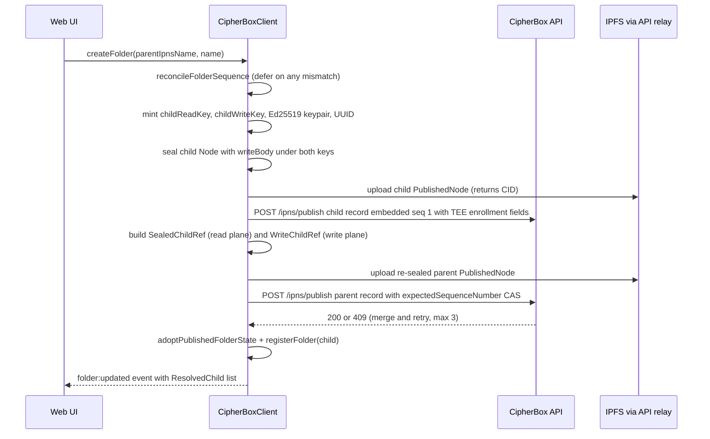

# Filesystem metadata and sync

| | |
| --- | --- |
| **Kind** | flow |
| **Sources** | `docs/FILESYSTEM_SPECIFICATION.md`, `docs/METADATA_SCHEMAS.md`, `packages/core/src/node/` (types, seal, encode, decode), `packages/sdk-core/src/` (folder/load, folder/metadata-ops, folder/registration, folder/merge, share/navigate, rotation/engine, rotation/scope, cas, ipns/index, file/index, upload, vault/index), `packages/sdk/src/` (client.ts, folder-listing.ts, state/folder-tree.ts, state/rotation-high-water.ts, state/rotation-idb-store.ts, share/shared-write.ts, types.ts), `apps/web/src/` (hooks/useSyncPolling, hooks/useFolderMutations, hooks/useDropUpload, hooks/useAuth, hooks/useMutationFailureUx, hooks/folder-helpers, stores/folder.store, stores/sync.store, components/file-browser/), `crates/core/src/node/`, `crates/sdk/src/` (listing.rs, rotation/high_water.rs), `crates/fuse/src/` (inode.rs, fs.rs, dir_ops.rs, read_ops.rs, mkdir.rs, delete.rs, rename.rs, file_data.rs, metadata.rs, publish.rs, cache.rs, events.rs, content_ops.rs, helpers.rs, write_ops/grant_scope.rs, write_ops/rotation_deps.rs), `apps/desktop/src-tauri/src/fuse/mod.rs`, `docs/ARCHITECTURE.md` |
| **Verified against** | cipher-box `27c4abec5` |
| **Status** | draft |

## Purpose and scope

Every folder, file, and the vault root is an independent encrypted **node** published at
its own `ipnsName`. There is no server-side filesystem: the tree exists only as a graph of
`PublishedNode` blobs on IPFS, linked by sealed child references inside parent read-bodies
and addressed through IPNS records the clients sign themselves. This spec covers that
graph end to end: the node/v3 publication model, the READ plane vs WRITE plane keying
split, the operation narratives (create, add, rename, move, delete, link rewrite) on web
and desktop, the publish discipline as it constrains those operations, strict client-side
resolve verification, and how each client keeps its local state converged with the
network — the web 30-second poll, the FUSE lazy-refresh loop, and the reconciliation/
conflict machinery in between.

It does **not** cover: the authoritative server-side publish/resolve gate definitions
([parts/api.md](../parts/api.md) — this spec states them as client-facing constraints),
TEE republish and record liveness ([flows/republish-liveness.md](republish-liveness.md)),
read/write key rotation internals ([flows/rotation.md](rotation.md) — only the metadata
consequences of rotation appear here), grant issuance and claim
([flows/sharing-grants.md](sharing-grants.md)), or content encryption and version
history ([flows/content-storage.md](content-storage.md)). The node codec byte formats
(AAD encoding, seal primitive, golden vectors) are owned by
[parts/core-codecs.md](../parts/core-codecs.md); the web app's store architecture by
[parts/web.md](../parts/web.md).

## Vocabulary

- **Node (node/v3)** — the decrypted metadata object, discriminated by
  `kind: 'folder' | 'file' | 'root'`; holds `children` (folder/root) or `content` (file)
  plus an optional `writeBody`.
- **`PublishedNode`** — the on-wire JSON envelope at a node's `ipnsName`: plaintext
  identity fields (`schema`, `kind`, `id`, `generation`, `aeadVersion`) plus two
  independently sealed bodies `readSealed` / `writeSealed`.
- **`readKey` / `writeKey`** — the node's two independent 32-byte AES keys. The SDK's
  `FolderState` names the readKey `folderKey` (divergent legacy name,
  `packages/sdk/src/types.ts:200-236`).
- **READ plane** — `SealedChildRef[]` inside the parent read-body, keyed by the child's
  `ipnsName`; carries `readKeySealed` only. Five frozen fields, no kind, no id, no write
  material (NODE-03).
- **WRITE plane** — `WriteChildRef[]` inside the parent write-body, keyed by the child's
  node UUID (`childId`); carries `writeKeySealed` only.
- **`ResolvedChild`** — in-memory display projection the SDK assembles per listing (kind,
  size, modifiedAt read from the child's own resolved Node); never a wire format.
- **`folderTree`** — the SDK client's single-owner in-memory state:
  `Map<ipnsName, FolderState>`.
- **`generation`** — per-node read-key rotation clock, plaintext on the envelope and
  AAD-bound. Distinct from **`sequenceNumber`** (per-IPNS-record publish clock, bigint)
  and **`keyEpoch`** (TEE key epoch). Never conflated.
- **`versionFloor`** — owner-vouched IPNS sequence floor carried in `SealedChildRef`,
  applied by cold devices on first contact with a node.
- **`RotationHighWater`** — the durable anti-rollback gate: per-`nodeId` monotonic-max
  floors for `generation` and `seq` (IndexedDB on web, JSON sidecar on desktop).
- **Scope-exit** — a mutation that removes a node from a grant's reachable subtree;
  the trigger for read-key rotation.
- **Link rewrite** — updating a parent's `SealedChildRef` without touching the child:
  a move (ref migrates between parents) or a rotation-driven `ipnsName` swap.

## Actors and trust boundaries

| Actor | Sees | Must never see |
| --- | --- | --- |
| Web client (SDK in browser) | every plaintext name, structure, key it can chain to from `rootReadKey`/`rootWriteKey`; all Ed25519 IPNS signing keys it holds | other users' keys |
| Desktop client (FUSE mount + Rust sdk/core twins) | same as web, mirrored into the in-memory `InodeTable` | same |
| CipherBox API | ciphertext blobs, CIDs, `ipnsName`s, signed IPNS record bytes, sequence/generation scalars, quota bookkeeping | plaintext names, folder structure, any `readKey`/`writeKey`/`fileKey`/`ipnsPrivateKey` |
| Postgres | what the API sees, at rest (`ipns_records` canonical rows) | plaintext or keys |
| IPFS (Kubo) | encrypted `PublishedNode` and content blobs by CID | anything decrypted |
| Delegated routing / DHT | public signed IPNS records | anything else |

Two consequences shape every flow below. First, **publish authority is key possession**:
the API verifies the record's Ed25519 signature against the name-derived public key and
performs no per-user ownership check ([parts/api.md](../parts/api.md)) — whoever can
reach a node's `ipnsPrivateKey` through the write chain can publish it. Second, **the
relay is never trusted on read**: every resolve response is re-verified client-side
(signature, name binding, CID/sequence binding, expiry) and gated against durable local
floors before any ciphertext is unsealed (see the navigation flow).

## Data structures

Byte-level encodings, the AAD table, and the seal primitive are owned by
[parts/core-codecs.md](../parts/core-codecs.md); `docs/METADATA_SCHEMAS.md` is the
in-repo schema reference this section condenses.

### `PublishedNode` (IPFS blob, one per node, addressed via the node's IPNS record)

| Field | Type | Notes |
| --- | --- | --- |
| `schema` | `'node/v3'` | sole current schema; legacy per-kind types retired (Phase 62 hard-cut) |
| `kind` | `'folder' \| 'file' \| 'root'` | plaintext, AAD input |
| `id` | UUID string | plaintext, AAD input — **the only bridge between the two planes** |
| `generation` | number (u32) | plaintext, AAD input, rotation clock |
| `aeadVersion` | `1` | AEAD primitive tag |
| `readSealed` | base64 | `IV ‖ AES-256-GCM ct+tag` of the read-body, under `readKey`, AAD role `0x01` |
| `writeSealed` | base64, optional | same for the write-body under `writeKey`; absent on read-only publications |

The read-body is the `Node` minus `writeBody`: `children: SealedChildRef[]` for
folder/root, `content: NodeContent` for files (self-sealed role `0x03`), plus
`createdAt`/`modifiedAt`. Rust twin: `crates/core/src/node/types.rs:224-241`,
`crates/core/src/node/seal.rs`.

### `SealedChildRef` (READ plane — inside the parent's sealed read-body)

Frozen to exactly five fields (NODE-03): `name`, `ipnsName`, `generation` (parent's
mirror of the child's rotation clock — a staleness witness, never authoritative),
`versionFloor` (bigint, decimal string on wire), `readKeySealed` (child `readKey` sealed
under the parent `readKey`, AAD role `0x02`). No `kind`, no `id`, no size/date mirror —
an interim Phase-68.1 size/date mirror was reverted in 68.2 in favor of `ResolvedChild`.
Lookup key: **`ipnsName`**.

### `NodeWriteBody` / `WriteChildRef` (WRITE plane — inside the sealed write-body)

`NodeWriteBody` = `{ ipnsPrivateKey (raw Ed25519 seed, base64 on wire),
writeChildren: WriteChildRef[], recipientPins?: string[] }`.
`WriteChildRef` = `{ childId (node UUID), writeKeySealed (role 0x04) }`. Lookup key:
**`childId`**. `writeKeySealed` never appears in the read plane and vice versa
(`packages/core/src/node/types.ts:99-129`). `recipientPins` is the Phase-80 additive
share-pin list, omitted from the wire when empty.

**Why two keys, and why conflating them breaks.** The read plane is what a reader
navigates, so it must be keyed by the resolvable address (`ipnsName`). The write plane
must survive write-rotation, which mints *new* `ipnsName`s — so it is keyed by the
stable UUID. The only join between them is the plaintext `id` on the child's own
envelope: `rotateWriteFromNode` iterates `writeChildren` by `childId` and finds the
matching read ref by resolving each `SealedChildRef.ipnsName` and testing
`candidatePub.id === writeChildRef.childId`
(`packages/sdk-core/src/rotation/engine.ts:2570-2586`). Feed an `ipnsName` where a
`childId` belongs and every lookup misses (`engine.ts:2652-2657` throws
`'missing rotation result for write child'`), and the role-0x04 AAD — bound to the
UUID — fails GCM authentication. Shared-write delete/move/update must therefore thread
**both** identifiers (see the shared-write flow); the client wrapper fails closed when
`childNodeId` is absent (`packages/sdk/src/client.ts:5483-5488`).

### `ResolvedChild` (memory only, SDK)

`{ ipnsName, name, kind, size?, modifiedAt, sequence }` — assembled per folder-load by
resolving each child's own `PublishedNode` through the gated read path
(`packages/sdk/src/folder-listing.ts:37-45, 89-130`). Because a bare `SealedChildRef`
has no `kind`, **a listing costs one gated IPNS resolve + fetch + unseal per child**;
kind discrimination is only possible after resolving the child (there is no
`isFileRef`-style helper anywhere — `dfsFindFolder` branches on the resolved
`published.kind`, `client.ts:1567-1569`).

### `FolderState` / `FolderTree` (memory only, SDK client — the single owner)

`FolderTree` is `Map<ipnsName, FolderState>`
(`packages/sdk/src/state/folder-tree.ts:20-21`); `set` deep-copies key material and
`delete`/`clear` zero it (`:29-69`). `FolderState`
(`packages/sdk/src/types.ts:200-236`): `ipnsName`, `folderKey` (the readKey),
`writeKey` (zero-filled sentinel when read-only), `ipnsKeypair`,
`sequenceNumber: bigint`, `children: SealedChildRef[]`, `metadata: Node | null`
(carries the write-body mirror), `nodeId`, `nodeGeneration`, `lastLoadedAt`. The tree is
flat — no nesting; every folder is its own entry. The client also keeps a
`listingCache: Map<ipnsName, { sequenceNumber, children: ResolvedChild[] }>`
(`client.ts:298-299`), hit only on exact sequence equality (`:961`) and never populated
from a partial listing (`:975-976`).

**Write discipline (in-memory):** all mutation paths flow through the client, which
(a) preflights `reconcileFolderSequence` (defer-never-skip, below), (b) publishes via
the sdk-core CAS helpers, and (c) adopts the published result into `FolderState` via
`adoptPublishedFolderState` (`client.ts:1363-1378`), emitting `folder:updated` events
keyed by `ipnsName`. The web Zustand store is a display projection fed by those events
and never independently resolves ([parts/web.md](../parts/web.md),
`apps/web/src/stores/folder.store.ts:22-25`); it holds `children: ResolvedChild[]`, a
same-session `rawChildren: SealedChildRef[]` mirror, and `sequenceNumber` as its clock,
with two adoption guards: drop events with strictly older sequence (`:274`) and drop
empty-children events over a populated equal-or-newer view (`:255-265`).

### `CombinedFloorRecord` / `HighWaterStore` (durable, per device)

Per-`nodeId` record `{ generation?, seq?, wrappedKeyCheckpoint? }` written atomically
(`packages/sdk/src/state/rotation-high-water.ts:56-80`). `enforceResolved({nodeId, seq,
generation, versionFloor})` is a pure pass/throw pre-unseal gate: generation below floor
→ `GenerationRegressionError`; seq below floor → `SequenceRegressionError`; cold-device
first contact applies the owner-vouched `versionFloor` instead (`:213-250`). Web adapter:
IndexedDB `cipherbox-rotation-state`/`rotation-floor` with max-preserving writes and an
in-memory degrade latch on IDB failure (`packages/sdk/src/state/rotation-idb-store.ts:55-61,
213-238, 299-378`). Desktop twin: `crates/sdk/src/rotation/high_water.rs:236-311`
(JSON sidecar, mutex-guarded max-preserving put). The whole gate is an **optional
injection seam** — a client constructed without `config.rotationHighWater` performs zero
floor enforcement (`packages/sdk/src/types.ts:182-191`).

### FUSE mount state (memory only, desktop)

`InodeTable`: root inode fixed at `1` (`crates/fuse/src/inode.rs:49, 303-345`); children
lazily populated (`children_loaded` flag, `inode.rs:160`); `apply_owned_children`
re-indexes by stable `ipns_name` and reuses inode numbers for unchanged children
(NFS/SMB stale-handle avoidance, `inode.rs:464-704`); each inode stores the child's real
`published.id` as `node_id` plus cached `recipient_pins` (`inode.rs:603-616, 659-662`).
`MetadataCache` is a pure 30-second freshness marker (`crates/fuse/src/cache.rs:11,
28-67`). `PublishCoordinator` holds a per-`ipnsName` async mutex serializing publishes
plus a monotonic sequence cache (`crates/fuse/src/publish.rs:68-189`).

### Publish-plane constraints (owned by [parts/api.md](../parts/api.md))

This flow's producers are built against these server gates and MUST stay compliant:

- A **first publish embeds sequence 1** — `createAndPublishIpnsRecord` callers pass
  `1n` verbatim; `publishWithCas` passes the pre-increment base (`0n` for a first
  publish) and embeds base+1 (`packages/sdk-core/src/cas.ts:85-104`).
- A **forward publish embeds exactly dbSeq + 1** under the `expectedSequenceNumber`
  CAS; a lost race is a 409 the client must merge-and-retry, never overwrite.
- A **same-sequence publish** must carry the same CID (equivocation guard).
- `generation` on rotation publishes is a **forward-only** server gate (TEE-07).
- A tombstoned name answers **410** to publish and resolve; the SDK converts publish-410
  into a typed `{ tombstoned: true }` result (`packages/sdk-core/src/ipns/index.ts:110-122`).

## Flows

### Vault bootstrap and root seeding (web login)

- **Trigger** — login; `initializeOrLoadVault` (`apps/web/src/hooks/useAuth.ts:114-444`),
  deduplicated module-wide via `vaultInitPromise`.
- **Steps (new user, `GET /vault` → 404)**
  1. A throwaway bootstrap client mints `rootReadKey`/`rootWriteKey` and derives the two
     HKDF IPNS keypairs (root node + vault key blob).
  2. Publish the ECIES-wrapped v3 key blob at the vault-key `ipnsName`, sequence `1n`
     (`useAuth.ts:197-210`).
  3. `publishEmptyRootNode` — a `kind: 'root'` Node with empty `children` **and a
     write-body** (`ipnsPrivateKey` + empty `writeChildren`,
     `packages/sdk-core/src/vault/index.ts:119-195`), sealed under both root keys,
     first-published at sequence `1n` with TEE-enrollment fields when `teeKeys` is
     seeded (fail-closed on malformed `teeKeys`, silent skip when wholly absent —
     [flows/republish-liveness.md](republish-liveness.md)).
  4. `POST /vault/init { ownerPublicKey, rootIpnsName }` — zero crypto crosses the wire.
- **Steps (returning user)** — resolve the vault-key blob, ECIES-unwrap both root keys,
  re-derive the root IPNS keypair deterministically (never stored), construct the real
  `CipherBoxClient` with the durable `rotationHighWater` gate and subscribe the stores
  (`useAuth.ts:157-187, 319-356`).
- **Postconditions** — the root `FolderState` is seeded lazily on first navigation via
  `ensureRootFolderState`, which resolves + gates + unseals the root
  (`client.ts:1405-1448`).
- **Failure modes** — a malformed `teeKeys` throws before side effects; a new-user path
  quirk: `setVaultKeys` omits `isNewVault: true` (`useAuth.ts:231-237`), so the sync
  poll's new-vault fast path never engages (Known gaps).

### Folder navigation and listing

- **Trigger** — UI navigation → `client.listFolder(ipnsName, opts?)`
  (`client.ts:1000-1011`) → `ensureFolderLoaded` → `resolveListingChildren`.
- **Steps**
  1. `ensureFolderLoaded(target, opts)` (`client.ts:1662-1685`): cache hit without
     `forceResolve` → return the cached `FolderState` **ungated** (the deliberate cheap
     fast path — and the residual ROT-07 gap, see Known gaps); cache hit with
     `forceResolve` → `doReresolveFolderInPlace` (gated, strictly-newer-only, in-place
     single-owner update, `client.ts:1730-1777`); miss → seed the root then DFS from it.
  2. `dfsFindFolder` walks the read chain hop by hop: resolve child → **gate** →
     unseal. Each hop's `unsealChildReadKey` sources the AAD generation from the
     **parent mirror** (`SealedChildRef.generation`), never the child's own envelope —
     a relay serving a stale child CID fails GCM authentication closed
     (`client.ts:1533-1569`; same rule in the grant walk,
     `packages/sdk-core/src/share/navigate.ts:144-153`, and the listing,
     `folder-listing.ts:103-109`). File-kind children are never made `FolderState`s.
  3. **Strict resolve pipeline** (every gated resolve, sdk-core
     `resolveIpnsRecord`, `packages/sdk-core/src/ipns/index.ts:336-497`): verify the
     Ed25519 signature over `"ipns-signature:" + data`; require
     `deriveIpnsName(responsePubKey) === ipnsName` (key-substitution guard — the public
     key is authenticated **by the name**, never trusted from any stored column);
     decode the signed CBOR with `rejectDuplicateMapKeys`; bind embedded `Value` to the
     response CID and embedded `Sequence` to the response sequence (strict equality);
     require `ValidityType === 0`; strict RFC3339-parse `Validity` and reject when
     expired beyond a 5-minute skew buffer; absent/partial signature fields → throw.
     Only a 404 returns null.
  4. **Durable floor gate**: `RotationHighWater.enforceResolved` runs before any unseal
     on every fresh-resolve path (`client.ts:1417, 1547, 1745, 1920`); regression errors
     propagate to the caller.
  5. `resolveChildren` assembles `ResolvedChild[]`: per child, gated resolve → unseal
     child readKey (parent-mirror AAD) → `unsealNode` → project
     `{kind, size, modifiedAt, sequence}`; any per-child failure drops that child from
     the listing rather than failing it (`folder-listing.ts:89-130`), and a partial
     listing is never cached.
- **Postconditions** — `folderTree` holds the folder; `listingCache` holds the
  projection keyed to the folder's own sequence; the web store receives children via
  the call-site writeback or `folder:updated` events.
- **Failure modes** — unresolvable name → `null`/empty listing; signature or binding
  failure → thrown error (fail closed); floor regression →
  `GenerationRegressionError`/`SequenceRegressionError` surfaced to the web as a
  terminal "Stale data from server rejected." toast
  (`apps/web/src/hooks/useMutationFailureUx.ts:242-254`). The shared-folder walk
  returns typed `'ok' | 'behind-retry' | 'revoked'` instead
  (`packages/sdk-core/src/share/navigate.ts:49-52, 126-128`) — `behind-retry` when the
  envelope generation is ahead of the grant's expected generation
  ([flows/sharing-grants.md](sharing-grants.md)).

### Create folder

- **Trigger** — web: `useFolderMutations.handleCreate`
  (`apps/web/src/hooks/useFolderMutations.ts:122-189`; depth gate
  `parentDepth >= MAX_FOLDER_DEPTH` (20) at `:129-132`) → `client.createFolder`.
  Desktop: FUSE `mkdir` (`crates/fuse/src/mkdir.rs:11-296`).
- **Preconditions** — parent loaded in `folderTree` with a real `writeKey`
  (`client.ts:2447-2451` throws otherwise); no duplicate sibling name
  (`client.ts:2437-2439`).

- **Steps (normative detail, web path)** — `client.createFolder`
  (`client.ts:2428-2617`) mints the child **inline**: child Node carries a write-body
  from birth (`:2474-2477`); TEE wrap fail-closed before any upload (`:2488-2508`);
  child first-publish embeds `1n` (`:2510-2524`); parent gets `SealedChildRef`
  (`versionFloor: 1n`, `readKeySealed` under parent readKey, AAD bound to the child
  **UUID**, `:2527-2540`) and `WriteChildRef` (`:2543-2550`); parent republished through
  `updateFolderMetadataAndPublish` with `baseChildren` for three-way merge and the
  parent's existing `recipientPins` threaded verbatim (`:2552-2574`); child registered
  into `folderTree` at seq `1n` (`:2586-2595`); finally the scope-exit predicate runs on
  the parent (`:2612`). Publish order is strictly **child before parent** — no published
  parent may reference an unpublished child.
- **Steps (desktop)** — `mkdir` validates (`EACCES` platform-special, `EEXIST` dup),
  mints keys, fsyncs a `MkdirPublish` journal entry **before** replying to the kernel
  (crash durability, `mkdir.rs:119-142`), then a background task publishes child (seq 1,
  no CAS) then parent (CAS, per-name `PublishCoordinator` lock); a parent 409 re-arms
  the debounced publisher via `FsEvent::MkdirConflict` (`mkdir.rs:190-275`).
- **Postconditions** — child resolvable and TEE-enrolled; parent sequence advanced by 1;
  both planes reference the child under their respective keys.
- **Failure modes** — parent CAS exhaustion → `ConflictError` (web surfaces retry UX);
  child published but parent publish failed → an orphaned-but-enrolled child name (the
  next parent publish attempt re-links or it leaks; desktop's journal replays the parent
  step).

### Add file (upload)

- **Trigger** — web: drop/upload (`apps/web/src/hooks/useDropUpload.ts`) →
  `client.uploadFiles` (batch). Desktop: `create` + `write` + `release`.
- **Steps (web)** — per file: encrypt content (Web Worker; GCM, or CTR for large
  media), upload ciphertext → `contentCid`; `createFileMetadata`
  (`packages/sdk-core/src/file/index.ts:190-344`) mints `fileReadKey`/`fileWriteKey`/
  Ed25519, builds `NodeContent {cid, fileIv, size, mimeType, encryptionMode, fileKey
  (raw bytes), versions: []}`, seals the file Node (write-body included) and **builds**
  its seq-`1n` IPNS record without publishing; the batch then publishes all file records
  plus **one** parent folder publish (batch endpoint; single parent CAS for the whole
  drop). Client-side gates: 100 MB `MAX_FILE_SIZE`, quota pre-check, in-batch duplicate
  names fail the batch (`useDropUpload.ts:13, 41-65`); a name matching an existing child
  routes to the replace dialog path instead.
- **Steps (desktop)** — `create` inserts an inode (no publish); `write` goes to a temp
  file; `release` builds an upload journal entry, streams the ciphertext sidecar with a
  bounded durable-ack, only then queues the publish: content upload → file-node publish
  (child) → debounced parent publish (1.5 s debounce / 10 s safety valve, coalesced via
  `mutated_folders`; `crates/fuse/src/read_ops.rs:693-986`,
  `docs/ARCHITECTURE.md` desktop section).
- **Postconditions** — file edit localization holds thereafter: replacing content
  republishes **only the file node** at `fileSequenceNumber + 1n` (single-shot, no CAS,
  `file/index.ts:433-538`); the parent's `SealedChildRef` is untouched because the
  file's `ipnsName` and generation are stable across edits.
- **Failure modes** — failed uploads unpin their CIDs best-effort; web post-upload
  freshness relies on `onUploadComplete` running `invalidateOpenFolder()` **before**
  `handleSync()` (`apps/web/src/components/file-browser/FileBrowser.tsx:172-184`) —
  the compensating patch for the root-only `handleSync` (Known gaps).

### Rename and delete

- **Trigger** — web: `handleRename` / `handleDelete`
  (`useFolderMutations.ts:199-229, 376-462`); desktop: FUSE `rename` (same-parent) /
  `unlink` / `rmdir` (`crates/fuse/src/rename.rs:10-245`,
  `crates/fuse/src/delete.rs:53-513`).
- **Steps** — both are pure read-plane transforms plus one parent republish:
  `renameInFolder` / `deleteFromFolder`
  (`packages/sdk-core/src/folder/metadata-ops.ts:33-67`) rewrite the `SealedChildRef[]`
  (find by `ipnsName`, throw `'Item not found'`), then the client re-seals and
  CAS-publishes the parent. Delete additionally: (1) **awaits** `revokeSharesForItems`
  fail-closed before the destructive mutation (`client.ts:420-432`), (2) runs the
  scope-exit gate, (3) fire-and-forgets `POST /ipns/unenroll` for the removed subtree's
  names (≤200/call, `client.ts:400-418, 3138-3141`). Desktop `unlink`/`rmdir` run the
  scope-exit gate **first** and fail closed to `EIO` if it cannot be evaluated
  (`delete.rs:107-114`), capture the bin ref under post-rotation keys, then republish
  the parent.
- **Scope-exit predicate** — `hasCoveringGrant(ancestry, activeGrantRoots,
  localGrantRecord)` is a pure sdk-core function cross-checking the relay-supplied grant
  set against the client's own local grant record (anti-malicious-relay,
  `packages/sdk-core/src/rotation/scope.ts:48-113`); `maybeRotateOnScopeExit` returns
  `'no-rotation'` (zero rotations, zero extra publishes) or invokes the rotation exactly
  once (`scope.ts:145-159`). All five client mutation sites gate through it
  (`client.ts:2065`; create/rename/move/delete/deleteToBin).
- **Postconditions** — parent sequence +1; deleted names drop from TEE republish and
  their records lapse naturally; a rename changes only the plaintext `name` inside the
  sealed parent body (nothing about the child changes).
- **Failure modes** — CAS 409 → three-way merge and retry (below); share-revocation
  failure aborts the delete entirely (no orphaned shared CIDs).

### Move (link rewrite within scope)

- **Trigger** — web: `handleMove`/`handleMoveItems` → `client.moveItem(sourceIpnsName,
  destIpnsName, childId)` (`client.ts:2742`); desktop: cross-parent FUSE `rename`.
- **Steps (web/SDK)**
  1. Both parents fetched by **direct** `folderTree.get` — `moveItem` does not
     auto-load (`client.ts:2744-2749`, `'Source/Destination folder not loaded'`).
  2. `sdkCore.moveItem` performs the pure relink: the `SealedChildRef` travels between
     the parents' child arrays **as-is** — zero re-encryption of the moved subtree
     (`metadata-ops.ts:132-143`). It returns `{updatedSource, updatedDest, movedRef}`;
     `movedRef` is the untouched ref, addressed by `ipnsName` (it carries no `id`); the
     client-level method returns `void` and communicates via events.
  3. Read-plane key migration: the child's `readKey` is unsealed under the source
     parent's readKey and re-sealed under the destination's — same key material, same
     child generation, only the wrapping changes (`client.ts:2805-2822`).
  4. Write-plane re-homing: the matching `WriteChildRef` is located by the child's
     **UUID** (`childPub.id`, never the `ipnsName`-typed `childId` parameter), unsealed
     under the source writeKey, dropped from the source write-body, re-sealed under the
     destination writeKey (`client.ts:2866-2913`).
  5. Publish **destination before source** (a crash window leaves the child doubly
     linked rather than orphaned), adopt + emit per parent
     (`client.ts:2920-3002`).
  6. Scope-exit rotation runs on the **source** ancestry only (`client.ts:3008-3015`).
- **Steps (desktop)** — FUSE `rename` validates the POSIX destination first, gates
  source scope-exit (and the overwritten destination's own scope-exit when covered),
  relinks, then republishes old and new parents (`rename.rs:93-233`). FUSE-T
  truncated-name workaround: suffix-match fallback (`rename.rs:41-80`).
- **Postconditions** — child untouched on the network (same `ipnsName`, same sequence,
  same keys); two parent publishes.
- **Failure modes** — depth and name-collision guards exist only on the web **batch**
  move path (`useFolderMutations.ts:311-338`); the single-item web move has neither
  (Known gaps). A 409 on either parent merges and retries independently.

### Shared-folder writes — dual-plane threading

- **Trigger** — a write-grant recipient mutates inside a shared subtree:
  `client.uploadToSharedFolder` / `createSharedSubfolder` / `updateSharedFile` /
  `deleteFromSharedFolder` / `moveInSharedFolder`
  (`packages/sdk/src/share/shared-write.ts`).
- **Steps** — structurally the owner flows above, but every child-touching call
  threads **both identifiers** explicitly:
  `deleteFromSharedFolder({ itemId, childNodeId })` filters the read plane by
  `c.ipnsName !== itemId` and the write plane by `wc.childId !== childNodeId`
  (`shared-write.ts:614-644` — "using itemId here would never match and leave a stale
  entry"); `moveInSharedFolder` finds/filters by `ipnsName` on the read side, by UUID on
  the write side, and re-seals the `WriteChildRef` under the destination writeKey
  (`shared-write.ts:786-903`, dest-before-source); `updateSharedFile` takes the
  read-plane `fileRef` plus `fileNodeId` ("must match `WriteChildRef.childId`",
  `shared-write.ts:659-664`). Publish authority is the recipient's possession of the
  chained `ipnsPrivateKey` — the API applies no share check
  ([flows/sharing-grants.md](sharing-grants.md)).
- **Failure modes** — a missing `childNodeId` fails closed at the client wrapper
  (`client.ts:5483-5488`): removing only the read-plane entry would strand a stale
  `WriteChildRef` that later breaks `rotateWriteFromNode`.

### Write-rotation link rewrite

Owned by [flows/rotation.md](rotation.md); stated here because it is the only path that
rewrites a parent's `SealedChildRef.ipnsName`. `rotateWriteSubtree` walks bottom-up,
mints per node a new Ed25519 keypair (→ new `ipnsName`) and new `writeKey`, rebuilds the
write-body under the new keys, and rewrites the read-body children **only** in the
`ipnsName` field — `readKeySealed` and `generation` are deliberately untouched (the read
plane is invariant across a write rotation,
`packages/sdk-core/src/rotation/engine.ts:2632-2701`). Each rotated node first-publishes
at seq `1n` under its new name; old names are tombstoned/unenrolled after the subtree
lands (`engine.ts:2707-2737, 2823`). Because the walk is bottom-up, a parent never
publishes a pointer to a not-yet-published name. On desktop, the rotation transport
rebuilds missing write-bodies from the live `InodeTable`
(`crates/fuse/src/write_ops/rotation_deps.rs:859-980`) and, after a scope-exit rotation,
marks every rotated folder mutated so a stale in-flight refresh cannot clobber the
refreshed keys (`crates/fuse/src/write_ops/grant_scope.rs:534-580`).

### Web sync loop (30-second poll)

- **Trigger** — `useSyncPolling` interval `SYNC_INTERVAL_MS = 30000`
  (`apps/web/src/hooks/useSyncPolling.ts:11`), paused when the tab is hidden or
  offline, with immediate ticks on mount, visibility regain, and reconnect
  (`:141-169`); re-entrancy guarded.
- **Steps** — each tick runs two legs, both unconditional force-resolves (there is no
  "compare sequence, skip if unchanged" pre-check — the SDK's strictly-newer guards make
  an unchanged resolve a no-op):
  1. `handleSync` — re-lists **root only** with `forceResolve: true` and writes the
     result back to the store's `'root'` node
     (`apps/web/src/components/file-browser/useFileBrowserActions.ts:135-186`).
  2. `invalidateOpenFolder` — re-resolves the currently open folder, with a
     monotonicity guard (captures the pre-await sequence, drops the result if the store
     advanced past it or the user navigated away) (`useSyncPolling.ts:26-68`).
- **Reconciliation** — remote updates enter `folderTree` through the gated
  `doReresolveFolderInPlace` (strictly newer only) and reach the store through
  writebacks and `folder:updated` events; the store's two adoption guards (older
  sequence, empty-over-populated) filter races. The IPNS `sequenceNumber` is the only
  clock on every hop.
- **Failure modes** — both legs are best-effort (errors logged, tick marked failed);
  sync latency is ≥30 s by construction with no push channel
  (`.planning/codebase/CONCERNS.md`); folders that are neither root nor open are
  refreshed only when navigated to.

### Desktop refresh and publish pipeline

- **Trigger** — there is **no periodic metadata poll on desktop**. Refresh is lazy:
  `readdir`/`lookup` check the 30 s `MetadataCache` TTL and spawn a background
  `list_folder_owned` refresh; results apply on the next FUSE operation
  (`crates/fuse/src/dir_ops.rs:19-86`, `crates/fuse/src/read_ops.rs:169-254`,
  `crates/fuse/src/events.rs:91-146`, `crates/fuse/src/fs.rs:573-610`). The only
  periodic timer is the 30 s sent-shares (grant-scope) cache refresh
  (`crates/fuse/src/write_ops/grant_scope.rs:191, 236-257`).
- **Steps** — refresh application is local-mutation-aware: remotely edited files are
  marked unresolved only when strictly newer than local state (`inode.rs:795-842`), and
  folders in `mutated_folders` (30 s window) are protected from stale-refresh clobber
  (`fs.rs:574-595`). Because FUSE-T ignores invalidation pushes, the mount instead
  serves `DIR_TTL = 0 s` / `FILE_TTL = 60 s` to force re-lookups
  (`crates/fuse/src/operations.rs:19-31`), and a 2 s `fuse-publish-pump` probe thread
  generates a FUSE op on idle mounts so queued publishes drain
  (`apps/desktop/src-tauri/src/fuse/mod.rs:72, 418-453`).
- **Publish side** — every publish for a name holds that name's `PublishCoordinator`
  lock; sequence sourcing is `max(resolved, cached)` with cache fallback so a routing
  hiccup cannot wedge publishing (`publish.rs:92-143`); `publish_with_cas_retry` retries
  409s with jittered backoff (5 attempts metadata, 2 file/bin), unpinning superseded
  CIDs (`crates/fuse/src/metadata.rs:46-154`).
- **Failure modes** — a refresh failure keeps the stale tree (fail-open on staleness,
  fail-closed on trust: floor regressions abort the refresh with no partial listing,
  `crates/sdk/src/listing.rs:83-84`); cross-client visibility on macOS is additionally
  bounded by FUSE-T/SMB caching (a known ~15% flake in cross-client sync tests, not a
  metadata-plane defect).

### Concurrent publish, merge, and conflict handling

- **The CAS loop** — `publishWithCas` (`packages/sdk-core/src/cas.ts:38-141`):
  encode+upload → publish with `expectedSequenceNumber` → on 409, re-resolve
  authoritatively (ignore any hint in the error body), fetch+decode the remote, run the
  injected three-way `merge(base, local, remote)`, retry with backoff+jitter (100 ms
  base, 1.5 s cap); `ConflictError` after `maxAttempts`.
- **Merge semantics** — read plane: `mergeChildren` is a remote-wins union by
  `ipnsName` that prunes deletes absent from both sides
  (`packages/sdk-core/src/folder/merge.ts`; note the stale "Phase-64 stub" doc drift,
  Known gaps). Write plane: base-aware three-way prune keyed by `childId` when a base
  snapshot is supplied, else naive union; `recipientPins` merge is a monotonic union
  (`packages/sdk-core/src/folder/registration.ts:402-450`).
- **Preflight** — `reconcileFolderSequence` (`client.ts:1867-1949`) runs before every
  owner mutation: resolve the live sequence; **any** mismatch (ahead or behind) throws
  `ReconcileStaleError` — defer, never skip. Network-ahead self-heals the local state
  first; when the high-water gate is wired it also fetches and unseals the live record
  to gate the **actual** generation (a failed unseal fails closed). A resolve network
  failure is inconclusive and skipped.
- **Web UX classification** (`apps/web/src/hooks/useMutationFailureUx.ts`): genuine
  concurrent-update staleness → bounded retry loop (2/4/8/16 s, 5 attempts) with a
  "Syncing latest state…" toast; sequence/generation **regression** → immediate
  fail-closed "Stale data from server rejected."; stale write key
  (`CannotWriteUntilRefetchError`) → one-tap "Refresh access" then a single retry.
- **Accepted residual** — during a rotation CAS-409 merge, local-wins can resurrect a
  child concurrently deleted remotely; it self-heals on the delete's next CAS retry
  (T-70-02, `packages/sdk-core/src/rotation/merge.ts` module doc).

## Runtime variants

- **Name normalization is per-platform** (lookup only; stored names are always
  as-entered): web `===` case-sensitive; macOS/Linux FUSE NFC-normalized; Windows
  lowercase-folded (`docs/FILESYSTEM_SPECIFICATION.md`, `crates/fuse/src/inode.rs:32-46`).
- **Platform-special filtering exists only in the FUSE layer**: `is_platform_special` /
  `is_windows_special` reject on create/mkdir (`EACCES`) and hide from
  readdir/lookup (`crates/fuse/src/helpers.rs:10-55`); the web can freely upload
  `.DS_Store` et al. — they simply never materialize on a mount.
- **Publish cadence differs**: web publishes synchronously inside each mutation;
  desktop coalesces parent publishes behind a 1.5 s debounce / 10 s safety valve and a
  per-name lock.
- **The durable anti-rollback gate is injected**: web wires IndexedDB, desktop wires
  the JSON sidecar; an SDK embedder that omits `rotationHighWater` gets zero floor
  enforcement.

## Invariants

1. **INV-1** — Every folder, file, and root is an independent `PublishedNode` at its own
   `ipnsName`; a mutation MUST republish only the node(s) whose sealed bodies changed.
   Corollaries: a file content edit touches no parent; adding a child touches only the
   parent; a subtree move touches exactly two parents.
2. **INV-2** — The READ plane is keyed by `ipnsName`, the WRITE plane by the node UUID
   (`WriteChildRef.childId`); the only join is the plaintext `id` on the child's own
   envelope. Any operation touching a write-chained child MUST thread both identifiers
   and MUST NOT substitute one for the other.
3. **INV-3** — `SealedChildRef` MUST carry exactly `name`, `ipnsName`, `generation`,
   `versionFloor`, `readKeySealed` — no write material, no `kind`, no `id` (NODE-03).
4. **INV-4** — First publishes MUST embed sequence 1; forward publishes MUST embed
   exactly the current sequence + 1 under the `expectedSequenceNumber` CAS; a lost race
   MUST merge and retry, never overwrite (gate authority:
   [parts/api.md](../parts/api.md)).
5. **INV-5** — Publish ordering MUST guarantee no published parent references an
   unpublished name: child-before-parent on create, destination-before-source on move,
   bottom-up on write rotation.
6. **INV-6** — Clients MUST verify every resolve fail-closed before trusting it:
   Ed25519 signature, `deriveIpnsName(pubKey) === ipnsName` binding (the key is
   authenticated by the name, never by stored data), embedded-CBOR CID and sequence
   binding, `ValidityType === 0`, and EOL expiry with a 5-minute skew buffer.
7. **INV-7** — The AAD generation for unsealing a child's `readKey` MUST come from the
   parent's `SealedChildRef.generation` mirror, never from the child's own envelope.
8. **INV-8** — On every fresh resolve of a gated path, `enforceResolved` MUST pass
   before unsealing: generation and sequence floors are monotonic-max per `nodeId`,
   with the owner-vouched `versionFloor` applied on cold-device first contact; any
   regression fails closed.
9. **INV-9** — The SDK `folderTree` is the single owner of folder state; host display
   stores are projections fed by events/writebacks and MUST never independently
   resolve.
10. **INV-10** — Local state MUST never rewind: refresh paths adopt strictly newer
    sequences only, and store adoption guards drop older-sequence events.
11. **INV-11** — Mutation preflight MUST defer on any local/network sequence mismatch
    (`ReconcileStaleError`), never silently proceed against a stale base.
12. **INV-12** — A move is a pure link relink: zero re-encryption of the moved subtree;
    only the wrapping of the child's `readKey`/`writeKey` migrates to the new parent's
    keys, with child generation unchanged.
13. **INV-13** — Every delete/move/rename/create MUST evaluate the scope-exit predicate
    against both the relay grant set and the local grant record; no covering grant
    means zero rotations and zero publishes beyond the relink; an unevaluable predicate
    fails closed (desktop: `EIO`).
14. **INV-14** — Desktop publishes for the same `ipnsName` MUST be serialized under the
    per-name `PublishCoordinator` lock, and a publish MUST never record a sequence it
    did not confirm.
15. **INV-15** — Key material is zeroed only by its terminal owner; callees never zero
    caller-owned buffers (D-09).

## Known gaps and quirks

- **`handleSync` resyncs root only.** The 30 s poll's tree leg touches `'root'`
  exclusively (`useFileBrowserActions.ts:135-186`); the open folder is covered by the
  separate `invalidateOpenFolder` leg, and post-mutation freshness for
  create/rename/move/delete rides entirely on SDK events surviving the store's
  stale-sequence guards — only the upload path explicitly compensates
  (`FileBrowser.tsx:172-184`).
- **ROT-07 residual: the cache-hit read path is ungated.** `ensureFolderLoaded` without
  `forceResolve` returns the cached `FolderState` with no `enforceResolved` call
  (`client.ts:1671-1678`). All fresh-resolve paths gate; the deliberate cheap fast path
  re-serves whatever was last gated. The `forceResolve` seam (68.2-13) is the escape
  hatch, and only the web poll drives it.
- **`childId` means two different things.** In `metadata-ops.ts` the `childId`
  parameters actually hold an `ipnsName` (every lookup is `c.ipnsName === childId`,
  `metadata-ops.ts:38, 62, 137`), while `addFilePointerToFolder.childId` and
  `WriteChildRef.childId` are UUIDs. Disjoint namespaces under one name — the exact
  conflation INV-2 exists to prevent. Naming hazard only at this commit.
- **sdk-core `createSubfolder` is a dormant export.** The live web create path is
  `client.createFolder` (inline, write-body from birth); `createSubfolder`
  (`registration.ts:47-148`) has no production caller and seals its node **without** a
  write-body — a consumer using it as-is would publish a folder whose signing seed
  exists only in session memory.
- **No duplicate-name enforcement below the client.** sdk-core add/move append
  unconditionally; `client.createFolder`/`uploadFile` check sibling names, but the web
  single-item move (`useFolderMutations.ts:239-280`) has neither the depth check nor
  the collision check its batch sibling has, and rename has no local guard at all.
- **Web/Windows naming divergence.** Case-sensitive web uniqueness vs Windows
  case-insensitive lookup, unvalidated Windows-reserved characters/device names, no
  path-length cap — files creatable on web that collide or fail on a Windows mount
  (`docs/FILESYSTEM_SPECIFICATION.md` Known Gaps 1-5).
- **File-vs-folder collision check is a no-op.** `useDropUpload`'s
  `existingFolderNames` is never populated ("Phase 63 placeholder",
  `useDropUpload.ts:70-86`); a file named like an existing folder routes to the
  file-replace dialog instead of being blocked.
- **Dead web code.** `resyncFolder` (the documented after-409 resync,
  `apps/web/src/hooks/folder-helpers.ts:23-46`) has no callers; `sync.store`'s
  conflict state and the amber "Resolving conflict…" indicator are never triggered
  (`setConflict` uncalled); the new-user path never sets `isNewVault`
  (`useAuth.ts:231-237`), so the poll's new-vault fast path is unreachable.
- **Desktop file versioning is dead code.** `version_cooldown_ms` (15 min) and
  `max_versions_per_file` are threaded into the mount but never consulted;
  `apply_versioning` has no production caller and the publish paths hardcode
  `versions: Vec::new()` (`crates/fuse/src/journal_helpers.rs:290-302`,
  `content_ops.rs:250`). `docs/FILESYSTEM_SPECIFICATION.md` still documents the
  cooldown as a live desktop behavior — doc drift; desktop writes currently drop
  version history.
- **Stale docs and comments.** `registration.ts:12, 155` still call the fully
  implemented `mergeChildren` "a Phase-64 stub"; `file/index.ts:301-302` references
  nonexistent `addFileToFolder`/`addFilesToFolder`; `sdk-core/src/ipns/index.ts:67`
  says "republished by TEE every 3 hours" (it is 6); `docs/ARCHITECTURE.md` still
  describes `sync.store` "conflict tracking" that is dead, and the sharing-flows
  walkthrough references the dropped `folder_ipns` table.
- **Write-plane grant encoding diverges from the read plane.** The read-grant re-mint
  hex-encodes for `PATCH /shares/:id/grant` (with an explicit "base64 would 400"
  comment, `engine.ts:649-657`); the write-plane sibling base64-encodes
  (`engine.ts:2842`) behind an injected, not-yet-live transport — a latent 400 if the
  eventual endpoint validates like its read twin.
- **Listing is O(children) resolves with no pagination.** Every folder load resolves
  each child's own `PublishedNode` (kind/size live only there), and folder metadata is
  a single inline blob (`.planning/codebase/CONCERNS.md`); per-child failures silently
  drop children from the listing rather than surfacing.
- **Desktop staleness windows.** No periodic metadata poll (refresh only on
  readdir/lookup after the 30 s TTL), FUSE-T ignores invalidation (DIR_TTL 0 / probe
  pump workarounds), and `drain_refresh_completions` records an empty CID into the
  freshness cache, so superseded parent metadata CIDs can accumulate as orphan pins
  (`fs.rs:589-594`).
- **`reconstruct_write_body` fails closed for non-materialized nodes** — a rotation
  republish of a folder the mount never materialized keeps `writeSealed` absent
  (`rotation_deps.rs:33-58, 487-500`), leaving write-plane recovery to the next full
  publish.

## Rewrite notes

- **Three-and-a-half copies of folder state.** SDK `folderTree` (owner), the
  `listingCache`, the web store's `children` + `rawChildren` mirrors, and the FUSE
  `InodeTable` each hold overlapping projections, stitched together by events whose key
  (`ipnsName`) differs from the web store's key (node `id`) — the guard rules
  (strictly-newer, empty-over-populated, mutated-folders windows) exist to patch the
  seams. A redesign should have one observable state owner per host with a single
  subscription surface, and the display projection derived, not mirrored.
- **Child identity should be one type, not a convention.** The UUID/ipnsName split is
  sound (stable identity vs routable address), but it is enforced today by comments and
  parameter names that are already wrong in places (`childId` holding an `ipnsName`).
  A typed child handle carrying both, threaded everywhere, would make the INV-2 class
  of bug unrepresentable.
- **Kind-blind child refs make listing N+1.** Removing `kind` from `SealedChildRef`
  (staleness purity, NODE-03/D-08) means a folder cannot even render its icon list
  without resolving every child. The tension is real — a mirror goes stale, a resolve
  is expensive — but the resolved compromise (silent per-child drop, no pagination, no
  batch resolve endpoint) satisfies neither correctness nor performance. A redesign
  should either authenticate a display projection into the parent (accepting bounded
  staleness) or add a batched, gated multi-resolve.
- **Sync grew organically around a root-only leg.** Root resync + open-folder
  invalidation + SDK events + per-mutation adoptions are four independent freshness
  mechanisms with different guards. Define one operation — "refresh the visible scope,
  gated" — and drive both the poll and post-mutation refresh through it. A server-side
  change feed (the IPNS sequence is already the perfect cursor) would collapse the 30 s
  floor and the desktop's probe-pump workarounds.
- **The CAS/merge/reconcile stack is implemented three times** (sdk-core owner path,
  shared-write path, Rust FUSE path) with subtly different attempt counts, backoff, and
  merge semantics. The publish discipline is the system's best idea; it deserves one
  shared, exhaustively-tested primitive with the merge policies as data.
- **Fail-closed reads vs best-effort listings.** The trust pipeline (signature → name
  binding → CBOR binding → EOL → durable floors → AAD) is genuinely strong, but its
  edges leak: the ungated cache hit, the optional high-water seam, silent per-child
  listing drops. If the floors matter, they should be constitutive (non-optional,
  enforced in one chokepoint), not an injection convenience.
