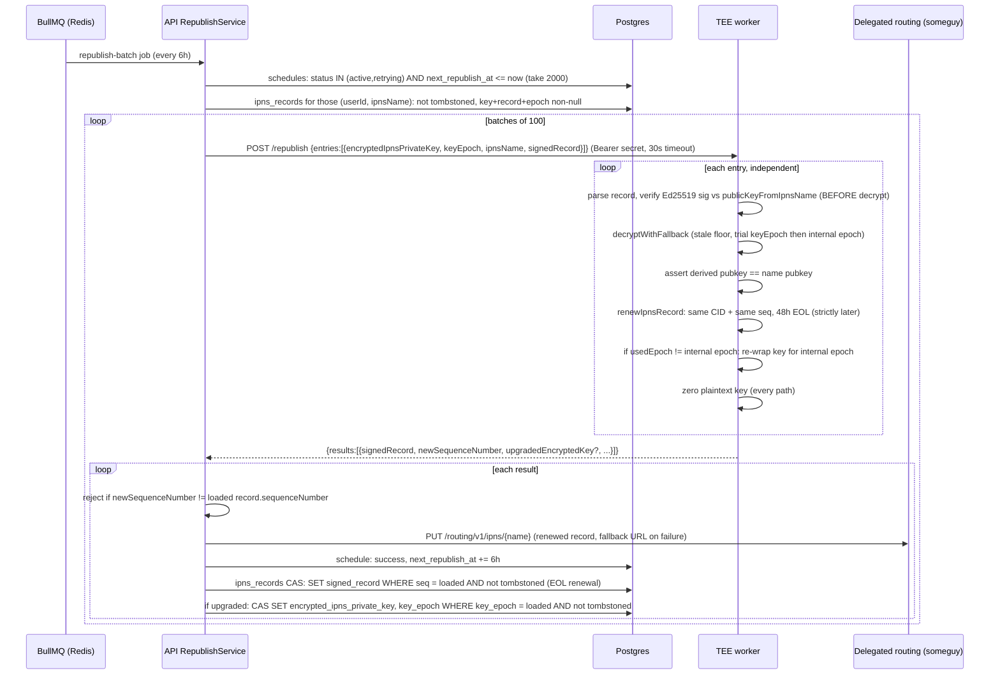

# IPNS republish and record liveness

| | |
| --- | --- |
| **Kind** | flow |
| **Sources** | `apps/tee-worker/src/` (index, routes/republish, routes/public-key, routes/health, middleware/auth, services/tee-keys, services/key-manager, services/ipns-signer), `apps/api/src/republish/` (republish.service, republish.processor, republish.module, republish-schedule.entity, republish-health.controller), `apps/api/src/tee/` (tee.service, tee.module, tee-key-state.service, tee-key-state.entity, tee-key-rotation-log.entity, dto/tee-keys.dto), `apps/api/src/ipns/` (ipns.service, ipns.controller, dto/publish.dto, entities/ipns-record.entity, ipns-record.codec, delegated-routing.client), `apps/api/src/vault/vault.service.ts`, `packages/sdk-core/src/` (tee/wrap, folder/registration, vault/index, file/index, cas, ipns/index, rotation/engine), `packages/sdk/src/client.ts`, `packages/crypto/src/ecies/`, `crates/fuse/src/write_ops/rotation_deps.rs`, `docker/docker-compose.yml`, `apps/tee-worker/docker-compose.phala.yml`, `docs/ARCHITECTURE.md`, `docs/CONFIGURATION.md`, `apps/api/src/migrations/1750000000000-ApiSchemaCutover.ts`, `apps/api/src/migrations/1751000000000-ScheduleCollapse.ts` |
| **Verified against** | cipher-box `27c4abec5` |
| **Status** | draft |

## Purpose and scope

IPNS records expire (client-signed records carry a 24-hour validity window) and clients
are usually offline when that happens. This flow keeps every enrolled IPNS name alive:
clients ECIES-wrap each name's `ipnsPrivateKey` to the TEE public key at creation time,
the API stores the wrapped key alongside the canonical signed record, and every 6 hours a
BullMQ job ships batches to the TEE worker, which decrypts each key in-enclave, re-signs
the **same** record with only a later end-of-life, and discards the key. The API then
pushes the renewed record to delegated routing and writes it back to the database under a
compare-and-swap.

This spec covers: enrollment (how a wrapped key reaches the database), the 6-hour renewal
cycle, TEE key epochs and the 4-week grace mechanics, the sequence/CAS discipline as it
constrains republishing, runtime modes (Phala CVM vs simulator), and lapse/failure
behavior. It does **not** cover the metadata content the records point at
([flows/metadata-sync.md](metadata-sync.md)), key rotation of folder read/write keys
([flows/rotation.md](rotation.md)), or grant delivery
([flows/sharing-grants.md](sharing-grants.md)). The TEE worker's non-republish routes
(`POST /migrate` CID migration, `POST /connection-test`) belong to
[parts/tee-worker.md](../parts/tee-worker.md).

## Vocabulary

- **`ipnsName`** — CIDv1 libp2p-key identifier (`k51…` base36 or `bafzaa…` base32) that
  encodes an Ed25519 public key; the key IS recoverable from the name
  (`publicKeyFromIpnsName`).
- **`ipnsRecord`** — protobuf-marshaled, Ed25519-signed record binding an `ipnsName` to a
  value `/ipfs/<cid>` with a sequence number and an RFC3339 end-of-life (`Validity`,
  `ValidityType: 0`).
- **`encryptedIpnsPrivateKey`** — ECIES ciphertext of a 32-byte Ed25519 IPNS private key,
  wrapped under a per-epoch TEE secp256k1 public key. Hex on the client→API wire, `bytea`
  in the DB, base64 on the API→TEE wire.
- **`teePublicKey`** — 65-byte uncompressed secp256k1 public key (0x04 prefix), one per
  `keyEpoch`, derived deterministically inside the TEE.
- **`keyEpoch`** — small sequential integer identifying which TEE key a ciphertext was
  wrapped for. Nominal duration 4 weeks.
- **Enrollment** — a publish that carries `encryptedIpnsPrivateKey` + `keyEpoch`, causing
  the API to store the wrapped key and add the name to the republish schedule.
- **Lease renewal / EOL-only renewal** — re-signing an existing record with the same
  value (CID) and same sequence, only a later EOL. The TEE performs exclusively this.
- **`TEE_WORKER_SECRET`** — shared bearer secret authenticating API→TEE HTTP calls.
- **Delegated routing** — the HTTP `/routing/v1/ipns/` PUT/GET interface (someguy in
  staging/local, `https://delegated-ipfs.dev` by default). Kubo is the IPFS node holding
  blocks; someguy fronts DHT routing for IPNS.

## Actors and trust boundaries

| Actor | Sees | Must never see |
| --- | --- | --- |
| Client (web/desktop SDK) | plaintext `ipnsPrivateKey` for names it owns; `teePublicKey` + `keyEpoch` (from vault API responses) | TEE private keys |
| CipherBox API | signed record bytes, `ipnsName`, CIDs, `encryptedIpnsPrivateKey` ciphertext, `keyEpoch`, `TEE_WORKER_SECRET` | plaintext `ipnsPrivateKey`, TEE epoch private keys, any folder/file plaintext |
| TEE worker | plaintext `ipnsPrivateKey` transiently in enclave RAM (zeroed on every exit path); per-epoch secp256k1 private keys (derived on demand, zeroed after unwrap) | database access of any kind — the worker is stateless and never touches Postgres; user JWTs |
| Delegated routing (someguy) / DHT | public signed IPNS records | anything else |
| Postgres | everything the API sees, at rest | plaintext keys |

The API is trusted to *relay* but not to *sign*: the TEE verifies the existing record's
signature against the name-derived public key **before** decrypting anything, and derives
the signing authority from the decrypted key itself, so a compromised API cannot make the
TEE sign a forged record, repoint a CID, or bump a sequence number
(`apps/tee-worker/src/routes/republish.ts` steps 2–6).

## Data structures

### `ipns_records` (DB table, one canonical row per `ipnsName`)

Created by migration `1750000000000-ApiSchemaCutover.ts`, which **dropped the old
`folder_ipns` table** (and its `public_key` column — the key is now always recovered from
the name). Entity: `apps/api/src/ipns/entities/ipns-record.entity.ts`. Unique on
`ipns_name` alone; `user_id` is a denormalized creator marker for listing/enrollment/
cleanup, not an authority check.

| Column | Type | Meaning |
| --- | --- | --- |
| `id` | uuid PK | row id |
| `user_id` | uuid FK→users | creator/owner (CASCADE delete) |
| `ipns_name` | varchar(255), unique | the IPNS name |
| `latest_cid` | varchar(255) nullable | CID of latest metadata blob |
| `sequence_number` | bigint (string in TypeORM) | canonical sequence, incremented on forward publish |
| `signed_record` | bytea nullable | canonical marshaled signed record of the latest publish — the TEE's signing input and the DB-cache resolve source |
| `encrypted_ipns_private_key` | bytea nullable | ECIES-wrapped Ed25519 key for TEE republishing |
| `key_epoch` | int nullable | TEE epoch the key is wrapped for |
| `is_root` | boolean | marks the vault root name |
| `tombstoned_at` | timestamptz nullable | terminal retirement; publish/resolve → 410 |
| `generation` | bigint | rotation counter, forward-only publish gate (TEE-07) |

A name is **republishable** iff `tombstoned_at IS NULL` and `encrypted_ipns_private_key`,
`signed_record`, `key_epoch` are all non-null (`republish.service.ts getDueEntries`).
Rows created by the sharing protocol (and the `POST /vault/init` root pre-row, seq `'0'`,
`vault.service.ts:91`) have null `signed_record` and are therefore not republishable
until a real publish lands.

### `ipns_republish_schedule` (DB table — scheduling only, zero crypto columns)

`apps/api/src/republish/republish-schedule.entity.ts`. Since migration
`1751000000000-ScheduleCollapse.ts` all signing inputs live on `ipns_records`; the
schedule row is pure bookkeeping, paired to `ipns_records` by (`user_id`, `ipns_name`).

| Column | Type | Meaning |
| --- | --- | --- |
| `user_id` + `ipns_name` | unique pair | which enrollment |
| `next_republish_at` | timestamp | due time (indexed with `status`) |
| `last_republish_at` | timestamp nullable | last success |
| `consecutive_failures` | int | resets to 0 on success |
| `status` | varchar(20) | `'active'` \| `'retrying'` \| `'stale'` |
| `last_error` | text nullable | truncated to 500 chars; never key material |

### `tee_key_state` (DB table, singleton row)

`apps/api/src/tee/tee-key-state.entity.ts`. Must be seeded before clients can enroll —
when the row is absent, vault responses carry `teeKeys: null` and clients silently skip
enrollment (see Known gaps).

| Column | Type | Meaning |
| --- | --- | --- |
| `current_epoch` | int | active epoch |
| `current_public_key` | bytea (65 bytes, 0x04-prefixed) | key clients wrap under |
| `previous_epoch` / `previous_public_key` | nullable | pre-rotation values |
| `grace_period_ends_at` | timestamp nullable | rotation + 4 weeks (`GRACE_PERIOD_MS`, `tee-key-state.service.ts:11`) |

`tee_key_rotation_log` (`tee-key-rotation-log.entity.ts`) is an append-only audit of
rotations: `from_epoch`, `to_epoch`, both public keys, `reason`
(`'scheduled' | 'cvm_update' | 'manual'`).

### `TeeKeysDto` (API→client JSON, embedded in every vault response)

`apps/api/src/tee/dto/tee-keys.dto.ts`, attached by `vault.service.ts toVaultResponse`:
`{ currentEpoch: number, currentPublicKey: hex-string, previousEpoch: number|null,
previousPublicKey: hex-string|null }`. Null as a whole when `tee_key_state` is empty.

### Publish enrollment fields (client→API JSON, on `POST /ipns/publish` / `/ipns/publish-batch`)

Subset of `PublishIpnsDto` (`apps/api/src/ipns/dto/publish.dto.ts`) relevant here:

| Field | Type | Notes |
| --- | --- | --- |
| `ipnsName` | string | `k51qzi5uqu5…` or `bafzaa…`, regex-validated |
| `record` | base64 | marshaled signed IPNS record |
| `publicKey` | base64, optional | raw 32-byte Ed25519 key; must derive to `ipnsName` |
| `metadataCid` | string | must equal the record's embedded value `/ipfs/<cid>` exactly (S1 gate) |
| `encryptedIpnsPrivateKey` | hex, optional, 100–1000 chars | enrollment ciphertext |
| `keyEpoch` | number, optional | required *together with* the ciphertext for the API to persist either |
| `expectedSequenceNumber` | numeric string, optional | CAS guard, 409 on mismatch |
| `generation` | numeric string, optional | forward-only rotation gate (TEE-07) |

### `RepublishEntry` / `RepublishResult` (API↔TEE JSON, `POST /republish`)

Defined twice, structurally identically: `apps/api/src/tee/tee.service.ts:13` and
`apps/tee-worker/src/routes/republish.ts:57`. Request: `{ entries: RepublishEntry[] }`,
max 100 entries; response `{ results: RepublishResult[] }`, index-aligned.

| `RepublishEntry` field | Type | Source |
| --- | --- | --- |
| `encryptedIpnsPrivateKey` | base64 | `ipns_records.encrypted_ipns_private_key` |
| `keyEpoch` | number | `ipns_records.key_epoch` (a *hint*, never authority) |
| `ipnsName` | string | schedule row |
| `signedRecord` | base64 | `ipns_records.signed_record` |

Deliberately **absent** (removed by design D-01/D-02/D-03, phase 67): `latestCid`,
`sequenceNumber`, `currentEpoch`, `previousEpoch` — the TEE parses value/sequence from
the signed record and derives the current epoch from its own clock; the relay cannot
inject either.

| `RepublishResult` field | Type | Meaning |
| --- | --- | --- |
| `ipnsName` | string | echo |
| `success` | boolean | |
| `signedRecord?` | base64 | renewed record: same CID, same sequence, later EOL |
| `newSequenceNumber?` | string | equals the parsed input sequence — never incremented |
| `upgradedEncryptedKey?` / `upgradedKeyEpoch?` | base64 / number | present when the TEE re-wrapped the key for its internal current epoch |
| `requiresReEnroll?` | `true` | key older than the stale floor; client-side re-enrollment needed |
| `error?` | string | sanitized; `'RE_ENROLL_REQUIRED'` for the above |

### TEE worker HTTP surface

`apps/tee-worker/src/index.ts`. Auth = `Authorization: Bearer <TEE_WORKER_SECRET>`,
constant-time compared (`middleware/auth.ts`); 500 if the worker has no secret
configured. `GET /health` and `GET /metrics` are unauthenticated.

| Route | Auth | Purpose |
| --- | --- | --- |
| `GET /health` | no | `{ healthy, mode, epoch, uptime }` — `epoch` comes from the `TEE_CURRENT_EPOCH` env var (default 1), **not** the internal clock (see Known gaps) |
| `GET /public-key?epoch=N` | yes | `{ epoch, publicKey: hex }`, epoch ∈ [1, 10000] |
| `POST /republish` | yes | batch lease renewal (the heart of this flow) |
| `POST /migrate`, `POST /connection-test` | yes | out of scope here — [parts/tee-worker.md](../parts/tee-worker.md) |

### TEE key derivation

`apps/tee-worker/src/services/tee-keys.ts`. Per-epoch secp256k1 keypairs, derived on
demand and never persisted:

- **simulator mode** (`TEE_MODE=simulator`, default): HKDF-SHA256 over the fixed seed
  `'cipherbox-tee-simulator-seed'`, salt `'cipherbox-dev'`, info `epoch-<N>` — public,
  deterministic, dev/staging only. Refused (typed `TeeKeyUnavailableError`) when
  `CIPHERBOX_ENVIRONMENT`/`NODE_ENV` is production.
- **cvm mode** (`TEE_MODE=cvm`, production): Phala dstack SDK
  `DstackClient.getKey('cipherbox/ipns-republish', 'epoch-<N>')`, hardware-backed and
  bound to the CVM app identity (deleting/recreating the CVM invalidates every epoch key —
  warning in `apps/tee-worker/docker-compose.phala.yml`).

The **internal current epoch** is `floor((now − EPOCH_ZERO_TIMESTAMP_MS) / 4 weeks) + 1`,
clamped to ≥ 1, computed at call time; an absent/invalid anchor yields epoch 1
(`getInternalCurrentEpoch`).

ECIES itself is the eciesjs scheme (`packages/crypto/src/ecies/`): ephemeral secp256k1
keypair → ECDH → HKDF → AES-GCM; `wrapKey`/`unwrapKey` are the only primitives used on
both sides.

## Flows

### Enrollment — a wrapped key reaches the schedule

- **Trigger** — a client creates an IPNS name: vault root (`packages/sdk-core/src/vault/index.ts:139-156`),
  subfolder (`packages/sdk-core/src/folder/registration.ts createSubfolder`), or per-file
  IPNS record (`packages/sdk-core/src/file/index.ts:283-298`).
- **Preconditions** — the client holds `teeKeys` from a vault API response
  (`currentPublicKey` hex + `currentEpoch`); `tee_key_state` is seeded server-side.
- **Steps**
  1. Client validates `teeKeys` fail-closed: present-but-malformed (`currentPublicKey`
     empty, `currentEpoch` < 1 or non-integer) throws before any side effect. A wholly
     **absent** `teeKeys` silently skips enrollment — the name is published un-enrolled.
  2. Client calls `wrapIpnsKeyForTee(ipnsPrivateKey, hexToBytes(currentPublicKey))`
     (`packages/sdk-core/src/tee/wrap.ts` → `wrapKey`), hex-encodes the ciphertext, and
     sets `keyEpoch = currentEpoch`. The plaintext key is borrowed, never zeroed by the
     wrapper (D-09 caller-owns-buffer).
  3. Client publishes the first IPNS record with **embedded sequence 1** (strict
     first-publish gate) carrying `encryptedIpnsPrivateKey` + `keyEpoch` in the same
     `POST /ipns/publish` (or batch) body.
  4. API (`ipns.service.ts publishRecord`) verifies the record's Ed25519 signature
     against the name-derived key (possession of the key IS publish authority — no
     per-user ownership check), runs the sequence/CAS/tombstone gates (below), and
     persists the row: on INSERT it stores ciphertext + epoch; on UPDATE it stores them
     only when **both** fields are present **and** the caller is the row owner
     (`shouldUpdateKey`, `ipns.service.ts:377` — write-share recipients cannot overwrite
     the owner's enrollment).
  5. API fire-and-forgets `republishService.enrollFolder(ownerUserId, ipnsName)`:
     upsert of the schedule row with `next_republish_at = now + 6h`, `status='active'`,
     failures reset — re-enrolling revives a `'stale'` row.
- **Postconditions** — the name is republishable; the network record (24h lifetime,
  `packages/sdk-core/src/ipns/index.ts:72`) will be renewed before expiry. The record's
  `ttl` field (resolver cache hint, distinct from validity) is never set explicitly by
  clients or the TEE — every record carries the js-ipns default of 5 minutes
  (`ipns@10.1.3` `DEFAULT_TTL_NS`, the spec-suggested default), which bounds how long a
  compliant resolver/gateway may serve a cached record after the value changes.
- **Failure modes** — malformed `teeKeys` → client-side throw, nothing published;
  `enrollFolder` rejection → logged warning only, publish still succeeds (the name is
  enrolled on the *next* key-carrying publish or never — a liveness gap, not an error
  surfaced to the client).

### Six-hour republish cycle

- **Trigger** — BullMQ job scheduler `republish-cron`, cron `0 */6 * * *`
  (`republish.module.ts onModuleInit`; registration failure when Redis is down is
  non-fatal and logged). Job → `RepublishProcessor.process` →
  `RepublishService.processRepublishBatch`.
- **Preconditions** — TEE worker reachable at `TEE_WORKER_URL` with matching
  `TEE_WORKER_SECRET`; due, republishable rows exist.

- **Steps (normative detail)**
  1. `getDueEntries` (`republish.service.ts:54`) pairs schedule rows to `ipns_records`
     by (`userId`, `ipnsName`) — never by name alone, since `ipns_name` uniqueness is
     enforced but the pairing defends against hypothetical duplicates. Rows failing the
     republishable filter silently drop out and are re-picked next cycle. Tombstone
     exclusion here is defense layer 1; the CAS write-backs are layer 2.
  2. `TeeService.republish` POSTs each 100-entry batch (`BATCH_SIZE`, matching the
     worker's `MAX_BATCH_SIZE`) with a 30 s timeout.
  3. The TEE worker processes entries independently (`routes/republish.ts`): a non-object
     entry yields a per-entry failure, not a batch crash. Order of operations is
     load-bearing: parse → **verify signature before any decryption** → decrypt with
     internal-epoch authority → name↔key binding via `deriveEd25519PublicKey(decrypted)`
     (never the record's embedded `pubKey`, which is absent for Ed25519 identity
     records) → renew → optional epoch upgrade → zero the key. `renewIpnsRecord`
     (`services/ipns-signer.ts`) takes no CID or sequence argument at all — both come
     exclusively from parsing the existing record — and throws `EolRollbackError` if the
     freshly minted record's on-wire EOL is not strictly later than the existing one's.
     TEE lifetime is 48 h vs the client's 24 h, giving 8× margin over the 6 h cadence.
  4. Back in the API, a sequence-mismatch result is rejected (defense TEE-02: publishing
     it would push delegated routing ahead of the DB row whose renewal CAS matches only
     the loaded sequence).
  5. `publishSignedRecord` PUTs the renewed bytes to
     `{DELEGATED_ROUTING_URL}/routing/v1/ipns/{name}` with retries and an optional
     fallback URL (`delegated-routing.client.ts`; default primary
     `https://delegated-ipfs.dev`, staging/local: local someguy).
  6. Success bookkeeping: schedule row reset (`active`, failures 0, `next += 6h`); then
     `renewIpnsRecordEol` — `UPDATE ipns_records SET signed_record, updated_at WHERE
     ipns_name AND user_id AND sequence_number = <loaded> AND tombstoned_at IS NULL`.
     `affected = 0` means a forward publish raced or the row was tombstoned mid-cycle;
     the renewal is harmlessly discarded (the newer row already has a valid EOL). A
     thrown DB error is logged at error level but non-fatal — the network publish already
     happened.
  7. Epoch upgrade persistence: `UPDATE ipns_records SET encrypted_ipns_private_key,
     key_epoch WHERE ipns_name AND user_id AND key_epoch = <loaded> AND tombstoned_at IS
     NULL` — the `key_epoch` equality is a CAS so a concurrent client re-wrap is never
     clobbered.
- **Postconditions** — DHT/gateway readers see a record valid for 48 h; the DB cache
  serves the same renewed bytes; sequence and CID unchanged everywhere.
- **Failure modes**
  - **TEE unreachable / non-2xx / timeout** — the whole 100-entry batch is marked failed;
    remaining batches still attempt (and fail similarly).
  - **Per-entry failure** (bad signature, undecryptable key, EOL rollback, publish
    failure after successful signing) — `handleEntryFailure`: `status='retrying'`,
    exponential backoff `30s · 2^failures` capped at 3600 s; after 10 consecutive
    failures `status='stale'` with `next_republish_at` pushed one year out. A stale
    entry's record **will lapse** on the network.
  - **`requiresReEnroll`** — the key is older than the TEE's stale floor. The API logs a
    warning and routes it as an ordinary failure (`republish.service.ts:176`) — there is
    no client-facing consumer (see Known gaps), so it decays to `'stale'`.
  - **All-failed batch** — processor logs "TEE worker may be unreachable" and flips the
    batch metric to error; nothing reactivates stale entries automatically (see Known
    gaps).

### TEE key-state bootstrap (seeding `tee_key_state`)

- **Trigger** — API startup, `TeeModule.onModuleInit` → `TeeService.initializeFromTee`.
- **Steps**
  1. `GET {TEE_WORKER_URL}/health` → `{ epoch }` (env-sourced, see Known gaps).
  2. If `tee_key_state` is empty: `GET /public-key?epoch=<health.epoch>` (validated
     65-byte 0x04-prefixed) → `initializeEpoch` inserts the singleton row.
  3. If seeded: compare `current_epoch` to the worker's reported epoch; mismatch is a
     logged warning ("Manual epoch rotation may be needed"), never an automatic rotation.
- **Failure modes** — TEE unreachable at boot is non-fatal (logged); until seeded, every
  vault response carries `teeKeys: null` and **new names are silently created
  un-enrolled** — nothing retro-enrolls them when the state appears later, short of a
  future key-carrying publish of the same name.

### Epoch rotation and grace

- **State machine** — `TeeKeyStateService.rotateEpoch(newEpoch, newPublicKey, reason)`
  shifts current→previous, sets the new current, stamps
  `grace_period_ends_at = now + 4 weeks`, and appends to `tee_key_rotation_log`, all in
  one transaction. `deprecatePreviousEpoch` nulls the previous fields once grace passes.
  **Neither has any production caller** — no endpoint, no scheduler (see Known gaps);
  rotation today is a manual/DB operation.
- **TEE-side authority** — the worker never trusts a relay-supplied epoch scalar. Its
  decryption policy (`services/key-manager.ts decryptWithFallback`):
  1. Hard stale floor: `keyEpoch < internalCurrentEpoch − 1` → `ReEnrollRequiredError`
     **before any unwrap attempt**. The floor width (current − 1, epochs are 4 weeks)
     is what actually implements the "4-week grace" for republishing.
  2. Trial 1: unwrap with the `keyEpoch` hint's derived keypair.
  3. Trial 2 (mid-rotation): unwrap with the internal current epoch (covers a key already
     re-wrapped whose DB `key_epoch` is stale).
  4. A `TeeKeyUnavailableError` (deployment misconfig, dstack SDK contract violation) is
     rethrown typed, never masked as a corrupt-key failure.
- **Lazy migration** — on every successful renewal where `usedEpoch !=
  internalCurrentEpoch`, the TEE re-wraps the key for the internal current epoch and
  returns `upgradedEncryptedKey`/`upgradedKeyEpoch`; the API persists them under the
  `key_epoch` CAS. Over one grace window every actively-republished name migrates without
  client involvement.
- **Client-side migration** — clients always wrap under `teeKeys.currentPublicKey` from
  the latest vault response, so *new* names land on the new epoch immediately. A
  dedicated lazy re-wrap seam exists in the SDK
  (`packages/sdk/src/client.ts maybeRepublishFolderForFileMigration`,
  `migratedIpnsPrivateKeyEncrypted`) but is dormant and broken (see Known gaps).
- **Failure modes** — grace expiry with a still-old key: the stale floor trips,
  `requiresReEnroll` propagates, and — absent the unbuilt re-enrollment consumer — the
  entry decays to `'stale'` and its record lapses on the network.

### Unenrollment and tombstone

- **Deletion** — clients call `POST /ipns/unenroll` (≤ 200 names) after file/folder
  deletion (`ipns.controller.ts unenrollBatch` → schedule-row `DELETE`, per-name
  ownership scoped). The SDK fires this best-effort (`client.ts fireAndForgetUnenroll`).
- **Rotation** — key rotation mints a *new* IPNS name per rotated node; the old name is
  retired via `POST /ipns/tombstone` (owner-scoped `SET tombstoned_at = now()` CAS +
  schedule delete; `ipns.service.ts tombstoneRecord`) and the rotation engine fires
  `teeUnenrollFn(oldName)` per old name after the subtree publishes
  (`packages/sdk-core/src/rotation/engine.ts:2823`). A tombstoned name answers 410 Gone
  to publish *and* resolve, forever.
- **Postconditions** — tombstoned/unenrolled names drop out of `getDueEntries`
  permanently; their network records expire naturally within ≤ 48 h.

### Sequence/CAS discipline as it constrains republishing

The publish plane (owned by [parts/api.md](../parts/api.md) /
[flows/metadata-sync.md](metadata-sync.md); summarized here because the renewal path is
defined by contrast) enforces, in `ipns.service.ts upsertIpnsRecord`:

- First publish: embedded sequence must be exactly 1 (else 400). All producers comply
  (`createAndPublishIpnsRecord` callers pass `1n`; `publishWithCas` passes
  `sequenceNumber: 0n` pre-increment).
- Forward publish: embedded must be `dbSeq + 1`; smaller → 400 rollback; larger → 400
  wild-jump. Anti-rollback additionally compares the *embedded, signature-covered*
  sequences of incoming vs stored record so replaying an old-but-valid signed record
  cannot regress the row.
- Same-sequence publish: allowed only as an idempotent re-sign of the **same** CID
  (sequence not incremented); same seq + different CID → 400 equivocation — unless it is
  a lost forward-CAS race (`expectedSequenceNumber == embedded − 1`), which falls through
  to the atomic CAS and 409s.
- The forward write is ONE atomic conditional UPDATE fusing sequence CAS + forward-only
  `generation` gate (TEE-07, rotation write-plane) + tombstone gate; `affected` drives
  the outcome, with a single follow-up read to distinguish 409 from 410.

The TEE renewal interacts with this plane only by *not* being on it: `renewIpnsRecordEol`
is a standalone equality-CAS UPDATE that never calls `upsertIpnsRecord`, never changes
`sequence_number`, `latest_cid`, or `generation`, and loses every race by design. Because
the renewed record re-signs the same CID, the sealed `PublishedNode` behind it — read
body, write-sealed body, recipient pins (phase 80 write-plane work, commit `27c4abec5`) —
is preserved bit-for-bit through republishing; write-body durability across *rotation*
republish is handled client-side (`crates/fuse/src/write_ops/rotation_deps.rs`
`reconstruct_write_body`) and belongs to [flows/rotation.md](rotation.md).

### Record lapse — who breaks when renewal stops

- Network record expires (24 h client-signed, 48 h TEE-renewed). DHT/gateway consumers
  and any resolver that trusts EOL stop resolving the name.
- **API-mediated readers survive**: `ipns.service.ts resolveRecord` always consults the
  DB cache, and `parseCachedRecord` serves the stored `signed_record` bundle (pubKey
  recovered from the name) — but the strict SDK client *verifies the EOL of whatever it
  receives* with a 5-minute skew buffer (`packages/sdk-core/src/ipns/index.ts:463-471`)
  and fails closed on an expired record. So once the cached `signed_record`'s own EOL
  passes (≤ 48 h after the last renewal), even first-party clients hard-fail.
- **Shared names with no `signed_record`** (sharing-protocol rows) resolve via the
  `seqFloor` path: they are served **only** from a live network record at or above the
  floor (`ipns-record.codec.ts`, `ipns.service.ts:704-727`). A lapse breaks shared reads
  immediately — there is no DB fallback for them.
- **TEE down** — all entries fail, backoff escalates; entries that cross 10 failures
  (~a few hours of TEE downtime given the backoff cap) go `'stale'` and stay there even
  after the TEE recovers (no automatic reactivation — Known gaps). `GET
  /admin/republish-health` (`republish-health.controller.ts`) exposes
  pending/failed/stale counts, last run, epoch, and TEE reachability.
- **API DB loss** — `encrypted_ipns_private_key` and `signed_record` are unrecoverable
  (the TEE is stateless; the plaintext keys exist only client-side, sealed inside vault/
  folder metadata). Republishing halts for every name until each owner comes online and
  re-publishes with fresh enrollment fields; network records lapse within 48 h.
  Recovery-tool territory: [flows/vault-export-recovery.md](vault-export-recovery.md).

## Invariants

1. **INV-1** — The TEE MUST verify the existing record's Ed25519 signature against
   `publicKeyFromIpnsName(ipnsName)` before any decryption of `encryptedIpnsPrivateKey`.
2. **INV-2** — A TEE renewal MUST carry the same value (CID) and same sequence number as
   the parsed existing record; both MUST be sourced only from those parsed bytes (no CID
   or sequence parameter exists on the renewal primitive).
3. **INV-3** — A renewed record's end-of-life MUST be strictly later than the parsed
   existing record's (compared on-wire, never against wall clock); otherwise the renewal
   is rejected (`EolRollbackError`).
4. **INV-4** — The TEE MUST assert `deriveEd25519PublicKey(decryptedKey) ==
   publicKeyFromIpnsName(ipnsName)` before signing, and MUST NOT use the record's
   embedded `pubKey` field for this check.
5. **INV-5** — The plaintext IPNS private key MUST be zeroed inside the TEE on every exit
   path (success, binding failure, re-enroll, unexpected error), and MUST never appear in
   logs, error messages, or the database.
6. **INV-6** — The TEE MUST derive its current epoch from its own clock
   (`EPOCH_ZERO_TIMESTAMP_MS`); it MUST NOT accept a relay-supplied current/previous
   epoch, and MUST refuse (typed re-enroll signal) any key with
   `keyEpoch < internalCurrentEpoch − 1` before attempting decryption.
7. **INV-7** — Epoch re-wrapping MUST target only the TEE-internal current epoch.
8. **INV-8** — The TEE worker MUST be stateless: no database access, no persisted keys;
   all durable state flows through the API.
9. **INV-9** — All signing inputs sent to the TEE MUST come from the canonical
   `ipns_records` row (never from schedule-row snapshots), and the schedule table MUST
   NOT hold crypto columns.
10. **INV-10** — The API MUST reject a TEE result whose `newSequenceNumber` differs from
    the sequence loaded with the batch, and MUST NOT publish it to delegated routing.
11. **INV-11** — Every DB write-back of the renewal cycle MUST be an equality CAS
    (`sequence_number = loaded` for the record renewal; `key_epoch = loaded` for the
    epoch upgrade), scoped to the owner (`user_id`) and gated on
    `tombstoned_at IS NULL`; an `affected = 0` outcome MUST be discarded silently.
12. **INV-12** — A tombstoned `ipnsName` MUST never be republished, re-encrypted, or
    served: excluded from batches, excluded by every write-back CAS, and answered 410 on
    publish/resolve. Tombstoning is terminal.
13. **INV-13** — Enrollment fields on an existing row MUST only be writable by the row
    owner, and only when `encryptedIpnsPrivateKey` and `keyEpoch` arrive together.
14. **INV-14** — A first publish MUST embed sequence 1; forward publishes MUST embed
    exactly `dbSeq + 1`; a same-sequence publish MUST carry the same CID (equivocation
    guard) and MUST NOT increment the stored sequence.
15. **INV-15** — API↔TEE calls MUST carry `Authorization: Bearer TEE_WORKER_SECRET`,
    compared in constant time; the secret MUST never be logged.
16. **INV-16** — Simulator-mode key derivation MUST be refused in a production
    environment.

## Known gaps and quirks

- **`docs/ARCHITECTURE.md` describes the pre-phase-67 design** (lines 225–268 at the
  pinned commit): it says schedule rows carry the signing inputs, that the TEE "builds"
  a record from `latestCid`, and that upgraded keys persist to
  `ipns_republish_schedule`. All three are wrong post-`ScheduleCollapse`: inputs come
  from `ipns_records`, the TEE renews (same CID/seq) rather than builds, and upgrades
  land on `ipns_records`. Its DB table list still names `folder_ipns`, dropped by
  `1750000000000-ApiSchemaCutover.ts`.
- **Two disconnected epoch sources in the worker.** `GET /health` (and `/migrate`)
  report `TEE_CURRENT_EPOCH` env (default 1), while the republish path uses the
  `EPOCH_ZERO_TIMESTAMP_MS`-derived internal epoch. The API seeds `tee_key_state` from
  the *health* epoch. If the internal clock advances past `TEE_CURRENT_EPOCH`, clients
  keep wrapping for the seeded epoch while the TEE re-wraps to a newer internal epoch —
  the trial-2 fallback absorbs it, but health/DB and signing authority disagree.
  `EPOCH_ZERO_TIMESTAMP_MS` is absent from `docs/CONFIGURATION.md` entirely; with it
  unset (all current deploy configs), the internal epoch is pinned to 1 and rotation
  never happens organically.
- **Epoch rotation has no trigger.** `rotateEpoch` and `deprecatePreviousEpoch` have no
  production callers — no admin endpoint, no scheduler. The 4-week grace machinery is
  fully built but reachable only by hand.
- **`requiresReEnroll` dead-ends.** The API routes it as a plain failure ("consumer
  surface deferred to Phase 68/69", `republish.service.ts:174-183`); no client or SDK
  code references it. A post-grace key therefore silently decays to `'stale'`.
- **`reactivateStaleEntries` is dead code** (`republish.service.ts:395`) — nothing calls
  it, so TEE recovery never revives `'stale'` rows; they wait a year.
- **Client lazy-migration seam is dormant and half-wired.**
  `maybeRepublishFolderForFileMigration` (`packages/sdk/src/client.ts:4064`) forwards
  `encryptedIpnsPrivateKey` **without `keyEpoch`**, so even if invoked the API's
  both-fields guard (`shouldUpdateKey`) silently drops the migrated key. No production
  caller supplies `migratedIpnsPrivateKeyEncrypted` (tests only).
- **Rotation-minted names are never enrolled.** The rotation engine
  (`packages/sdk-core/src/rotation/`) threads no `encryptedIpnsPrivateKey`/`teeKeys`
  through any of its publishes — zero references in the module — so every rotated-in
  IPNS name is published un-enrolled: no TEE coverage, 24 h network lifetime, DB-cache-
  only liveness until the record's own EOL passes. Old names are correctly unenrolled/
  tombstoned; their replacements just never join the schedule.
- **Local-dev port trap.** `TEE_WORKER_URL` defaults to `http://localhost:3001`
  (`tee.service.ts:60`), but in `docker/docker-compose.yml` host 3001 is
  `mock-ipns-routing` and the worker is host-mapped to **3002**. An unset
  `TEE_WORKER_URL` makes the API "initialize" against the mock router — `tee_key_state`
  stays empty, `teeKeys` is null, clients silently skip enrollment.
- **Seeding is a hard prerequisite with a silent failure mode.** Until
  `tee_key_state.current_public_key` exists, enrollment is skipped without any client-
  visible signal, and nothing retro-enrolls names created during that window.
- **Stale comment drift**: `packages/sdk-core/src/ipns/index.ts:67` says "republished by
  TEE every 3 hours" (it is 6); `apps/tee-worker/README.md` describes the fallback order
  as current-then-previous (code: `keyEpoch` hint then internal-current, plus the hard
  floor) and calls `TEE_CURRENT_EPOCH` required (code defaults it to 1);
  `republish.processor.ts:23` hard-codes the metric label `tee_provider: 'mock'` in all
  environments.
- **Sharing-protocol rows are structurally un-renewable** (`signed_record` null →
  `seqFloor` resolve path only) — by design, but it means share liveness rides entirely
  on the owner's enrollment of that name.

## Rewrite notes

- The flow's biggest structural win — verify-in-enclave lease renewal with no relay-
  supplied CID/sequence/epoch — was retrofitted (phase 67) over an earlier "TEE builds a
  record from relay scalars" design, and the docs still describe the old one. A rewrite
  should specify the renewal primitive (`(key, existingRecord) → renewedRecord`) as the
  *only* TEE signing capability from day one.
- Liveness is currently best-effort with silent decay at every edge: un-seeded key
  state, un-enrolled rotated names, `requiresReEnroll` with no consumer, `'stale'` rows
  that nothing revives, fire-and-forget `enrollFolder`. There is no invariant anywhere
  of the form "every live, non-tombstoned name the user cares about has TEE coverage" —
  enrollment is an optional side-car on publish. A redesign should make enrollment a
  *property the server can audit* (e.g. reconcile schedule ↔ records ↔ recent resolves)
  rather than a client courtesy, and give re-enrollment a real client-facing signal.
- The epoch system is split across four authorities (env var, internal clock,
  `tee_key_state`, `ipns_records.key_epoch`) with manual-only rotation. Collapsing to a
  single attested epoch source published by the TEE — and wiring rotation + grace expiry
  to a scheduler — would eliminate the whole quirk cluster above.
- The schedule table earns its keep only as a due-time index; after `ScheduleCollapse`
  it is one `status` + two timestamps keyed by the same pair as `ipns_records`. Folding
  it into `ipns_records` would remove the pairing logic and the drop-out races in
  `getDueEntries`.
- 48 h record lifetime on a 6 h cadence is comfortable, but the *client*-signed 24 h
  lifetime combined with strict client-side EOL enforcement means any enrollment gap
  breaks first-party reads within a day. If strict EOL verification stays, lifetime and
  renewal coverage need to be designed together, not in two packages.
