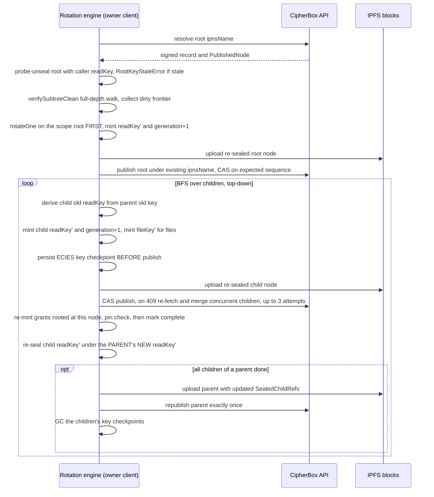
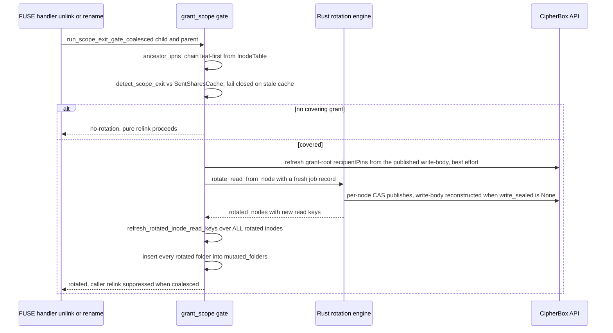

# Key rotation

| | |
| --- | --- |
| **Kind** | flow |
| **Sources** | `packages/sdk-core/src/rotation/` (engine, scope, merge, index), `packages/sdk-core/src/cas.ts`, `packages/sdk/src/client.ts`, `packages/sdk/src/types.ts`, `packages/sdk/src/state/rotation-high-water.ts`, `packages/sdk/src/share/owner-reconcile.ts`, `apps/web/src/services/rotation-driver.service.ts`, `apps/web/src/services/rotation-state.service.ts`, `apps/web/src/hooks/useAuth.ts`, `crates/sdk/src/rotation/` (engine.rs, high_water.rs), `crates/sdk/src/floor_store.rs`, `crates/sdk/src/listing.rs`, `crates/fuse/src/write_ops/` (grant_scope.rs, rotation_deps.rs, implementation/delete.rs, implementation/rename.rs), `crates/fuse/src/fs.rs`, `crates/fuse/src/platform/windows/write_ops.rs`, `apps/api/src/ipns/ipns.service.ts`, `apps/api/src/ipns/dto/publish.dto.ts`, `packages/core/src/node/types.ts`, `docs/adr/0001-write-revocation-full-ed25519-rotation.md`, `docs/adr/0002-read-revocation-protects-future-content-only.md`, `docs/METADATA_SCHEMAS.md`, `.planning/phases/64-rotation-soundness-revocation-guarantees/64-CONTEXT.md`, `.planning/phases/80-rotation-write-plane-and-re-mint-durability/80-CONTEXT.md`, `.planning/REQUIREMENTS.md` (ROT-01..07), `.planning/security/REVIEW-80.md`, `.planning/security/REVIEW-2026-07-11-phase74-rotation.md`, `.planning/research/PITFALLS.md` |
| **Verified against** | cipher-box `27c4abec5` |
| **Status** | draft |

## Purpose and scope

Rotation is how revocation becomes cryptographically real in a zero-knowledge system
where the relay cannot be asked to enforce anything. When a node leaves a grantee's
reachable scope — it is deleted, renamed, or moved out from under a shared folder — the
owner's client re-keys the granted subtree so the (possibly revoked) reader's cached
keys stop opening anything published from that point on. The system defines two planes:

- **Read-plane rotation** (live, shipped): mint a fresh `readKey` and bump `generation`
  for every node in the granted subtree, re-seal all metadata, re-mint surviving grants
  under the new keys. IPNS names and the write plane are untouched.
- **Write-plane rotation** (built, dormant — no production caller): full Ed25519
  rotation per ADR 0001 — a fresh IPNS keypair and k51 name per node, old names
  tombstoned and TEE-unenrolled, co-writer keys re-wrapped.

This spec owns the rotation narrative and its invariants: triggers, the cascade, the
re-seal-under-parent's-new-key rule, content re-key semantics, the forward-only
generation clock and convergence, crash-resume, desktop scope-exit mechanics, the
fail-closed gates and their wiring holes, and what rotation does and does not protect
(ADR 0001/0002). TS engine implementation detail lives in
[../parts/sdk-core.md](../parts/sdk-core.md); the Rust/FUSE runtime in
[../parts/desktop.md](../parts/desktop.md); grant issuance, pins, and re-mint transport
in [sharing-grants.md](sharing-grants.md); IPNS republish/TEE liveness in
[republish-liveness.md](republish-liveness.md); publish/CAS mechanics in
[metadata-sync.md](metadata-sync.md).

## Vocabulary

- **`readKey` / `writeKey`** — per-node AES-256 keys sealing the read-body and
  write-body of a `PublishedNode` (node/v3). Rotation mints `readKey′` ("read key
  prime"); the write plane never changes during read-plane rotation.
- **`generation`** — per-node read-key rotation clock, u32, plaintext on the
  `PublishedNode` envelope and bound into the AAD of both sealed bodies. Authoritative
  only on the child's own envelope; every other copy is a staleness witness
  (`docs/METADATA_SCHEMAS.md` §10).
- **Grant root / covering grant** — a node at which a share (grant) is rooted; a
  mutation is a **scope exit** iff some ancestor (or the node itself) is a grant root
  (`hasCoveringGrant`, `packages/sdk-core/src/rotation/scope.ts:98-113`).
- **Pure relink** — a mutation with no covering grant: parent metadata is re-published,
  zero rotations occur (ROT-02).
- **Dirty edge / dirty frontier** — a child whose published `generation` is ahead of the
  parent's `SealedChildRef.generation` mirror: rotated but not yet mirrored, unreadable
  through the parent (stale `readKeySealed` fails AEAD).
- **Key checkpoint** — `readKey′` ECIES-wrapped under the owner's own `publicKey`,
  persisted *before* the node's publish so a crash between publish and parent-mirror
  update is recoverable.
- **`RotationHighWater`** — durable per-node `{generation, seq}` floors (ROT-07);
  `enforceResolved` fails closed on regression (`packages/sdk/src/state/rotation-high-water.ts:191-252`).
- **`contentRekeyPending`** — the design name (ADR 0002, ROT-03) for the lazy
  content-re-encrypt marker. **The field does not exist in code** — see Known gaps.
- **`recipientPins`** — owner-sealed recipient `publicKey` pins in
  `NodeWriteBody.recipientPins`; the only trusted wrap-target identity at re-mint
  (Phase 80 D-03; detail in [sharing-grants.md](sharing-grants.md)).
- **Terminal-owner rule (D-09)** — a callee never zeroes caller-owned key buffers; the
  minter/terminal owner zeroes, on every exit path.
- **Revocation by absence** — revoked shares are hard-deleted server-side, so a re-mint
  sweep cuts revoked recipients simply by not finding them.
- **`rotateReadFromNode` / `rotateOne` / `rotateWriteFromNode`** — the engine
  entrypoints (`packages/sdk-core/src/rotation/engine.ts`; Rust twin
  `crates/sdk/src/rotation/engine.rs`).

## Actors and trust boundaries

| Actor | Sees | Must never see |
| --- | --- | --- |
| Owner client (web SDK / desktop FUSE) | all plaintext keys of the owned subtree, mints every new key; the only actor that can rotate | other users' private keys |
| Surviving recipient | new `readKey` re-wrapped to their pinned `publicKey`; new `rootGeneration` | any key of nodes outside their grant |
| Revoked reader | old `readKey`/`fileKey` (presumed retained), old CIDs, possibly plaintext already exfiltrated | `readKey′`, `fileKey′`, any post-rotation seal |
| CipherBox API (relay) | sealed envelopes, plaintext `generation`, IPNS records, share rows incl. recipient `publicKey` strings, CAS traffic | any plaintext key; a pubkey it serves is **never** trusted as a wrap target (pin check) |
| IPFS / IPNS network | ciphertext blobs — old CIDs remain fetchable forever | anything else |
| TEE worker | old rotated-out names via unenroll only | rotation key material — the rotation modules never send it anything else |

The relay is inside the rotation threat model twice: it can **replay** a pre-rotation
signed IPNS record (the IPNS signature covers CID + sequence, *not* `generation` —
PITFALLS M1), countered only by client-side durable floors; and it can **substitute a
recipient `publicKey`** in `GET /shares/sent`, countered by the owner-sealed pin check
(Phase 74 review MEDIUM #1 → Phase 80 D-03). Tampering with `generation` itself on an
envelope fails AEAD (it is AAD input). ADR 0002 sets the outer boundary: a ciphertext
already shared is presumed leaked — rotation protects future writes, navigation, and
filenames, never already-distributed content.

## Data structures

Node/v3 (`PublishedNode`, `SealedChildRef`, `NodeWriteBody`, `WriteChildRef`,
`NodeContent`) is owned by [../parts/sdk-core.md](../parts/sdk-core.md) /
`docs/METADATA_SCHEMAS.md`. Rotation constrains it:

- `generation` is authoritative only on the child's own envelope;
  `SealedChildRef.generation` and `shares.rootGeneration` are staleness witnesses.
  Read-plane rotation sets `generation′ = generation + 1` (`engine.ts:1128-1129`);
  write-plane rotation MUST NOT bump it (`engine.ts:2677-2691`).
- The AAD/gate generation for unsealing a child comes from the **parent's mirror**
  (`childRef.generation`), never the child's own envelope — otherwise a replayed stale
  envelope self-authenticates (`client.ts:1529-1532`, `engine.ts:770-775`).
- Dual keying discipline: the read plane is keyed by `SealedChildRef.ipnsName`, the
  write plane by `WriteChildRef.childId` (node UUID). They are correlated only by
  resolving a candidate and matching `candidatePub.id === writeChildRef.childId`
  (`engine.ts:2570-2585`); conflating them breaks `rotateWriteFromNode` silently
  (`client.ts:5478-5488`, `crates/fuse/src/write_ops/grant_scope.rs:433-439`).

### `RotationJobRecord` (memory only, advisory)

`engine.ts:169-207`. `{rootNodeId, status, completedNodeIds: Set, frontier,
persistCallback}`. Published IPNS records are the source of truth (D-10); the record
only provides same-run idempotency (`completedNodeIds` checked at `engine.ts:1070`,
added at `engine.ts:1263` — *after* grant re-mint, D-07 ordering). `frontier` is
vestigial (never read by the engine). Web builds a **fresh, empty** record per mutation
(`client.ts:2091-2097`); desktop likewise (`grant_scope.rs:508`); the engine documents
the seeding hazard for hosts that would persist one (`engine.rs:276-288`).

### Key checkpoint plane (durable, ciphertext only)

Write discipline: before a node's rotated publish, `readKey′` is `wrapKey`ed (ECIES)
under the **owner's own** `publicKey` and persisted via
`persistWrappedKey(nodeId, base64)` (`engine.ts:1150-1163`; Rust `engine.rs:510-523`).
GC: the root's checkpoint is deleted right after its own publish
(`engine.rs:1681-1684`); a child's only after its parent's batched mirror republish
commits (`pendingCheckpointNodeIds`, `engine.ts:1700-1704`, rationale 1914-1922; Rust
`engine.rs:963-970`). Storage: desktop — ciphertext in the combined sidecar
`<journal_dir>/rotation-high-water.json` (`JsonSidecarFloorStore`,
`crates/fuse/src/write_ops/rotation_deps.rs:362-405`, `crates/sdk/src/floor_store.rs:339-385`);
web — IndexedDB accessors exist (`apps/web/src/services/rotation-state.service.ts:50-61`)
but are **not wired** into the live client (Known gaps). Plaintext keys never touch
disk; job records and floors carry numbers only (`engine.ts:404-407`).

### `RotationHighWater` durable floors (ROT-07)

`packages/sdk/src/state/rotation-high-water.ts` (Rust:
`crates/sdk/src/rotation/high_water.rs`). Per-`nodeId` monotonic-max `{generation,
seq}` floors in one combined record, seeded from the grant's owner-vouched
`rootGeneration`/`versionFloor` on first contact (`rotation-high-water.ts:231-237`).
`enforceResolved` is a pure pass/throw gate run before unsealing a resolved record,
throwing `GenerationRegressionError`/`SequenceRegressionError`
(`rotation-high-water.ts:213-250`). Write discipline: monotonic max, never decremented;
survives restart (IndexedDB via `apps/web/src/hooks/useAuth.ts:349`; desktop sidecar
`crates/fuse/src/fs.rs:72-82`).

### Server-side generation gate (constrains [../parts/api.md](../parts/api.md))

`ipns_records.generation` plus a forward-only publish gate fused into the atomic CAS
UPDATE (`apps/api/src/ipns/ipns.service.ts:227-244, 371, 423`; 409 on regression,
`:444`). The gate is opt-in per publish — `generation?: string` on the DTO, a no-op
when omitted (`publish.dto.ts:110-117`, `ipns.service.ts:410-412`). **No client
currently sends it**: the TS engine never passes `generation` into `publishWithCas`
(`cas.ts:101` forwards a param no rotation caller sets) and the Rust api-client's
`IpnsPublishRequest` has no such field at all (`rotation_deps.rs:533-540`). See Known
gaps.

## Flows

### Trigger — scope-exit detection (and what does NOT trigger rotation)

- **Trigger** — an owner mutation that removes a node from a granted scope. Five TS SDK
  call sites, all owner mutations: `createSubfolder` (`client.ts:2612`), `renameItem`
  (`client.ts:2716`), `moveItem` **source side only** — moving *into* a destination is a
  scope entry, not an exit (`client.ts:3008-3021`) — `deleteItem` (`client.ts:3129`),
  `deleteToBin` (`client.ts:4884`). Desktop: fuser `unlink`/`rmdir`
  (`implementation/delete.rs:108, 360`), cross-folder `rename` gating the source, with
  an overwritten destination gated as its own independent scope exit
  (`implementation/rename.rs:145-163`); WinFsp gates in `set_delete` — the only
  rejectable callback (`platform/windows/write_ops.rs:1304-1397`).
- **What does not trigger it** —
  - **Revoking a share does not rotate.** `revokeShare` (`client.ts:5149`) only deletes
    the share row; rotation of that root is deferred to whichever *later* direct
    mutation targets the same folder ("PURE-REVOKE ANCESTOR-MIRROR STALENESS, accepted
    residual", `client.ts:2026-2038`).
  - **There is no hygiene rotation.** No timer, schedule, or manual "rotate now" path
    exists anywhere; grant coverage on mutation is the sole trigger. (`keyEpoch` TEE
    key hygiene is a different clock — [republish-liveness.md](republish-liveness.md).)
  - A same-folder rename on desktop is not a scope exit (`rename.rs:145-150`).
- **Steps**
  1. Build leaf-first ancestry. Desktop walks the real inode parent chain
     (`ancestor_ipns_chain`, `grant_scope.rs:53-98`). The web SDK passes only the
     directly-mutated node's **own** `ipnsName` — `FolderTree` tracks no parent chain,
     so coverage is detected only for a grant rooted *at* the mutated node itself
     (`client.ts:2018-2023`; Known gaps).
  2. `hasCoveringGrant` cross-checks two sources: relay-supplied active grant-root
     names (completeness aid) and the client-authoritative `localGrantRecord`
     (anti-malicious-relay, T-63-17; `scope.ts:101-110`). Desktop sources the grant set
     from `SentSharesCache`, refreshed at mount and every 30 s, never per-mutation
     (`grant_scope.rs:126-129, 191, 236-257`), failing closed (EIO) on a
     non-authoritative cache, an incomplete ancestor walk, or a poisoned lock
     (`grant_scope.rs:394-427, 663-673`).
  3. Uncovered → `'no-rotation'`: a pure relink, zero rotation publishes
     (`scope.ts:149-153`; ROT-02 hard-tested across delete/move/rename). Covered → the
     grant root to rotate from is the **closest** covered ancestor — a deep delete
     rotates from the shared-folder root, not the leaf — and rotation fires exactly
     once per scope exit regardless of how many ancestors are grant roots
     (`grant_scope.rs:287-306, 356-380`).
- **Failure modes** — desktop detection failure aborts the destructive operation
  (EIO / `STATUS_ACCESS_DENIED`) — fail closed, never a silent revocation bypass
  (`delete.rs:106-114`, `windows/write_ops.rs:1390-1396`).

### Read-plane rotation cascade (`rotateReadFromNode`)

- **Trigger** — a covered scope exit (above).
- **Preconditions** — the caller holds the scope root's current `readKey`, its
  `ipnsPrivateKey`/`ipnsPublicKey`, and a `nodeKeySource` able to supply per-node
  IPNS/write keys for descendants.

- **Steps**
  1. **Root first.** The scope root is rotated before any descendant — "the actual cut
     that revokes the reader's access at the cheapest commit point"
     (`engine.ts:1297-1300, 1392-1412`; Rust `engine.rs:1628-1640`). Descendants follow
     via a top-down BFS queue (`engine.ts:1501-1547, 2205-2445`).
  2. **Per node, `rotateOne`** (9-step skeleton, `engine.ts:1032-1046`): resolve →
     unseal under the node's own **old** `readKey` (the parameter is named
     `parentReadKey` — a documented misnomer, `engine.ts:267-281`) → mint
     `readKey′ = random 32 bytes`, `generation′ = generation + 1` → for files, swap in
     a fresh `fileKey′` (next flow) → re-seal the read-body under `readKey′` at
     `generation′`; re-seal the write-body **unchanged** under the same `writeKey`
     ("read-rotation does NOT rotate the write plane", `engine.ts:1172-1180`) →
     CAS-publish at the resolved sequence → re-mint grants → mark complete.
     Fail-closed guards: a missing/all-zero 32-byte `ipnsPrivateKey` throws — no
     placeholder-key publish ever (`engine.ts:1099-1108`, Phase 64 D-01).
  3. **The re-seal-under-parent's-NEW-key rule (D-02 — the CRITICAL fix).**
     `rotateOne`'s internal `sealChildReadKey` seals `readKey′` under the node's own
     old key — correct for the node's identity binding but *wrong for the parent link*.
     The Phase-63 bug was exactly this: the parent's `SealedChildRef.readKeySealed` was
     never re-sealed under the parent's new key, so every non-root node would AEAD-fail
     on the next `unsealChildReadKey` (`64-CONTEXT.md` D-02). As built, the walk caller
     performs the fix out-of-band: after a child's `rotateOne` commits, it re-seals the
     returned `childReadKey` under `parentState.parentNewReadKey` (the parent's
     `readKey′` from the parent's own rotation) and writes it, with the bumped
     `generation` mirror, onto the parent's mutable `children[]` copy
     (`engine.ts:2309-2353`; dirty-repair twin `engine.ts:1899-1913`).
  4. **Batched parent republish (D-09/Phase 64 D-02).** Per-parent tracking state
     counts pending children; when the counter hits zero the parent is republished
     **exactly once** with all updated `SealedChildRef`s
     (`decrementPendingAndMaybeRepublish`, `engine.ts:1670-1710`) — the main
     constant-factor win at scale. Skipped children still decrement the counter so the
     republish is never dropped (`engine.ts:2415-2431`).
  5. **CAS-409 merge (ROT-05).** On a lost publish race the engine re-fetches the
     current parent, unseals base + remote under the *old* key, and three-way merges
     `SealedChildRef`s before re-sealing under `readKey′` (`mergeConcurrentChildren`,
     `engine.ts:693-722`; `mergeRotatedChildren`, `merge.ts:44-66`): local rotated
     seals win on conflict, a concurrent add is kept (its wrapper re-sealed under the
     new parent key, its own node NOT re-keyed — `engine.ts:1556-1660`), a base-only
     entry (concurrent delete) is dropped. Accepted residual T-70-02: a delete racing
     rotation is resurrected and self-heals later (`merge.ts:24-29`).
  6. **Grant re-mint per node.** `reMintGrantsRootedAt` (`engine.ts:587-661`) runs
     before completion-marking: revoked → deleted/absent, never re-minted; surviving →
     `assertRecipientPinned` against the owner-sealed `NodeWriteBody.recipientPins`,
     then `wrapKey(readKey′, recipientPublicKey)` hex-encoded for
     `PATCH /shares/:id/grant` (`engine.ts:648-658` — the "Gap C" hex fix). Folder/root
     grants with no pin hard-fail; **file grants are exempt** (D-03g carve-out — a file
     leaf structurally cannot carry pins; enforcing would abort every rotation of a
     folder containing a separately-shared file, `engine.ts:573-582, 608-613`). Detail:
     [sharing-grants.md](sharing-grants.md).
- **Postconditions** — every node in the granted subtree has a new `readKey` and
  `generation + 1` published under its **unchanged** `ipnsName`; parents' mirrors seal
  the children's new keys under the parents' new keys; surviving recipients hold
  re-wrapped keys; the revoked reader's cached keys open nothing published from now on.
  The write plane (writeKeys, `ipnsPrivateKey`s, k51 names) is bit-identical.
- **Failure modes** — per step 5 (CAS retry ≤ 3); a node whose `nodeKeySource` returns
  nothing fails closed but parent accounting still converges (`engine.ts:2165-2174`);
  crash anywhere → next flow but one (crash-resume).

### Content re-key on file rotation (ROT-03 / CRIT-1) — and its as-built honesty

- **Design (ADR 0002)**: rotating a file mints `fileKey′` and marks
  `contentRekeyPending`; the *next content write* re-encrypts under `fileKey′` and
  clears the marker. Read-revocation protects future versions, navigation, and
  filenames — never already-distributed ciphertext ("a shared ciphertext is presumed
  leaked").
- **As built**: `mintFileKeyOnRotate` (`engine.ts:547-558`, called for `kind === 'file'`
  at `engine.ts:1167-1170`) zeroes the old `fileKey` in the unsealed copy and writes
  `fileKey′` **eagerly into the re-sealed metadata**. The lazy marker + clear-on-write
  wiring was deferred to Phase 65 (`engine.ts:529-533`) and **never landed**:
  `contentRekeyPending` exists in no type, and no write path reads or clears it.
- **Consequence**: after rotating a file, the published read-body carries `fileKey′`
  while the current `content.cid` ciphertext was encrypted under the **old** key. The
  current version remains decryptable only via `content.versions[]` (each
  `VersionEntry` carries its own inline `fileKey` — `packages/core/src/node/types.ts:36-46`).
  The security property that *was* delivered (and is tested): a holder of the old
  `readKey`/`fileKey` cannot decrypt the **next published version** — a revoked reader
  who kept `fileKey` can still fetch and decrypt the pre-rotation CID from any IPFS
  gateway forever, exactly as ADR 0002 concedes.

### Crash-resume and convergence

- **Trigger** — `rotateReadFromNode` invoked over a subtree a lost prior run partially
  rotated (the client cannot tell in advance; the walk always checks).
- **Steps**
  1. **Entry probe.** Try unsealing the published root with the caller's `readKey`;
     failure → `RootKeyStaleError` — the root has no checkpoint plane, so a stale root
     key is genuinely unrecoverable by the engine (`engine.ts:1353-1367, 397-419`). The
     SDK falls back to dropping the stale `folderTree` entry and re-navigating top-down
     from the vault root (`client.ts:2185-2245`) — which itself dead-ends "one hop
     early" for a pure-revoke root whose ancestor mirror was never re-sealed (Known
     gaps).
  2. **`verifySubtreeClean` runs unconditionally** (`engine.ts:1369-1384`): a full-depth
     read-only walk comparing each child's plaintext envelope `generation` to the
     parent's mirror, collecting dirty edges **without decrypting them**
     (`engine.ts:932-1025`; Rust `engine.rs:1246-1297`).
  3. **Dirty nodes are repaired, not re-rotated**: `repairDirtyNode`
     (`engine.ts:1837-1990`) recovers `readKey′` from the ECIES key checkpoint
     (`unwrapKey` under the owner's `privateKey`), re-seals only the parent mirror, and
     seeds tracking so descendants still enqueue. No checkpoint →
     `DirtyNodeUnrecoverableError`, fail closed (`engine.ts:1850-1854, 2241-2252`; Rust
     `engine.rs:1918-1923`).
  4. **Clean-but-incomplete nodes are simply rotated again.** Convergence is by safe
     double-rotation, not by skip logic: "an extra rotation only strengthens
     revocation" (`engine.ts:2254-2261`). The done-predicate is
     `parent.SealedChildRef[N].generation == N.envelope.generation` *and* above the
     enqueue-time baseline; the ROT-06 test asserts a converged re-run produces **no
     double bump** (root `Skipped` + empty frontier + not dirty → `Ok(None)`, Rust
     `engine.rs:1749-1761`).
- **Postconditions** — a half-rotated tree is observable only as dirty edges (children
  ahead of their parents' mirrors, unreadable through the parent); a completed resume
  leaves no edge dirty.
- **Failure modes** — crash before a node's publish: nothing durable changed for it;
  crash between publish and parent mirror: the checkpoint covers it; checkpoint lost
  or GC'd: fail closed with an explicit reload-the-app error surfaced by the SDK
  (`client.ts:2157-2181`). On web this path is currently theoretical — see Known gaps
  (checkpoint callbacks unwired; every mutation starts a fresh job record and the
  web driver's `resumeInterruptedRotation` only shows a badge,
  `rotation-driver.service.ts:302-314`).

### Desktop scope-exit rotation (FUSE)

The desktop drives the **Rust twin** of the engine (`cipherbox_sdk::rotate_read_from_node`,
a locked cross-language contract with the TS shape — `engine.rs:887-889`), not a TS
bridge. Runtime detail: [../parts/desktop.md](../parts/desktop.md).

- **Steps (the desktop-specific rules)**
  1. **Pins refresh BEFORE the walk.** The very first statement of
     `rotate_read_on_scope_exit` fetches and unseals the grant root's *current
     published* write-body (write keys never rotate) and overwrites the inode's cached
     `recipientPins` (`grant_scope.rs:474-483`, impl `rotation_deps.rs:670-784`).
     Best-effort by design — a failed refresh proceeds on cached pins
     (`rotation_deps.rs:664-668`). The race it closes: a pin written out-of-band (owner
     shared from web) missing from this mount's cache would both fail-close the
     surviving recipient's re-mint *and* republish the node pin-less, aborting the
     rotation mid-flight so every later refresh AES-GCM-fails against the
     new-generation record — the macOS/WinFsp desktop-e2e cascade
     (`rotation_deps.rs:644-668`).
  2. **Write-body reconstruction on publish (Phase 80 D-01).** The read-plane engine
     emits `PublishedNode`s with `write_sealed: None`. Publishing that verbatim broke
     `list_folder_owned` (607×/run) and lost signing-seed durability across
     rotation + remount. `ApiClientTransport::publish` therefore reconstructs the
     write-body from the in-memory `InodeTable` — the node's own **unchanged**
     `writeKey` + `ipnsPrivateKey` + child `WriteChildRef`s rebuilt from child inodes +
     cached `recipientPins` carried verbatim — re-sealed under the node's own
     `writeKey` at the **new** `generation` (`rotation_deps.rs:486-500, 859-980`).
     Fail-open to `None` for a non-materialized node (D-01b). This **never mutates the
     write plane** — it re-seals the unchanged plane at the bumped generation;
     write-key rotation proper is a deferred Phase-72 concern
     (`rotation_deps.rs:33-51`).
  3. **Post-rotation inode key refresh** overwrites **every** rotated inode's in-memory
     `readKey` (root, folders, files — not just the grant root; the 74-03
     deep-path fix, `grant_scope.rs:602-649`).
  4. **The rotated-folders-marked-mutated rule (the "Part D" fix).** Rotation
     republishes folders out-of-band via the engine, not the mount's publish queue, so
     they were never recorded as locally changed. A stale in-flight metadata refresh
     (resolved pre-rotation, completing after) would clobber the freshly refreshed
     inode keys via `apply_owned_children`, then a later parent republish would revert
     the grant root's child refs — parent/child key divergence, after which **every**
     subsequent scope-exit rotation fails `rotate_one`/`verify_subtree_clean` (the
     macOS FUSE-T overwrite-rename repro). Fix: every rotated folder is inserted into
     `fs.mutated_folders` (`grant_scope.rs:540-580`), which the refresh-completion
     drain treats as "local change wins — do not apply remote"
     (`fs.rs:573-610`; entries expire after 30 s).
  5. **Coalescing.** For a shallow covered delete (the grant root is the direct
     parent), the gate builds the post-delete child list without mutating state and the
     rotation's grant-root publish is the **single** authoritative publish; the
     caller's own relink is suppressed (`grant_scope.rs:740-829`, `delete.rs:99-114,
     249-250`; WinFsp hand-off via a suppression set, `fs.rs:106-114`).
- **Failure modes** — any rotation error aborts the removal (EIO /
  `STATUS_ACCESS_DENIED`); the item stays put. `persist_job` is a no-op logger on
  desktop — resume rides entirely on published-record convergence plus the sidecar
  checkpoints (`rotation_deps.rs:269-279`).

### Write-plane rotation (`rotateWriteFromNode`) — built, dormant

ADR 0001 chose full Ed25519 rotation (approach c) as the write-revocation mechanism:
key possession is the only IPNS publish authority, so denying a revoked co-writer means
changing the signing key — and therefore the k51 `ipnsName` — of every node in the
subtree. The engine exists (`engine.ts:2476-2855`) and is exported, but **no production
code calls it** — the "Phase 66 cutover" never happened (`engine.ts:2769-2777`; only
tests and comments reference it).

- **Steps (as implemented)**
  1. **Child-first (bottom-up)** recursion — the inverse of the read plane — so parents
     only ever point at already-published new names (`engine.ts:2504-2508, 2515-2755`).
  2. Per node: resolve + unseal both bodies; **fail closed on a non-recoverable write
     body** (missing `writeSealed` or absent/all-zero `ipnsPrivateKey` → "cannot rotate
     a read-only node", `engine.ts:2542-2552`); recurse into children, correlating read
     and write planes by resolving `SealedChildRef` candidates and matching the
     envelope `id` to `WriteChildRef.childId` (`engine.ts:2570-2585`); mint a new
     Ed25519 keypair + `deriveIpnsName` + new 32-byte `writeKey`
     (`engine.ts:2632-2638`); rebuild the write-body (new `ipnsPrivateKey`, children's
     `writeKeySealed` re-sealed under this node's new `writeKey`); re-point the
     read-body children's `ipnsName` only — `readKeySealed` NOT re-sealed and
     `generation` NOT bumped (read-plane invariant, `engine.ts:2677-2691`).
  3. First-publish each new name with **embedded sequence exactly 1** (the strict
     server first-publish gate — [republish-liveness.md](republish-liveness.md);
     `engine.ts:2707-2725`), enqueue the old name for tombstoning
     (`engine.ts:2732-2737`).
  4. Only after the **entire subtree** publishes: fire `teeUnenrollFn(oldName)` per old
     name (`engine.ts:2820-2824` — deferred so a failed ancestor publish can't leave
     TEE-unenrolled children still referenced), then handle co-writer grants: revoked →
     delete; surviving → `wrapKey(newRootWriteKey, recipientPublicKey)` handed to
     `encryptedWriteKeyPersistFn` (`engine.ts:2829-2843`).
- **Failure modes / latent defects** — the co-writer re-wrap at `engine.ts:2842` is
  encoded **base64**; the read-plane sibling of this exact bug ("Gap C") 400'd every
  re-mint against the hex-validating `PATCH /shares/:id/grant` and was fixed to hex
  (`engine.ts:648-657` documents it) — the write-plane copy was not changed. Unit tests
  only assert the callback fires. Being dormant, it is latent, not live.
- **Interaction with liveness** — old names are tombstoned/unenrolled, but nothing in
  the rotation module ever threads `encryptedIpnsPrivateKey`/`keyEpoch` into any
  publish (zero grep hits module-wide; the Rust transport hard-codes
  `encrypted_ipns_private_key: None, key_epoch: None`, `rotation_deps.rs:533-540`), so
  **every rotation-minted name is born un-enrolled**: 24 h network lifetime, no TEE
  renewal — see [republish-liveness.md](republish-liveness.md) Known gaps.

## Runtime variants

- **Gates are configuration-conditional.** Every ROT-07 floor gate in the TS SDK is a
  no-op for a client constructed without `config.rotationHighWater`
  (`client.ts:867, 1887` — "zero enforcement, matching prior behavior"). The live web
  app injects the IndexedDB-backed store (`useAuth.ts:349`); desktop injects the
  sidecar store; any other embedder gets no anti-rollback.
- **Web vs desktop callback wiring diverges materially.** Desktop wires pins,
  checkpoints, and grant re-mint fully (Rust). The live web
  `buildRotationClientCallbacks()` wires only grant-root lookup, local grant record,
  persistJob, and progress (`rotation-driver.service.ts:284-291`) — **neither**
  `resolveInlineGrantRemint` **nor** `keyCheckpoint`, despite `client.ts` comments
  claiming the seam is "now LIVE-WIRED for web" (stale — pulled back to dormant in
  PR #615). Consequences in Known gaps.
- **Desktop `persist_job` is a deliberate no-op** (D-10 — published records are the
  source of truth); the web driver checkpoints job *metadata* to IndexedDB
  (`rotation-driver.service.ts:51-57, 179-227`), never key bytes.
- **fuser vs WinFsp** gate placement differs (unlink/rename handlers vs `set_delete`),
  sharing one `grant_scope` module by construction (`write_ops/mod.rs:5-16`). WinFsp
  quirk: `set_delete(true)` then `set_delete(false)` has already rotated eagerly and is
  not undone — the trade favors fail-closed revocation
  (`windows/write_ops.rs:1322-1332`).

## Invariants

1. **INV-1** — After a child rotates, its `readKey′` MUST be re-sealed into the
   parent's `SealedChildRef.readKeySealed` under the parent's **post-rotation**
   `readKey′` (with the bumped `generation` mirror) before the parent's republish. A
   seal under any old key is the Phase-63 CRITICAL defect.
2. **INV-2** — `generation` MUST only move forward, exactly +1 per read-plane rotation
   of a node; the authoritative value is the child's own envelope; every mirror
   (`SealedChildRef.generation`, `shares.rootGeneration`) is a staleness witness only.
3. **INV-3** — Read-plane rotation MUST NOT mutate the write plane (same `writeKey`,
   same `ipnsPrivateKey`, same `ipnsName`); write-plane rotation MUST NOT bump
   `generation` or re-seal `readKeySealed`.
4. **INV-4** — The scope root MUST be rotated first (the revocation cut precedes the
   cascade); the write-plane variant MUST publish children before parents.
5. **INV-5** — Rotation fires iff the mutated node has a covering grant; with no
   covering grant the mutation MUST be a pure relink with zero rotation publishes
   (ROT-02), and a covered scope exit MUST rotate exactly once, from the closest
   covered ancestor.
6. **INV-6** — Rotating a file node MUST mint a fresh `fileKey′` such that a holder of
   the old `readKey`/`fileKey` cannot decrypt the next published version (ROT-03).
7. **INV-7** — On a CAS-409 the walk MUST re-fetch the current parent and merge
   `SealedChildRef`s (local rotated seals win, concurrent adds kept, never silently
   dropped) rather than re-seal from a stale child list (ROT-05).
8. **INV-8** — A revoked grant MUST never be re-minted; a surviving **folder/root**
   grant MUST only be re-wrapped to a recipient `publicKey` byte-equal to an
   owner-sealed pin, hard-failing when the pin is absent; file-rooted grants are the
   sole, documented exemption (D-03e/D-03g).
9. **INV-9** — Each node's `readKey′` MUST be durably checkpointed (ECIES under the
   owner's own `publicKey`, ciphertext only) *before* that node's publish, and the
   checkpoint MUST NOT be GC'd until the parent's mirror republish has committed.
10. **INV-10** — Crash recovery MUST treat published IPNS records as the sole source of
    truth (job records advisory): `verifySubtreeClean` rebuilds the frontier, dirty
    nodes are repaired from checkpoints without re-decrypting the dirty edge, and a
    dirty node with no checkpoint MUST fail closed (`DirtyNodeUnrecoverable`).
11. **INV-11** — A converged re-run MUST NOT double-bump any node's `generation`
    (done-predicate: parent mirror equals the child envelope's generation, above the
    enqueue baseline); an *unconverged* re-run MAY safely double-rotate.
12. **INV-12** — When a `RotationHighWater` store is configured, every resolve on a
    gated path MUST fail closed on a `generation` or sequence regression, and floors
    MUST be durable, monotonic-max, numbers-only.
13. **INV-13** — Zeroization follows the terminal-owner rule: the engine zeroes every
    key it minted or derived on all exit paths, and MUST NOT zero caller-owned buffers
    (`rootReadKey`, `parentReadKey`, `ownerPrivateKey`, returned result keys — always
    fresh copies, never aliases).
14. **INV-14** — Key material MUST never persist in plaintext: job records and floors
    carry numbers only; checkpoints are ECIES ciphertext.
15. **INV-15** — A write-plane-rotated node's new `ipnsName` MUST be first-published
    with embedded sequence exactly 1; old names MUST be tombstoned and TEE-unenrolled
    only after the entire subtree has published.
16. **INV-16** — The write plane is keyed by `WriteChildRef.childId` (node UUID) and
    the read plane by `SealedChildRef.ipnsName`; the two MUST both be threaded through
    any mutation touching both planes and MUST never be conflated.
17. **INV-17** — Desktop scope-exit rotation MUST mark every rotated folder as locally
    mutated so a stale in-flight metadata refresh cannot clobber refreshed keys, and
    MUST refresh the grant root's `recipientPins` from the published write-body before
    the walk begins.
18. **INV-18** — A desktop write-body reconstruction MUST re-seal the *unchanged*
    write plane (verbatim child write keys, verbatim `recipientPins`) under the node's
    own `writeKey` at the node's new `generation` — never rotate it.
19. **INV-19** — Unsealing a child MUST use the parent-mirror `generation` as AAD
    input, never the child envelope's self-declared value.

## Known gaps and quirks

- **`contentRekeyPending` is documentation-only.** ADR 0002 and ROT-03 describe a lazy
  marker + re-encrypt-on-next-write; no such field exists in any type and no write path
  clears it (`engine.ts:529-533` — "deferred to Phase 65", which never landed). As
  built, rotation eagerly swaps `fileKey′` into metadata while the current CID's
  ciphertext stays under the old key, readable via `versions[]`.
- **`rotateWriteFromNode` has no production caller.** ADR 0001's write-revocation
  mechanism is fully built but dormant (`engine.ts:2769-2777`); write-revocation is
  therefore not actually deliverable end-to-end today. Its co-writer re-wrap still
  carries the base64-vs-hex sibling of fixed Gap C (`engine.ts:2842` vs the hex fix at
  `engine.ts:648-657`) — latent until wired.
- **Rotation-minted IPNS names are never TEE-enrolled.** Zero
  `encryptedIpnsPrivateKey`/`teeKeys` references in either rotation module; the Rust
  transport sends `None`/`None` explicitly (`rotation_deps.rs:533-540`). Read-plane
  republishes don't refresh enrollment (harmless — same name), but every write-plane
  new name would be born un-enrolled with a 24 h network lifetime
  ([republish-liveness.md](republish-liveness.md)).
- **The server-side forward-only generation gate is unfed.** The DTO field, service
  gate, and DB column all exist (TEE-07), but no client — TS or Rust — ever sends
  `generation` on a publish, so the gate is a no-op in production. The client-side
  `RotationHighWater` floors are the *only* enforced anti-rollback, and only for
  clients that inject the store.
- **ROT-07 gate wiring history and residue.** Phase 68 found the gate implemented but
  unreachable (every web resolve bypassed it; `ensureFolderLoaded` was then a dead
  Phase-63 stub) and closed Gap 1 by gating `reconcileFolderSequence` — the chokepoint
  for all four revocation-triggering mutations (`68-VERIFICATION.md`). Phase 68.1 made
  `ensureFolderLoaded` real code, initially bypassing the read-path gate
  (`68.1-SECURITY.md:195`); 68.2 gated the read entrypoints (`client.ts:1397, 1524`,
  SDK-READ-01). Remaining today: `ensureFolderLoaded`'s cache-hit branch returns the
  in-memory entry with no gate (by design — nothing new is trusted,
  `client.ts:1666-1678`), and all gates are no-ops without an injected store.
- **Web scope detection is one level deep.** The SDK passes only the mutated node's own
  `ipnsName` as "ancestry" (`client.ts:2018-2023`) — a grant rooted at an *ancestor* of
  the mutated folder is invisible to the web coverage check. Desktop walks the real
  inode chain and does not share this hole.
- **Revocation is deferred, and the root's own ancestor mirror is never re-sealed.**
  `revokeShare` never rotates; rotation happens on the next direct mutation of that
  folder. Even then, the rotation root's entry inside *its own parent's* `children[]`
  still seals the old key (no `parentTracking` above the root is ever created), which
  blocks the `RootKeyStaleError` top-down recovery "one hop early" — both accepted
  residuals (`client.ts:2026-2062`).
- **Live web runs without checkpoints or inline re-mint.** The SDK seams exist
  (`types.ts:107`, `keyCheckpointCallbacks`) and `client.ts` comments claim they are
  live-wired, but `apps/web` wires neither (`rotation-driver.service.ts:284-291`; zero
  hits repo-wide in `apps/web/src`) — pulled back to dormant in PR #615. Consequences:
  the checkpoint-repair path is unreachable on web (a dirty resume throws
  `DirtyNodeUnrecoverableError` → reload message), and file grants are never
  re-minted on web — the login/opportunistic reconcile sweep
  (`packages/sdk/src/share/owner-reconcile.ts:122-135`) covers folders only ("Gap B":
  `nodeKeySource` reads `folderTree`, which has no file leaves —
  `tests/sdk-e2e/src/suites/file-share-rotation-remint.test.ts:18-60`, suite
  `describe.skip`ped). A file recipient loses access after any covering rotation.
- **`RotateReadResult.rotatedNodes` has no TS consumer** — populated for the Rust/FUSE
  deep inode refresh; the web refreshes only the root's `folderTree` entry
  (`client.ts:2255-2272`), relying on later re-navigation for descendants.
- **Pin lifecycle debt (Phase 80 deferred MEDIUMs,**
  `.planning/todos/pending/2026-07-12-recipient-pin-lifecycle-hardening.md`**):** pins
  are never pruned on revoke (a malicious relay could re-inject a revoked-but-pinned
  recipient), grow unboundedly, and issuance is non-atomic (a failed pin write strands
  an unpinned share that then blocks whole-node rotation). REVIEW-80's HIGH — routine
  write-body reseals silently dropping pins, so ordinary usage of a shared folder
  eventually hard-failed its own rotation — was fixed in `ddb7082e6`.
- **Merge residual T-70-02** — a delete racing a rotation is resurrected by the
  three-way merge and must be re-deleted (self-healing; `merge.ts:24-29`).
- **Naming drift** — `rotateOne`'s `parentReadKey` parameter carries the node's *own*
  old key (`engine.ts:267-281`); vestigial Phase-63 fields
  (`parentIpnsName`/`parentCurrentSeq`, `RotationJobRecord.frontier`) are still passed
  as dummies; PITFALLS Pitfall 4 describes the child merge as keyed "by `childId`"
  where the read plane actually merges by `ipnsName`.
- **REVIEW verdicts for context**: Phase 74 review — core crypto sound, one MEDIUM
  (server-trusted recipient pubkey) which became Phase 80 D-03; REVIEW-80 — the
  three-consumer pin binding is cryptographically sound *conditional on pins being
  present at re-mint time* (see the pin-lifecycle debt above).

## Rewrite notes

- **The system's two revocation stories have opposite maturity.** Read-revocation is a
  deeply engineered cascade (checkpoints, convergence, repair) while write-revocation —
  the ADR-0001 headline — is dormant code with a known-broken encoding in its co-writer
  path. A rewrite should either ship the write plane or stop advertising approach (c)
  as the design; the half-state is the worst option because the read plane's
  correctness rules (never bump generation, never touch writeKeys) are defined *by
  contrast* with a plane that doesn't run.
- **Anti-rollback enforcement is client-optional.** The only live generation gate is a
  client-side store an embedder may simply not inject, while the server-side
  forward-only gate — the one place rollback could be stopped for every client — is
  fully built and receives no input. Feeding `generation` on rotation publishes is a
  one-field change on each client and should be day-one in a redesign, with the
  client floors demoted to defense-in-depth.
- **The D-02 out-of-band re-seal is a symptom.** `rotateOne` doesn't know its parent,
  so the single most safety-critical step (parent-mirror re-seal under the new key)
  lives in walk-caller bookkeeping (`ParentTrackingState`, pending counters, deferred
  checkpoint GC) — and its absence *above* the rotation root is exactly the accepted
  ancestor-mirror residual. A rotation primitive that takes the parent link as an
  explicit input would collapse the tracking machinery and fix the root's own mirror
  for free.
- **Honesty debt around content re-key**: the marker the ADR promises doesn't exist,
  and the eager-fileKey-swap-without-re-encrypt state is subtle enough that it was
  documented as "lazy" in three places. A rewrite should implement the marker (it is
  the difference between "old key opens nothing new" and "old key opens the current
  version via history") or amend ADR 0002 to match what ships.
- **Web/desktop parity is aspirational, not structural.** Same-named engines with a
  locked wire contract, but the hosts wire different callback subsets (pins,
  checkpoints, inline re-mint, ancestry depth), producing behavior differences —
  file-grant loss, unreachable repair, shallow scope detection — that no test catches
  because each host's suite exercises its own wiring. Making the callback seams
  mandatory constructor arguments (not optional config) would turn these silent
  divergences into compile errors.
- **Enrollment should ride the publish**, as elsewhere: rotation is the one producer of
  IPNS publishes that never carries TEE enrollment fields, and the liveness spec
  already flags the result. Any redesign should make "every publish of a name the user
  cares about carries or preserves enrollment" a transport-level invariant instead of a
  per-caller courtesy.
