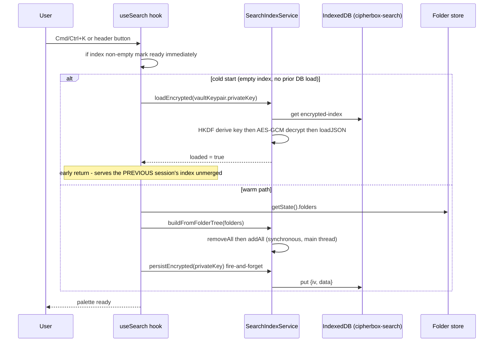

# Client-side search

| | |
| --- | --- |
| **Kind** | flow |
| **Sources** | `apps/web/src/services/search-index.service.ts`, `apps/web/src/hooks/useSearch.ts`, `apps/web/src/components/file-browser/SearchPalette.tsx`, `apps/web/src/components/layout/AppShell.tsx`, `apps/web/src/components/layout/AppHeader.tsx`, `apps/web/src/components/file-browser/useFileBrowserActions.ts`, `apps/web/src/components/file-browser/FileBrowser.tsx`, `apps/web/src/hooks/useSyncPolling.ts`, `apps/web/src/hooks/useFolderNavigation.ts`, `apps/web/src/stores/folder.store.ts`, `apps/web/src/stores/auth.store.ts`, `tests/web-e2e/tests/search-workflow.spec.ts`, `.planning/milestones/m2/phases/15.1-client-side-search/`, `.planning/todos/pending/2026-02-24-async-incremental-search-index.md` |
| **Verified against** | cipher-box `27c4abec5` |
| **Status** | draft |

## Purpose and scope

Search in CipherBox is a **web-only, client-only, name-only fuzzy filter** over the
folder listings the browser has already loaded and decrypted. There is no server-side
search, no content indexing, and no SDK-level search API: the entire feature is three
files in `apps/web` (a MiniSearch wrapper service, a React hook, a command-palette
component) plus its mounting in the app shell. The one non-trivial piece is
persistence — the serialized index is AES-256-GCM-encrypted under a key HKDF-derived
from the user's vault `privateKey` before it touches IndexedDB, keeping the on-disk
story zero-knowledge.

This spec covers: index construction and its actual coverage (loaded folders only —
**not** the whole vault), query semantics, the encrypted-persistence lifecycle, the
privacy properties (no query or index byte ever leaves the browser), and the desktop
story (there is none — the mounted volume delegates search to the OS). Folder loading
itself — what puts listings into the store that search indexes — belongs to
[flows/metadata-sync.md](metadata-sync.md); shared-folder browsing (which search does
**not** cover) to [flows/sharing-grants.md](sharing-grants.md).

There is no design artifact for this feature. It was built as phase 15.1
(`.planning/milestones/m2/phases/15.1-client-side-search/`, v1.0/m2 era); this spec is
written from code, with the phase VERIFICATION doc and the web-e2e suite as the only
prior behavioral records.

## Vocabulary

- **Search index** — an in-memory [MiniSearch](https://www.npmjs.com/package/minisearch)
  `7.2.0` inverted index (`apps/web/package.json:35`) over file/folder **names** only.
- **Search palette** — the Cmd/Ctrl+K command-palette overlay
  (`SearchPalette.tsx`), mounted globally in `AppShell.tsx` so it works on every
  authenticated page.
- **`SearchDocument`** — one indexed entry: a child of a loaded folder, or a loaded
  subfolder itself (see Data structures).
- **folder store** — the web app's Zustand store of decrypted `FolderNode`s
  (`apps/web/src/stores/folder.store.ts`), a display projection of the SDK's
  `folderTree`. The index is built exclusively from this store's current contents.
- **`ResolvedChild`** — the SDK's display listing entry
  (`packages/sdk/src/folder-listing.ts:37-45`: `ipnsName`, `name`, `kind`, `size?`,
  `createdAt`, `modifiedAt`, `sequence`) — the per-child source of `name`, `kind`,
  `modifiedAt` for indexing.
- **Persisted index** — the MiniSearch `toJSON()` serialization, encrypted and stored
  in IndexedDB database `cipherbox-search` (see Data structures).
- **Rebuild** — `buildFromFolderTree`: a full `removeAll()` + re-`addAll()` from the
  folder store. There is no incremental update path.

## Actors and trust boundaries

Search is single-actor: only the **web client** participates. No query, index content,
or derived key ever reaches the API, IPFS, or any other process.

| Actor | Sees | Must never see |
| --- | --- | --- |
| Web client (browser JS) | plaintext names/paths of loaded folders, the user's queries, the vault `privateKey` (memory-only, `auth.store.ts:26-27`) | — |
| IndexedDB (browser disk) | AES-256-GCM ciphertext of the serialized index + random IV | any plaintext name, path, or query |
| CipherBox API / IPFS / TEE | nothing — no search endpoint exists (no match for a search route anywhere in `apps/api/src`) | queries, index contents |

The web logger is console-only (`apps/web/src/lib/logger.ts` — level-filtered
`console.*`, no remote transport), and the search paths log only error objects on
persist/load failure, never the query string (`useSearch.ts:121-125`,
`search-index.service.ts:230,269`).

The desktop client is not an actor: it ships no search surface at all (Desktop column
is `-` for all three search rows in `.planning/milestones/FEATURES.md:68-71`; no
search code exists in `apps/desktop/src` or `crates/` — all greppable "search" hits
there are `binary_search` calls and RESEARCH.md comment references). Searching a
mounted vault is delegated entirely to OS tooling (Finder/Explorer/`grep`) reading
plaintext names through the FUSE layer's normal `lookup`/`readdir` surface. Whether
OS indexers (e.g. Spotlight over the macOS FUSE-T SMB mount) index the volume is
OS-dependent and unverified — no CipherBox code enables, disables, or assists it.

## Data structures

### `SearchDocument` (memory only, one per indexed entry)

`search-index.service.ts:20-33`. Written only by `buildFromFolderTree`; lives inside
the MiniSearch instance.

| Field | Type | Meaning |
| --- | --- | --- |
| `id` | string | `${folderId}:${childIpnsName}` for children, `${parentFolderId}:${folderStoreId}` for folder self-entries — these collide **by design** (see below) |
| `name` | string | file/folder name — the only **indexed** field |
| `type` | `'file' \| 'folder'` | from the child's resolved `kind` (`kind === 'file' ? 'file' : 'folder'`, line 130) |
| `parentPath` | string | breadcrumb `"My Vault / Documents / Reports"`, built by walking `parentId` links (`buildPath`, lines 318-328) — stored for display, **not searchable** |
| `parentFolderId` | string | folder-store id of the containing folder — the navigation target on select |
| `modifiedAt` | number | Unix ms from `ResolvedChild.modifiedAt`; `0` for folder self-entries (line 156) |

Dedup discipline: the build emits every loaded folder's children **plus** a
self-entry for every loaded non-root folder, then keeps the first document per `id`
in a `Map` (lines 163-168). This only deduplicates because the folder store keys
subfolder nodes **by `ipnsName`** (`useFolderNavigation.ts:326-330` — a deliberate,
comment-guarded decision: "do not 'fix' this to `id: node.id`"), so a subfolder's
child entry (`${parent}:${ipnsName}`) and its self-entry (`${parent}:${storeId}`)
produce the same key. The child entry wins, carrying the real `kind`/`modifiedAt`;
the self-entry survives only when the parent's children array does not (yet) contain
the folder. The root folder itself (`id: 'root'`, name `"My Vault"`,
`useFolderNavigation.ts:46-49`) is never indexed (`if (!folder.parentId) continue`,
line 142).

### MiniSearch configuration

`MINISEARCH_OPTIONS`, `search-index.service.ts:53-61` — shared between the
constructor and `loadJSON` so a persisted index round-trips identically:

- `fields: ['name']` — name-only. No content search, no path search, no tags.
- `searchOptions: { fuzzy: 0.2, prefix: true, boost: { name: 1 } }` — edit-distance
  fuzziness at 20% of term length plus prefix matching, applied to every query
  (callers cannot vary the options). Results come back sorted by MiniSearch
  relevance score, unmodified (`search()`, lines 180-195; empty/whitespace query →
  `[]`).

### `SearchResult` (memory only, service → UI)

`search-index.service.ts:36-47` — a `SearchDocument` plus `score: number` and
`match: Record<string, string[]>` (MiniSearch's matched-terms map, used by the
palette's `highlightMatches` to `<mark>` matching substrings,
`SearchPalette.tsx:107-151`).

### Encrypted persisted index (IndexedDB)

Database `cipherbox-search`, version 1, object store `index`, single key
`encrypted-index` (`search-index.service.ts:67-70`). Value shape:
`{ iv: number[], data: number[] }` — a 12-byte random IV and the AES-256-GCM
ciphertext of `JSON.stringify(miniSearch.toJSON())`, both stored as plain number
arrays for cross-browser IndexedDB compatibility (lines 209-223).

**Key derivation** (`deriveSearchKey`, lines 334-355): HKDF-SHA256 over the user's
vault secp256k1 `privateKey` (the Web3Auth-derived keypair, memory-only per
`auth.store.ts:26-27` and zeroed on logout, `auth.store.ts:71-81`), empty salt,
info `'cipherbox-search-index-v1'` (line 76), yielding a **non-extractable**
AES-256-GCM `CryptoKey`. The private key itself is never persisted by this flow —
only imported transiently as HKDF input.

**Write discipline**: single-writer (the one browser tab's singleton
`searchIndexService`, line 362), last-write-wins, best-effort — every persist and
load is wrapped in try/catch and degrades to a logged warning + memory-only
operation (lines 229-231, 268-271). There is no versioning, no CAS, no
cross-tab coordination.

## Flows

### Palette open and index initialization

- **Trigger** — Cmd/Ctrl+K anywhere (global `keydown` listener,
  `useSearch.ts:70-79`), or the header search button (`AppHeader.tsx:23-31` →
  `AppShell.tsx:56` `search.open`).
- **Preconditions** — authenticated with `vaultKeypair` in the auth store
  (`useSearch.ts:87` — the init effect no-ops without it).

- **Steps (normative detail)**
  1. Opening resets nothing; closing clears `query` and `results`
     (`useSearch.ts:54-67`).
  2. On open, if the in-memory index already has documents, `isIndexReady` is set
     immediately so the user can search the existing index while a rebuild runs
     (`useSearch.ts:93-95`).
  3. **Cold start** (first open of the session, empty index): try
     `loadEncrypted`. On success with a non-empty index, the effect **returns
     early** — no rebuild, no merge with current folder state (`useSearch.ts:104-111`).
  4. Otherwise: rebuild synchronously from the folder store's **current** contents
     and fire-and-forget `persistEncrypted` (`useSearch.ts:114-122`). Any error
     still marks the index ready — search works memory-only (`useSearch.ts:124-128`).
- **Postconditions** — index reflects either the previous session's persisted
  snapshot (cold path) or exactly the currently-loaded folder set (warm path).
- **Failure modes** — decryption failure (different user logged in, corrupt blob)
  → `loadEncrypted` returns `false`, falls through to a fresh build; IndexedDB
  unavailable → warnings only, memory-only operation.

### Index coverage — what is actually searchable

The build walks `useFolderStore.getState().folders` and nothing else
(`useSearch.ts:115-116`, `search-index.service.ts:111-172`). It never forces a
folder load, never touches the network, never walks the SDK's `folderTree`.
Coverage is therefore:

- the vault root's children (root is loaded at login), **plus**
- children of every subfolder the user has navigated into this session (folder
  loads are lazy, on navigation — `useFolderNavigation.ts:240-345`), **plus**
- transiently, whatever the previous session's persisted index held (cold path
  above) — until the first rebuild replaces it.

Explicitly **not** covered:

- **Unvisited subfolders' contents** — despite phase 15.1's stated goal ("search
  file and folder names across their entire vault",
  `15.1-VERIFICATION.md`), nothing ever indexes folders that were never loaded.
- **Shared-with-me content** — shared browsing keeps its state in local React
  state inside `useSharedNavigation` (`apps/web/src/hooks/useSharedNavigation.ts:136-138`),
  not in the folder store, so it is invisible to the index.
- **Recycle bin items** (separate `bin.store`), and **historical file versions**
  (only the current listing entry per child is indexed).

### Query

- **Trigger** — every keystroke in the palette input.
- **Steps** — the hook debounces 150 ms, then calls
  `searchIndexService.search(query.trim())` (`useSearch.ts:138-151`) — a pure
  in-memory MiniSearch call with the fixed fuzzy/prefix options. No network, no
  storage, no logging of the query. Results render with substring highlighting,
  breadcrumb path, and date; arrow keys move the selection, Enter opens, Escape or
  backdrop-click closes (`SearchPalette.tsx:247-273`).
- **Postconditions** — `results` holds score-ordered `SearchResult[]`; the footer
  shows the count.

### Result selection and navigation

`AppShell.tsx:36-46` (`handleSelectResult`): close the palette, then
`navigate('/files')` when `parentFolderId === 'root'`, else
`navigate('/files/${parentFolderId}')`.

- Selecting a **file** navigates to the folder **containing** it — it does not
  open, preview, or highlight the file.
- Selecting a **folder** result likewise navigates to its **parent** (the folder
  containing it), not into the folder itself.
- The handler calls React Router's `navigate()` directly, bypassing
  `useFolderNavigation.navigateTo` (which is what performs on-demand folder
  loading). For fresh-index results this is safe by construction — a result's
  `parentFolderId` is a folder that was in the store at build time. For
  **stale persisted-index results** whose parent is not loaded this session, the
  route renders with `currentFolder` undefined and falls through to the
  `EmptyState` (`FileBrowser.tsx:236-238`) — nothing auto-loads the folder, a
  silent dead end.

### Rebuild on sync

`triggerSearchIndexRebuild()` (`useSearch.ts:11-19`, a module-level callback so
non-React code can invoke the hook's `rebuildIndex`) has exactly one caller:
`handleSync` in `useFileBrowserActions.ts:179`, which re-resolves the **root**
listing through the SDK's gated read path and then rebuilds. `handleSync` runs:

- on every 30-second sync-poll tick while the file browser is mounted
  (`useSyncPolling(actions.handleSync)`, `FileBrowser.tsx:100`;
  `SYNC_INTERVAL_MS = 30000`, `useSyncPolling.ts:11`), and
- after an upload completes (`FileBrowser.tsx:182`).

`rebuildIndex` (`useSearch.ts:154-164`) rebuilds from the whole folder store and
re-persists. Note the poll's open-subfolder refresh leg (`invalidateOpenFolder`,
`useSyncPolling.ts:26`) does **not** trigger a rebuild — subfolder changes reach
the index only via the next palette-open rebuild or the next root-sync tick.

Consequence of rebuild-replaces-everything: within one sync tick of landing on
`/files`, the cold-loaded persisted index (potentially covering last session's
deep folders) is **replaced** by a loaded-folders-only index and re-persisted —
persistence never accumulates coverage, it only bridges the gap between login and
the first rebuild.

### Logout clear

`useSearch.ts:193-198` watches the `isAuthenticated` true→false transition and
runs `clearIndex` (`useSearch.ts:177-190`): sets a cancellation flag that aborts
any in-flight init suspended at an `await` (preventing post-logout persistence),
empties the in-memory index, and **deletes** the `encrypted-index` entry from
IndexedDB (`search-index.service.ts:278-294`). If the tab is closed without a
logout, the encrypted blob remains on disk — undecryptable without the vault
`privateKey`. The folder store and auth store independently zero their key
material on logout (`folder.store.ts:198-223`, `auth.store.ts:71-81`).

## Invariants

1. **INV-1** — Query evaluation MUST happen entirely in the client: no search
   term, index content, or derived search key may be sent to any network endpoint
   or logged.
2. **INV-2** — The index MUST only ever be persisted encrypted: AES-256-GCM under
   a non-extractable key derived via HKDF-SHA256 from the vault `privateKey` with
   info `'cipherbox-search-index-v1'`; no plaintext name or path may be written to
   any browser storage.
3. **INV-3** — On logout, the in-memory index MUST be emptied and the IndexedDB
   entry deleted, and any in-flight index initialization MUST be cancelled before
   it can persist.
4. **INV-4** — Index construction MUST read only already-loaded folder-store
   state; it MUST NOT force folder loads or perform network resolves.
5. **INV-5** — Persistence and load failures MUST degrade to memory-only search
   (logged warning), never block or break the palette.
6. **INV-6** — Document ids MUST be `${parentFolderId}:${childIpnsName}` so that a
   subfolder's child entry and self-entry deduplicate — this depends on the folder
   store keying subfolder nodes by `ipnsName`, which MUST be preserved (the
   comment-guarded decision at `useFolderNavigation.ts:326-330`).
7. **INV-7** — Selecting a result MUST navigate to the containing folder
   (`'root'` → `/files`), and MUST NOT mutate any vault state.
8. **INV-8** — The same MiniSearch options MUST be used for building and for
   `loadJSON`, or a persisted index deserializes with different semantics.

## Known gaps and quirks

- **"Entire vault" is aspirational.** The phase goal and verification doc claim
  whole-vault search; the implementation indexes loaded folders only (see Index
  coverage). Nothing in the codebase walks or preloads the full tree for search.
- **Stale-result dead end.** A cold-start persisted-index result whose parent
  folder is not loaded this session navigates (via raw `navigate()`, bypassing the
  loading path) to an `EmptyState` view with no auto-load and no user-facing
  explanation (`AppShell.tsx:36-46`, `FileBrowser.tsx:236-238`).
- **Persistence self-erodes.** Every rebuild is `removeAll` + `addAll` from the
  loaded set and re-persists, so the persisted index's cross-session coverage is
  destroyed within ~30 s of viewing `/files` (first sync tick). The IndexedDB
  layer effectively only serves the first palette open of a session.
- **Cold-start early return skips freshness.** When the persisted index loads,
  the init effect returns before rebuilding (`useSearch.ts:104-111`) — the first
  open shows last session's names, missing anything created since, until the next
  open or sync tick.
- **Mid-rebuild queries are not re-run.** If the user types while a rebuild is in
  flight (palette marks the old index ready immediately, `useSearch.ts:93-95`),
  the results are computed against the pre-rebuild index and are not refreshed
  when the rebuild completes — only the next keystroke re-queries.
- **Synchronous main-thread build.** `buildFromFolderTree` + `addAll` block the
  main thread; fine at current scale (sub-50 ms for hundreds of files per the
  todo), a jank risk for thousands. Recorded as pending todo
  `.planning/todos/pending/2026-02-24-async-incremental-search-index.md`
  ("async/incremental search index"), carried to v1.2/Milestone 4 per
  `.planning/STATE.md:49` — implying today's behavior stays full-rebuild,
  synchronous, palette-open-driven.
- **Shared folders and the bin are silently unsearchable** (separate state
  stores, never indexed) — no UI hint tells the user the palette only covers
  their own vault.
- **Folder self-entries have no date** (`modifiedAt: 0`,
  `search-index.service.ts:156`) — the palette renders them dateless.
- **Duplicate names across folders are legal** and distinguished only by the
  `parentPath` line in results (per-folder duplicate prevention is case-sensitive
  at the web layer — `docs/FILESYSTEM_SPECIFICATION.md:116-129`; the
  case-collision gap noted there for Windows mounts is orthogonal to search).
- **The web-e2e suite is the only behavioral record.**
  `tests/web-e2e/tests/search-workflow.spec.ts` (10 serial tests: shortcut/button
  open, fuzzy results, no-results, click and Enter navigation, Escape and
  backdrop dismissal) with `tests/web-e2e/page-objects/dialogs/search-palette.page.ts`
  (listed in `.planning/codebase/TESTING.md:461` and the FEATURES matrix rows).
  `search-index.service.ts` has **no unit tests**, and `apps/web` unit tests are
  excluded from the CI `Test` job anyway; the e2e suite runs only on pushes to
  `main` or manual dispatch (`.github/workflows/ci-e2e.yml:3-6`), so a search
  regression cannot turn a PR red.

## Rewrite notes

- The honest summary is: search is a well-encrypted cache of the wrong dataset.
  The encryption/persistence machinery (HKDF domain separation, non-extractable
  keys, logout deletion, cancellation-safe init) is the most carefully built part
  of the feature — and it protects an index whose useful life is one palette-open
  per session before a rebuild flattens it to loaded-folders-only. A redesign
  should decide first whether cross-session persistence is worth having: either
  make the index genuinely whole-vault (a background crawl that walks and indexes
  the tree, incrementally updated — at which point persistence pays for itself)
  or drop IndexedDB entirely and keep a pure in-memory filter, which removes the
  stale-result dead end, the self-erosion quirk, and a whole encrypted-storage
  surface for roughly the current user-visible behavior.
- Search living in `apps/web` contradicts the repo's own testing convention
  ("logic in SDK, UI via web-e2e") — which is exactly why it has zero unit
  coverage. Hoisting the index/build/query logic into `packages/sdk` (which
  already owns `folderTree` and `ResolvedChild`) would make it unit-testable and
  shareable with a future desktop UI.
- Navigation-to-parent is a deliberate v1 simplification, but routing through raw
  `navigate()` instead of the loading-aware `navigateTo` is what turns stale
  results into dead ends; any rewrite should make result selection go through the
  folder-loading path so an unloaded target loads instead of rendering empty.
- The name-only, single-field index makes the fuzzy semantics trivially simple —
  worth preserving. Content search over encrypted blobs would require a
  fundamentally different (and much more privacy-sensitive) design; nothing in
  the current code points that way.
