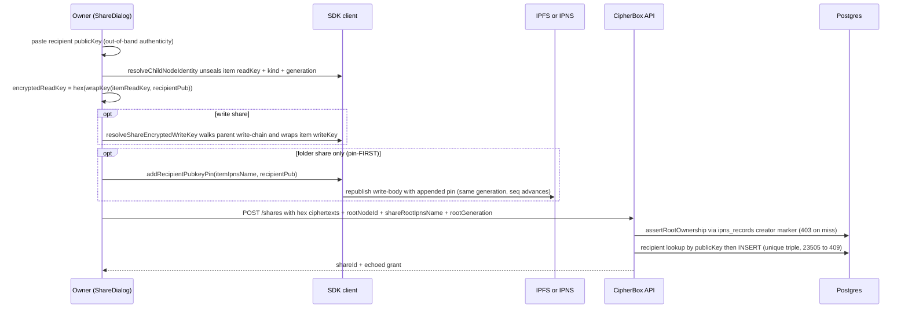
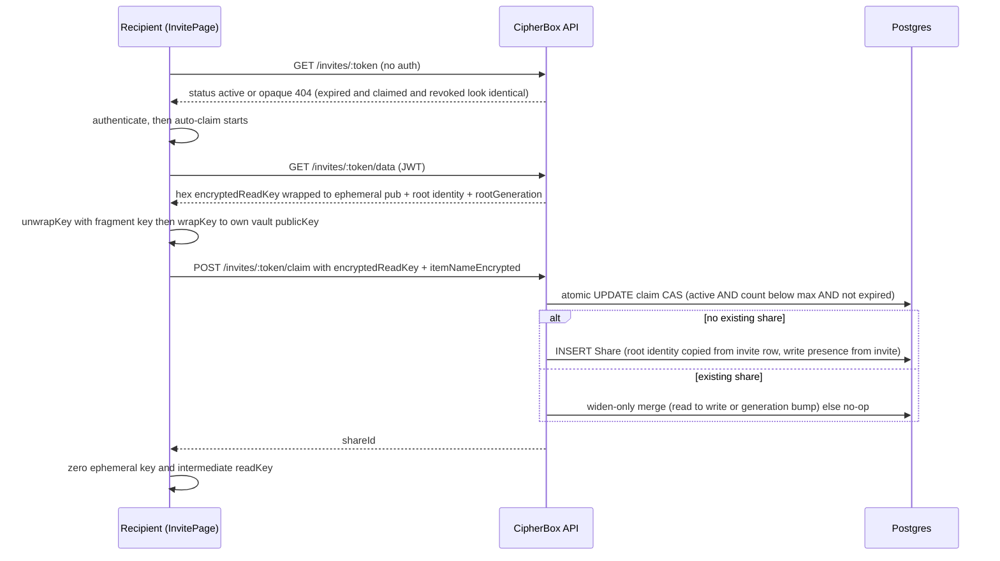
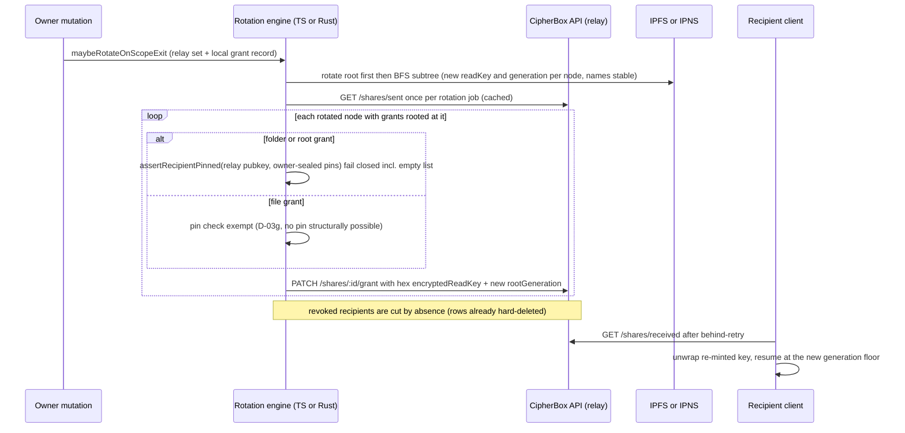

# Sharing and grants

| | |
| --- | --- |
| **Kind** | flow |
| **Sources** | `apps/api/src/shares/` (share.entity, share-invite.entity, shares.service, share-invite.service, shares.controller, share-invites.controller, invites.controller, root-ownership.util, dto/), `packages/sdk-core/src/share/` (grant, navigate, recipient-pins), `packages/sdk-core/src/rotation/` (engine, scope), `packages/sdk/src/share/` (index, shared-write, owner-reconcile, context, key-cache), `packages/sdk/src/client.ts`, `packages/core/src/node/types.ts`, `apps/web/src/services/` (invite.service, share.service, owner-reconcile.service, rotation-driver.service, rotation-state.service), `apps/web/src/components/file-browser/ShareDialog.tsx`, `apps/web/src/routes/InvitePage.tsx`, `apps/web/src/hooks/useAuth.ts`, `crates/sdk/src/rotation/engine.rs`, `crates/fuse/src/write_ops/` (rotation_deps, grant_scope), `docs/adr/0001`, `docs/adr/0002`, `docs/METADATA_SCHEMAS.md`, `docs/SHARING.md` (stale), `.planning/research/grant-delivery-rotation-research-goals.md`, `.planning/todos/pending/2026-07-12-recipient-pin-lifecycle-hardening.md`, `tests/sdk-e2e/src/suites/file-share-rotation-remint.test.ts` |
| **Verified against** | cipher-box `27c4abec5` |
| **Status** | draft |

## Purpose and scope

Sharing gives another user access to a subtree of an owner's vault with **one ECIES
wrap**: because every node's `readKey` is derivable from its parent's `readKey` down the
sealed read chain, wrapping the subtree root's `readKey` to a recipient's public key is a
complete read grant — no per-child key fan-out, no node republishes, and a single-file
grant is structurally identical to a deep-folder grant. Write access adds one more wrap
(the root `writeKey`), which unlocks the write chain and, inside each write-body, the
node's `ipnsPrivateKey`.

This spec covers: the key-chaining grant model, the user-to-user share lifecycle
(mint → consume → revoke), link-based invites (mint → claim, with the phase-71 authz
hardening and widen-only re-claim merge), shared-write operations and the
`WriteChildRef` discipline, revocation semantics as ratified in ADR 0001/0002, grant
re-mint on rotation with recipient-pubkey pinning (phase 80 D-03) and the recipient-pins
lifecycle, trust boundaries per step, and the known gaps (Gap B, Gap C history, the
write-plane encoding sibling, the file-share carve-out). It does **not** cover the
rotation walk's internal mechanics — CAS commit order, crash resume, merge — which
belong to [flows/rotation.md](rotation.md), nor IPNS record liveness
([flows/republish-liveness.md](republish-liveness.md)), nor the owner's normal
metadata read/write plane ([flows/metadata-sync.md](metadata-sync.md)). The API's
generic publish/resolve gates are owned by [parts/api.md](../parts/api.md).

## Vocabulary

- **Grant** — one `shares` row: `{sharer, recipient, encryptedReadKey,
  encryptedWriteKey?, rootNodeId, shareRootIpnsName, rootGeneration}`. The unit of
  sharing; "share" and "grant" are used interchangeably.
- **`encryptedReadKey`** — ECIES ciphertext of the share-root's 32-byte `readKey`,
  wrapped to the recipient's secp256k1 public key. Hex on the wire, `bytea` in the DB.
- **`encryptedWriteKey`** — same for the root `writeKey`; NULL for read-only grants.
  **Presence IS the write-authority bit** (invariant T-66-E1) — there is no separate
  permission column.
- **Read chain / write chain** — `SealedChildRef.readKeySealed` (child `readKey` sealed
  under parent `readKey`, AAD role `0x02`) and `WriteChildRef.writeKeySealed` (child
  `writeKey` under parent `writeKey`, role `0x04`). The chains are what make a root
  grant cover the whole subtree.
- **`shareRootIpnsName` / `rootNodeId`** — the grant root's IPNS name (read-plane key,
  stable across read rotation) and node UUID (write-plane key). The two planes are keyed
  differently and must never be conflated (`crates/fuse/src/write_ops/grant_scope.rs:437`).
- **`rootGeneration`** — the root node's `generation` at grant issuance/re-mint; the
  recipient's staleness witness and durable anti-rollback floor seed.
- **`recipientPins`** — owner-sealed list of recipient public keys inside the shared
  node's `NodeWriteBody`; the anti-relay-substitution authority a re-mint verifies
  against (D-03).
- **Re-mint** — after a read-key rotation, re-wrapping the new root `readKey` for each
  surviving recipient via `PATCH /shares/:id/grant`.
- **Scope-exit rotation** — the read-key rotation fired when a covered mutation
  (delete/rename/move/createSubfolder) removes content from a grantee's reachable scope;
  the mechanism that makes revocation real (ADR 0002).
- **Invite** — a `share_invites` row: a link-based grant wrapped to an **ephemeral**
  secp256k1 public key whose private key lives only in the URL fragment.
- **Widen-only merge** — claiming an invite against an already-existing share applies
  the invite's grant only if it widens authority (read→write or higher
  `rootGeneration`); never downgrades (phase 71 D-07).
- **behind-retry / revoked** — the recipient-side discriminated navigation result:
  grant present but root generation advanced (re-fetch the re-minted grant) vs grant/row
  absent (hard fail).

## Actors and trust boundaries

| Actor | Sees | Must never see |
| --- | --- | --- |
| Owner client (web / desktop FUSE) | all plaintext keys for owned subtrees, recipient public keys as pasted, pin lists (unsealed) | recipient private keys |
| Recipient client | unwrapped share-root `readKey` (+ `writeKey` for write grants) and everything derivable down-chain, incl. per-file `fileKey`s and full version history (ADR 0002 consequence) | keys outside the granted subtree, owner's private key |
| CipherBox API (relay) | the full **sharing graph** (sharer/recipient user ids, `rootNodeId`, `shareRootIpnsName`, `rootGeneration`, timestamps), all grant ciphertexts, invite tokens, users' registered `publicKey`s | any plaintext key, the invite's ephemeral private key (URL fragment never leaves the browser), pin lists (sealed inside write-bodies) |
| Postgres | everything the API sees, at rest | plaintext keys |
| IPFS / IPNS network | published `PublishedNode` envelopes (plaintext `id`, `kind`, `generation` + two sealed bodies) | body plaintext, pins, grants |

Three trust facts shape every flow below:

1. **The relay is zero-knowledge for key material but authoritative for nothing.**
   Every grant blob is ECIES to a recipient (or ephemeral) public key; the server
   persists client ciphertext as-is and never re-encrypts
   (`apps/api/src/shares/shares.service.ts:241`). But the relay *stores and echoes* the
   recipient's public key (`GET /shares/sent` returns `recipient.publicKey`,
   `shares.controller.ts:159`), and a compromised relay that substitutes that key would
   cause the owner to wrap a fresh post-rotation key **to the attacker**. The
   owner-sealed `recipientPins` list exists to close exactly this (phase 80 D-03,
   `.planning/security/REVIEW-80.md`).
2. **Publish authority is key possession, not the share table.** The API's IPNS publish
   path verifies the record signature against the name-derived key and performs no
   share/ownership check (ADR 0001). Consequently the only way to *deny* a writer is to
   rotate the Ed25519 keypair itself — see Revocation below.
3. **Server-side "ownership" is a creator marker, not proof.** `createShare` and
   `createInvite` gate on `ipns_records.user_id` — "the authenticated user who
   registered this node" (`apps/api/src/shares/root-ownership.util.ts:16-27`). This is
   explicit defense-in-depth: the real boundary is that a sharer can only wrap keys they
   hold, so a forged grant for content the caller lacks keys to is cryptographically
   inert. `rootNodeId` remains client-asserted (phase 71 D-02, documented half-gap), and
   a cryptographic key-possession challenge is deferred.

## Data structures

### `shares` (DB table — one row per active grant)

Entity: `apps/api/src/shares/entities/share.entity.ts`. Plain unique constraint on
`(sharerId, recipientId, rootNodeId)` — hard-delete on revoke means no revoked rows ever
coexist (D-11, `share.entity.ts:14-16`). Index on `(sharerId, shareRootIpnsName)` for
the bulk-revoke and re-mint queries.

| Column | Type | Meaning |
| --- | --- | --- |
| `id` | uuid PK | `shareId` |
| `sharer_id` / `recipient_id` | uuid FK→users (CASCADE) | the pair |
| `encrypted_read_key` | bytea | ECIES-wrapped root `readKey` (hex on the wire) |
| `encrypted_write_key` | bytea nullable | ECIES-wrapped root `writeKey`; **NULL = read-only** (T-66-E1) |
| `root_node_id` | uuid | grant root node UUID (write-plane key) |
| `share_root_ipns_name` | varchar(255) | grant root IPNS name (read-plane key) |
| `root_generation` | bigint (string in TypeORM) | generation at issuance/last re-mint; monotone |
| `item_name_encrypted` | bytea nullable | ECIES-wrapped display name for the recipient (server-opaque) |
| `hidden_by_recipient` | boolean | recipient dismissed the share from their view |

**Write discipline:**

- **INSERT** — sharer only, after the `assertRootOwnership` creator-marker gate and a
  recipient lookup by public key (`shares.service.ts:34-94`). Self-share → 409;
  duplicate triple → 409, including the concurrent race via Postgres `23505` → 409
  translation (`:83-93`). Also inserted by the invite-claim transaction (below).
- **UPDATE** — only via `PATCH /shares/:shareId/grant`, sharer-only, inside a
  `pessimistic_write` row-lock transaction with an **anti-rollback gate**: a
  `rootGeneration` lower than the stored value → 409 ("grants only advance the
  generation", `shares.service.ts:266-289`). The same PATCH carries the optional
  read→write upgrade (`encryptedWriteKey`) / write→read downgrade
  (`clearEncryptedWriteKey: true`), which are mutually exclusive (`:260-264`); when
  neither is supplied the write key is left untouched (read-rotation-only shape).
  Recipients may PATCH nothing except `hide` (`:206-219`).
- **DELETE** — hard delete, sharer-only (`revokeShare`, `:141-153`), or bulk by
  `share_root_ipns_name` in one query-builder DELETE inside a transaction
  (`revokeForItems`, `:167-200`). There is **no `revoked_at`** column anywhere —
  revocation is row absence.

### `share_invites` (DB table — link-based grants)

Entity: `apps/api/src/shares/entities/share-invite.entity.ts`. DB `CHECK
(claim_count >= 0 AND claim_count <= max_claims)` (`:14`, phase 71 D-04).

| Column | Type | Meaning |
| --- | --- | --- |
| `token` | varchar(44) unique | `randomBytes(16).toString('base64url')` (`share-invite.service.ts:43`) |
| `sharer_id` | uuid FK→users | inviter |
| `share_root_ipns_name` / `root_node_id` / `root_generation` | as on `shares` | root identity, copied to the minted share at claim (never claimer input) |
| `encrypted_read_key` | bytea | root `readKey` wrapped to the **ephemeral** public key |
| `encrypted_write_key` | bytea nullable | root `writeKey` wrapped to the ephemeral key; NULL = read-only invite |
| `item_name_encrypted` | bytea nullable | display name wrapped to the ephemeral key |
| `status` | `'active' \| 'claimed' \| 'revoked'` | invite lifecycle (soft, unlike shares) |
| `max_claims` / `claim_count` | int | schema supports multi-claim; **as-built `createInvite` hard-codes `maxClaims: 1`** (`share-invite.service.ts:58`) |
| `claimed_by` | uuid nullable | set on claim |
| `expires_at` | timestamp | 7 days (`INVITE_EXPIRY_MS`, `:20`); expired invites are hard-deleted lazily on any access (`:76-79`, `:95-99`, `:278-286`) |

**Write discipline:** created by the sharer (behind `assertRootOwnership`); consumed by
the claimer through **one atomic conditional UPDATE** — `SET status='claimed',
claimed_by, claim_count = claim_count + 1 WHERE token = ? AND status='active' AND
claim_count < max_claims AND expires_at > NOW()` — with `affected = 0` → 409
(`share-invite.service.ts:158-176`). Revocation flips `status = 'revoked'`
(`:294-307`), and `revokeForItems` does the same in bulk; claimed/revoked invite rows
are retained (with their ciphertext) rather than deleted — the shares-side hard-delete
rule does not extend to invites.

### Grant wire shapes (client ↔ API JSON)

All ciphertext fields are validated as **even-length hex**
(`/^(?:[0-9a-fA-F]{2})+$/`) and decoded with `Buffer.from(.., 'hex')` — on
`CreateShareDto`, `CreateInviteDto`, `ClaimInviteDto`, and `UpdateGrantDto` alike
(`apps/api/src/shares/dto/`). This single fact is the root of Gap C (below).
`recipientPublicKey` is `/^(0x)?04[0-9a-fA-F]{128}$/` (65-byte uncompressed secp256k1,
`create-share.dto.ts:41`); `shareRootIpnsName` is regex-gated to k51/bafzaa forms
(`:87`). Responses hex-encode the stored bytes back
(`shares.controller.ts:65-70,124-129,160-165`).

| Endpoint | Auth | Purpose |
| --- | --- | --- |
| `POST /shares` | JWT | mint a user-to-user grant |
| `GET /shares/sent` / `GET /shares/received` | JWT | paginated grant listings (recipient view excludes hidden) |
| `GET /shares/lookup?publicKey=0x04…` | JWT | existence check for a registered user (boolean only) |
| `PATCH /shares/:id/grant` | JWT, sharer | re-mint / upgrade / downgrade (row-locked, generation-monotone) |
| `PATCH /shares/:id/hide` | JWT, recipient | dismiss from recipient view (no unhide endpoint) |
| `DELETE /shares/:id` | JWT, sharer | hard-delete revoke |
| `POST /shares/revoke-for-items` | JWT | bulk revoke by IPNS names (delete-to-bin path) |
| `POST /shares/invites` / `GET ?ipnsName=` / `DELETE /shares/invites/:id` | JWT, sharer | invite management |
| `GET /invites/:token` | none | opaque status — `{status:'active'}` or 404; expired/claimed/revoked are indistinguishable (anti-oracle, `invites.controller.ts:53-61`) |
| `GET /invites/:token/data` | JWT | full invite ciphertext bundle for the claim flow |
| `POST /invites/:token/claim` | JWT | atomic claim (mint or widen-only merge) |

### `NodeWriteBody.recipientPins` (owner-sealed pin list)

The pin field lives inside the shared node's write-body
(`packages/core/src/node/types.ts:135-156`): `recipientPins?: string[]` — base64 of the
raw recipient public-key bytes as issued (currently the 65-byte uncompressed `0x04`
form; compared as raw bytes, so the encoding is not normalized). It is additive-optional
per METADATA_EVOLUTION_PROTOCOL §3.1: omitted from the wire when empty (preserving the
frozen empty-pin KAT `seal_vectors[0]` byte-for-byte; `seal_vectors[1]` locks the
non-empty path across Rust/TS), tolerated as absent on decode, never `deny_unknown_fields`
(`docs/METADATA_SCHEMAS.md:299-331`). Because it is sealed under the owner's `writeKey`
inside an AAD-bound AES-256-GCM body, it is **server-opaque and cross-device by
construction** — a re-mint on a different owner device can still verify it.

This spec *constrains* the structure (the node codec owns it): every write-body reseal
path MUST carry the pins forward — the phase-80 review found and fixed routine-mutation
reseal paths that dropped them (REVIEW-80 HIGH, fixed in `ddb7082e6`) — and pins are
meaningful only on folder/root nodes (file leaves never carry them, D-03g).

Pure helpers (single source of truth for all three enforcement consumers):
`packages/sdk-core/src/share/recipient-pins.ts` — `extractRecipientPins` (`:70`),
`appendRecipientPin` (`:82`, dedup by raw bytes), `assertRecipientPinned` (`:108-125`,
**fail-closed on an empty/absent list** — "D-03e no-legacy hard fail" — and on a
non-member). There is **no removal helper anywhere** — the pin list is append-only
(quirk, below).

### Client-side grant contracts (in-memory seams)

- **`GrantRemintCallbacks`** (`packages/sdk-core/src/rotation/engine.ts:80-93`) — the
  re-mint transport seam: `queryGrantsFn(nodeId) → [{shareId, recipientPublicKey,
  isRevoked}]`, `updateGrantFn(shareId, encryptedReadKey, newGeneration)`,
  `deleteGrantFn(shareId)`, and `getPinsFn?(nodeId)` — the owner-sealed pin source,
  required on the enforced path (missing seam = hard throw, `:615-621`). Because
  revocation is hard-delete, live transports return `isRevoked: false` always — revoked
  recipients are cut **by absence** from `/shares/sent`
  (`crates/fuse/src/write_ops/rotation_deps.rs:315`,
  `apps/web/src/services/owner-reconcile.service.ts:38-42`).
- **`WriteRevocationCallbacks`** (`engine.ts:113-122`) — the write-rotation seam:
  `queryWriteGrantsFn`, `encryptedWriteKeyPersistFn`, `teeUnenrollFn`,
  `deleteWriteGrantFn`. Built and unit-tested; **no production caller** (below).
- **`SharedWriteContext`** (`packages/sdk/src/share/shared-write.ts:70-108`) — a
  write-capable recipient's working set: `readKey`, `writeKey`, the current
  `PublishedNode`, `sequenceNumber`, plus injected `publishNodeFn`/`addToIpfsFn`.
  `publishNodeFn` returns `{tombstoned: true}` when the target name was rotated out,
  which surfaces as `CannotWriteUntilRefetchError` (`:123-130`).
- **`NavigateResult`** (`packages/sdk-core/src/share/navigate.ts:49-52`) — the
  recipient-side discriminated union `'ok' | 'behind-retry' | 'revoked'`.

## Flows

### The key-chaining grant model — issuance is O(1)

- **Read plane.** `issueReadGrant` (`packages/sdk-core/src/share/grant.ts:80-126`) is
  ONE `wrapKey(shareRootReadKey, recipientPublicKey)` — "the only crypto op in grant
  issuance" (`:105-110`) — with zero node resolves, zero seals, zero IPNS publishes.
  Because a file node's content self-seals under the file's own `readKey`, **a share of
  a single file is structurally identical to a share of a subtree**: the grant always
  covers whatever is rooted at `rootNodeId`, whether that root is a deep folder or one
  file (`:58-62`).
- **Add-item stays O(1) per add.** Adding a child inside a shared folder seals the new
  child's `readKey` under the **parent** `readKey` into `SealedChildRef.readKeySealed`
  — recipients derive it down-chain; there is no per-recipient fan-out anywhere in the
  system (the v1 `reWrapForRecipients`/`share_keys` fan-out was deleted in phase 63
  D-03). The v1 remnant `docs/SHARING.md` still describes the fan-out model — see Known
  gaps.
- **Write plane mirrors it.** A write grant is one extra wrap of the root `writeKey`;
  descendants' `writeKey`s chain down `WriteChildRef.writeKeySealed`, and each node's
  `ipnsPrivateKey` sits inside its own write-body — you distribute the shareable
  envelope (`writeKey`), never the signing seed directly.
- **Navigation** (`navigateReadChain`, `navigate.ts:96-179`): one ECIES unwrap of the
  grant, then O(depth) symmetric `unsealChildReadKey` hops. The AAD generation for each
  hop MUST come from the **parent mirror** (`childRef.generation`), never the child's
  own envelope (`:144-153`) — a stale-CID serve fails GCM-closed. Results: root
  generation ahead of the grant's `rootExpectedGeneration` → `behind-retry` (`:122-128`);
  missing IPNS record / missing child ref / non-file leaf → `revoked` (fail-closed).

### Mint a user-to-user share

- **Trigger** — owner opens `ShareDialog` on an item and **pastes the recipient's
  public key out-of-band** (free-text input validated against `/^04[0-9a-fA-F]{128}$/`,
  `apps/web/src/components/file-browser/ShareDialog.tsx:176-179,502-518`). This paste
  is the only moment the recipient's identity is authentic (D-03); the
  `GET /shares/lookup` endpoint exists but the live dialog never calls it.
- **Preconditions** — the item's parent folder is loaded (the dialog unseals the item's
  own `readKey`, kind, and generation via `resolveChildNodeIdentity(item, folderKey)`,
  `:182`; SDK twin `resolveChildIdentity`, `packages/sdk/src/client.ts:914`, which also
  uses the parent-mirror generation, `:930-936`).

- **Steps (normative detail)**
  1. Read wrap: `bytesToHex(await wrapKey(itemReadKey, recipientPublicKey))`
     (`ShareDialog.tsx:185`).
  2. Write grants call `resolveShareEncryptedWriteKey(parentIpnsName, itemIpnsName,
     recipientPub)` (`client.ts:3882`): parent `writeKey` → `walkChildWriteKey` over
     `WriteChildRef` (`:3914-3925`) → wrap the derived item `writeKey` (`:3935-3936`,
     hex) → zero the derived key in `finally` (`:3938`). The raw `writeKey` never
     leaves the SDK.
  3. **Pin-FIRST, folders only** (`:211-241`): `addRecipientPubkeyPin` republishes the
     shared node's write-body with `appendRecipientPin(...)` **before**
     `POST /shares`, so a partial failure can never strand a server grant with no
     owner-sealed pin. The pin publish keeps `generation` unchanged — only the IPNS
     `sequenceNumber` advances (`client.ts:3957,3993-4007`) — and refreshes the
     in-memory pin mirror (`:4018-4019`). The gate is the **unsealed envelope kind**
     (`identity.kind === 'folder'`), not the caller-supplied prop; file shares skip the
     pin entirely (D-03g carve-out, `ShareDialog.tsx:226-241`).
  4. `POST /shares` with `rootGeneration: String(identity.generation)`
     (`ShareDialog.tsx:243-251`); the API runs the creator-marker gate, the recipient
     lookup (0x-prefix normalized), self-share/duplicate 409s, and persists ciphertext
     verbatim (`shares.service.ts:34-94`).
- **Postconditions** — one grant row; for folders, the recipient's pubkey is pinned in
  the node's sealed write-body. The recipient sees the share on their next
  `GET /shares/received` poll. The relay learned: who shared what root (ids/names) with
  whom — never a key.
- **Failure modes** — pin publish fails → dialog errors before any server grant exists
  (the safe order). `POST /shares` fails after the pin → a stray pin with no grant
  (harmless; append-only list). Concurrent duplicate → 409 via `23505`. The dormant SDK
  primitives (`client.shareFolder` → `createShareKey`, `packages/sdk/src/share/index.ts:63-71`,
  and sdk-core `issueReadGrant`, which emits **base64**) are not on this live path.

### Consume a share (recipient read path)

- **Trigger** — recipient's client pages `GET /shares/received` (hex ciphertexts +
  `sharerPublicKey` + `rootGeneration`), parses the generation floor
  (`apps/web/src/services/share.service.ts:80,106,122`) and seeds it into every read as
  `rootExpectedGeneration`.
- **Steps** — `resolveShareRoot` (`client.ts:1205`): `unwrapKey(hexToBytes(
  encryptedReadKey), recipientPrivateKey)` (`:1223-1226`); unresolvable root →
  `{status:'revoked'}` (`:1229-1230`); published generation > expected →
  `{status:'behind-retry'}` (`:1231-1235`). Deep reads go through
  `sdkCore.navigateReadChain` (bridged hex→base64 at `client.ts:1160`). A
  `behind-retry` caller re-fetches `/shares/received` — the re-minted grant carries the
  advanced `rootGeneration` and the new wrapped key.
- **Postconditions** — the recipient holds the subtree's derivable keys, including
  every `VersionEntry.fileKey` (granting read hands over full version history — ADR
  0002 consequence, stated plainly in the ADR).
- **Recipient-side controls** — `PATCH /shares/:id/hide` is the only recipient
  mutation (no unhide endpoint); recipients cannot revoke.

### Create an invite link

- **Trigger** — `InviteLinkTab` → `createInviteLink`
  (`apps/web/src/services/invite.service.ts:137-193`).
- **Steps**
  1. Mint an **ephemeral secp256k1 keypair** (`:87-91`).
  2. Resolve the item's own `readKey` (same `resolveChildNodeIdentity` path) and wrap
     it to the **ephemeral** public key, hex (`:154`).
  3. Write invites would add `resolveShareEncryptedWriteKey(..., ephemeral.publicKey)`
     (`:156-164`) — but **no live caller ever requests `permission:'write'`**; the
     invite UI has no read/write toggle (`:129-130`, `InviteLinkTab.tsx:81-86`).
  4. Wrap the display name to the ephemeral key; zero the plaintext (`:166-176`).
  5. `POST /shares/invites` (behind `assertRootOwnership`) stores the row; the server
     assigns the token and the 7-day expiry.
  6. Build `${origin}${pathname}#/invite/${token}?key=${ephemeralPrivKeyHex}`
     (`:106-109,187`) — the private key rides the **URL fragment**, which browsers
     never send to servers.
  7. `finally`: zero the ephemeral private key and the item `readKey` (`:189-192`).
- **Postconditions** — anyone holding the URL holds the capability; the server holds
  ciphertext it can never open (it never sees the fragment). No pin is written — the
  claimer's identity does not exist yet (see Known gaps).

### Claim an invite

- **Trigger** — recipient opens the URL; `InvitePage` copies the fragment key into a
  ref and immediately strips it from the address bar
  (`apps/web/src/routes/InvitePage.tsx:62,74-78`).

- **Authorization hardening (phase 71, all server-side)**
  - Opaque pre-auth status: `GET /invites/:token` leaks only active-or-404
    (`invites.controller.ts:53-61`); reason discrimination comes only from the claim
    endpoint's 409.
  - Self-claim → 409 (`share-invite.service.ts:141-143`).
  - **Write-claim guard**: a write-capable invite claimed without a re-wrapped
    `encryptedWriteKey` → 400 **before** the transaction, so the invite is not burned
    while silently minting a read-only share (`:151-155`).
  - **Atomic single-claim CAS** (`:158-176`): the conditional UPDATE is the only
    consume point; `affected = 0` → 409.
  - Root identity (`rootNodeId`, `shareRootIpnsName`, `rootGeneration`) is copied from
    the **invite row**, never claimer input (T-66-S1, `:234-253`); write authority is
    presence-derived from the **invite**, so a read-only invite can never yield a write
    grant even if the claimer posts an `encryptedWriteKey` (T-66-E1, `:242-250`).
  - **Widen-only re-claim merge** (D-07, `:180-232`): with an existing
    (sharer, claimer, rootNodeId) share, the claim applies only if it widens —
    read→write upgrade or a strictly higher `rootGeneration`. A generation bump on an
    already-write-capable share also refreshes `encryptedWriteKey` (else the recipient
    would keep a write key wrapped for pre-rotation material, `:206-220`). A
    non-widening re-claim is a true no-op — logged, nothing mutated, but the invite is
    **still consumed** (the CAS committed first, by design).
- **Client-side crypto** — the web claim path unwraps with the fragment key and
  re-wraps to the claimer's own vault `publicKey` inline
  (`invite.service.ts:228-236`, hex), zeroing intermediates in `finally` (`:253-256`).
  The sdk-core primitive `claimInviteReadKey` (`grant.ts:164-204`, `reWrapKey` with
  intermediate zeroed inside) and the `claimInvite` service wrapper (`:244-319`) exist
  as transport-decoupled twins but the web page does not route through them.
- **As-built claim body has no `encryptedWriteKey`** (`invite.service.ts:247-250`) —
  combined with the write-claim guard this means **a write-capable invite is
  unclaimable through the web client** (400). Since the UI also cannot create one,
  write invites are an API-only surface end to end.
- **Postconditions** — one standard grant row, indistinguishable from a direct share —
  except it is **unpinned** (no `recipientPins` entry for the claimer; see Known gaps).
  The ephemeral key is dead (zeroed client-side); the row's ciphertext remains in the
  claimed invite row.

### Shared write (using a write grant)

Write-capable recipients operate through `packages/sdk/src/share/shared-write.ts` with
a `SharedWriteContext` built from the unwrapped root `writeKey`:

- **Key recovery** — the write-body unlocks `ipnsPrivateKey`: parent write-body →
  `writeChildren.find(wc => wc.childId === fileNodeId)` →
  `unsealChildWriteKey(..., parentWriteKey, ...)` → child write-body →
  `ipnsPrivateKey` (`client.ts:5584-5596` for the in-folder file path;
  `updateSharedSingleFile` recovers both keys straight from the grant for a file-rooted
  share, `:5709-5739`). All derived keys zeroed in `finally` (`:5654-5663`).
- **`WriteChildRef` discipline** — the write plane is keyed by the child **UUID**
  (`WriteChildRef.childId`), the read plane by **ipnsName** (`SealedChildRef.ipnsName`).
  Every shared-write mutation must thread both: `deleteFromSharedFolder` takes
  `{itemId (ipnsName), childNodeId (UUID)}` and fails closed on a missing UUID because
  removing the read-body entry while leaving a stale `WriteChildRef` "later breaks
  `rotateWriteFromNode`" (`client.ts:5478-5496`); creation paths
  (`uploadToSharedFolder`, `createSharedSubfolder`) insert **both** refs
  (`shared-write.ts:365-378,517`).
- **Publish gate** — shared-write publishes go through the same CAS/sequence plane as
  owner publishes (possession of `ipnsPrivateKey` IS the authority). A publish against
  a rotated-out (tombstoned) name returns `{tombstoned: true}` →
  `CannotWriteUntilRefetchError` — the co-writer must re-fetch their re-wrapped key
  (`shared-write.ts:54-60,114-130`).
- **Content edits do not touch the parent** — a file-content publish under the file's
  own name never rewrites the folder, and never triggers rotation.

### Revocation — as ratified vs as wired

- **Read revocation (ADR 0002)** — *protects future content only.* A pure revoke is
  `DELETE /shares/:shareId` — a hard row delete with **no rotation and no key change**
  (`performScopeExitRotation`'s doc is explicit: "revokeShare … does NOT call this
  method at all … there is no eager rotation on revoke", `client.ts:2033-2038`). The
  actual key cut is **deferred** to the next covered mutation's scope-exit rotation,
  which re-mints only survivors — the revoked party drops out by absence. Already-held
  ciphertext/plaintext is presumed leaked; rotation cuts navigation, filenames, and
  future versions, never the past. On file-node rotation the engine also mints a fresh
  `fileKey` (`mintFileKeyOnRotate`, `engine.ts:547-558`); the `contentRekeyPending`
  re-encrypt-on-next-write wiring is deferred (TS comment `engine.ts:526-531`; Rust
  carries an in-memory `content_rekey_pending` flag, `crates/sdk/src/rotation/engine.rs:361,508`)
  — details in [flows/rotation.md](rotation.md).
- **Bulk revoke on delete** — `addToBin` awaits `POST /shares/revoke-for-items`
  fail-closed *before* unpinning content (`client.ts:420-431`; batch cap 5000,
  `share/index.ts:24`), hard-deleting grants and flipping invites to `revoked` in one
  transaction.
- **Write revocation (ADR 0001)** — *ratified*: denying a writer requires rotating the
  affected subtree's Ed25519 keypairs (new k51 names, tombstoned old names, TEE
  re-enroll, co-grant re-mints), because publish authority is key possession and a
  revoked writer may have extracted the stable `ipnsPrivateKey`. *As wired*: the engine
  exists — `rotateWriteFromNode` (`engine.ts:2779-2855`) does the child-first subtree
  rotation, defers `teeUnenrollFn` tombstone-intent until the whole subtree is
  published (`:2820-2824`), then re-wraps the new root `writeKey` for surviving
  co-writers (`:2829-2845`) — **but it has zero production callers** in TS, web, or
  Rust (repo-wide, only comments reference it). The live "write revocation" today is
  the grant downgrade (`clearEncryptedWriteKey`) or row delete, neither of which
  rotates names — a key-extracting writer is not actually denied. See Known gaps.
- **Invite revocation** — `DELETE /shares/invites/:id` flips `status='revoked'`;
  already-claimed shares are unaffected. ADR 0002 is explicit that a multi-claim link
  is "revoked" by rotation, not link invalidation (`grant.ts:144-147`).

### Grant re-mint on rotation + recipient-pubkey pinning

- **Trigger** — every covered scope-exit mutation: `createSubfolder`, `renameItem`,
  `moveItem` (source side), `deleteItem`, `deleteToBin` call
  `performScopeExitRotation` (`client.ts:2065`, call sites `:2612,2716,3008,3129,4884`),
  gated by `maybeRotateOnScopeExit` (`sdk-core/rotation/scope.ts:145-159`) over
  `hasCoveringGrant` (`:98-113`) — which consults **both** the relay-supplied grant-root
  set *and* the client's own local grant record (the relay set is "a COMPLETENESS AID,
  never the sole authority" — anti-malicious-relay, T-63-17).
- **The threat re-mint must survive** (D-03): the recipient pubkey is authentic only at
  issuance (pasted). Everywhere it round-trips back through `GET /shares/sent` it is
  server-trusted, and three consumers re-wrap fresh keys to it: the Rust re-mint, the TS
  re-mint, and the web upgrade/reconcile path. A substituted key in any of those
  responses would wrap the post-rotation `readKey` to the attacker — so all three
  verify the relay-fed key against the owner-sealed pins, fail-closed, before wrapping
  (phase 80 D-03d; REVIEW-80 verdict: sound, conditional on pins being present).

- **Engine mechanics (both languages)**
  - `reMintGrantsRootedAt` (`engine.ts:587-661`) / `re_mint_grants_rooted_at`
    (`crates/sdk/src/rotation/engine.rs:631-710`): fetch grants for the node, fetch the
    owner-sealed pins **once per node** (TS `:601-625`, Rust `:662-666`), then per
    surviving grant assert the pin (TS `:642`, Rust `:682-693` — raw-byte equality,
    `:627-629`) and `wrapKey(newReadKey, recipientPublicKey)` → **hex** →
    `updateGrantFn` (TS `:648-658`, Rust `:694-706` — "must be hex, NOT base64",
    `:701-703`). A pin mismatch or an empty list on a folder/root grant aborts the
    node's re-mint hard (deliberately not a per-grant skip).
  - **File-share carve-out (D-03g)**: `nodeKind === 'file'` skips the pin fetch and the
    check entirely and re-mints directly — a file leaf structurally cannot carry a pin
    (no pinnable write-body path; issuance never pins files), and enforcing D-03e on it
    would fail-close every rotation of a folder that merely *contains* a
    separately-shared file. Folder/root grants stay fully fail-closed; file-share
    recipient-substitution is the accepted, tracked limitation.
  - **In-walk placement**: the inline re-mint runs inside `rotateOne` after the node's
    publish and **before** `completedNodeIds.add(nodeId)` (`engine.ts:1250-1263`), so a
    re-mint failure is retried on resume rather than skipped.
  - **O(1) share fetch per job (D-02)**: the Rust deps cache `collect_sent_shares()` in
    a per-job `OnceCell` and filter by `root_node_id` per node
    (`rotation_deps.rs:190-199,290-319`); the TS sweep memoizes `listSentGrants()` per
    pass (`packages/sdk/src/share/owner-reconcile.ts:85-97`).
  - **Grant PATCH durability**: the server-side row lock + generation-monotone gate
    (Data structures) makes a replayed or duplicate re-mint PATCH harmless — the grant's
    `rootGeneration` seeds the recipient's durable floor and must never regress.
- **Who actually runs re-mint today (host wiring)**
  - **Desktop/FUSE (live, in-walk)**: `rotate_read_on_scope_exit`
    (`grant_scope.rs:468`) first refreshes the grant root's cached pins from the
    **currently published** write-body (`refresh_grant_root_recipient_pins`,
    `rotation_deps.rs:670-784`; invoked at `grant_scope.rs:474-483`) — closing the
    share→rotate race where a web-issued pin hasn't reached the mount's `InodeTable`
    yet (skipping this refresh both fail-closes the retained recipient's re-mint *and*
    republishes the node pin-less, then cascades into AES-GCM refresh failures against
    the new generation — the documented desktop-e2e cascade, `rotation_deps.rs:641-668`).
    Pins are then read offline from the inode cache (`:608-639`); after rotation every
    rotated inode's in-memory `readKey` is refreshed in place
    (`refresh_rotated_inode_read_keys`, `grant_scope.rs:624-649`) and rotated folders
    are marked locally-mutated so a stale refresh cannot clobber the new keys
    (`:558-579`).
  - **Web (live, sweep-only)**: the owner-reconcile sweep — eager on login and
    opportunistic after mutations (`useAuth.ts:363-369,433-435`) — drives
    `runOwnerReconcile` → `reMintGrantsRootedAt` per known grant root
    (`owner-reconcile.service.ts:170-274`, `sdk/share/owner-reconcile.ts:126-136`),
    with `getPinsFn` unsealing the live write-body. It only reaches roots present in
    the in-memory `folderTree` (`:198-201,256-257`) — file-rooted grants are never
    swept.
  - **Web (dormant, in-walk)**: `performScopeExitRotation` consumes an optional
    `resolveInlineGrantRemint` host seam (`client.ts:2106-2109,2143-2144`), but the web
    host supplies neither it nor `keyCheckpoint`
    (`rotation-driver.service.ts:284-291`), so the inline per-node re-mint no-ops on
    web. PR `#615` explicitly reverted the live wiring "pending architecture research"
    — the seam remains a dormant opt-in hook. Web rotation durability is IndexedDB job
    checkpoints + generation high-water only (`rotation-driver.service.ts:46-57,179-227`,
    `rotation-state.service.ts:21-62`).
- **Web upgrade/downgrade (the third pin consumer)** — `handleUpgrade` verifies the
  server-fed `share.recipientPublicKey` against `getRecipientPubkeyPins(item.ipnsName)`
  via `assertRecipientPinned` for folders (files skipped, same carve-out) **before**
  wrapping the write key and PATCHing (`ShareDialog.tsx:344-378`). Downgrade sends
  `clearEncryptedWriteKey: true` with no re-wrap and no pin check (`:398-431`).
- **Postconditions** — surviving recipients' rows carry the new hex-wrapped key and the
  advanced generation; revoked recipients hold grants to a key that no longer decrypts
  anything new; names are unchanged (read rotation never changes `ipnsName` — only
  write rotation would, and it is unwired).
- **Failure modes** — pin-verification failure aborts the node's re-mint (and on
  desktop the surrounding rotation errors); grant PATCH 4xx surfaces per share; a
  crashed walk resumes and re-runs re-mint for uncommitted nodes (in-walk path). A
  recipient navigating mid-rotation sees `behind-retry` until the re-mint lands.

## Runtime variants

- **Host key sourcing differs per platform and is the root of Gap B.** The TS engine
  asks the host for per-node keys via `nodeKeySource(ipnsName)`; web implements it over
  the folders-only in-memory `folderTree`, returning `undefined` for any file leaf
  (`client.ts:2123-2135`). Desktop implements `RotationDeps` over the mounted
  `InodeTable`, which materializes files too, and the Rust engine additionally derives
  child read keys by unsealing the chain itself (`engine.rs:1068-1097`). Same protocol,
  divergent data models — desktop rotates file leaves, web cannot.
- **Rust has no write-plane rotation at all** — write keys are treated as stable
  ("write keys never rotate, only the read plane does", `rotation_deps.rs:662,843-844`);
  `rotateWriteFromNode` exists only in TS sdk-core.
- **Pin reads**: web unseals the live published write-body per check; desktop reads an
  offline inode cache refreshed from the network only at rotation entry (the §6
  stale-cache window below).

## Invariants

1. **INV-1** — Grant key material MUST reach the relay only as ECIES ciphertext wrapped
   to the recipient's (or the invite's ephemeral) public key; the server persists and
   echoes it verbatim and MUST never re-encrypt or derive keys.
2. **INV-2** — A grant is ONE wrap of the share-root key per plane. No flow may
   introduce per-child or per-recipient key fan-out (v1 `share_keys` is dead).
3. **INV-3** — A read grant MUST never convey `writeKey` or `ipnsPrivateKey`; write
   authority is solely the presence of a non-null `encryptedWriteKey` (T-66-E1), and a
   claim can never widen authority beyond what the invite row carries.
4. **INV-4** — The minted share's root identity (`rootNodeId`, `shareRootIpnsName`,
   `rootGeneration`) MUST come from the invite row, never from claimer input (T-66-S1).
5. **INV-5** — Invite consumption MUST be a single atomic conditional UPDATE gated on
   `status='active' AND claim_count < max_claims AND expires_at > NOW()`.
6. **INV-6** — A re-claim over an existing share MUST be widen-only: read→write or a
   strictly higher `rootGeneration`; it MUST never null an existing write key or apply
   a same/lower-generation grant.
7. **INV-7** — `PATCH /shares/:id/grant` MUST be sharer-only, row-locked, and reject
   any `rootGeneration` below the stored value (the recipient's durable floor seed).
8. **INV-8** — Revoking a share MUST hard-delete the row. No soft `revoked_at` state
   may exist; revoked recipients are cut from re-mint by row absence.
9. **INV-9** — Before wrapping a rotated key for a folder/root grant, every consumer of
   a relay-fed recipient key (Rust re-mint, TS re-mint, web upgrade/reconcile) MUST
   assert raw-byte membership in the owner-sealed `recipientPins`, failing closed on
   mismatch AND on an empty/absent pin list (D-03d/D-03e). File-rooted grants are the
   sole, explicit exemption (D-03g).
10. **INV-10** — `recipientPins` lives only inside the AES-GCM-sealed, AAD-bound
    write-body; the relay never sees or influences it, and every write-body reseal path
    (rotation republish, journal replay, routine mutation) MUST carry existing pins
    forward.
11. **INV-11** — Grant ciphertext on the client↔API wire is even-length **hex** in both
    directions and in both languages (`Buffer.from(.., 'hex')` end to end).
12. **INV-12** — Read rotation MUST keep every `ipnsName` stable; only write rotation
    may mint new names, and then MUST tombstone the old ones only after the full
    subtree is published.
13. **INV-13** — Scope-exit gating MUST consult both the relay-supplied grant-root set
    and the client's local grant record; the relay set alone is never authority.
14. **INV-14** — The invite's ephemeral private key exists only in the URL fragment and
    client memory, is stripped from the address bar on load, and is zeroed after
    claim/creation; it MUST never be sent to the server.
15. **INV-15** — Share/invite creation MUST pass the `ipns_records` creator-marker
    ownership gate (403 otherwise) — acknowledged as defense-in-depth, not proof.
16. **INV-16** — Recipient navigation MUST take each hop's AAD generation from the
    parent mirror (`SealedChildRef.generation`), never the child envelope, and MUST
    surface rotation-vs-revocation as the typed `behind-retry` / `revoked` split.

## Known gaps and quirks

- **Gap B — web cannot rotate (or re-mint) file leaves.** The rotation BFS enqueues
  file children, but web's `nodeKeySource` reads only the folders-only `folderTree`, so
  a file leaf resolves no `ipnsPrivateKey`/`writeKey` and `rotateOne` fail-closes at
  the D-01 guard (`engine.ts:1094-1108`). Scope-exit rotation of any shared folder
  containing files throws on web; latent only because web's in-walk path is dormant.
  Deferred to the research sprint (`grant-delivery-rotation-research-goals.md` RQ4/P3);
  reproduced by the **kept, skipped** live suite
  `tests/sdk-e2e/src/suites/file-share-rotation-remint.test.ts:92` ("Gap A
  worked-around, Gap C fixed, Gap B still blocks the file re-mint").
- **Gap C — re-mint encoding mismatch (fixed, instructive).** `reMintGrantsRootedAt`
  emitted base64 while `PATCH /shares/:id/grant` validates hex, so **every** re-mint
  PATCH 400'd — including the folder sweep, which had silently never worked. Fixed on
  the phase-80 branch (commit `4b1b00d4f`; now hex with a load-bearing comment,
  `engine.ts:649-657`; Rust always emitted hex, `engine.rs:701-704`). It existed
  because re-mint is an out-of-band relay write with its own wire format and unit tests
  mocked the transport.
- **Write-plane Gap-C sibling — live in the code, latent in production.**
  `rotateWriteFromNode`'s co-writer re-wrap emits **base64**
  (`engine.ts:2842 bytesToBase64`) while every API write-key field validates hex. Latent
  only because…
- **…ADR 0001 write-revocation is built but unwired.** `rotateWriteFromNode` has zero
  production callers (TS/web/Rust; comments only), and Rust has no write-plane rotation
  at all. As-built, "revoking write" = grant downgrade or row delete — neither rotates
  names, so a co-writer who extracted `ipnsPrivateKey` retains publish capability,
  bounded only by the tombstone/publish plane if a rotation ever runs.
- **Web never re-mints file-rooted grants (recipients silently lose access).** The
  sweep only visits `folderTree` roots and the in-walk seam is dormant, so after any
  rotation that rekeys a separately-shared file (whole-subtree blast radius), the file
  recipient's grant still wraps the dead key — pre-existing, tracked
  (pin-lifecycle todo §5; research charter Gap-B/§4 evidence). Desktop's in-walk path
  does re-mint file grants (with the D-03g exemption).
- **Inline re-mint seam deliberately dormant on web.** PR `#615` reverted the live
  wiring ("pull back web inline grant-remint wiring pending architecture research");
  `resolveInlineGrantRemint`/`keyCheckpoint` are optional hooks no web code supplies
  (`rotation-driver.service.ts:284-291`), and `client.ts:2136`'s "now LIVE-WIRED for
  web" comment is stale.
- **Pin lifecycle is append-only and half-hardened** (deferred items,
  `2026-07-12-recipient-pin-lifecycle-hardening.md`):
  - §1 pins are never pruned on revoke — a malicious relay can re-inject a
    revoked-but-still-pinned recipient into `/shares/sent` and the pin check passes
    (defense-in-depth gap; revocation already trusts relay grant-row honesty).
  - §2 unbounded growth, O(n²) union on CAS-409 merges.
  - §3 residual cross-client window (web-added pin absent from an offline FUSE
    `InodeTable` until re-resolve) — the issuance itself is now pin-first.
  - §4 two FUSE crash-replay sites can republish a shared node pin-less.
  - §6 a routine desktop reseal inside the ~30s pin-cache staleness window republishes
    the folder pin-less until the next refresh.
- **Invite-claimed folder grants are unpinned** (code-derived observation, not in the
  tracked todo): `addRecipientPubkeyPin` is called only from the direct-share dialog;
  no claim path pins the claimer (the owner isn't present, and the invite predates the
  claimer's identity). Under D-03e, a later folder re-mint or read→write upgrade of a
  claimed share hits the empty-pin hard-fail — aborting the rotation's re-mint for that
  node exactly like the pre-carve-out file case. Untracked as of this commit.
- **Write invites are dead surface on web.** The API fully supports them (storage,
  claim guard, widen-merge), but the UI can neither create (`invite.service.ts:129-130`)
  nor claim (`:247-250` sends no `encryptedWriteKey` → 400) one.
- **`GET /shares/lookup` is live but unused by the live dialog** — the pasted key is
  used directly (`ShareDialog.tsx` never calls it); only `share.service.ts:160-163`
  wraps it.
- **`docs/SHARING.md` describes the dead v1.0 model** — `share_keys` per-child fan-out,
  plaintext `item_name`, soft `revoked_at` + `executeLazyRotation`,
  `encrypted_ipns_key` columns, `/shares/:id/keys` endpoints. All of it is gone
  post-cutover (the entities/controllers above are the truth). Read it only for UI
  archaeology.
- **Doc drift on pin encoding** — `METADATA_SCHEMAS.md:311` says pins are "compressed
  secp256k1" keys; issuance actually pins the 65-byte uncompressed form
  (`types.ts:141-144`). Harmless today (raw-byte compare, single producer) but the
  encoding is unnormalized by design.
- **Invites keep crypto-bearing rows after claim/revoke** — `status` flags rather than
  the hard-delete rule shares follow; the retained ciphertext is openable only with the
  URL-fragment key, but the row (and `claimed_by`) persists indefinitely; expired rows
  are deleted only lazily on access.
- **`maxClaims` is schema-ready, single-claim as-built** — `createInvite` hard-codes 1;
  the multi-claim semantics ADR 0002 anticipates (same readKey re-wrapped per claimer)
  are unreachable without an API change.
- **Ownership ceiling** — `assertRootOwnership` bottoms out at "first authenticated
  user to register the name"; `rootNodeId` is client-asserted (phase 71 D-01/D-02
  documented ceiling; key-possession challenge deferred).
- **Resolve-plane leftover** — the API keeps a `seqFloor` resolve path for
  "sharing-protocol rows" with `latestCid` but no `signedRecord`
  (`ipns-record.codec.ts:85-91`), but nothing inserts such rows today; recipients
  resolve shared names through the owner's normal row. The defensive path and its
  comment are drift from an earlier design
  (cross-reference: [flows/republish-liveness.md](republish-liveness.md) notes these
  rows are structurally un-renewable).

## Rewrite notes

- **The relay drifted from key transport into a load-bearing grant store, and every
  recent bug is a symptom.** Re-mint is an out-of-band relay write with its own wire
  format (Gap C), its own recipient-identity trust hole (D-03 pins, retrofitted), its
  own atomicity problem (pin-first ordering, §3), and its own reachability problem
  (Gap B, dormant web seam). The open research charter
  (`.planning/research/grant-delivery-rotation-research-goals.md`) frames the real
  decision — grants-in-relay vs owner-sealed grants-in-metadata vs inbox, delivery vs
  discovery, hygiene vs revoking rekeys (RQ1–RQ9, H1–H5) — and a rewrite should settle
  that **before** re-hardening any of the above; this spec deliberately records the
  questions, not answers.
- **Key sourcing must be engine-side.** Web/`folderTree` vs desktop/`InodeTable` vs
  Rust's chain-unsealing produced a protocol-identical system with host-divergent
  correctness (files rotate on desktop, throw on web). The write-chain contains
  everything needed to key any node; a redesign should derive in the engine (research
  P3/H3) and delete `nodeKeySource`.
- **One wire encoding.** Hex on the read plane, base64 in the dormant write plane, and
  base64 in the dormant sdk-core issuance primitive is three chances at Gap C. Specify
  the grant-ciphertext encoding once, enforce it at the seam with a shared codec, and
  contract-test transports un-mocked.
- **The pin defense is sound but its lifecycle was an afterthought.** Append-only pins
  with folder-only issuance immediately spawned the file carve-out, the unpinned
  claimed-invite landmine, prune/growth debt, and two cache-staleness republish
  windows. If grants move into owner-sealed metadata, pins collapse into the grant
  itself (H1) — otherwise pin add/remove must be a first-class, atomic part of every
  grant mutation.
- **Ship or delete the write-revocation engine.** ADR 0001 chose the most expensive
  option, and the implementation sits unwired with a latent encoding bug and no Rust
  twin, while the UI presents "downgrade" as if it revoked. Either wire
  `rotateWriteFromNode` end to end (with hex, pins, and a caller) or revisit ADR
  0001's flip conditions honestly.
- **Revocation UX must say what ADR 0002 says.** A hard-deleted row with a deferred key
  cut is invisible to the owner; nothing in the current surface communicates "revoked
  readers keep everything they saw and keep reading until your next mutation of that
  subtree." The lazy stance is right for content-addressed storage; hiding it is not.
