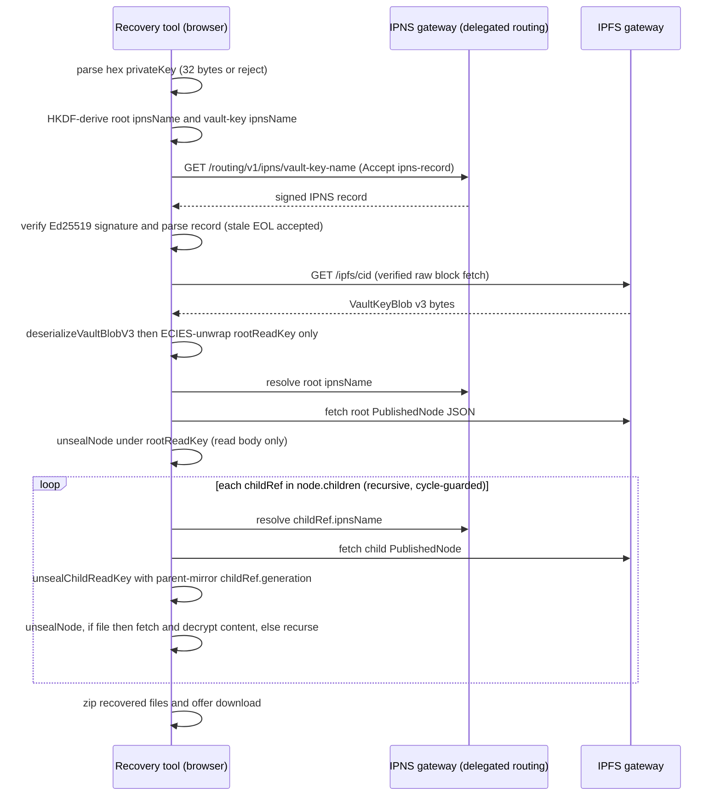

# Vault export, import, and offline recovery

| | |
| --- | --- |
| **Kind** | flow |
| **Sources** | `apps/api/src/vault/` (vault.controller, vault.service, dto/vault-export.dto, dto/init-vault.dto, entities/vault.entity), `apps/web/src/components/vault/VaultExport.tsx`, `apps/web/src/routes/SettingsPage.tsx`, `apps/web/src/hooks/useAuth.ts`, `apps/web/public/recovery.html`, `apps/web/recovery-src/` (main, walk, gateway, build, buffer-shim), `apps/desktop/src-tauri/src/commands/vault.rs`, `packages/sdk/src/client.ts`, `packages/sdk-core/src/vault/index.ts`, `packages/sdk-core/src/ipns/index.ts`, `packages/core/src/vault/blob.ts`, `packages/core/src/node/seal.ts`, `packages/crypto/src/vault/derive-ipns.ts`, `crates/api-client/src/ipns.rs`, `apps/api/src/shares/entities/share.entity.ts`, `tests/web-e2e/tests/recovery.spec.ts`, `docs/VAULT_EXPORT_FORMAT.md`, `docs/METADATA_SCHEMAS.md`, `docs/METADATA_EVOLUTION_PROTOCOL.md` |
| **Verified against** | cipher-box `27c4abec5` |
| **Status** | draft |

## Purpose and scope

CipherBox is zero-knowledge: the server never holds root keys, so "recovery" cannot mean
"ask the server for your keys". This spec documents the three mechanisms that exist
instead, and — the question a reader must be able to answer — exactly what is recoverable
**without** the CipherBox server:

1. **The vault export artifact** — `GET /vault/export`, downloadable from web Settings.
   As-built it contains **no key material at all** (metadata only), despite documentation
   and UI copy claiming otherwise. There is **no import path** that consumes it, anywhere.
2. **Self-sovereign vault load** — the real "import": every client re-derives the vault's
   two IPNS names from the user's `privateKey` via HKDF, fetches the VaultKeyBlob v3 from
   IPFS, and ECIES-unwraps `rootReadKey`/`rootWriteKey`. Includes the login guards that
   decide fresh-init vs refuse, and the desktop's fail-closed decrypt-and-resume.
3. **The offline recovery tool** — `apps/web/public/recovery.html`, a standalone
   single-file page (node/v3 support shipped Phase 78) that recovers the whole tree from
   the pasted `privateKey` plus public gateways, with zero CipherBox-API dependency.

Adjacent ground: the VaultKeyBlob v3 and node/v3 codec field tables belong to
[parts/core-codecs.md](../parts/core-codecs.md); IPNS record liveness, TEE republish, and
lapse mechanics to [flows/republish-liveness.md](republish-liveness.md); grant storage and
what recipients lose to [flows/sharing-grants.md](sharing-grants.md); how the user's
secp256k1 `privateKey` is obtained (Web3Auth Core Kit TSS export) to
[flows/auth.md](auth.md); the sealed-node read chain the recovery walk traverses to
[flows/metadata-sync.md](metadata-sync.md).

## Vocabulary

- **Vault export** — the JSON file `cipherbox-vault-export.json` produced by
  `GET /vault/export`. Metadata-only (see Data structures).
- **`VaultKeyBlob` v3** — binary envelope `0x03 | u16_BE(readLen) | ECIES(rootReadKey) |
  u16_BE(writeLen) | ECIES(rootWriteKey)` stored as an IPFS blob; the only durable home of
  the root keys. Owned by [parts/core-codecs.md](../parts/core-codecs.md).
- **`rootReadKey` / `rootWriteKey`** — two independently generated 32-byte AES-256 keys
  sealing the root node's read body and write body. Never derived from each other or from
  any IPNS keypair (`docs/METADATA_SCHEMAS.md` §9).
- **Vault-key `ipnsName`** — HKDF-derived IPNS name addressing the VaultKeyBlob (info
  `cipherbox-vault-key-ipns-v1`). Distinct from the **root `ipnsName`** (info
  `cipherbox-vault-ipns-v1`) addressing the root `PublishedNode`.
- **Derive-from-key model** — everything needed to find and unlock the vault (both
  `ipnsName`s, the root IPNS signing key, the ECIES unwrap key) is reconstructible from
  the 32-byte secp256k1 `privateKey` alone. No stored state is required.
- **Decrypt-and-resume** — the desktop init path (`RecoverResume`) that finds an existing
  VaultKeyBlob, unwraps the original keys, and resumes a crashed init instead of minting
  fresh keys (Phase 76 hardening, `.planning/security/REVIEW-2026-07-12-phase76.md`).
- **Recovery tool** — `recovery.html`: hand-written HTML shell + one esbuild bundle of
  `apps/web/recovery-src/` and the workspace crypto/codec libraries, inlined at
  `recovery.html:314`.

## Actors and trust boundaries

| Actor | Sees | Must never see |
| --- | --- | --- |
| User | the 32-byte secp256k1 `privateKey` (from Web3Auth TSS export) — the sole recovery secret | — |
| Web client | `privateKey`, both root keys, all folder/file plaintext | — |
| Desktop (Tauri native) | same as web, in `Zeroizing` buffers | — |
| CipherBox API + Postgres | `ownerPublicKey`, `rootIpnsName`, share-grant ciphertexts, IPNS records/enrollment | `privateKey`, `rootReadKey`, `rootWriteKey`, the vault-key `ipnsName` (never registered — server cannot even name the blob) |
| IPFS gateways / delegated routing | ciphertext blobs, signed public IPNS records | any plaintext or key |
| Recovery tool (browser page) | `privateKey` in memory, all recovered plaintext | it must never *contact* the CipherBox API or any CDN — build-enforced |

The defining boundary of this flow: the server is not merely unable to decrypt the vault —
it does not even store enough to *locate* the VaultKeyBlob. The vault-key `ipnsName` is
re-derived client-side on every login and appears in no DB column
(`InitVaultDto` carries only `ownerPublicKey` + `rootIpnsName`,
`apps/api/src/vault/dto/init-vault.dto.ts:9-27`; `vaults` columns:
`apps/api/src/vault/entities/vault.entity.ts:13-59`).

## Data structures

### `VaultExportDto` (API→client JSON, the export artifact)

`apps/api/src/vault/dto/vault-export.dto.ts:8-41`, produced by
`vault.service.ts getExportData` (`apps/api/src/vault/vault.service.ts:365-385`):

| Field | Type | Actual value | Notes |
| --- | --- | --- | --- |
| `format` | string | `'cipherbox-vault-export'` | constant |
| `version` | string | `'1.0'` | constant — never bumped through the v2/v3 format changes |
| `exportedAt` | string | `new Date().toISOString()` | request time |
| `rootIpnsName` | string | `vault.rootIpnsName` | public, and independently re-derivable from `privateKey` |
| `derivationMethod` | string \| null | `user ? 'web3auth' : null` | a ternary on user-row existence, not a stored derivation record |

That is the **entire** export. There are no `encryptedRootFolderKey` /
`encryptedRootReadKey` / `encryptedRootWriteKey` fields in the DTO, no encrypted-key
columns in the `vaults` table, and none in any historical migration — the original schema
(`apps/api/src/migrations/1700000000000-FullSchema.ts:96-105`) never had them. The
two-key export described in `docs/VAULT_EXPORT_FORMAT.md` §2 was never implemented
server-side (see Known gaps). Nothing in the codebase reads this file back.

### `VaultKeyBlob` v3 (IPFS blob)

Field table and codec owned by [parts/core-codecs.md](../parts/core-codecs.md); summary of
what this flow depends on (`packages/core/src/vault/blob.ts`):

- Layout `0x03 | u16_BE(readLen) | ECIES(rootReadKey) | u16_BE(writeLen) |
  ECIES(rootWriteKey)`; each ECIES output is typically 129 bytes (`blob.ts:53`,
  `BLOB_V3_VERSION = 0x03` at `blob.ts:17`). ECIES is the eciesjs scheme — the envelope
  mechanics section of `docs/VAULT_EXPORT_FORMAT.md` §3.1/§4 (65-byte ephemeral key,
  16-byte non-standard GCM nonce, HKDF-SHA256 no salt/info) remains **accurate** and is
  the canonical byte-level ECIES reference.
- Deserialize guards, fail-closed: `'Vault blob too short for v3 header (need at least 5
  bytes)'` (`blob.ts:91-93`), `'Not a v3 vault blob'` on any version byte other than
  `0x03` (`blob.ts:95-97` — this is the entire v1/v2 story: no legacy decode path exists,
  Phase 62 hard-cut, `62-CONTEXT.md` D-05), zero/truncated length guards
  (`blob.ts:101-123`), and returned keys are `.slice` copies so they survive zeroization
  of the source buffer (`blob.ts:109-112,125`). Serialize rejects empty or >65535-byte
  keys (`blob.ts:40-51`).
- Cross-language locked: Rust twin `crates/core/src/vault_blob.rs`, shared vectors
  `tests/vectors/vault-v3-blob.json`.

**Write discipline:** published exactly once, at IPNS sequence 1, at vault init; the blob
and its CID are immutable thereafter. There is no update path — rotation never touches the
root keys' wrapping (rotation re-seals node bodies, not the vault blob), and the desktop
treats an unexpected CAS `Conflict` on the first publish as a hard abort
(`vault.rs:325` "Vault initialization aborted due to existing vault key IPNS record").

### HKDF-derived IPNS names

`packages/crypto/src/vault/derive-ipns.ts`. All use HKDF-SHA256 over the secp256k1
`privateKey` with salt `'CipherBox-v1'` (`:28`) → 32-byte Ed25519 seed → keypair →
`ipnsName`. Domain separation by info string:

| Name | info (`derive-ipns.ts`) | Addresses |
| --- | --- | --- |
| Root node | `cipherbox-vault-ipns-v1` (`:29`) | root `PublishedNode` |
| Vault key blob | `cipherbox-vault-key-ipns-v1` (`:30`) | VaultKeyBlob v3 |
| BYO config | `cipherbox-byo-ipfs-config-v1` (`:31`) | pinning config blob |
| Vault settings | `cipherbox-vault-settings-v1` (`:32`) | settings blob |

The bin has its own derived name (`deriveBinIpnsKeypair`,
`packages/core/src/bin/derive-ipns.ts`). A 32-byte key is required or derivation throws
typed `INVALID_KEY_SIZE` (`derive-ipns.ts:95`). Because every name is derived, "losing the
pointer" is impossible while the `privateKey` survives — and conversely, losing the
`privateKey` is unrecoverable by design.

### `vaults` (DB row) and `shares` (DB rows)

Owned by [parts/api.md](../parts/api.md) / [flows/sharing-grants.md](sharing-grants.md);
listed here only for the server-loss analysis. `vaults`
(`vault.entity.ts:13-59`): `owner_id`, `owner_public_key` (bytea), `root_ipns_name`,
`is_byo_user`, timestamps — zero crypto material, no tombstone column. `shares`
(`share.entity.ts:42-50`): `encrypted_read_key` / `encrypted_write_key` — ECIES
ciphertexts wrapped to the **recipient's** `publicKey`. Grant key material lives **only**
in these DB rows (hard-deleted on revoke, `share.entity.ts:14-15`); it has no on-IPFS
mirror.

### Recovery tool artifact

`apps/web/public/recovery.html` (331 lines): DOM shell lines 1-312, one minified
`<script type="module">` at line 314 between `RECOVERY_BUNDLE:START/END` markers
(`recovery.html:313`). Source of truth is `apps/web/recovery-src/` (TypeScript), esbuild-
bundled and spliced by `recovery-src/build.ts` (idempotent replacement-function splice,
`build.ts:100-107`; a build-time guard fails the build if any CDN host appears in the
bundle, `build.ts:76-81`). `apps/web/dist/recovery.html` is a Vite copy of the same
artifact. Inputs (all client-side): a hex `privateKey` textarea (`recovery.html:277`), an
IPFS gateway URL (default `https://ipfs.io`, `:280`), an IPNS resolution gateway URL
(default `https://delegated-ipfs.dev`, `:284`). Output: one ZIP
(`cipherbox-recovery-<YYYY-MM-DD>.zip`) preserving the folder hierarchy
(`recovery-src/main.ts:192-224`). The page states its own contract: "It never contacts
the CipherBox API and never loads code from a public CDN" (`recovery.html:260`).

## Flows

### Vault export (web Settings)

- **Trigger** — user clicks the export button in the always-visible `[VAULT EXPORT]`
  section below the Settings tabs (`apps/web/src/routes/SettingsPage.tsx:202`, comment
  `:41`), then confirms a dialog.
- **Preconditions** — authenticated session; a `vaults` row exists.
- **Steps**
  1. Web calls `vaultControllerExportVault()` (`VaultExport.tsx:22`) →
     `GET /vault/export`, JWT-guarded (`vault.controller.ts:23,73-94`).
  2. API loads the `vaults` row (404 if absent, `vault.service.ts:370-372`) and returns
     the five-field `VaultExportDto` above.
  3. Web pretty-prints the JSON (`VaultExport.tsx:25`) and triggers a Blob download named
     `cipherbox-vault-export.json` (`VaultExport.tsx:31`).
- **Postconditions** — the user holds a file whose only non-public, non-re-derivable
  content is the export timestamp. The UI told them otherwise: "The export contains
  encrypted keys that can reconstruct your entire file tree" (`VaultExport.tsx:49-50`) and
  "This export contains encrypted keys for your entire vault. Anyone with this file AND
  your private key can access all your files" (confirm dialog, `VaultExport.tsx:75`).
  Both statements are false against the DTO actually returned (see Known gaps).
- **Failure modes** — 401 (no session), 404 (no vault row) → error banner
  (`VaultExport.tsx:65`). No other client, and no code path anywhere, ever reads the file.

### Vault import / restore from export

**Does not exist.** No endpoint accepts an export upload; no web, desktop, or SDK code
parses `cipherbox-vault-export.json`; `vaultControllerExportVault` has exactly one caller
(`VaultExport.tsx`). The web features named "restore" are the recycle-bin restore
(`apps/web/src/stores/restore.store.ts`) and are unrelated. The functional replacement is
the derive-from-key flows below, which need no artifact at all.

### Self-sovereign vault load (login, web) and the vault-load guard

- **Trigger** — successful login; `useAuth.ts initializeOrLoadVault`
  (`apps/web/src/hooks/useAuth.ts:114`), deduplicated module-wide.
- **Preconditions** — `privateKey` obtained from Web3Auth Core Kit
  ([flows/auth.md](auth.md)).
- **Steps**
  1. `GET /vault` is isolated so that **only a 404 means "new user"**; any other error
     rethrows (`useAuth.ts:147-155`) — a transient API failure must never be
     misclassified as vault absence.
  2. **Existing vault:** derive the vault-key keypair (`useAuth.ts:164`), resolve its
     `ipnsName` through the API relay (`resolveConfigBlob` →
     `sdkCore.resolveIpnsRecord`, `packages/sdk/src/client.ts:4746-4752`). The resolve is
     the strict verified path: Ed25519 signature, name↔key binding, CBOR cid/sequence
     binding, and EOL enforcement with a 5-minute skew buffer
     (`packages/sdk-core/src/ipns/index.ts:336-477`, expiry check `:463-471`).
  3. **Guard (fail closed, no re-mint):** if the record is absent,
     `throw new Error('Vault key IPNS name not found')` (`useAuth.ts:166-167`). A
     registered vault whose key blob cannot be resolved refuses login rather than minting
     a fresh vault that would orphan the existing tree.
  4. Fetch the blob by CID, `deserializeVaultBlobV3`, ECIES-unwrap both root keys
     (`useAuth.ts:169-176` via the SDK facade `deserializeVault`,
     `client.ts:4625-4640`); re-derive the root IPNS keypair (`useAuth.ts:179`); store
     keys in the Zustand vault store.
  5. **New user (404 only):** mint `rootReadKey`/`rootWriteKey` + root IPNS keypair
     (`bootstrapVaultKeys`, `client.ts:4583`), wrap + serialize the v3 blob, publish it to
     the vault-key `ipnsName` at sequence `1n` (`useAuth.ts:202-210`), publish the empty
     `kind:'root'` node at sequence `1n` (`useAuth.ts:216-221` →
     `packages/sdk-core/src/vault/index.ts:119-196`), then — only after both IPNS records
     are durable — `POST /vault/init { ownerPublicKey, rootIpnsName }`
     (`useAuth.ts:226-229`).
- **Postconditions** — client memory holds both root keys; the server still knows nothing
  it didn't already.
- **Failure modes** — expired vault-key record → step 2 throws `IPNS record expired: …`
  and login fails (see Known gaps: nothing renews this record); tampered record → typed
  signature/binding errors; key-blob publish failure during init → thrown before
  `initVault`, so no DB row exists and the next attempt retries cleanly; root-node publish
  failure after key-blob success → DB row absent but blob present, a state the **desktop**
  init can resume from (below) while the web would retry fresh-init and hit the API-side
  first-publish/CAS gates on the already-published key-blob name.

The SDK also exposes the same load as a primitive: `loadVaultKeyBlob`
(`packages/sdk-core/src/vault/index.ts:83-99`) — returns `null` when the record does not
resolve, both keys otherwise. `publishVaultKeyBlob` (`:39-73`) is the publish twin
(sequence `1n`, zeroes the derived vault-key Ed25519 private key on all exit paths,
`:68-72`).

### Desktop vault init — preflight and decrypt-and-resume

`apps/desktop/src-tauri/src/commands/vault.rs` (Phase 76 hardening; reviewed ship-safe in
`.planning/security/REVIEW-2026-07-12-phase76.md`).

- **Trigger** — desktop `initialize_vault` command (`vault.rs:420-551`).
- **Preconditions** — `privateKey` derived and held in `Zeroizing` (`vault.rs:435`).
- **Steps**
  1. Derive both keypairs (`vault.rs:443,448`), then **preflight both names** through
     `preflight_ipns_absent` (`vault.rs:83-91`). `classify_preflight_outcome`
     (`vault.rs:65-74`) maps `Ok(_)` → present, `Err(IpnsNotFound)` → confirmed absent,
     and **any other error → abort** ("preflight resolve failed", `vault.rs:72`) — a
     resolve that cannot confirm absence is never coerced to absent.
  2. `route_vault_init` (`vault.rs:118-138`) on `(keyBlobAbsent, rootAbsent)`:

     | key blob | root node | Route |
     | --- | --- | --- |
     | absent | absent | `FreshInit` (`vault.rs:125`) |
     | present | absent | `RecoverResume` (`vault.rs:126`) — prior init died between the two publishes |
     | present | present | `Err` "vault already fully initialized … route through the vault load path" (`vault.rs:127-131`) |
     | absent | present | `Err` "unrecoverable vault state: root folder IPNS record present but vault key blob absent (unexpected under key-blob-first publish order)" (`vault.rs:132-136`) |

  3. **`FreshInit`** (`vault.rs:458-501`): mint two independent random 32-byte keys
     (`generate_file_key` twice, `vault.rs:462-465`), ECIES-wrap both (`:470-475`), then
     publish **key-blob-first**: `publish_vault_key_blob` (`:480`, 24 h validity,
     sequence 1) before `publish_root_folder` (`:493`). A crash between the two leaves
     exactly the state `RecoverResume` handles.
  4. **`RecoverResume`** (`vault.rs:502-543`): `recover_root_keys_from_key_blob`
     (`vault.rs:147-178`) resolves the vault-key name through the **verified** chokepoint
     `resolve_ipns_verified` (fail-closed on `VerifyError::Invalid`, `:158-163`; EOL
     enforced in `crates/api-client/src/ipns.rs:118-151`), fetches and deserializes the
     v3 blob (`:171`), and unwraps the **original** keys into `Zeroizing` buffers
     (`:173-176`). It **never re-mints** — a fresh random pair could not match the
     already-published blob (unit test asserts byte-identical recovery). It then
     publishes the root node under the recovered keys (`:531`) and runs
     `coherency_check_root_unseal` (`vault.rs:184-212`): fetch the just-published root,
     `unseal_node` under the recovered `rootReadKey`, and abort with "recovery coherency:
     root read body did not unseal under recovered root_read_key" (`:207`) on mismatch —
     a resume can never register an unopenable vault.
  5. Both arms call `register_vault` (`POST /vault/init`) **last** (`vault.rs:547`).
- **Postconditions** — the DB row exists only when both IPNS records are durable and the
  keys provably open the root.
- **Failure modes** — every transient error, both impossible presence states, and a
  coherency failure abort **before any write** or before registration; there is no path
  from "something looked absent but wasn't" to key re-minting.

The desktop's routine (non-init) load is `fetch_and_decrypt_vault` (`vault.rs:559` on):
`GET /vault`, verified resolve of the vault-key name (`vault.rs:612`), v3 deserialize,
unwrap, HKDF re-derive of the root IPNS keypair — the same derive-from-key shape as web.

### Offline recovery (recovery.html)

- **Trigger** — user opens the saved HTML file (or `/recovery.html` on the web host),
  pastes the hex `privateKey`, optionally repoints the two gateways, clicks start
  (`recovery-src/main.ts:142-176`).
- **Preconditions** — the `privateKey`; the encrypted content still pinned on *some*
  gateway-reachable IPFS node; the IPNS records still resolvable somewhere (see
  postconditions of [flows/republish-liveness.md](republish-liveness.md) — records lapse
  without renewal).
- **Steps** (`main.ts runRecovery`, `:98-136`; walk in `recovery-src/walk.ts`)

  1. Key intake: `0x` prefix tolerated; non-32-byte input is zeroed and rejected —
     "Private key must be 32 bytes (got N bytes)." (`main.ts:84-91`).
  2. Both `ipnsName`s are HKDF-derived exactly as the clients derive them
     (`main.ts:104-105`); the derived Ed25519 signing keys are zeroed immediately
     (`main.ts:110-111`) — recovery signs nothing.
  3. IPNS resolution is a three-rung ladder (`recovery-src/gateway.ts resolveIpnsVerified`):
     rung 1 (primary, **verified**): `{ipnsGateway}/routing/v1/ipns/<name>` with
     signature verification (`gateway.ts:88-129`); an invalid signature is a hard stop
     that does **not** fall through to unverified rungs ("IPNS record signature
     verification failed — possible tampering", `gateway.ts:110-111,120-122`). A
     **stale-but-authentic** (past-EOL) record is deliberately **accepted** —
     availability over freshness (`gateway.ts:104-112`), the opposite trade from the
     login path's fail-closed EOL check. Rungs 2/3 (unverified fallbacks): gateway HEAD
     `X-Ipfs-Roots` (`:132-144`) and Kubo `POST /api/v0/name/resolve` (`:147-161`).
  4. VaultKeyBlob: `deserializeVaultBlobV3`, then **only** `encryptedRootReadKey` is
     unwrapped; the write key is discarded unread (`main.ts:116-123`). Recovery is
     read-plane only: `unsealNode` is always called without a `writeKey`
     (`main.ts:130`, `walk.ts:162`; write-body branch requires one,
     `packages/core/src/node/seal.ts:142`).
  5. Node guards, fail-closed before any decrypt: `'Unsupported PublishedNode envelope'`
     unless `schema === 'node/v3' && aeadVersion === 1` (`seal.ts:129-130`); read-body
     schema check `'Invalid node format: unsupported schema'`
     (`packages/core/src/node/decode.ts:218-219`).
  6. Walk (`walk.ts walkFolder`): per child — cycle guard on visited `ipnsName`s
     (`walk.ts:143-149`), fetch the child's `PublishedNode`, unseal its `readKey` from
     the parent ref using the **parent-mirror `childRef.generation`, never the child
     envelope's own `generation`** (`walk.ts:155-161` — the AAD binds the generation the
     parent sealed under; using the child's own value hard-fails every unseal after a
     rotation), then unseal and either decrypt content (`kind:'file'`) or recurse.
  7. Content: fetched bytes are re-hashed against the CID multihash (`assertCidDigest`,
     `gateway.ts:213-225` — "content hash mismatch … gateway returned tampered or wrong
     bytes"); unverifiable content is failed closed, never emitted (`gateway.ts:300-333`).
     Multi-block files are reassembled from verified raw dag-pb blocks
     (`gateway.ts:263-286`). Both `GCM` and `CTR` content decrypt with the inline raw
     `fileKey` from the sealed read body (`walk.ts:100-103`) — no per-file ECIES exists
     in node/v3.
  8. Per-child failures are logged as `Skipped <path>: <message>` and never abort the run
     (`walk.ts:180-186`); a top-level failure surfaces as `FATAL: <message>` / "Recovery
     failed: …" (`main.ts:203-204`). Keys are zeroed at their terminal owners
     (`childReadKey`, `fileKey`, `rootReadKey`, the input `privateKey`).
- **Postconditions** — one ZIP with the full hierarchy; "Your private key was used
  in-memory only and is not stored or transmitted" (`recovery.html:303`). Empty vault →
  "No files found (vault empty)." (`main.ts:190`).
- **Failure modes** — wrong (but well-formed) `privateKey`: derivation succeeds but yields
  *different* `ipnsName`s, so the first observable failure is "Failed to resolve IPNS
  name: <name>" (`gateway.ts:163`) — not a decrypt error; a wrong key that somehow
  resolves (impossible in practice) would fail at ECIES/AEAD as `FATAL`. Pre-v3 blob:
  `'Not a v3 vault blob'`. Lapsed IPNS records: rung 1 404s once delegated routing drops
  the expired record; rungs 2/3 succeed only if a gateway still caches the mapping —
  otherwise the subtree is skipped even though its ciphertext still exists (the CID is
  undiscoverable). Unpinned content: per-file skip.
- **Coverage** — `tests/web-e2e/tests/recovery.spec.ts` is a green gate (un-`fixme`'d in
  Phase 78, plan 78-03): recovers a seeded v3 vault end-to-end in the suite.

### Server-loss recovery envelope — what survives, what dies

The honest answer to "what is recoverable without the CipherBox server", assuming the user
holds their `privateKey`:

**Recoverable (self-sovereign, from `privateKey` + any gateway that has the data):**

| Asset | Where it lives | How recovered |
| --- | --- | --- |
| `rootReadKey`, `rootWriteKey` | VaultKeyBlob v3 on IPFS | derived name → fetch → ECIES unwrap |
| Root + vault-key `ipnsName`s and the root IPNS signing key | nowhere — re-derived | HKDF from `privateKey` |
| Entire own folder/file tree, names, and content | sealed `PublishedNode`s + content blobs on IPFS | recovery-tool walk (read plane) |
| Per-node `ipnsPrivateKey`s (write plane) | inside sealed write bodies | unwrap `rootWriteKey`, unseal write bodies — *possible* with the primitives but not implemented by any recovery tool (read-only by design) |
| Bin, device registry, BYO/settings blobs | own derived-name IPNS blobs | derivable in principle; **not** walked by recovery.html |

**Dies with the API + Postgres (no on-IPFS mirror):**

| Asset | Table | Consequence of loss |
| --- | --- | --- |
| Share grants (`encrypted_read_key`, `encrypted_write_key`) | `shares` | recipients permanently lose access to everything shared *to* them; the owner's copy is unaffected. Grants exist only in the relay (see [flows/sharing-grants.md](sharing-grants.md)) |
| Share invites | `share_invites` | pending invites vanish |
| TEE enrollment (`encrypted_ipns_private_key`, `key_epoch`) + republish schedule | `ipns_records`, `ipns_republish_schedule` | IPNS renewal stops — every record lapses at its own EOL (≤24 h client-signed, ≤48 h TEE-renewed; [flows/republish-liveness.md](republish-liveness.md)) |
| Canonical `signed_record` cache, sequence/generation/tombstone gates | `ipns_records` | API-mediated resolve and all anti-rollback server state gone |
| Quota/pin accounting | `pinned_cids`, `pending_unpin` | accounting only — actual pins live on Kubo |
| Accounts, auth methods, refresh tokens, device approvals | `users`, `auth_methods`, … | login infrastructure — irrelevant to offline recovery |

**The time dimension is the real constraint.** Content blobs are content-addressed and
survive as long as *something* pins them (CipherBox's Kubo — which is CipherBox
infrastructure too — or the user's BYO pinning target). But the IPNS **pointers** are
mortal: with the API/TEE gone, every record expires at its embedded EOL, delegated
routing and DHT nodes drop expired records, and the recovery tool's stale-record
acceptance (`gateway.ts:104-112`) only helps against a gateway that still *serves* the
expired record. Practically: server-independent recovery of the full tree is reliable
within ~24-48 h of API death, or indefinitely against a cooperating gateway/pinning
service that retains the records and blobs — and degrades to per-subtree failure after
that, with ciphertext intact but unlocatable. This is the flow-level reason IPNS-record
liveness (the other spec) is on the critical path of the recovery story.

## Runtime variants

- **Recovery-tool gateways** — both endpoints are user-configurable at runtime; defaults
  `https://ipfs.io` (content + HEAD-resolve fallback) and `https://delegated-ipfs.dev`
  (verified resolve) (`recovery.html:280,284`). Pointing them at a private
  gateway/pinning host is the supported disaster path (Phase 78 D-04,
  `78-CONTEXT.md`).
- **BYO pinning** (`vaults.is_byo_user`, BYO config blob) changes *survivability* of the
  content, not the recovery algorithm: with BYO pins the ciphertext outlives CipherBox's
  Kubo.
- There are no environment flags that alter export/recovery behavior; the recovery tool
  is identical in dev and production (single static file).

## Invariants

1. **INV-1** — Root keys (`rootReadKey`, `rootWriteKey`) MUST exist only inside the
   VaultKeyBlob v3 on IPFS (ECIES-wrapped to the owner's `publicKey`) and in client
   memory. The server MUST never receive, store, or be able to locate them — the
   vault-key `ipnsName` MUST NOT be registered with or stored by the API.
2. **INV-2** — Every recovery-critical name (root, vault-key, bin, config blobs) MUST be
   HKDF-derivable from the `privateKey` alone (salt `CipherBox-v1`, per-name info
   strings); recovery MUST require no artifact beyond the `privateKey`.
3. **INV-3** — The VaultKeyBlob MUST be published exactly once, at IPNS sequence 1, and
   MUST be immutable thereafter; a version byte other than `0x03` MUST be rejected with
   no legacy fallback.
4. **INV-4** — A client that can confirm a vault exists (DB row or either IPNS record)
   MUST NOT mint fresh root keys. Fresh init is permitted only on confirmed absence
   (web: isolated `/vault` 404; desktop: both preflights returning `IpnsNotFound`), and
   any unconfirmable state MUST abort fail-closed.
5. **INV-5** — Desktop init MUST publish key-blob-first; a resume MUST reuse the
   published blob's keys byte-identically (never re-mint) and MUST pass the root-unseal
   coherency check before registering the vault with the API.
6. **INV-6** — `POST /vault/init` MUST be the last step of initialization, after both
   IPNS records are durable.
7. **INV-7** — The recovery tool MUST NOT contact the CipherBox API, Web3Auth, or any
   CDN at runtime (build-enforced), and MUST reuse the workspace crypto/codec libraries
   rather than reimplementing them.
8. **INV-8** — The recovery tool MUST verify the IPNS record signature on its primary
   resolution rung, and an invalid signature MUST hard-stop that name (no downgrade to
   unverified rungs). A stale-but-authentic record MAY be accepted (availability over
   freshness).
9. **INV-9** — All bytes the recovery tool decrypts MUST be verified against their CID
   multihash first; unverifiable content MUST be skipped, never emitted.
10. **INV-10** — Recovery is read-plane only: write bodies MUST NOT be unsealed and the
    wrapped `rootWriteKey` MUST be discarded unread.
11. **INV-11** — Child read-key unsealing MUST use the parent-mirror
    `childRef.generation` in the AAD, never the child envelope's own `generation`.
12. **INV-12** — Per-child recovery failures MUST NOT abort the walk; a cycle in the
    IPNS graph MUST be detected and skipped.
13. **INV-13** — Key material MUST be zeroed at its terminal owner on every exit path
    (input `privateKey`, root keys, per-child read keys, file keys, derived Ed25519
    signing keys; desktop keys in `Zeroizing`).

## Known gaps and quirks

- **`docs/VAULT_EXPORT_FORMAT.md` describes a system that no longer exists.** Its export
  schema (§2: `encryptedRootFolderKey` + `encryptedRootIpnsPrivateKey`), metadata model
  (§5: `{iv, data}` JSON envelopes, FolderMetadata v1/v2, per-child ECIES key fan-out),
  per-file HKDF IPNS derivation (§5), and recovery procedure (§6: consume the export
  JSON) are all pre-node/v3. As-built: the export carries no keys, metadata is sealed
  `PublishedNode`s, file keys are raw bytes inside sealed read bodies, and recovery
  consumes no export. Only §3.1/§4 (ECIES envelope mechanics) and §9.2 (eciesjs
  compatibility) remain accurate. The doc footer even names `recovery.html` as its
  "reference implementation" — the current tool implements a different model.
- **The export endpoint was never key-bearing, and everything around it claims it is.**
  No migration dropped key columns — `vaults` never had them
  (`1700000000000-FullSchema.ts:96-105`; `1750000000000-ApiSchemaCutover.ts` does not
  touch `vaults`). Yet the controller (`vault.controller.ts:77` "encrypted root keys"),
  the service docstring (`vault.service.ts:361-364`), and the web UI + confirm dialog
  (`VaultExport.tsx:49-50,75`) all describe an encrypted-key export. The artifact is a
  decoy: users are told to guard a file containing a public name and a timestamp.
- **No import consumer exists** for the export artifact in any client or the SDK.
- **`derivationMethod` is a fiction of one bit** — `user ? 'web3auth' : null`
  (`vault.service.ts:383`); the doc's `derivationInfo` object with `derivationVersion`
  for external wallets is unimplemented (and the field is flat, differently named).
- **Export `version` is frozen at `'1.0'`** across the v2→v3 world change; the doc's
  promise that format changes bump it (§9.1) never happened, so the field carries no
  information.
- **The vault-key IPNS record has no liveness coverage — static reading implies logins
  fail ~24 h after vault init.** No publisher of the vault-key record sends TEE
  enrollment fields: web passes none (`useAuth.ts:202-210`), `publishVaultKeyBlob` has
  no `teeKeys` parameter at all (`packages/sdk-core/src/vault/index.ts:39-73`), desktop
  passes `encrypted_ipns_private_key: None, key_epoch: None` (`vault.rs:314-315`). The
  record is published once with 24 h validity (`sdk-core/src/ipns/index.ts:68-73`;
  `vault.rs` 86_400_000 ms) and the blob is immutable, so nothing ever re-publishes it —
  yet both login paths resolve it through strict verified resolves that fail closed on
  expiry (`sdk-core/src/ipns/index.ts:463-471`, `crates/api-client/src/ipns.rs:118-151`).
  `docs/METADATA_SCHEMAS.md` §9 asserts "the IPNS record is periodically republished by
  the TEE" and the design walkthrough
  (`.planning/design/2026-06-26-sharing-flows-walkthrough.md:50`) shows enrollment fields
  on the vault-key publish — the implementation never wired it. No counter-mechanism was
  found in the API (`renewIpnsRecordEol` only touches enrolled rows). The window is
  untested: e2e suites mint fresh vaults per run, and staging vaults were wiped at Phase
  62, so a >24 h-old vault login exercising this path may simply never have happened.
  Flagging as an inferred-from-code defect, not an observed one.
- **The root record is also un-enrolled at init** — web: "New users have no TEE
  enrollment yet — teeKeys stays undefined" (`useAuth.ts:220`); desktop: `None`
  (`vault.rs:362-363`). Root liveness then rides on ordinary mutation publishes (each
  gives a fresh 24 h EOL) rather than TEE renewal. Enrollment-gap territory continues in
  [flows/republish-liveness.md](republish-liveness.md) Known gaps.
- **`docs/METADATA_EVOLUTION_PROTOCOL.md` §7 (recovery-tool matrix) predates Phase 78**:
  it still lists "Reads FolderMetadata v2 (v1 also supported as legacy)", per-file IPNS
  FilePointers, and inline v1 file entries. The current tool is node/v3-only and rejects
  everything earlier.
- **Fresh-vs-existing authority differs between clients.** Web decides from the DB
  (`/vault` 404) and then requires the blob; desktop decides from IPNS preflights and
  treats the DB registration as the final step. The mixed state "DB row present, blob
  record expired/absent" makes web throw `'Vault key IPNS name not found'` with no resume
  story, while the state "blob present, root absent, DB row absent" is resumable only on
  desktop. Neither client can repair the other's partial states.
- **Tombstones brick API-mediated load but not offline recovery.** A tombstoned
  `ipnsName` answers 410 on publish and resolve forever (see
  [flows/republish-liveness.md](republish-liveness.md) INV-12;
  `createAndPublishIpnsRecord` surfaces it as `{ success: false, tombstoned: true }`,
  `sdk-core/src/ipns/index.ts:110-121`). No code path today tombstones the root or
  vault-key names (there is no vault-deletion endpoint), but were it to happen, login
  would fail permanently while recovery.html — which never consults the API — would keep
  working against gateways until the network record lapses.
- **The recovery tool walks only the owner's tree.** Shares received from others (rooted
  in a grantor's tree, keyed via DB grants), the bin, the device registry, and the
  config blobs are not visited — the first is structurally unreachable without the DB,
  the rest are derivable but unimplemented.
- **The recovery walk duplicates the SDK's read chain by design** (Phase 78 D-02/D-03:
  no SDK import because the SDK routes I/O through the CipherBox API). It mirrors
  `packages/sdk/src/folder-listing.ts resolveChildren`; the parent-mirror-generation rule
  was the port's #1 bug source (`78-RESEARCH.md`).
- **Pre-Phase-78 the tool was not actually infra-independent**: it pulled four crypto
  libraries from `cdn.jsdelivr.net` at runtime and verified no IPNS signatures. Fixed by
  the bundle + anti-CDN build guard + verified rung (78-01…78-03; `Buffer` polyfill and
  `$`-splice corruption were late blockers, commit `ac12fea04`).

## Rewrite notes

- **Kill the decoy export or make it real.** The derive-from-key model made the export
  artifact redundant, and what shipped is worse than redundant: a file that claims to
  hold keys, holds none, and trains users to protect the wrong thing while the actual
  recovery secret (the Web3Auth-held `privateKey`) has no export/backup UX at all. A
  redesign should pick one recovery story — derived names + on-IPFS key blob — and give
  the *secret* a first-class custody flow (export the `privateKey` or a seed for it,
  with the recovery tool as its verifier), deleting the JSON artifact, its endpoint, and
  its doc.
- **The single most important IPNS record in the system is the one with no liveness
  design.** Every login round-trips the vault-key record, yet it is the only name that
  is structurally never renewed — a design contradiction between the immutable-blob
  model (publish once) and fail-closed EOL verification (must be fresh). A rewrite must
  choose deliberately: enroll it, or exempt authenticated-but-stale records from the
  EOL gate the way the recovery tool already does, or drop the record entirely and
  address the blob by a deterministic CID. The current state is an accident.
- **Recovery-tool divergence is a standing tax.** Because the SDK read chain is welded
  to the API transport, Phase 78 had to fork the walk. Designing the read chain as
  walk-over-abstract-transport (API transport for the app, gateway transport for
  recovery) would make the recovery tool a build target instead of a port, and the
  parity bugs (generation source, Buffer polyfill) structurally impossible.
- **Unify the fresh-vs-resume authority.** Desktop's preflight matrix +
  key-blob-first + coherency unseal is the correct shape; web's DB-404 heuristic plus
  fail-closed throw leaves unresumable partial states. The init/resume state machine
  should live once, in the SDK, with both clients driving it.
- **Recovery scope should be stated, not discovered.** "Own tree only, read-only, within
  the record-liveness window, grants excluded" is the real contract; nothing in the
  product tells users that shares-received die with the server or that the recovery
  window is ~48 h unless content and records are independently hosted. A redesign should
  surface the envelope explicitly — and if grants are moved out of the relay DB (the
  standing research-sprint question), the envelope grows accordingly.
