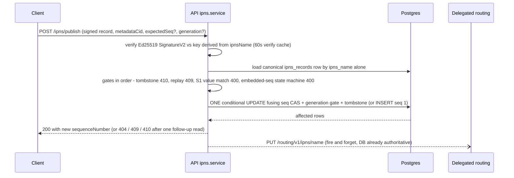

# API relay and coordination plane

| | |
| --- | --- |
| **Kind** | part |
| **Sources** | `apps/api/src/` (app.module, main, auth/, vault/, ipfs/, ipns/, shares/, tee/, republish/, device-approval/, migration/, health/, metrics/, common/, migrations/), `apps/api/scripts/generate-openapi.ts`, `packages/api-client/`, `crates/api-client/`, `scripts/check-api-client.sh`, `docs/DATABASE_EVOLUTION_PROTOCOL.md`, `docs/CONFIGURATION.md`, `docs/CAPACITY.md`, `docs/ARCHITECTURE.md`, `.planning/phases/66-*/66-CONTEXT.md`, `.planning/phases/71-*/71-CONTEXT.md`, `.planning/REQUIREMENTS.md` |
| **Verified against** | cipher-box `27c4abec5` |
| **Status** | draft |

## Purpose and scope

`apps/api` is the NestJS coordination plane of a zero-knowledge system: it authenticates
users and issues session tokens, relays ciphertext blobs to a Kubo IPFS node with per-user
quota accounting, relays pre-signed IPNS records to delegated routing while enforcing the
system's integrity gates (sequence CAS, forward-only `generation`, tombstone), stores the
social-graph rows for sharing (grants and invites, all key material ECIES-wrapped), and
schedules TEE republishing. It can refuse and account; it can never read.

This spec owns the **entire Postgres schema** (all 14 tables), the **REST wire surface**
at capability level, and the **authoritative definition of the publish/resolve integrity
gates** — [flows/metadata-sync.md](../flows/metadata-sync.md),
[flows/rotation.md](../flows/rotation.md) and
[flows/republish-liveness.md](../flows/republish-liveness.md) link here for those gates.
It does **not** cover: the TEE republish cycle end-to-end (→
[flows/republish-liveness.md](../flows/republish-liveness.md)), the TEE worker internals
(→ [parts/tee-worker.md](../parts/tee-worker.md)), the client side of authentication (→
[flows/auth.md](../flows/auth.md)), or the metadata structures whose ciphertext the API
relays (→ [parts/core-codecs.md](../parts/core-codecs.md)).

## Vocabulary

- **Relay** — the API's role on the storage plane: it forwards opaque bytes (ciphertext
  blobs, signed IPNS records) and enforces bookkeeping gates, never producing or
  inspecting content.
- **Identity JWT** — short-lived (5 min) RS256 token minted by the API's identity plane
  after Google/email/wallet proof; consumed by Web3Auth Core Kit as the custom-verifier
  input (`apps/api/src/auth/services/jwt-issuer.service.ts:57-76`).
- **Access token / refresh token** — CipherBox session pair: HS256 JWT (15 min, claims
  `sub`, `publicKey`, optional `scope`) + opaque 32-byte random refresh token (7 days,
  stored argon2-hashed).
- **The three counters** (never conflate): **`sequenceNumber`** — the IPNS record clock,
  incremented by the relay on forward publish; **`generation`** — the rotation clock,
  incremented only by the client rotation engine and gated forward-only by the relay;
  **`keyEpoch`** — the TEE wrapping-key era. (Pinned glossary in repo-root `CONTEXT.md`.)
- **Publish CAS** — the single conditional UPDATE that fuses sequence compare-and-set,
  forward-only generation, and tombstone exclusion (TEE-04/TEE-07).
- **Tombstone** — terminal retirement of an `ipnsName` (`tombstoned_at` set): publish and
  resolve both answer 410, forever.
- **`seqFloor`** — resolve mode for rows with no cached `signed_record` (sharing-protocol
  rows): only a live network record at or above the stored sequence is served.
- **Enrollment** — a publish carrying `encryptedIpnsPrivateKey` + `keyEpoch`, adding the
  name to the TEE republish schedule.
- **Grant row / invite** — the two sharing rows: a `shares` row (per-recipient wrapped
  keys) and a `share_invites` row (link-based, keys wrapped to an ephemeral key whose
  private half lives only in the invite URL fragment).
- **Hosted pin / advisory pin** — `pinned_cids` rows for content the CipherBox Kubo node
  physically holds vs rows a BYO-IPFS user registers for content on their own node.
- **Guarded unpin** — the refcounted, advisory-locked unpin path: physical unpin only
  when no user (hosted or BYO) references the CID.
- **BYO mode** — `vaults.is_byo_user`: quota becomes advisory, `register-cid` unlocks.

## Actors and trust boundaries

| Actor | Sees | Must never see |
| --- | --- | --- |
| Client (web/desktop SDK) | its own plaintext, keys, tokens | other users' anything |
| CipherBox API | JWTs and hashed identifiers; the social graph (who shares/invites whom, which `ipnsName`s and CIDs exist, sizes, `is_root`, share roots); ciphertext blobs; ECIES ciphertexts (grant keys, invite keys, TEE-wrapped IPNS keys, provider configs); user secp256k1 `publicKey`s; signed IPNS record bytes | plaintext file content, folder/file names (`item_name_encrypted` is ciphertext), `readKey`/`writeKey`/`fileKey`, plaintext `ipnsPrivateKey`, raw refresh tokens at rest, OTP codes at rest |
| Postgres | everything the API sees, at rest | plaintext keys/content |
| Kubo | ciphertext blobs, CIDs | key material |
| Delegated routing (someguy) / DHT | public signed IPNS records | anything else |
| TEE worker | plaintext `ipnsPrivateKey` and provider credentials transiently in-enclave ([parts/tee-worker.md](../parts/tee-worker.md)) | the database |
| SendGrid | recipient email + the OTP code in the mail body | tokens, keys |

Trust posture, precisely:

- **Confidentiality: untrusted.** Every key-material column is ECIES ciphertext wrapped
  to a key the API does not hold; content blobs are AES-GCM/CTR ciphertext; the API does
  no crypto beyond hex/base64 transport and argon2 hashing of its own secrets. The
  metadata *hierarchy* is also hidden — the API sees a flat set of names/CIDs; parent →
  child links live inside sealed bodies it cannot open.
- **Integrity: trusted as a witness, not an authority.** The publish gates (signature
  verify, CAS, generation, tombstone, equivocation) are defense-in-depth ordering
  guarantees; the cryptographic root of integrity is the Ed25519 record signature plus
  the AAD-bound seals, both verified client-side. A compromised API can serve stale data
  or deny service, but cannot forge a record or repoint a CID without the signing key.
- **Availability: fully trusted.** Pin retention, the DB record cache, quota accounting,
  and republish scheduling all live here; DB loss halts republishing and pin bookkeeping
  ([flows/republish-liveness.md](../flows/republish-liveness.md) "API DB loss").
- **Social-graph authorization: trusted.** Who may create/revoke/claim grant rows is
  enforced server-side only (see the ownership-ceiling quirk — the model bottoms out at
  "first authenticated registrant of the name").

## Data structures

The full Postgres schema: 14 tables. `synchronize` is off in every environment; the
schema exists only through migrations (see the evolution paragraph at the end of this
section). Naming convention is snake_case columns — except the three oldest tables (see
quirks).

### Identity and session

#### `users` (`apps/api/src/auth/entities/user.entity.ts`)

| Column | Type | Meaning |
| --- | --- | --- |
| `id` | uuid PK | internal user id (JWT `sub`) |
| `publicKey` | varchar, unique | secp256k1 public key hex; placeholder `pending-core-kit-<id>` until Core Kit key derivation completes (`identity.controller.ts:312-318`) |
| `createdAt` / `updatedAt` | timestamp | camelCase columns (quirk) |

Write discipline: created by the identity plane (find-or-create on hashed identifier);
`publicKey` upgraded from placeholder at first real `/auth/login`. Deleting the row
cascades to every FK-bearing table below.

#### `auth_methods` (`auth/entities/auth-method.entity.ts`)

| Column | Type | Meaning |
| --- | --- | --- |
| `id` | uuid PK | |
| `userId` | uuid FK→users CASCADE | camelCase column |
| `type` | varchar | `'google' \| 'apple' \| 'github' \| 'email' \| 'wallet'` |
| `identifier` | varchar NOT NULL | in practice holds the SHA-256 **hash**, not plaintext (`identity.controller.ts:323`) |
| `identifier_hash` | varchar(64) | SHA-256 of the canonical identifier |
| `identifier_display` | varchar(255) | truncated human-readable value |
| `lastUsedAt` / `createdAt` | timestamp | |

Unique `(type, identifier_hash)` at DB level only (migration
`1740200000000-AddAuthMethodsUniqueConstraint.ts:12-14`; no entity decorator). Write
discipline: linked/unlinked via `/auth/link`/`/auth/unlink`; unlink runs a
pessimistic-write transaction and refuses to remove the last method
(`auth-method.service.ts:87-110`).

#### `refresh_tokens` (`auth/entities/refresh-token.entity.ts`)

| Column | Type | Meaning |
| --- | --- | --- |
| `id` | uuid PK | |
| `userId` | uuid FK→users CASCADE | |
| `tokenHash` | varchar | argon2 hash of the opaque token |
| `tokenPrefix` | varchar(16), indexed | first 16 chars of the raw token, O(1) candidate lookup |
| `expiresAt` / `revokedAt` / `createdAt` | timestamp | `revokedAt` set on rotation and logout |

Write discipline: insert on login/refresh; refresh revokes the old row and inserts a new
one (`auth.service.ts:257-316`); logout revokes all of a user's rows
(`token.service.ts:128-130`). Raw tokens are never stored.

#### `device_approvals` (`device-approval/device-approval.entity.ts`)

Cross-device MFA bulletin board: a new device posts an approval request with an ephemeral
public key; an existing device answers with the MFA factor key ECIES-wrapped to it.

| Column | Type | Meaning |
| --- | --- | --- |
| `id` | uuid PK | |
| `user_id` | varchar — **no FK** | plain string, not cascade-deleted (quirk) |
| `device_id` / `device_name` | varchar | requesting device |
| `ephemeral_public_key` | text | wrap target for the factor key |
| `status` | varchar default `'pending'` | `pending / approved / denied / expired` |
| `encrypted_factor_key` | text nullable | ECIES ciphertext from the approving device |
| `expires_at` | timestamp | 5-minute TTL |
| `responded_by` | varchar nullable | responding device id |

Index `(user_id, status)`. Write discipline: request → respond → poll; requests expire in
5 minutes; the requesting device may delete its own pending row.

### Vault and storage accounting

#### `vaults` (`vault/entities/vault.entity.ts`)

One row per user, binding user → root name + ECIES wrap target. **No key blob column** —
the VaultKeyBlob travels in published metadata, never Postgres
([parts/core-codecs.md](../parts/core-codecs.md)).

| Column | Type | Meaning |
| --- | --- | --- |
| `id` | uuid PK | |
| `owner_id` | uuid FK→users CASCADE, unique | one vault per user (this uniqueness is the system's one-root-per-user rule, phase 71 D-03) |
| `owner_public_key` | bytea | uncompressed 65-byte secp256k1 key — the ECIES wrap target others use for this user |
| `root_ipns_name` | varchar(255) | vault-root IPNS name, client-asserted at init |
| `is_byo_user` | boolean default false | BYO mode flag: quota advisory, `register-cid` unlocked |
| `initialized_at` | timestamp nullable | set on first upload |

Write discipline: `POST /vault/init` creates it (409 if exists — not idempotent) and
upserts the root `ipns_records` row (`isRoot: true`, seq `'0'`); a root name already
claimed by another user → 409 (`vault.service.ts:90-118`).

#### `pinned_cids` (`vault/entities/pinned-cid.entity.ts`)

The quota ledger *and* the pin refcount source, one row per `(user, cid)`.

| Column | Type | Meaning |
| --- | --- | --- |
| `id` | uuid PK | |
| `user_id` | uuid FK→users CASCADE, indexed | |
| `cid` | varchar(255) | CIDv1; also indexed alone (`1749100000000`) for the cross-user refcount |
| `size_bytes` | bigint (string in TypeORM) | quota accounting |
| `pinned_at` | timestamp | |

Unique `(user_id, cid)`; inserts are `INSERT … ON CONFLICT DO NOTHING`
(`vault.service.ts:224-236`). Hosted rows come from `/ipfs/upload`; advisory rows from
`/ipfs/register-cid` (BYO only). Write discipline on delete: only via `guardedUnpin`
(per-CID Postgres advisory lock `pg_advisory_xact_lock(hashtext(cid))`, delete caller's
row, recount across **all** users, enqueue physical unpin only at refcount 0 —
`vault.service.ts:254-346`). There is no stored usage counter; quota is
`SUM(size_bytes)` computed live per request.

#### `pending_unpins` (`vault/entities/pending-unpin.entity.ts`)

Outbox for physical unpins: `id` uuid PK, `cid` varchar(255) unique, `created_at`. A row
means "refcount reached 0, Kubo `pin/rm` still owed." Written inside the `guardedUnpin`
transaction; deleted post-commit on successful unpin or by the 5-minute drain worker,
which re-checks the refcount under the same lock and discards the row if the CID was
re-pinned meanwhile (`ipfs/pending-unpin/unpin-helpers.ts:48-61`). No time-based grace
period exists — deletion intent becomes physical unpin as soon as the refcount allows.

#### `pin_migrations` (`migration/migration.entity.ts`)

BYO pin-migration job tracking. `id`, `user_id` (uuid, indexed, **no FK**), `status`
(`pending / running / paused / completed / failed / cancelled`), `total_cids` /
`migrated_cids` / `failed_cids` counters, `source_config_encrypted` /
`dest_config_encrypted` (text — provider credentials ECIES-wrapped to the **TEE** public
key, opaque to the API), `failed_cid_list` (text nullable), timestamps + `completed_at`.
Write discipline: one active job per user (409 otherwise); progress written only by the
BullMQ processor, which forwards batches to the TEE worker's `/migrate`
([parts/tee-worker.md](../parts/tee-worker.md)).

### IPNS plane

#### `ipns_records` (`ipns/entities/ipns-record.entity.ts`)

The canonical row per `ipnsName` — unique on `ipns_name` **alone**; `user_id` is a
denormalized creator marker (listing, enrollment, cleanup, the phase-71 anti-spoof gate),
never publish authority (entity comment `:15-18`). Created by migration
`1750000000000-ApiSchemaCutover.ts` (which dropped the predecessor `folder_ipns` and its
`public_key` column — the Ed25519 key is always recovered from the name).

| Column | Type | Meaning |
| --- | --- | --- |
| `id` | uuid PK | |
| `user_id` | uuid FK→users CASCADE, indexed | creator marker |
| `ipns_name` | varchar(255), unique | |
| `latest_cid` | varchar(255) nullable | CID of the latest published metadata |
| `sequence_number` | bigint (string) default 0 | canonical IPNS sequence |
| `signed_record` | bytea nullable | canonical marshaled signed record — the DB-cache resolve source and the TEE signing input |
| `encrypted_ipns_private_key` | bytea nullable | ECIES-to-TEE wrapped Ed25519 key (enrollment) |
| `key_epoch` | int nullable | TEE epoch the wrap targets |
| `is_root` | boolean default false | vault-root marker |
| `tombstoned_at` | timestamptz nullable | terminal retirement |
| `generation` | bigint (string) default 0 | rotation clock — **only the client rotation engine increments it**; the API stores and gates it |

Write discipline — four writers, each with its own gate:

1. **Publish plane** (this spec's authoritative section, Behaviors below): first publish
   INSERTs seq `'1'`; every later publish is the single fused conditional UPDATE.
2. **TEE renewal** (`republish.service.ts renewIpnsRecordEol`): standalone equality-CAS
   `WHERE ipns_name AND user_id AND sequence_number = :loaded AND tombstoned_at IS NULL`
   that updates only `signed_record` — never sequence, CID, or generation; loses every
   race by design ([flows/republish-liveness.md](../flows/republish-liveness.md)). Note
   its CAS shape differs from the publish gate: owner-pinned, no generation predicate.
3. **Tombstone** (`ipns.service.ts:579-605`): owner-scoped
   `SET tombstoned_at = now() WHERE ipns_name AND tombstoned_at IS NULL AND user_id`.
4. **Vault init** (`vault.service.ts:90-118`): root pre-row / `is_root` flag upsert.

#### `ipns_republish_schedule` (`republish/republish-schedule.entity.ts`)

Pure scheduling bookkeeping, zero crypto columns since the phase-67 `ScheduleCollapse`
(`1751000000000`): `user_id` + `ipns_name` (unique pair), `next_republish_at`,
`last_republish_at`, `consecutive_failures`, `status`
(`'active' \| 'retrying' \| 'stale'`), `last_error` (truncated, never key material).
Indexed `(status, next_republish_at)`. Written by enrollment (upsert), the republish
cycle (success/failure bookkeeping), and unenroll/tombstone (row DELETE). Full lifecycle:
[flows/republish-liveness.md](../flows/republish-liveness.md).

### Sharing

#### `shares` (`shares/entities/share.entity.ts`, DDL `1750000000000-ApiSchemaCutover.ts:43-80`)

One grant row per `(sharer, recipient, root node)` — the read-root grant is the only DB
residue of a share; write authority is presence-derived (phase 66 D-09: a non-null
`encrypted_write_key` IS a write grant, there is no `permission` column).

| Column | Type | Meaning |
| --- | --- | --- |
| `id` | uuid PK | |
| `sharer_id` | uuid FK→users CASCADE, indexed | grantor (owner *or* a write-recipient — multi-sharer is deliberate, D-06) |
| `recipient_id` | uuid FK→users CASCADE, indexed | grantee, resolved from the supplied `recipientPublicKey` at create |
| `encrypted_read_key` | bytea NOT NULL | share-root `readKey` ECIES-wrapped to the recipient |
| `encrypted_write_key` | bytea nullable | share-root `writeKey` wrapped to the recipient; NULL = read-only |
| `root_node_id` | uuid | shared node's UUID — client-asserted (phase 71 D-02 gap) |
| `share_root_ipns_name` | varchar(255) | shared node's IPNS name — ownership-gated |
| `root_generation` | bigint (string) default 0 | generation the wrapped keys are rooted at; seeds the recipient's anti-rollback floor |
| `item_name_encrypted` | bytea nullable | display name wrapped to the recipient |
| `hidden_by_recipient` | boolean default false | recipient-side dismissal |
| `created_at` / `updated_at` | timestamp | |

Plain unique `(sharer_id, recipient_id, root_node_id)` — plain precisely because revoke
is a hard DELETE (D-11), so no revoked rows ever coexist with a re-share. Composite index
`(sharer_id, share_root_ipns_name)` for bulk revoke. Write discipline: INSERT via
`POST /shares` (root-ownership gate + 23505→409 race guard) or invite claim; UPDATE only
via the sharer-only, row-locked, generation-monotonic `PATCH /shares/:id/grant`
(rotation re-mint); DELETE via sharer-only revoke or bulk revoke — **never** a soft
delete (no `revoked_at`/`deleted_at` column exists anywhere in the module).

Note: the phase-80 "recipient-pubkey pinning" lives in the **metadata plane**
(`recipientPins` in the write body, [parts/core-codecs.md](../parts/core-codecs.md) /
[flows/sharing-grants.md](../flows/sharing-grants.md)), not in this table — there is no
`recipient_public_key` column; the DB pins the recipient by `recipient_id` FK only.

#### `share_invites` (`shares/entities/share-invite.entity.ts`, DDL migration `:96-135`)

Link-based sharing with a distinct ephemeral lifecycle (kept separate from `shares`,
phase 66 D-05).

| Column | Type | Meaning |
| --- | --- | --- |
| `id` | uuid PK | |
| `token` | varchar(44), unique | `randomBytes(16)` base64url (22 chars), **stored plaintext** (quirk) |
| `sharer_id` | uuid FK→users CASCADE, indexed | |
| `share_root_ipns_name` / `root_node_id` / `root_generation` | as on `shares` | root identity, copied to the minted grant at claim (anti-spoof) |
| `item_name_encrypted` | bytea nullable | wrapped to the **ephemeral** key |
| `encrypted_read_key` | bytea NOT NULL | root `readKey` wrapped to the ephemeral key (private half only in the URL fragment) |
| `encrypted_write_key` | bytea nullable | NULL = read-only invite |
| `status` | varchar(20) default `'active'` | `active / claimed / revoked` |
| `max_claims` / `claim_count` | int, default 1 / 0 | CHECK `claim_count >= 0 AND claim_count <= max_claims` (phase 71 D-04) |
| `claimed_by` | uuid nullable, **no FK** | claimer |
| `expires_at` | timestamp, indexed | 7-day TTL |
| `created_at` | timestamp | |

Write discipline: INSERT via `POST /shares/invites` (root-ownership gate); the claim is
an atomic single-statement consume
(`UPDATE … WHERE status='active' AND claim_count < max_claims AND expires_at > NOW()`,
`share-invite.service.ts:158-176`); revoke is a **soft** `status='revoked'` flip
(asymmetric with the shares hard-delete — quirk); expired-but-active rows are hard-deleted
opportunistically by the read paths.

### TEE key state

#### `tee_key_state` / `tee_key_rotation_log` (`tee/tee-key-state.entity.ts`, `tee/tee-key-rotation-log.entity.ts`)

`tee_key_state` is a singleton row: `current_epoch` + `current_public_key` (65-byte
0x04-prefixed secp256k1 bytea), nullable `previous_epoch` / `previous_public_key`,
`grace_period_ends_at`. It is what vault responses surface to clients as `teeKeys` (the
wrap target for enrollment); seeded at API boot from the TEE worker's `/health` +
`/public-key`, rotated only by `rotateEpoch` (currently caller-less — see
[flows/republish-liveness.md](../flows/republish-liveness.md) Known gaps).
`tee_key_rotation_log` is an append-only audit: `from_epoch`, `to_epoch`, both public
keys, `reason` (`'scheduled' \| 'cvm_update' \| 'manual'`). Full epoch semantics:
[flows/republish-liveness.md](../flows/republish-liveness.md).

### Schema evolution discipline

TypeORM + Postgres with `synchronize: false` everywhere and `migrationsRun: true` at boot
(`app.module.ts:102-104`); forward-only, timestamp-ordered, idempotent migration files
are the sole schema source, with three runner paths (NestJS boot, TypeORM CLI via
`data-source.ts`, and the standalone Docker `run-migrations.ts` used by the staging
deploy). Rules, checklists, and the historical incidents that produced them live in
`docs/DATABASE_EVOLUTION_PROTOCOL.md`. Two deliberate v2.0-era deviations are on record:
the phase-66 cutover (`1750000000000-ApiSchemaCutover.ts`) is a **destructive
drop-recreate whose `down()` throws** (greenfield waiver, phase 66 D-01), and phase 71
later **edited that shipped cutover in place** (D-10 renames + the claim-count CHECK)
rather than adding forward migrations, on the grounds that the v2.0 schema was still
unreleased (71-CONTEXT "Migration ordering"). Note the protocol document's own "Current
Schema Reference" (§6) predates the cutover and still lists `folder_ipns` and
`share_keys` — see Known gaps.

## Interface

All routes are JWT-guarded via `JwtAuthGuard` unless marked *public*. There is **no
global guard**: throttling exists only where a controller opts in with
`@UseGuards(BypassableThrottlerGuard)` (named limiters `short` 10/1 s and `medium`
100/60 s, per-route `@Throttle` overrides; all bypassed when `NODE_ENV === 'test'` or
with the non-production `X-Throttle-Bypass` header). Global `ValidationPipe` runs
`whitelist` + `forbidNonWhitelisted` + `transform` (`main.ts:20-26`).

| Group | Endpoints (capability level) | Notes |
| --- | --- | --- |
| `/auth` session plane | `POST login` (public, 10/min) exchanges an identity JWT + Core-Kit `publicKey` for the session pair — refresh token in body for desktop (`x-client-type: desktop`) or HTTP-only cookie for web. `POST refresh` (public, **unthrottled**) rotates the pair. `POST logout` revokes all refresh tokens. `DELETE account` (3/min, body `confirmation: 'DELETE'`) unpins best-effort then cascade-deletes the user. `GET methods`, `POST link`, `POST unlink` manage `auth_methods`. `POST test-login` (public, 5/15 min) — see Runtime variants | `apps/api/src/auth/auth.controller.ts` |
| `/auth` identity plane | `GET .well-known/jwks.json` (public, 1 h cache) serves the RS256 JWK. `POST identity/google` (public, **unthrottled**) verifies a Google idToken. `POST identity/email/send-otp` / `verify-otp` (5/15 min) — argon2-hashed OTP in Redis, 5-min TTL, 5 attempts. `GET identity/wallet/nonce` (10/min) + `POST identity/wallet` (5/15 min) — SIWE with single-use Redis nonce. Each success mints a 5-min identity JWT | `auth/controllers/identity.controller.ts` |
| `/device-approval` | `POST request` (3/min), `GET :id/status`, `GET pending`, `POST :id/respond`, `DELETE :id` — the cross-device MFA bulletin board; the only surface reachable with a `'device-approval'`-scoped token | `device-approval/device-approval.controller.ts` |
| `/vault` | `POST init` (binds user → `rootIpnsName` + `ownerPublicKey`, 409 if exists), `GET /vault` (vault + `teeKeys`), `GET quota` (`usedBytes`/`limitBytes`/`remainingBytes`/`advisory`), `GET config` (`recycleBinRetentionDays`), `GET export` (root name + derivation hint — no keys), `PATCH byo-status` | `vault/vault.controller.ts` — no throttler guard |
| `/ipfs` | `POST upload` (multipart, 100 MB cap, quota-gated, pins to Kubo `add?pin=true&cid-version=1`), `GET :cid` (streams Kubo `cat`), `POST unpin` (guarded refcounted unpin), `POST register-cid` (BYO-only advisory row; its `@Throttle` is inert — no guard on this controller) | `ipfs/ipfs.controller.ts` |
| `/ipns` | `POST publish` (10/min), `POST publish-batch` (5/min, ≤200 entries), `GET resolve` (30/min, **no per-user scoping** — any authenticated user resolves any name), `POST tombstone` (10/min, owner-scoped), `POST unenroll` (5/min, ≤200 names, owner-scoped) | the integrity gates below; `ipns/ipns.controller.ts` |
| `/shares` | `POST /shares` (create grant), `GET received` / `sent` (paginated; expose the counterparty `publicKey`), `GET lookup?publicKey=` (existence oracle, returns `{exists}` only), `DELETE :id` (hard revoke), `PATCH :id/hide`, `PATCH :id/grant` (rotation re-mint), `POST revoke-for-items` (≤5000 names, bulk) | `shares/shares.controller.ts` |
| `/shares/invites` | `POST` (create, 7-day TTL), `GET ?shareRootIpnsName=` (list + expired cleanup), `DELETE :id` (soft revoke) | `shares/share-invites.controller.ts` |
| `/invites` | `GET :token` (**public**, opaque `{status:'active'}` or 404), `GET :token/data` (auth, full ciphertext for claim), `POST :token/claim` (auth, mints a grant) | token format-gated by `ParseTokenPipe`; `shares/invites.controller.ts` |
| `/tee` | `POST connection-test` (10/min) — forwards ECIES-encrypted BYO provider config to the TEE worker for in-enclave connection testing | `tee/tee.controller.ts` |
| `/migration` | `POST start` (5/h), `GET status`, `POST :id/pause` / `resume` / `cancel` — BYO pin migration jobs executed via the TEE worker | `migration/migration.controller.ts` |
| Ops | `GET /health` (public — Terminus DB ping only, plus `version`), `GET /metrics` (**public, unauthenticated** Prometheus text), `GET /admin/republish-health` (JWT — any user; republish schedule stats + TEE reachability), `GET /` (app info), Swagger UI at `/api-docs` (always enabled) | |

### Generated clients

The wire surface is the source of truth; both clients are derived artifacts, not
independently specced:

- **`packages/api-client` (TypeScript, generated, checked in).** `pnpm api:generate`
  chains (root `package.json:19`): a standalone reflection module
  (`apps/api/scripts/generate-openapi.ts` — controllers/DTOs only, all services mocked,
  `/health` path injected manually) writes `packages/api-client/openapi.json`; orval
  ^7.3.0 (`orval.config.ts`, `tags-split` mode, axios-functions client, custom
  `customInstance` mutator) emits `src/generated/**` + `src/models/**`; then build +
  lint. A pre-commit hook (`scripts/check-api-client.sh`) forces `openapi.json` to be
  staged whenever a DTO/controller/entity changes — it checks **only** `openapi.json`,
  not the generated sources and not the Rust crate.
- **`crates/api-client` (Rust, hand-written).** No codegen anywhere (no build.rs, no
  progenitor, no generated markers) — a manual serde mirror of the TS client
  (`src/lib.rs:5` "Mirrors @cipherbox/api-client"), with hand-written redacting `Debug`
  impls and a hard-coded `X-Client-Type: desktop` header. It drifts unless a human moves
  it (version `0.36.1` vs api-client `0.44.0` at the pinned commit).

## Dependencies

- **Postgres 16** (TypeORM) — all durable state; migrations auto-run at boot.
- **Redis 7** — BullMQ job queues; plus direct `ioredis` for OTP storage and SIWE
  nonces. The throttler does **not** use Redis (in-memory, per-process).
- **Kubo** (`IPFS_LOCAL_API_URL`) — `add?pin=true&cid-version=1`, `cat`, `pin/rm`,
  `pin/ls` over the RPC API.
- **Delegated routing** (`DELEGATED_ROUTING_URL`, default `https://delegated-ipfs.dev`;
  someguy in staging/local; optional fallback URL) — IPNS record PUT/GET, 5 s timeout,
  3 retries, exponential backoff, Retry-After honored.
- **TEE worker** (`TEE_WORKER_URL` + Bearer `TEE_WORKER_SECRET`) — republish batches,
  public-key fetch, connection tests, pin migration
  ([parts/tee-worker.md](../parts/tee-worker.md)).
- **SendGrid** — OTP email delivery (dev logs the code instead when unset).
- **JWKS consumers/producers** — verifies Google tokens against Google's JWKS; verifies
  its *own* identity JWTs against its own JWKS; Web3Auth consumes that JWKS as a custom
  verifier.

## Behaviors

### Two-phase login

- **Trigger** — user authenticates in a client ([flows/auth.md](../flows/auth.md) owns
  the end-to-end flow; this is the server's half).
- **Steps**
  1. **Phase 1 — identity.** Client proves a Google account (`POST /auth/identity/google`,
     RS256 verify against Google JWKS, `email_verified` required, keyed on Google `sub`),
     an email (OTP: argon2-hashed in Redis, 5-min TTL, 5 send + 5 verify attempts), or a
     wallet (SIWE: single-use Redis nonce, domain checked against `CORS_ALLOWED_ORIGINS`).
     The API find-or-creates `users` + `auth_methods` on the SHA-256 identifier hash and
     signs a 5-minute RS256 **identity JWT** (`iss: cipherbox`, `aud: web3auth`,
     kid `cipherbox-identity-1`).
  2. Client feeds that JWT to Web3Auth Core Kit (custom verifier against the API's own
     JWKS) and derives its secp256k1 keypair.
  3. **Phase 2 — session.** `POST /auth/login` with the identity JWT + derived
     `publicKey`. The API verifies the JWT **against its own JWKS**
     (`auth.service.ts:175-197` — issuer/audience/RS256), resolves the placeholder
     `publicKey`, and issues the session pair via `TokenService.createTokens`: HS256
     access token (15 min, `JWT_SECRET`) + opaque refresh token (7 days, argon2-hashed at
     rest). Web gets the refresh token as an HTTP-only cookie; desktop
     (`x-client-type: desktop`) gets it in the body.
  4. **MFA temp auth**: if the client's key reconstruction is still pending device
     approval (`publicKey` still `pending-core-kit-…` and not a new user), the API
     instead issues a **scoped, non-refreshable** token — `scope: ['device-approval']`,
     empty refresh token (`auth.service.ts:154-162`). `JwtAuthGuard` confines scoped
     tokens to routes carrying `@AllowScope('device-approval')` (the bulletin board);
     everything else → 403. The device re-logins with the real key after approval.
- **Postconditions** — `req.user` on every subsequent request is the DB user loaded from
  the JWT `sub` (not the raw payload; `jwt.strategy.ts:35-46`).
- **Failure modes** — refresh with an expired/revoked/unknown token → 401 (candidates
  found by 16-char prefix, argon2-verified; rotation revokes the old row); logout revokes
  all; `TEST_LOGIN_SECRET` paths are hard-blocked in production (Runtime variants).

### IPNS publish — the integrity gates (authoritative)

- **Trigger** — `POST /ipns/publish` (or per-entry within `publish-batch`) with
  `PublishIpnsDto`: `ipnsName`, base64 `record`, `metadataCid`, optional `publicKey`,
  optional enrollment pair (`encryptedIpnsPrivateKey` hex + `keyEpoch`), optional
  `expectedSequenceNumber` (seq CAS), optional `generation`
  (`ipns/dto/publish.dto.ts`).
- **Preconditions** — the record is fully signed client-side; the API never signs.
  Publish **authority is possession of the Ed25519 key**, proven by the record's
  signature — not row ownership (`ipns.service.ts:241-244`).



- **Steps — gate order** (`publishRecord` `ipns.service.ts:51-163`, then
  `upsertIpnsRecord` `:231-524`):
  1. Base64-decode the record → 400 on garbage. If the optional `publicKey` is present:
     must decode, be exactly 32 bytes, and derive to `ipnsName` → 400 otherwise
     (`:70-87`). (Redundant defense — step 2 derives the key from the name regardless.)
  2. **Signature gate.** Verify the record's SignatureV2 against the key recovered from
     the name (`verifyIpnsRecordSignature`, strict `ipns` validator — an *expired* record
     also fails) → 400. A 60-second in-process cache keyed by
     `ipnsName + base64(recordBytes)` (10 000 entries, populated **only** from this
     publish path, never from resolve) short-circuits retry storms
     (`ipns/ipns-verify-cache.ts`).
  3. Load the canonical row by `ipnsName` alone — no user filter (`:245`).
  4. **Tombstone short-circuit.** `existing.tombstonedAt` → **410**
     `{ error: 'IPNS_TOMBSTONED', ipnsName }` before any other gate (`:252-254`).
  5. **Replay anti-rollback.** When a stored `signed_record` exists, parse both records
     and compare *embedded, signature-covered* sequences: incoming < stored → **409**
     "sequence regression rejected (rollback/replay)" (`:256-278`) — an old-but-valid
     signed record can never regress the row.
  6. **S1 value gate.** The record's embedded value must equal `/ipfs/<metadataCid>`
     exactly → 400 on mismatch (`:280-297`).
  7. **Embedded-sequence state machine** (`:298-366`), `dbSeq` = stored value:
     - no row: embedded must be exactly `1` → 400 otherwise (first-publish gate);
     - `embedded == dbSeq`: an idempotent same-CID re-sign is allowed (sequence **not**
       incremented); same seq + **different CID** → 400 **equivocation** (phase 71
       D-05); *unless* `expectedSequenceNumber == embedded − 1` marks it a lost
       forward-CAS race, which falls through so the stale CAS yields 409;
     - `embedded == dbSeq + 1`: forward publish;
     - `embedded < dbSeq` → 400 rollback; `embedded > dbSeq + 1` → 400 wild jump.
  8. **Enrollment persistence.** `shouldUpdateKey` = ciphertext **and** epoch present
     **and** `existing.userId === caller` (`:377-381`) — a write-share recipient can
     advance the record but never overwrite the owner's enrollment; successful key writes
     fire-and-forget `enrollFolder` under the **owner's** id.
  9. **The fused conditional UPDATE** (`:394-428`). SET: `latest_cid`, `signed_record`,
     `sequence_number` (raw SQL `sequence_number + 1`, or unchanged on the idempotent
     path), `updated_at`, plus `generation` and the enrollment pair when eligible.
     WHERE, verbatim (`:423`):

     ```sql
     ipns_name = :ipnsName AND sequence_number = :expected
       AND generation <= CAST(:incoming AS bigint)
       AND tombstoned_at IS NULL
     ```

     with `:expected = expectedSequenceNumber ?? existing.sequenceNumber` and
     `:incoming = generation ?? existing.generation` (omitted fields degrade the extra
     gates to no-ops). No in-memory check gates the write; `affected` decides.
  10. **`affected = 0` disambiguation** — one follow-up read: row gone → 404; tombstoned
      → 410; else → **409** `'Sequence number mismatch or generation regression'`
      carrying `currentSequenceNumber` (`:432-447`). Seq-CAS failure and generation
      regression are deliberately not distinguished.
  11. **First-publish INSERT** (`:472-523`): seq `'1'`, `generation` = DTO value or
      `'0'`, `isRoot: false`, enrollment fields if paired; a concurrent INSERT's Postgres
      `23505` → **409** `'IPNS record already exists'` (phase 71 D-06).
- **Postconditions** — the DB row is authoritative *before* the network sees anything:
  the delegated-routing PUT is fire-and-forget with a swallowed error (`:130-150`).
  Response carries the new `sequenceNumber`.
- **Failure modes** — batch publish (`publishBatch` `:170-222`, concurrency 10,
  ≤200 entries) is per-entry independent with partial success, **except** any 409 or 410
  aborts the whole batch (tombstone surfaced to stop client retry loops). Delegated
  routing down → publish still succeeds (DB-canonical); resolve covers the gap.

The `generation` counter is bumped exclusively by the client rotation engine
([flows/rotation.md](../flows/rotation.md)); grep confirms no API code increments it —
the column is written only from DTO values (`:402-404`, `:487`).

### IPNS resolve — anti-rollback case split (authoritative)

- **Trigger** — `GET /ipns/resolve?ipnsName=` (any authenticated user, no ownership
  scoping).
- **Steps** (`resolveRecord` `ipns.service.ts:613-785`):
  1. Fetch from delegated routing (GET, 404 → null). For Ed25519 identity records the
     embedded `pubKey` is absent — recover it from the name, or **fail closed** to null
     if unrecoverable. A BAD_GATEWAY from routing degrades to DB-only; other errors
     rethrow.
  2. Always load the DB row. `tombstoned_at` set → **410** `IPNS_TOMBSTONED` before any
     CID is served.
  3. `parseCachedRecord` (`ipns/ipns-record.codec.ts:77-132`) classifies the row:
     **full fields** (has `signed_record`; the parsed record's CID must equal
     `latest_cid` or the cache is **discarded — fail closed**), **`seqFloor`**
     (`latest_cid` present, `signed_record` null — sharing-protocol rows), or **null**.
  4. Case split:
     - **seqFloor row**: serve only a live network record with
       `networkSeq >= floor` — below the floor or absent → 404. Never an ungated
       network record for shared names (TEE-05).
     - **both present**: DB wins unless the network is *strictly* ahead
       (`dbSeq >= networkSeq` → serve the DB bundle, which carries the full verifiable
       signature; network ahead → serve network).
     - **network only** / **DB only**: serve what exists; neither → 404.
- **Postconditions** — response: `cid`, `sequenceNumber`, and an all-or-nothing signature
  bundle `{signatureV2, data, pubKey}` when complete — never raw record bytes. The
  client re-verifies and applies its own durable generation/sequence floor (ROT-07,
  [parts/sdk-core.md](../parts/sdk-core.md)); the server-side split here is the relay's
  own fail-closed layer, not a substitute.

### Tombstone and unenroll

- `POST /ipns/tombstone` — owner-scoped atomic UPDATE
  (`WHERE ipns_name AND tombstoned_at IS NULL AND user_id`); an already-tombstoned owned
  row is an idempotent no-op, a non-owned/unknown name → 404; always followed by an
  idempotent schedule-row delete. Used by rotation to retire replaced names
  ([flows/rotation.md](../flows/rotation.md)).
- `POST /ipns/unenroll` (≤200 names) — per-name independent, owner-scoped
  `DELETE FROM ipns_republish_schedule`; touches nothing on `ipns_records`. Fired
  best-effort by clients after deletes.

### Upload, quota, and guarded unpin

- **Upload** (`POST /ipfs/upload`): 100 MB multipart cap → quota pre-check
  (`SUM(size_bytes) + incoming <= 500 MiB`, BYO users exempt) → 413 on either → Kubo
  `add?pin=true&cid-version=1` → `pinned_cids` upsert. If the DB record fails after the
  pin, the controller compensates with a direct unpin to avoid a leaked physical pin
  (`ipfs.controller.ts:119-135`). The blob is never inspected — "ciphertext only" is a
  client-side contract, not server-validated.
- **register-cid** (BYO only): advisory `pinned_cids` row, no Kubo call, no quota gate.
- **Guarded unpin** (`POST /ipfs/unpin` → `vault.service.ts guardedUnpin:254-346`):
  per-CID advisory lock → silently no-op if the caller has no row (cross-user attempts
  are metered, not surfaced — no existence oracle, D-01) → delete the caller's row
  (quota decrement) → recount across **all** users → at refcount 0, insert a
  `pending_unpins` outbox row and attempt `pin/rm` post-commit; failures are retried by
  the 5-minute drain job, which re-checks the refcount and discards rows for re-pinned
  CIDs. BYO advisory rows hold the refcount up by design (retention consequence,
  `docs/CAPACITY.md` §7). An hourly read-only drift report compares Kubo's pin list
  against `pinned_cids ∪ pending_unpins` and counts orphans.

### Share grant lifecycle

- **Create** (`POST /shares`): root-ownership gate — the caller must be the registered
  creator of `shareRootIpnsName` in `ipns_records` (`shares/root-ownership.util.ts:16-27`,
  403 otherwise; phase 71 D-01 — explicitly defense-in-depth: a forged grant for content
  the caller lacks keys to is cryptographically inert). Recipient resolved from the
  supplied `recipientPublicKey` (never persisted); self-share → 409; duplicate triple →
  409, including the 23505 race translation.
- **Invite create/claim** (`POST /shares/invites`, `POST /invites/:token/claim`): same
  ownership gate at create. Claim: expiry/status checks, self-claim → 409, a write
  invite without a supplied re-wrapped write key → 400 *before* the invite is consumed
  (T-66-E1), then the atomic claim UPDATE, then either a fresh grant mint — root
  identity copied **from the invite row**, never claimer input (anti-spoof), write
  authority derived from invite presence — or the **widen-only merge** (phase 71 D-07):
  apply the later grant only if it upgrades read→write or advances `rootGeneration`;
  never downgrade, never regress.
- **Re-mint after rotation** (`PATCH /shares/:id/grant`): sharer-only, row-locked;
  requires new `encryptedReadKey` + `rootGeneration`, rejects generation regression
  (409); optional write-key upgrade or explicit `clearEncryptedWriteKey` downgrade
  (mutually exclusive). The server stores client ciphertext verbatim. Consumed by the
  rotation engine's grant re-mint ([flows/sharing-grants.md](../flows/sharing-grants.md)).
- **Revoke**: `DELETE /shares/:id` (sharer-only) and `POST /shares/revoke-for-items`
  (≤5000 subtree names, single bulk DELETE) **hard-delete** grant rows — revoked ECIES
  key material does not linger (phase 66 D-11). Invites are soft-revoked
  (`status='revoked'`). Access cutoff is expected to precede unpin in the shared-delete
  flow (DTO doc, `revoke-for-items.dto.ts:11-21`).

### TEE integration touchpoints

The API is the TEE worker's only client, always with `Authorization: Bearer
TEE_WORKER_SECRET`. Touchpoints owned here: the enrollment columns on `ipns_records`,
`tee_key_state` seeding at boot, the `/tee/connection-test` proxy (ECIES-encrypted BYO
provider config, decrypted only in-enclave), and the `pin_migrations` processor calling
`/migrate`. The 6-hour republish cycle, epoch/grace mechanics, and failure decay are
specified in [flows/republish-liveness.md](../flows/republish-liveness.md); the worker
itself in [parts/tee-worker.md](../parts/tee-worker.md).

### Background jobs (BullMQ, Redis-backed)

| Queue | Job | Schedule | Purpose |
| --- | --- | --- | --- |
| `republish` | `republish-batch` | cron `0 */6 * * *` | TEE lease-renewal cycle (flow spec) |
| `pending-unpins` | `drain-pending-unpins` | cron `*/5 * * * *` | retry outbox physical unpins (batch 50) |
| `pending-unpins` | `drift-report` | cron `0 * * * *` | read-only Kubo-vs-DB pin drift counter |
| `pin-migration` | `pin-migration` | on demand | per-user BYO pin migration via TEE (batch 10, 300 s/batch) |

Scheduler-registration failure at boot is fatal in production for `pending-unpins` but
only a warning for `republish` (`pending-unpin.module.ts:49-52` vs
`republish.module.ts:44-48` — asymmetric by accident, see quirks).

## Runtime variants

- **`NODE_ENV=test`** — throttling disabled outright in the guard; limiter factories
  also 20× the limits (`app.module.ts:58-76`).
- **`THROTTLE_BYPASS_SECRET`** — non-production only: requests with a timing-safe-matched
  `X-Throttle-Bypass` header skip rate limits (load tests, E2E).
- **`TEST_LOGIN_SECRET`** — enables `POST /auth/test-login`: deterministic per-email
  secp256k1 keypair, real (unscoped) tokens. Triple-gated: hard 403 when
  `NODE_ENV === 'production'` regardless of the env var, 403 when unset, timing-safe
  compare otherwise (`auth/services/test-auth.service.ts:43-57`).
- **`IDENTITY_JWT_PRIVATE_KEY`** — mandatory in production; dev/staging generate an
  ephemeral RS256 keypair per boot (identity JWTs won't survive an API restart there).
- **BYO mode** (per-vault flag) — quota advisory, `register-cid` unlocked, pin
  migration available.
- **Delegated routing** — default public `https://delegated-ipfs.dev`; staging/local
  point at a someguy sidecar; optional fallback URL doubles the retry envelope.
- **Swagger** — `/api-docs` is always on; there is no production gate.

## Invariants

1. **INV-1** — The API MUST verify a publish's Ed25519 SignatureV2 against the key
   derived from the `ipnsName` before any DB write. Possession of the signing key IS
   publish authority; row ownership MUST NOT gate the record-advance path.
2. **INV-2** — A first publish MUST embed sequence exactly 1 and INSERT with sequence
   `'1'`; a concurrent-INSERT unique violation MUST surface as 409, never 500.
3. **INV-3** — A forward publish MUST embed exactly `dbSeq + 1`; a smaller embedded
   sequence is a 400 rollback, a larger one a 400 wild jump.
4. **INV-4** — A same-sequence publish MUST carry the same CID (else 400 equivocation)
   and MUST NOT increment the stored sequence; only a provable lost forward-CAS race may
   fall through to the CAS (which then 409s).
5. **INV-5** — Every existing-row publish write MUST be one atomic conditional UPDATE
   fusing `sequence_number = :expected`, `generation <= :incoming`, and
   `tombstoned_at IS NULL`; `affected` alone decides the outcome, disambiguated by a
   single follow-up read into 404 / 409 / 410.
6. **INV-6** — `metadataCid` MUST equal the record's embedded value `/ipfs/<cid>`
   exactly (S1).
7. **INV-7** — Before overwriting a stored `signed_record`, the API MUST compare the
   embedded, signature-covered sequences of incoming vs stored and reject regression
   (replaying an old valid record can never regress the row).
8. **INV-8** — The API MUST NOT originate `generation` increments; the column only ever
   stores client-supplied values, gated forward-only.
9. **INV-9** — Tombstoning is terminal and owner-scoped: a tombstoned name MUST answer
   410 on publish and resolve forever, and MUST be removed from the republish schedule.
10. **INV-10** — Enrollment fields (`encrypted_ipns_private_key`, `key_epoch`) MUST only
    be written when both arrive together AND the caller is the row's `user_id`.
11. **INV-11** — Resolve MUST fail closed: a `seqFloor` row is served only from a live
    network record at or above the floor; a cached record whose parsed CID differs from
    `latest_cid` is discarded; on a sequence tie the DB bundle wins.
12. **INV-12** — Resolve MUST answer 410 for a tombstoned row before serving any CID.
13. **INV-13** — The API MUST never persist or log plaintext key material or content:
    every key column is ECIES ciphertext, item names are ciphertext, OTPs and refresh
    tokens are stored only hashed (argon2), `last_error` carries no key material.
14. **INV-14** — Grant revocation is a hard DELETE of the `shares` row; no soft-delete
    column may exist, and a re-share after revoke MUST insert cleanly under the plain
    unique triple.
15. **INV-15** — Invite claim merges are widen-only: never write→read downgrade, never
    `rootGeneration` regression; minted grants take root identity from the invite row,
    never claimer input; a read-only invite can never yield a write grant.
16. **INV-16** — `PATCH /shares/:id/grant` MUST reject `rootGeneration` regression
    (409) and MUST be sharer-only under a row lock.
17. **INV-17** — Physical unpin MUST happen only at refcount 0 across ALL `pinned_cids`
    rows (advisory included), under the per-CID advisory lock; the caller's quota
    decrement happens regardless of the refcount outcome.
18. **INV-18** — Hosted uploads MUST be quota-gated at 500 MiB per user, computed live
    from `SUM(size_bytes)`; BYO advisory rows bypass enforcement but still count toward
    the refcount.
19. **INV-19** — Share/invite creation MUST pass the root-ownership gate (caller is the
    `ipns_records` registrant of `shareRootIpnsName`), acknowledged as
    defense-in-depth, not cryptographic authority.
20. **INV-20** — Test login MUST be refused in production regardless of configuration;
    scoped (`device-approval`) tokens MUST be non-refreshable and confined to
    `@AllowScope` routes.
21. **INV-21** — The schema exists only through migrations (`synchronize: false`
    everywhere); every new `@Entity()` ships with a `CREATE TABLE` migration.

## Known gaps and quirks

- **No global guard at all.** Nothing binds `APP_GUARD`; auth and throttling are
  per-controller opt-in. Consequences: the `@Throttle(100/h)` on
  `POST /ipfs/register-cid` is **inert** (its controller never applies the guard —
  `ipfs.controller.ts:47,161`), the vault and IPFS controllers are entirely
  unthrottled, `POST /auth/refresh` and `POST /auth/identity/google` are public **and**
  unthrottled (`auth.controller.ts:100-108`, `identity.controller.ts:71`), and
  `GET /metrics` is unauthenticated by design of omission (`metrics.controller.ts`).
- **Throttle counters are in-memory per process** — no Redis storage is configured for
  the throttler despite Redis being present (`app.module.ts:58-76`), so limits reset on
  restart and would not be shared across replicas.
- **`/admin/republish-health` is not admin-gated** — plain `JwtAuthGuard`; any
  authenticated user reads schedule stats and TEE reachability
  (`republish/republish-health.controller.ts:12-13`).
- **Ownership ceiling (phase 71, documented posture).** No store proves key possession:
  `vaults.root_ipns_name` is client-asserted at init, `ipns_records.user_id` is a
  creator marker, and the model bottoms out at "first authenticated user to claim the
  globally-unique ipnsName wins." The root-ownership gate raises this to "authenticated
  registrant," not further. `shares.root_node_id` remains wholly client-asserted (D-02
  gap). A cryptographic key-possession challenge is explicitly deferred (71-CONTEXT
  Deferred Ideas).
- **camelCase columns in the auth-era tables.** `users` (`publicKey`, `createdAt`),
  `refresh_tokens` (`userId`, `tokenHash`, `tokenPrefix`), `auth_methods` (`userId`,
  `lastUsedAt` — mixed with snake_case `identifier_hash` in the same table) violate the
  project's own snake_case convention (`1700000000000-FullSchema.ts:30-79`).
- **`device_approvals.user_id` has no FK** and the table escapes account-deletion
  cascade — orphaned rows persist after user deletion (they expire logically in 5
  minutes but the rows remain). `share_invites.claimed_by` likewise dangles with no FK.
- **Dead code, auth module**: `Web3AuthVerifierService` (ES256/Web3Auth-JWKS verifier)
  is registered and exported but never called — the live path verifies CipherBox RS256
  JWTs (`auth/services/web3auth-verifier.service.ts:24-25`); `AuthService.refresh()`,
  `TokenService.rotateRefreshToken()` and `revokeToken()` are unreachable (the endpoint
  uses `refreshByToken`).
- **Invite tokens are stored plaintext** (`share_invites.token`,
  `share-invite.service.ts:43`) — DB read access + the URL fragment convention would
  reconstruct claimable links; only the public status endpoint is opaque (404 for
  anything non-active).
- **Asymmetric revocation in one endpoint**: `revoke-for-items` hard-deletes shares but
  soft-flips invites to `'revoked'` (`shares.service.ts:176-193`) — two lifecycles, one
  operation.
- **Quota is O(rows-per-user) per request** — no stored usage counter; every upload and
  quota read re-aggregates `SUM(size_bytes)` (`vault.service.ts:182-216`). Also the
  recorded size is Kubo's DAG `Size`, while the pre-check uses the raw multipart size —
  recorded usage can slightly exceed what was checked (`local.provider.ts:64` vs
  `ipfs.controller.ts:103`).
- **Vault export doc drift**: controller/service docstrings promise "encrypted root
  keys" but `getExportData` returns only format/version/rootIpnsName/derivationMethod —
  no keys (`vault.service.ts:361-385`); real export is client-side
  ([flows/vault-export-recovery.md](../flows/vault-export-recovery.md)).
- **Stale-doc drift, elsewhere**: `docs/DATABASE_EVOLUTION_PROTOCOL.md` §6 still lists
  `folder_ipns` and `share_keys` (dropped by the cutover) and predates `ipns_records` /
  `pending_unpins`; `docs/ARCHITECTURE.md`'s module table still says "share key
  distribution" (the `share_keys` plane was deleted in phase 66);
  `docs/CAPACITY.md` §4.3 still names `folder_ipns`; the account-deletion cascade
  comment lists both dropped tables (`auth.service.ts:223`).
- **Env vars missing from `docs/CONFIGURATION.md`**: `ACCESS_TOKEN_TTL` (silently
  overrides the 15-min access TTL), `IDENTITY_JWT_PRIVATE_KEY` (documented only in
  INTEGRATIONS.md), backend `GOOGLE_CLIENT_ID`, `SENDGRID_API_KEY`,
  `SENDGRID_FROM_EMAIL`.
- **409 conflation**: a failed publish CAS returns one message for both stale sequence
  and generation regression (`ipns.service.ts:444`); clients disambiguate via
  `currentSequenceNumber` only.
- **Verify-cache vestige**: the cache key's `sequenceNumber` slot is always `''` in
  production use (`ipns.service.ts:102,109`), yielding `name::bytes` keys.
- **Resolve source metric is heuristic**: the controller labels `network` vs `db_cache`
  by mere presence of a signature bundle (`ipns.controller.ts:234-236`), so a DB row
  with a full bundle counts as `network`.
- **No graceful shutdown**: `enableShutdownHooks()` is never called, so
  `OnModuleDestroy` cleanup (Redis quit, metrics interval) does not run on SIGTERM
  (`main.ts`).
- **`RepublishProcessor` hardcodes `tee_provider: 'mock'`** on its batch metric in all
  environments (`republish.processor.ts:24`); the two cron modules also disagree on
  whether scheduler-registration failure is fatal in production.
- **Version drift across the generated surface**: `@cipherbox/api` 0.44.1,
  `@cipherbox/api-client` 0.44.0, Rust `cipherbox-api-client` 0.36.1 — the hand-written
  Rust client has no freshness guard at all (the pre-commit check covers only
  `openapi.json`).

## Rewrite notes

- **The publish plane is the part worth keeping.** One fused conditional UPDATE carrying
  all three gates, `affected`-driven outcomes, signature-derived authority, and
  DB-before-network ordering is a genuinely sound design that survived adversarial
  review; a rewrite should preserve it verbatim and only fix the 409 conflation and the
  batch abort-on-conflict semantics.
- **Guard wiring should be structural, not per-controller etiquette.** Every observed
  authz/throttle gap (inert `@Throttle`, unthrottled refresh/identity endpoints, public
  metrics, non-admin admin endpoint) is the same root cause: security posture assembled
  by remembering decorators. Bind global authn + Redis-backed throttling with explicit
  public/role exceptions.
- **Authority bottoms out in first-claimer-wins.** Three overlapping half-authorities
  (record signature, `ipns_records.user_id` creator marker, `vaults` ownership) papered
  over by defense-in-depth checks. A rewrite should make name registration prove key
  possession (signed challenge at `/vault/init` and share create), collapsing the
  creator-marker gates.
- **Two token systems plus a dead third** (HS256 sessions, RS256 identity JWTs,
  never-called ES256 Web3Auth verifier) is an auth module that accreted. Pick one
  asymmetric scheme, delete the placeholder-publicKey dance by making phase 1 and phase
  2 one endpoint family with explicit states.
- **`pinned_cids` conflates the quota ledger with the pin refcount**, and BYO advisory
  rows deliberately pollute the refcount (retention consequence). Separate "what this
  user is charged for" from "what Kubo must keep," and persist a usage counter instead
  of per-request aggregation.
- **Generated-client discipline should cover everything or nothing.** The TS client is
  generated-and-checked-in with a hook that guards only the spec file; the Rust client
  is a hand-maintained mirror eight minor versions behind. Either generate both from
  `openapi.json` in CI or drop the pretense of a generated surface.
- **The schema carries its history**: camelCase auth tables, FK-less `device_approvals`,
  an edited-in-place "immutable" cutover, and a protocol doc describing a dropped
  schema. A v2 schema should start from the cutover's conventions (snake_case, FK'd,
  hard-delete) and treat the evolution protocol's own reference table as generated, not
  hand-written.
