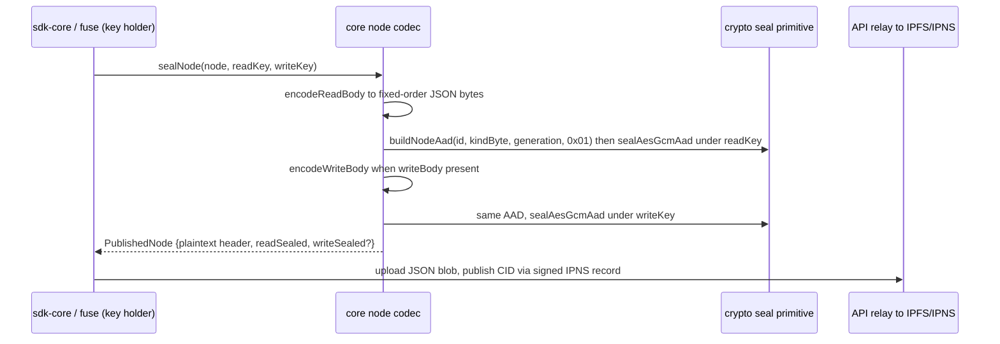

# Core codecs — node/v3 schema, sealed bodies, vault blob, IPNS record codecs

| | |
| --- | --- |
| **Kind** | part |
| **Sources** | `packages/core/src/` (node/types, node/encode, node/decode, node/seal, node/index, vault/blob, vault/types, vault/init, ipns/create-record, ipns/marshal, ipns/sign-record, ipns/derive-name, registry/, bin/, `__tests__/node-codec-vectors.test.ts`, `__tests__/vault-blob-vectors.test.ts`), `crates/core/src/` (node/types.rs, node/encode.rs, node/decode.rs, node/seal.rs, ipns.rs, vault_blob.rs, folder.rs, file.rs, registry.rs, bin.rs, lib.rs), `crates/core/tests/` (node_codec_vectors.rs, node_seal_vectors.rs, node_write_body_vectors.rs), `packages/sdk-core/src/ipns/index.ts` (strict resolve parsing — placement drift, see Known gaps), `crates/api-client/src/ipns.rs` (strict RFC3339 twin), `tests/vectors/node-codec.json`, `tests/vectors/vault-v3-blob.json`, `tests/vectors/crypto/node-aad.json`, `tests/vectors/crypto/uuid-acceptance.json`, `tests/vectors/ipns/verify.json`, `scripts/check-vector-parity.sh`, `docs/METADATA_SCHEMAS.md`, `docs/METADATA_EVOLUTION_PROTOCOL.md`, `docs/adr/0003-aad-bound-node-seal-encoding.md` |
| **Verified against** | cipher-box `27c4abec5` |
| **Status** | draft |

## Purpose and scope

`packages/core` (TypeScript) and `crates/core` (Rust) are deliberate twins: everything that
"knows about CipherBox's data model" — the node/v3 metadata schema and its codecs, the vault
key blob envelope, and IPNS record construction — implemented twice and held byte-identical
by shared JSON golden vectors (KATs). The twin relationship is the load-bearing property:
a web-sealed node must unseal on the desktop and vice versa, so every wire-format decision
is frozen by a committed vector before any consumer ships against it (the "freeze-first"
discipline from phases 61/62).

This spec owns the field tables and codec behavior for: `Node`, `SealedChildRef`,
`PublishedNode`, `NodeContent`/`VersionEntry`, `NodeWriteBody`/`WriteChildRef`,
VaultKeyBlob v3, the content self-seal seam, and the IPNS record
construction/marshaling/strict-validity codecs — plus the CBOR strictness rules, the KAT
lockstep evolution rule, and the known TS↔Rust divergence traps. It does **not** own: the
AEAD/AAD/ECIES primitive parameters themselves ([parts/crypto.md](crypto.md) — this spec
only states how the codecs *compose* `buildNodeAad`/`sealAesGcmAad`), the DB/REST publish
plane ([parts/api.md](api.md)), navigation/rotation behavior over these structures
([parts/sdk-core.md](sdk-core.md), [flows/rotation.md](../flows/rotation.md)), or record
republishing ([flows/republish-liveness.md](../flows/republish-liveness.md)).

## Vocabulary

- **node/v3** — the current (and sole) metadata schema; the literal string `'node/v3'` is
  the schema discriminator on both the plaintext body and the published envelope.
- **`readKey` / `writeKey`** — two independent 32-byte AES-256 keys per node; readKey seals
  the read-body, writeKey seals the write-body. Neither is derived from the other.
- **read plane / write plane** — the two sealed bodies and their child-key chains:
  `SealedChildRef.readKeySealed` (role `0x02`) vs `WriteChildRef.writeKeySealed`
  (role `0x04`).
- **`readSealed` / `writeSealed`** — base64 of `IV(12) ‖ AES-256-GCM ciphertext ‖ tag(16)`
  for each body, both sealed with AAD role `0x01` (the *key* is the plane separator, not
  the role byte).
- **`generation`** — per-node read-key rotation clock, `number`/`u32` in `[0, 2^32-1]`,
  plaintext on the envelope and bound into every AAD. Distinct from `keyEpoch` (TEE) and
  `sequenceNumber` (IPNS, `bigint`/`u64`).
- **`versionFloor`** — owner-vouched IPNS sequence floor on a `SealedChildRef`;
  `bigint` (TS) / `u64` (Rust), decimal string on the wire.
- **kind byte / role byte** — the 1-byte AAD inputs frozen by ADR 0003: kinds
  `0x01 folder / 0x02 file / 0x03 root`, roles `0x01 body / 0x02 child-readkey /
  0x03 content / 0x04 child-writekey`.
- **KAT / golden vector** — a shared JSON fixture under `tests/vectors/` asserted by both
  a Vitest suite and a Rust `#[test]`; the cross-language parity oracle.
- **PRIMARY LOCK / FULL-SEAL LOCK** — the two vector tiers for the node codec:
  IV-independent plaintext body bytes vs deterministic fixed-key/fixed-IV sealed bytes.
- **`ipnsRecord`** — protobuf-marshaled, Ed25519-signed IPNS record; its `data` field is a
  CBOR map (`TTL`, `Value`, `Sequence`, `Validity`, `ValidityType`) covered by the V2
  signature.

## Actors and trust boundaries

These packages are libraries — they run inside a client's trust domain and never talk to
the network themselves. The boundaries they *encode* are:

| Actor | Sees via these codecs | Must never see |
| --- | --- | --- |
| TS clients (web via `@cipherbox/sdk-core`/`sdk`) | plaintext `Node` bodies they hold keys for; raw `fileKey`s, child keys, `ipnsPrivateKey` (writeKey holders only) | nothing withheld — full codec access, key-gated |
| Rust desktop (`crates/fuse`, `crates/sdk`) | same, via the twin codec | — |
| CipherBox API / Postgres | only the `PublishedNode` envelope plaintext (`schema`, `kind`, `id`, `generation`, `aeadVersion`) and opaque sealed base64; marshaled IPNS record bytes | any body plaintext, any raw key |
| IPFS network | the `PublishedNode` JSON blob and the VaultKeyBlob binary blob, by CID | plaintext |

Key-capability boundary (the codecs enforce this structurally, not procedurally):

- Holding a node's **`readKey`** unseals its read-body → the `Node` plaintext, every child's
  `readKeySealed` (recursive read traversal), and for file nodes the raw `fileKey`s.
- Holding a node's **`writeKey`** additionally unseals the write-body → `ipnsPrivateKey`
  (IPNS publish authority) and every child's `writeKeySealed` (recursive write traversal).
- A read-only holder gains no write capability: `writeKeySealed` appears only inside the
  write-body, never in `SealedChildRef` (NODE-03; `packages/core/src/node/types.ts:117-129`).
- The envelope plaintext fields are not confidential but are tamper-evident twice: they are
  AAD inputs (a mutation breaks the GCM tag) and the whole blob's CID is bound by the IPNS
  signature chain.

## Data structures

All node/v3 bodies are **JSON** (D-03, phase 62): `JSON.stringify` → UTF-8 bytes → AEAD.
Field order is fixed on the encode side for byte determinism (the vectors depend on it);
decoding is `JSON.parse` + validation, not byte comparison. camelCase field names on the
wire in both languages (Rust via `#[serde(rename_all = "camelCase")]`).

### `Node` (decrypted, in-memory; the sealed read-body payload)

TS: `packages/core/src/node/types.ts:172-190` (one struct, kind-discriminated).
Rust: `crates/core/src/node/types.rs:165-188` (`enum Node { Folder, File, Root }` — the
kind-invalid states are structurally unrepresentable on the Rust side).

| Field | Type | Required | Notes |
| --- | --- | --- | --- |
| `schema` | `'node/v3'` | yes | version lever; decode fails closed on anything else |
| `kind` | `'folder' \| 'file' \| 'root'` | yes | drives kind byte `0x01/0x02/0x03` |
| `id` | string (hyphenated RFC-4122 UUID) | yes | AAD input (16 raw bytes); canonical-form-only since phase 75 |
| `generation` | number / `u32` | yes | range-checked fail-closed on decode with the **verbatim** `buildNodeAad` predicate (`decode.ts:230-239`) |
| `createdAt`, `modifiedAt` | number / `u64` (Unix ms) | yes | TS decoder defaults absent values to `0` (`Number(obj.createdAt ?? 0)`); Rust requires them — see divergence table |
| `children` | `SealedChildRef[]` | folder/root only | |
| `content` | `NodeContent` | file only | |
| `writeBody` | `NodeWriteBody` | optional | **never** in the read-body JSON; encoded and sealed separately. Rust models it as an explicit parameter to `seal_published_node`, not an enum field (`seal.rs:169-174`) |

Read-body JSON field order (frozen, D-04): `schema`, `kind`, `id`, `generation`,
`children` **or** `content`, `createdAt`, `modifiedAt`
(`packages/core/src/node/encode.ts:93-126`; Rust twin via serde struct field order,
`crates/core/src/node/encode.rs:19-42`).

### `SealedChildRef` (read-chain link, inside the parent's sealed read-body)

Frozen to **exactly five fields** (NODE-03). An interim revision (commit `ba3e0229a`,
phase 68.1) added `size`/`modifiedAt` display mirrors; reverted in 68.2 in favor of the
SDK-side `ResolvedChild` projection (owned by [parts/sdk.md](sdk.md)). Rust enforces the
freeze with `#[serde(deny_unknown_fields)]` (`types.rs:100`); TS tolerates and drops
unknown fields (`decode.ts:151-191`).

| Field | Type | Wire encoding | Notes |
| --- | --- | --- | --- |
| `name` | string | — | display name, plaintext *within* the sealed parent body |
| `ipnsName` | string | — | child's IPNS name |
| `generation` | number / `u32` | — | staleness-witness **mirror**; authoritative value is the child's own envelope (SC#6 invariant 1) |
| `versionFloor` | bigint / `u64` | decimal string | bound at (re)share; bigint is not JSON-serializable |
| `readKeySealed` | string | base64 | child `readKey` sealed under parent `readKey`, AAD role `0x02` with the **child's** id/kind/generation |

### `PublishedNode` (on-wire envelope, IPFS blob addressed via IPNS)

TS `types.ts:203-223`, Rust `types.rs:226-241` (Rust `schema`/`kind` are plain `String`s;
`write_sealed: Option<String>` with `skip_serializing_if`).

| Field | Type | Required | Notes |
| --- | --- | --- | --- |
| `schema` | `'node/v3'` | yes | plaintext |
| `kind` | node kind string | yes | plaintext, AAD input |
| `id` | UUID string | yes | plaintext, AAD input |
| `generation` | number | yes | plaintext, AAD input — honest readers detect staleness without keys |
| `aeadVersion` | `1` | yes | AEAD primitive version tag, always 1 |
| `readSealed` | base64 string | yes | `IV ‖ ct ‖ tag`, sealed under `readKey`, role `0x01` |
| `writeSealed` | base64 string | no | same layout under `writeKey`, same role `0x01`; absent on read-only copies |

TS `unsealNode` gates fail-closed on `schema !== 'node/v3' || aeadVersion !== 1` before
touching ciphertext (`seal.ts:129-131`) — deliberate, since these two fields are plaintext
and *not* AAD-covered. The Rust envelope decoder (`decode_published_node`,
`decode.rs:109-111`) performs no such gate; only the body decoder checks `schema`
(see Known gaps).

### `NodeContent` and `VersionEntry` (file kind, inside the sealed read-body)

TS `types.ts:36-67`; Rust `types.rs:61-91`.

| Field | Type | Wire | Notes |
| --- | --- | --- | --- |
| `cid` | string | CIDv1 | encrypted content blob |
| `fileIv` | string | **base64** of the raw IV | 12 bytes for GCM, 16 for CTR — the KAT pins the base64-decode length (`expected_file_iv_len_bytes`, phase 75; see KAT behavior below) |
| `size` | number / `u64` | — | plaintext byte size |
| `mimeType` | string | — | `NodeContent` only |
| `encryptionMode` | `'GCM' \| 'CTR'` | — | **mandatory**, both structures; CTR drives large-file range reads |
| `fileKey` | `Uint8Array`(32) / `Vec<u8>` | base64 | **raw** AES-256 key — the SC#6 "semantic type change": legacy ECIES-hex-in-parent-folder became raw-bytes-in-own-sealed-body. TS decode asserts exactly 32 bytes (`decode.ts:99,128`); Rust does not (divergence table) |
| `versions` | `VersionEntry[]` | — | newest-first; order is semantic |
| `versionId`, `createdAt` | string, number | — | `VersionEntry` only |

### `NodeWriteBody` and `WriteChildRef` (sealed write-body payload)

TS `types.ts:121-156`; Rust `types.rs:121-156`. Write-body JSON field order (frozen):
`ipnsPrivateKey`, `writeChildren`, then `recipientPins` only when non-empty
(`encode.ts:140-168`, Rust serde order + `skip_serializing_if = "Vec::is_empty"`,
`types.rs:154`).

| Field | Type | Wire | Notes |
| --- | --- | --- | --- |
| `ipnsPrivateKey` | `Uint8Array` / `Vec<u8>` | base64 | raw Ed25519 signing seed for this node's IPNS record; TS decode deliberately does **not** assert 32 bytes ("wire might carry an extended seed", `decode.ts:333-335`) |
| `writeChildren` | `WriteChildRef[]` | — | write chain |
| `writeChildren[].childId` | UUID string | — | child node id |
| `writeChildren[].writeKeySealed` | base64 | — | child `writeKey` under this node's `writeKey`, role `0x04`, child id/kind/generation in AAD |
| `recipientPins` | `string[]` / `Vec<Vec<u8>>` | base64 array, **omitted when empty** | additive optional (phase 80 D-03b); raw secp256k1 pubkey bytes, compared as raw bytes (encoding not normalized). Decode tolerance: TS leaves absent/empty as `undefined` (`decode.ts:363-390`); Rust `#[serde(default)]` yields `vec![]` — both re-encode to the same omitted-key bytes, preserving the frozen empty-pin vector `seal_vectors[0]` |

`NodeWriteBody` intentionally carries **no** `deny_unknown_fields` (forward tolerance,
unlike `SealedChildRef`). Note a twin doc-comment contradiction: the TS comment says pins
are currently the 65-byte uncompressed `0x04` form (`types.ts:141-144`), the Rust comment
says compressed (`types.rs:145-146`), and the golden vector uses 33-byte compressed
samples — the codec itself is encoding-agnostic (opaque bytes).

Pin semantics (folder/root-only issuance, file-grant re-mint exemption D-03g) are owned by
[flows/sharing-grants.md](../flows/sharing-grants.md) / [parts/sdk-core.md](sdk-core.md);
this spec constrains only the wire shape.

### VaultKeyBlob v3 (binary envelope, IPFS blob at the vault-key IPNS name)

TS: `packages/core/src/vault/blob.ts` (`BLOB_V3_VERSION = 0x03`, serialize 33-75,
deserialize 87-128). Rust: `crates/core/src/vault_blob.rs:85-176`.

```text
0x03 | u16_BE(readLen) | ECIES(rootReadKey) | u16_BE(writeLen) | ECIES(rootWriteKey)
```

| Offset | Size | Field |
| --- | --- | --- |
| 0 | 1 | version byte `0x03` |
| 1 | 2 | `readLen`, big-endian u16 (each ECIES segment ≈ 129 bytes) |
| 3 | readLen | `encryptedRootReadKey` |
| 3+readLen | 2 | `writeLen`, big-endian u16 |
| 3+readLen+2 | writeLen | `encryptedRootWriteKey` |

Both segments must be non-empty and ≤ `0xffff` bytes (serialize throws otherwise). Both
deserializers return **owned copies** (`blob.slice`/`to_vec`), never views, so later
zeroization of the source blob cannot corrupt the extracted keys (D-09;
`blob.ts:109-112`, `vault_blob.rs:135-140`). Neither deserializer rejects trailing bytes
after the write segment (both check `<`, not `!==` — see Known gaps).
`rootReadKey`/`rootWriteKey` are independently generated 32-byte AES keys, ECIES-wrapped
under the user's secp256k1 `publicKey` (`vault/init.ts encryptVaultKeys`; ECIES parameters
in [parts/crypto.md](crypto.md)). Write discipline: written once at vault init; the blob
and CID are immutable thereafter (the TEE republishes the IPNS record without touching the
blob — [flows/republish-liveness.md](../flows/republish-liveness.md)). v2 (`0x02`,
single `rootFolderKey`) was hard-cut-deleted from TS in phase 62 — but **still exists in
Rust** (Known gaps).

### IPNS record (`IpnsRecord` / `IPNSRecord`)

TS delegates to the `ipns` npm package (`^10.1.3`): `createIpnsRecord`
(`packages/core/src/ipns/create-record.ts`) wraps `createIPNSRecord` with
`v1Compatible: true`; `marshalIpnsRecord`/`unmarshalIpnsRecord` wrap the package's
protobuf codec (`marshal.ts`). Rust hand-rolls the identical wire format
(`crates/core/src/ipns.rs`):

| Protobuf field | Type | Content |
| --- | --- | --- |
| 1 | bytes | `Value` — `/ipfs/<cid>` UTF-8 |
| 2 | bytes | `signatureV1` — Ed25519 over `value ‖ validity ‖ 0x00` (varint ValidityType) |
| 3 | varint | `ValidityType` (0 = EOL) |
| 4 | bytes | `Validity` — RFC3339 with nanosecond precision, e.g. `2026-02-08T23:31:12.138000000Z` |
| 5 | varint | `Sequence` |
| 6 | varint | `TTL` in nanoseconds |
| 7 | bytes | `pubKey` — libp2p protobuf-wrapped Ed25519 key (omitted by the TS package for identity keys) |
| 8 | bytes | `signatureV2` — Ed25519 over `"ipns-signature:" ‖ data` |
| 9 | bytes | `data` — CBOR map |

The CBOR `data` map field order is frozen to match js-ipns: `TTL`, `Value`, `Sequence`,
`Validity`, `ValidityType` (`ipns.rs build_cbor_data:200-232`; the vector generator
`scripts/gen-ipns-verify-vectors.ts` mirrors it). `Value`/`Validity` are CBOR byte
strings; `Sequence`/`TTL`/`ValidityType` are CBOR integers.

**TTL is never set explicitly by any producer.** TS passes no `ttlNs` option
(`create-record.ts:67`), so every record carries the js-ipns default of 5 minutes
(`DEFAULT_TTL_NS`); Rust hardcodes the same `300_000_000_000` ns with no parameter to
override (`ipns.rs:25-27`). This 5-minute TTL is the resolver/gateway cache bound —
distinct from the `Validity` lifetime (default 24 h client-side, `create-record.ts:14`;
48 h on TEE renewal) whose renewal story is
[flows/republish-liveness.md](../flows/republish-liveness.md).

## Interface

`@cipherbox/core` public surface (`packages/core/src/index.ts`):

| Capability | Exports |
| --- | --- |
| Node body codec | `encodeReadBody`, `encodeWriteBody`, `decodeReadBody`, `decodeWriteBody`, `validateNode`, `serializeContentForWire`, `deserializeContentFromWire` |
| Node seal/unseal | `sealNode`, `unsealNode`, `sealChildReadKey`, `unsealChildReadKey`, `sealChildWriteKey`, `unsealChildWriteKey`, `sealContent`, `unsealContent` |
| Vault blob + init | `serializeVaultBlobV3`, `deserializeVaultBlobV3`, `BLOB_V3_VERSION`, `initializeVault`, `encryptVaultKeys`, `decryptVaultKeys`, vault settings |
| IPNS records | `createIpnsRecord`, `marshalIpnsRecord`, `unmarshalIpnsRecord`, `signIpnsData`, `IPNS_SIGNATURE_PREFIX`, `deriveIpnsName` (re-export from crypto) |
| Device registry (TS-only runtime) | `encryptRegistry`, `decryptRegistry`, `validateDeviceRegistry`, registry IPNS derivation |
| Recycle bin | `encryptBinMetadata`, `decryptBinMetadata`, `validateBinMetadata` |

`cipherbox-core` public surface (`crates/core/src/lib.rs`):

| Capability | Exports |
| --- | --- |
| Node codec + seal | `node::{encode_node, decode_node, encode_write_body, decode_write_body, encode_published_node, decode_published_node}`, `node::seal::{seal_node, unseal_node, seal_child_read_key, unseal_child_read_key, seal_child_write_key, unseal_child_write_key, seal_published_node}` |
| Vault blob | `serialize_vault_blob_v3`, `deserialize_vault_blob_v3`, **plus retained legacy** `serialize_vault_blob_v2`, `deserialize_vault_blob_v2`, `detect_blob_version` |
| IPNS records | `create_ipns_record`, `marshal_ipns_record`, `decode_ipns_cbor_data`, `decode_ipns_cbor_validity` |
| Legacy / auxiliary | `folder::VersionEntry` (legacy ECIES-hex row, see Known gaps), `bin::*`, `registry::*`, `vault_settings::*` |

The DeviceRegistry, recycle-bin, and vault-settings schemas are documented in
`docs/METADATA_SCHEMAS.md` §12-13 and are not re-stated here; they are ECIES-blob codecs
outside the node/v3 seal system.

## Dependencies

- **`@cipherbox/crypto` / `cipherbox-crypto`** — the only crypto the node codecs touch:
  `buildNodeAad`/`build_node_aad` + `sealAesGcmAad`/`seal_aes_gcm_aad` (never
  reimplemented — composition is a standing rule), base64 helpers, `CryptoError`, ECIES
  for the vault blob keys, Ed25519 sign/verify and `derive_ipns_name`/
  `encode_libp2p_public_key` for records. Parameters: [parts/crypto.md](crypto.md).
- **`ipns` npm (`^10.1.3`) + `@libp2p/crypto` + `@noble/ed25519`** — TS record
  creation/marshaling; the Rust twin exists precisely to match this package's bytes.
- **`ciborium`, `base64`, `serde`/`serde_json`, `thiserror`** — Rust CBOR/JSON/wire.
- **`cborg`** — the TS strict CBOR decoder, used by the *consumer-side* verification path
  in `packages/sdk-core` (see Known gaps on placement).

## Behaviors

### Encode and decode a read-body

- **Trigger** — any node create/update/load in sdk-core, sdk, fuse.
- **Steps**
  1. Encode: build the fixed-order JSON object (kind-specific branch), converting
     `fileKey`s to base64 (`serializeContentForWire`, `encode.ts:35-55`) and
     `versionFloor` to a decimal string (`encode.ts:67-75`); `TextEncoder` the JSON
     string. A file node without `content` throws (`encode.ts:99-101`). Rust:
     `encode_node` serializes borrowed wire structs with identical field order
     (`encode.rs:49-100`).
  2. Decode: `JSON.parse` then `validateNode` (`decode.ts:211-289`) — fail-closed
     `CryptoError('...', 'DECRYPTION_FAILED')` on wrong `schema`, unknown `kind`, missing
     `id`, out-of-range `generation` (predicate copied verbatim from `buildNodeAad`),
     malformed children/content. Rust: `decode_node` peeks `kind`, routes to a
     `deny_unknown_fields` wire struct, checks `schema == "node/v3"`, returns typed
     `NodeError` — never panics on untrusted bytes (`decode.rs:55-103`).
- **Postconditions** — TS returns a `Node` with `Uint8Array`/`bigint` fields
  reconstructed; Rust returns the `Node` enum variant. Neither zeroes any buffer — the
  caller is the terminal owner of all returned key material (D-09).
- **Failure modes** — every structural failure is a thrown/returned typed error before
  any partial state; error strings never include key material.

### Seal and unseal a `PublishedNode`



- **Steps (TS `sealNode`, `seal.ts:78-108`; Rust `seal_published_node`,
  `seal.rs:169-209`)**
  1. Map kind → kind byte (`kindByte`, fail-closed on unknown).
  2. Seal the read-body under `readKey` with `buildNodeAad(id, kind, generation, 0x01)`;
     a fresh random 12-byte IV is minted inside the primitive per call.
  3. If a write-body exists (TS: `node.writeBody`; Rust: explicit `Option<&NodeWriteBody>`
    parameter — the enum deliberately has no field), seal it under `writeKey` with the
    **same AAD** — the two bodies are distinguished by key alone.
  4. Emit the envelope with `aeadVersion: 1`.
- **Unseal (TS `unsealNode`, `seal.ts:121-151`)**
  1. Reject `schema !== 'node/v3'` or `aeadVersion !== 1` before any crypto.
  2. Rebuild the AAD from the envelope's plaintext fields; unseal + `decodeReadBody`.
     Any tamper of `id`/`kind`/`generation` — or transplant of a blob to another node —
     fails the GCM tag.
  3. If `writeSealed` present *and* the caller supplied `writeKey`, unseal and attach the
     write-body. Rust splits this into `unseal_node` (byte-level) + `decode_write_body`.
- **Failure modes** — wrong key, wrong AAD input, or read-key-against-write-body all
  surface as an AEAD auth failure (locked by the Rust transplant test
  `aad_transplant_read_key_cannot_open_write_sealed`, `seal.rs:297-322`).

### Child key wrap — the two chains

- `sealChildReadKey`/`unsealChildReadKey` (role `0x02`; `seal.ts:169-206`,
  `seal.rs:81-117`): child `readKey` under parent `readKey`, AAD carrying the **child's**
  `id`, kind, and generation — so a sealed key ref only opens against the correct child
  identity at the correct generation (rotation invalidates stale refs cryptographically,
  locked by the generation-mismatch KAT tests).
- `sealChildWriteKey`/`unsealChildWriteKey` (role `0x04`; `seal.ts:224-261`,
  `seal.rs:121-154`): the write-chain twin, child `writeKey` under parent `writeKey`.
- The Rust `unseal_child_read_key` is the symmetric-unwrap primitive that replaced the
  FUSE ECIES fan-out (phase 69) — ECIES never appears in node metadata.

### Content self-seal (role `0x03`) — built, vector-locked, dormant

`sealContent`/`unsealContent` (`seal.ts:277-313`) seal a `NodeContent` standalone under
the file node's own `readKey` with role `0x03` and the file's id/generation in the AAD.
As built, the **live pipeline does not use them**: file content travels *inside* the
read-body (role `0x01` seal) — `encodeReadBody` embeds the serialized content, and the
sdk-core file path reads `node.content` off `unsealNode`'s result
(`packages/sdk-core/src/file/index.ts:349-372`). Repo-wide, the only callers are
`packages/core`'s own tests (`node-codec-vectors.test.ts:460-520`). The Rust twin
deliberately omits content sealing (`seal.rs:14-15` — "0x03 content is out of scope").
The role byte remains reserved and KAT-covered at the AAD level
(`tests/vectors/crypto/node-aad.json`, asserted by `crates/crypto` and
`packages/crypto` suites). See Known gaps for the METADATA_SCHEMAS drift this causes.

### Vault blob v3 serialize/deserialize

1. Serialize: validate both ECIES segments non-empty and ≤ `0xffff`, emit the
   length-prefixed layout (`blob.ts:33-75`, `vault_blob.rs:93-133`).
2. Deserialize: check ≥ 5 bytes, version byte `0x03`, non-zero lengths, and bounds for
   both segments; return owned copies. Fail-closed errors, never panics.
3. TS is v3-only (`detectBlobVersion`/v2/v1 deleted in phase 62); Rust retains the v2
   codec additively (Known gaps).

### IPNS record creation and marshal (twin implementations)

- **TS** (`create-record.ts:31-85`): validate 32-byte Ed25519 seed and
  `sequenceNumber >= 0n`; build the 64-byte libp2p key (`seed ‖ publicKey`), convert via
  `privateKeyFromRaw`, **zero the intermediate buffer immediately** (including on the
  error path — the one place this codec zeroes anything, because it exclusively owns that
  copy); call `createIPNSRecord(value, seq, lifetimeMs, { v1Compatible: true })` with
  `lifetimeMs` defaulting to 24 h. CBOR/signature layout is the npm package's.
- **Rust** (`ipns.rs:307-339`): derive the public key, format
  `Validity = now + lifetime_ms` as nanosecond-precision RFC3339
  (`format_validity_timestamp:237-256`, Hinnant `civil_from_days:260-272`), build the
  CBOR data map, compute V2 (`"ipns-signature:" ‖ cbor`) and V1
  (`value ‖ validity ‖ 0x00`) signatures, set `ttl = DEFAULT_TTL_NS`.
  `marshal_ipns_record` (`ipns.rs:353-371`) hand-encodes the protobuf fields 1-9 with
  LEB128 varints.
- **Constraint on other planes**: producers embed sequence 1 on first publish and the
  API's CAS plane owns forward-sequencing — this codec only signs what it is told
  ([parts/api.md](api.md), [flows/republish-liveness.md](../flows/republish-liveness.md)).

### Strict resolve-side parsing (the validation codec twin)

The verification twin is split across packages (placement drift — Known gaps): TS inlined
in `packages/sdk-core/src/ipns/index.ts` (`resolveIpnsRecord`, lines 355-475), Rust in
`crates/core/src/ipns.rs` (CBOR decode helpers) + `crates/api-client/src/ipns.rs`
(`bind_verified` + `parse_rfc3339_to_unix_secs`). Both must reach identical verdicts —
locked by the 12-case `tests/vectors/ipns/verify.json` suite (phase 75 raised it from 8).

Steps, identical order both sides:

1. Verify the Ed25519 `signatureV2` over `"ipns-signature:" ‖ data`, and that the pubKey
   derives to the requested `ipnsName` (key-substitution guard).
2. Decode the CBOR `data` **rejecting duplicate map keys**: TS
   `cborDecode(data, { rejectDuplicateMapKeys: true })` (`index.ts:391-393`); Rust tracks
   a `seen_keys` set over **text** keys and errors on any repeat, including ignored keys
   like `TTL` (`ipns.rs:89-99, 161-171`) — deliberate parser-differential hardening (a
   `ValidityType:[1,0]` dup must not decode last-wins on one side and reject on the
   other). Residual asymmetries in this rule are in Known gaps.
3. Bind the signed `Value` to the response CID (`/ipfs/<cid>` exact match) and the signed
   `Sequence` to the response sequence (strict equality, no first-publish skew disjunct —
   removed when first publishes started embedding sequence 1).
4. Require `ValidityType` present and `== 0` (EOL) before treating `Validity` as an
   expiry (`index.ts:443-455`; Rust `decode_ipns_cbor_validity` reports the value, the
   `== 0` gate lives in `bind_verified`).
5. Parse `Validity` with the **strict hand-rolled RFC3339 parser** — not `new Date()` —
   mirrored branch-for-branch: fixed-width digit fields (rejecting a leading sign the
   Rust `parse::<T>()` would otherwise accept — `parse_fixed_digits`,
   `api-client/ipns.rs:207-208`; TS `isFixedDigits` with an explicit **length guard**
   because JS `/^[0-9]+$/` `$` matches before a trailing newline —
   `sdk-core/ipns/index.ts:298-301`), exactly 3 date and 3 time components, non-empty
   all-digit optional fraction, leap-aware impossible-date rejection (2026-02-31 must not
   roll into March — that would *extend* apparent validity), Hinnant inverse for Unix
   seconds (`index.ts:195-292`, `api-client/ipns.rs:221-`).
6. Reject when `expiry < now − 300 s` (5-minute skew buffer, both sides;
   `index.ts:466-470`, `api-client/ipns.rs:151-157`).

Failure at any step is a thrown error / typed `Err` — the record is discarded, never
partially trusted.

### KAT lockstep evolution (how the twins stay twins)

- **Vector inventory** owned by this part: `tests/vectors/node-codec.json` — 4
  `body_vectors` (folder, file/GCM, file/CTR, root — PRIMARY LOCK, IV-independent
  `expected_read_body_hex`) + 2 `seal_vectors` (FULL-SEAL LOCK: fixed key + fixed IV
  `000102030405060708090a0b` → exact `readSealed`/`writeSealed` base64, one with empty
  and one with populated `recipientPins`); `tests/vectors/vault-v3-blob.json`;
  `tests/vectors/crypto/node-aad.json` (AAD-only KAT, all four roles);
  `tests/vectors/crypto/uuid-acceptance.json` (canonical-form accept/reject boundary);
  `tests/vectors/ipns/verify.json` (12 signed-record verdict cases, generated only by
  `scripts/gen-ipns-verify-vectors.ts`, never hand-edited).
- **Asserted by**: TS `packages/core/src/__tests__/node-codec-vectors.test.ts` (body hex,
  fileIv **base64-decode-and-length** lock, full-seal reconstruction via
  `encryptAesGcmAad(fixedIv)`, round-trips, AAD-transplant rejection) and
  `vault-blob-vectors.test.ts`; Rust `crates/core/tests/node_codec_vectors.rs`,
  `node_seal_vectors.rs`, `node_write_body_vectors.rs`, and the in-module
  `vault_blob.rs:317` KAT. The `fileIv` lock exists because the pre-75 KAT only
  round-tripped the field as an opaque string — a hex-vs-base64 divergence (the actual
  phase 69 desktop incident) passed silently; the samples are now deliberately valid in
  exactly one encoding and the tests decode them.
- **Lockstep rules** (ADR 0003 + METADATA_EVOLUTION_PROTOCOL §5/§6.4): every new role
  byte extends both `node-aad.json` and `node-codec.json` before merge; any AAD layout
  change bumps the domain separator `"cipherbox/node-seal/v1"`; any breaking body change
  bumps `schema` to `'node/v4'` (expensive by design — the string lives inside sealed
  bodies, so a bump forces re-sealing); additive optional fields keep `'node/v3'` with
  omit-when-empty + tolerant decode on both sides (the `recipientPins` precedent);
  vectors with real crypto material are regenerated by the committed generator, never
  hand-edited. Vector-count assertions are hard-coded on both sides as
  anti-vacuous-pass guards and must be bumped with the fixture.
- **CI**: the `vector-parity` job runs the crypto cross-language suite +
  `scripts/check-vector-parity.sh` (a file-existence/JSON-validity meta-check); the node
  and IPNS vector tests run in the full workspace `cargo test` and per-package Vitest
  jobs — `vector-parity` alone does not cover them.

## Invariants

1. **INV-1** — The read-body wire format MUST be the fixed-field-order JSON
   (`schema`, `kind`, `id`, `generation`, `children`|`content`, `createdAt`,
   `modifiedAt`), byte-identical across TS and Rust, as locked by
   `tests/vectors/node-codec.json` `body_vectors`.
2. **INV-2** — The write-body wire format MUST be `ipnsPrivateKey`, `writeChildren`, then
   `recipientPins` emitted only when non-empty; an absent/empty pin list MUST decode
   without error and MUST re-encode to the identical (omitted-key) bytes.
3. **INV-3** — Both sealed bodies MUST use AAD
   `buildNodeAad(id, kindByte, generation, role 0x01)`; the read/write separation is the
   key (`readKey` vs `writeKey`), never the role byte. Child read keys MUST use role
   `0x02` and child write keys role `0x04`, each with the **child's** id/kind/generation.
4. **INV-4** — `writeKeySealed` MUST NEVER appear in `SealedChildRef`; `SealedChildRef`
   is frozen to exactly `{name, ipnsName, generation, versionFloor, readKeySealed}`. A
   `readKey` holder MUST gain no write capability from any read-plane structure.
5. **INV-5** — Body decoders MUST fail closed on `schema !== 'node/v3'`; the TS envelope
   unseal MUST additionally reject `aeadVersion !== 1` before any decryption.
6. **INV-6** — `generation` MUST be validated as an integer in `[0, 0xffffffff]` at
   decode with the same predicate the AAD builder uses; decode and AAD-binding MUST never
   disagree on validity.
7. **INV-7** — `fileKey` (content and every version entry) MUST be a raw 32-byte key
   inside the sealed body, base64 on the JSON wire; ECIES MUST NOT be used for any key
   inside node metadata (ECIES is reserved for the vault-blob root wrap).
8. **INV-8** — `encryptionMode` MUST be carried explicitly (`'GCM'` or `'CTR'`) on
   `NodeContent` and every `VersionEntry`; `versions` order (newest first) is semantic
   and MUST be preserved by codecs.
9. **INV-9** — `versionFloor` MUST serialize as a decimal string on the wire and
   reconstruct as `bigint`/`u64`.
10. **INV-10** — The codecs MUST NOT zero caller-supplied or returned buffers (terminal-
    owner rule D-09) and MUST NOT log or embed key material in errors. The single
    exception: `createIpnsRecord`'s intermediate 64-byte libp2p key copy, which the
    function exclusively owns, MUST be zeroed on every path.
11. **INV-11** — The VaultKeyBlob v3 layout MUST be
    `0x03 | u16_BE(readLen) | ECIES(readKey) | u16_BE(writeLen) | ECIES(writeKey)` with
    both segments non-empty; deserializers MUST return owned copies and fail closed on
    version/truncation/zero-length.
12. **INV-12** — Every IPNS record produced MUST carry the CBOR data map in the order
    `TTL, Value, Sequence, Validity, ValidityType` with `ValidityType = 0`, a V2
    signature over `"ipns-signature:" ‖ data`, and (for v1 compatibility) a V1 signature
    over `value ‖ validity ‖ 0x00`. TTL is always 300 s.
13. **INV-13** — Strict resolve verification MUST reject duplicate CBOR map keys, MUST
    bind embedded `Value` and `Sequence` to the response values, MUST require
    `ValidityType == 0` before honoring `Validity`, MUST parse `Validity` with the strict
    fixed-width RFC3339 parser (never `new Date()` / a date library), and MUST apply
    exactly the 300 s skew buffer — with identical verdicts in TS and Rust on every
    committed verify vector.
14. **INV-14** — Every new role byte, AAD layout change, or body wire change MUST land
    with its cross-language vector in the same merge; a vector regenerated by hand (not
    by the committed generator) MUST NOT be committed.
15. **INV-15** — A `node/v3` breaking change MUST bump the `schema` literal; an AAD
    layout change MUST bump the `"cipherbox/node-seal/v1"` domain string.

## Known gaps and quirks

- **Decode-strictness divergences between the twins.** The wire *encoders* are
  byte-locked, but the *decoders* accept different supersets. None is exploitable
  without holding the sealing key (all these fields live inside authenticated bodies),
  but a reimplementation must know the as-built asymmetries:

  | Input | TS verdict | Rust verdict | Evidence |
  | --- | --- | --- | --- |
  | Unknown extra field in read-body / `SealedChildRef` | accepted, dropped | **rejected** (`deny_unknown_fields`) | `decode.ts:211-289` vs `decode.rs:19,32`, `types.rs:100` |
  | `content.encryptionMode` not `GCM`/`CTR` | rejected | **accepted** (plain `String`, unvalidated) | `decode.ts:79-84` vs `types.rs:69-71` |
  | `fileKey` not exactly 32 bytes | rejected | **accepted** (any length `Vec<u8>`) | `decode.ts:99,128` vs `types.rs:72-73` |
  | Missing `createdAt`/`modifiedAt` | accepted, defaults `0` | rejected (required `u64`) | `decode.ts:258,284` vs `decode.rs:20-42` |
  | JSON float-typed integer (e.g. `generation: 1.0`) | accepted (`Number.isInteger(1.0)` true) | rejected (serde `u32`/`u64` refuse floats) | `decode.ts:230-239` |
  | `versionFloor` `"0x10"`, `""`, whitespace-padded | accepted (`BigInt(String(...))` parses prefixes, `""` → `0n`) | rejected (`parse::<u64>()` decimal only) | `decode.ts:188` vs `types.rs:296-307` |
  | `versionFloor` ≥ 2^64 | accepted (unbounded bigint) | rejected (`u64`) | same |
  | `recipientPins` entry with invalid base64 | accepted (opaque string, never decoded) | rejected (STANDARD-alphabet decode at deserialize) | `decode.ts:378-386` vs `types.rs:269-292` |

  The Rust `deny_unknown_fields` on the read-body directly contradicts
  METADATA_EVOLUTION_PROTOCOL §2/§3.1's blanket "validators must not reject unknown
  fields" — an additive optional field on `Node` or `SealedChildRef` would fail-closed on
  existing desktop builds. Only `NodeWriteBody` actually honors the additive-tolerance
  rule today (which is why `recipientPins` could ship without a schema bump).
- **Role `0x03` content self-seal is a dormant seam.** Exported, unit-tested, AAD-KAT-
  covered — zero production callers in TS, deliberately unimplemented in Rust; live
  content rides inside the role-`0x01` read-body. `docs/METADATA_SCHEMAS.md` §6 describes
  the self-seal as the live path ("sealed separately... embedded as the `readSealed`
  field") — drift; the as-built truth is plaintext-content-inside-read-body.
- **Rust still ships the retired v2 vault-blob codec.** `serialize_vault_blob_v2`,
  `deserialize_vault_blob_v2`, `detect_blob_version` remain public in
  `crates/core/src/vault_blob.rs:1-70` after TS's phase-62 hard-cut deleted them. Dead
  compatibility surface for a format greenfield-wiped from existence.
- **Two different `VersionEntry` types coexist in `crates/core`.** The node/v3 one
  (`node/types.rs:63-74`, raw base64 `fileKey`, `createdAt`) and a legacy one
  (`folder.rs:17-30`, ECIES-hex `fileKeyEncrypted`, `timestamp`) — the legacy row is
  still re-exported at the crate root and consumed by the FUSE bin/versioning helpers.
  Same name, incompatible wire shapes; which one you get depends on the import path.
- **Envelope gate asymmetry.** Rust `decode_published_node` performs no
  `schema`/`aead_version` check (both are plain `String`/`u8` fields); TS `unsealNode`
  fail-closes on both. Rust relies on the body decoder's `schema` check after unseal.
- **Trailing-bytes tolerance in the vault blob.** Both v3 deserializers bound-check with
  `<`, so a blob with trailing garbage after the write segment parses successfully on
  both sides (symmetric, therefore not a parity break — but not fail-closed either).
- **Residual CBOR strictness asymmetries in the verify twin.** (a) cborg's
  `rejectDuplicateMapKeys` is all-or-nothing over every key type, while Rust tracks only
  *text* keys and `continue`s past non-text keys before the seen-set insert
  (`ipns.rs:91-99`) — a record with duplicate non-text map keys rejects on TS and passes
  Rust. (b) A CBOR float-encoded integral `Sequence` (e.g. `1.0`) decodes to a JS
  `number` and passes TS's `BigInt(embeddedSeq)` binding (`sdk-core/ipns/index.ts:416-
  422`) while Rust's `CborValue::Integer`-only arm rejects it (`ipns.rs:115-119`). Both
  require a signed record from the legitimate key holder, so they are parser-differential
  hardening gaps, not authentication bypasses. Per project experience, locking these
  requires hand-crafted CBOR bytes — the generator only emits well-formed maps.
- **Strict-parse placement drift.** The "core owns the codecs" story holds for record
  *construction*, but the strict validation codec is split: TS strict parsing lives in
  `packages/sdk-core/src/ipns/index.ts` (inlined in `resolveIpnsRecord`), not
  `packages/core/src/ipns/`; Rust splits it between `crates/core/src/ipns.rs` (CBOR
  helpers) and `crates/api-client/src/ipns.rs` (`bind_verified`, RFC3339). The TS core
  package's own `parse-record` helper (`packages/crypto/src/ipns/parse-record.ts`) still
  parses validity with lenient `new Date(record.validity)` — acceptable there because its
  consumer (the TEE renewal path) only compares parsed dates for strictly-later EOL, but
  it is a second, looser validity parser living outside the hardened pair.
- **Dead legacy vectors pinned by the meta-check.** `tests/vectors/core/*`
  (`folder-metadata.json`, `vault-blob.json` (v2), `ipns-record.json`,
  `bin-metadata.json`) have no code consumers post-cutover, yet
  `scripts/check-vector-parity.sh:15-24` still requires them to exist — deleting the dead
  fixtures would fail CI until the script list is updated.
- **`docs/METADATA_SCHEMAS.md` drift (beyond §6)**: §12 claims DeviceRegistry has "No
  Rust equivalent" while `crates/core/src/registry.rs` exists and is re-exported; §14's
  parity table still marks the Rust Node twin as pending "Phase 69" (it shipped);
  the `sealContent` doc comment in `seal.ts:283` mentions a `versionFloor` conversion
  that content does not contain.
- **TS `Node` is one struct, Rust is an enum.** TS can represent a `folder` node carrying
  `content` (the type has all optional kind-specific fields); Rust cannot. TS relies on
  `validateNode`/`encodeReadBody` branching to keep such values off the wire.

## Rewrite notes

- The single-struct-with-optionals TS `Node` vs the Rust enum shows which shape is right:
  the enum. Every TS decode branch re-derives what the Rust type system states once. A
  rewrite should make invalid kind/field combinations unrepresentable in both languages
  (TS discriminated unions per kind, not one bag of optionals).
- Decoder strictness was never specified, only encoder bytes — hence the eight-row
  divergence table above. The KAT discipline locks the *happy path* byte-for-byte but
  says nothing about rejection behavior; phase 75 had to retrofit verdict-vectors for the
  IPNS verify path one gap at a time. A rewrite should treat the **acceptance domain**
  (including malformed-input verdicts) as part of the frozen contract from day one:
  reject-vectors alongside accept-vectors for every codec, and one shared strictness
  policy (deny unknown fields or don't — currently it differs per structure per
  language).
- JSON-with-fixed-field-order is a fragile determinism contract: it works only because
  both serializers happen to emit insertion/struct order, and it forced hand-rolled
  string-typed workarounds (`versionFloor` decimal strings, base64-in-JSON keys, the
  `BigInt(String(...))` prefix-parsing trap). A canonical binary encoding (deterministic
  CBOR) would make determinism a property, not a convention — the IPNS record data field
  already is CBOR.
- The role-byte space is half-live: `0x03` is reserved, KAT-locked, and dead in
  production. Either wire the content self-seal (it exists to allow content re-key
  without re-sealing the whole body) or drop it; keeping a sealed-but-unreachable seam
  invites a consumer to adopt it on one side only.
- The verification codec should live where the construction codec lives. Today the
  strict parsers sit two packages away from the record builders they mirror
  (sdk-core/api-client vs core), plus a third lenient parser in crypto — three validity
  parsers with two strictness levels. One strict parser per language, exported from the
  codec package, consumed everywhere.
- Twin-maintenance is the standing tax of the TS/Rust split: every schema touch is two
  implementations + vectors + two hard-coded count guards. The parts that hurt least are
  the ones that are pure byte layouts (vault blob); the parts that hurt most are
  JSON-shape tolerances. A rewrite should minimize the twin surface — share vectors *and*
  share a single schema definition (generated types, or a single Rust core compiled to
  WASM for the web) rather than hand-mirroring.
