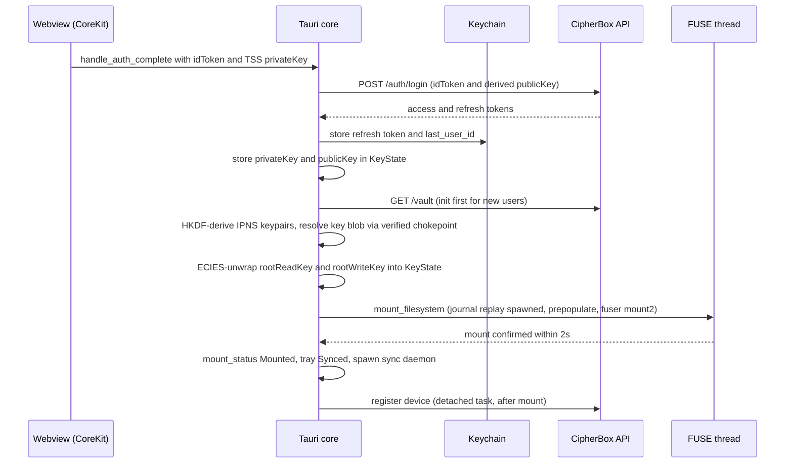

# Desktop app and FUSE virtual filesystem

| | |
| --- | --- |
| **Kind** | part |
| **Sources** | `apps/desktop/src-tauri/src/` (main, state, keychain, updater, commands/{auth,oauth,sync,debug,vault,util}, fuse/{mod,prepopulate,windows}, registry, sync, tray), `apps/desktop/src-tauri/{tauri.conf.json,Cargo.toml,capabilities/default.json}`, `apps/desktop/src-tauri/vendor/fuser/`, `apps/desktop/src/{main.ts,auth.ts}`, `crates/fuse/src/` (all modules), `crates/sdk/src/{queue.rs,sync.rs,state.rs}` (referenced), `docs/FILESYSTEM_SPECIFICATION.md`, `docs/DEPLOYMENT.md`, `.planning/phases/80-rotation-write-plane-and-re-mint-durability/80-CONTEXT.md`, `.planning/security/REVIEW-2026-07-11-phase74-rotation.md`, `.planning/security/REVIEW-2026-07-12-phase76.md`, `.planning/codebase/CONCERNS.md` |
| **Verified against** | cipher-box `27c4abec5` |
| **Status** | draft |

## Purpose and scope

The desktop client is a Tauri menu-bar app that logs a user in via Web3Auth, loads and
decrypts the vault, and mounts the vault as a real filesystem at `~/CipherBox`
(`crates/fuse/src/fs.rs:800-804`) so Finder/Explorer/terminals operate on encrypted cloud
storage transparently. It is two components: the Tauri shell (`apps/desktop` — auth,
vault load, mount lifecycle, tray, sync daemon, updater) and the virtual filesystem
(`crates/fuse` — inode model, caches, read/write paths, write journal + replay, and the
scope-exit rotation gate).

This spec covers the Tauri command surface at capability level, the mount backends and
platform matrix, and FUSE internals as behavior. The Rust rotation *engine* the FUSE
layer drives lives in `crates/sdk` and is owned by [../parts/sdk.md](../parts/sdk.md);
the end-to-end rotation story is [../flows/rotation.md](../flows/rotation.md). Node
codecs and the read/write-plane structures are owned by
[../parts/core-codecs.md](../parts/core-codecs.md); the metadata sync discipline by
[../flows/metadata-sync.md](../flows/metadata-sync.md); content envelope and versioning
by [../flows/content-storage.md](../flows/content-storage.md); login/key-derivation by
[../flows/auth.md](../flows/auth.md).

## Vocabulary

- **Mount point** — `~/CipherBox`, created `0o700`; the vault appears here as a volume
  named `CipherBox`.
- **`InodeTable`** — the in-memory map from FUSE inode numbers to CipherBox nodes; the
  single local source of truth for names, keys, and structure while mounted.
- **`node_id`** — a node's stable UUID identity (`PublishedNode.id`), the write-plane
  child-ref key (`WriteChildRef.child_id`) and seal-AAD input. Distinct from `ipnsName`,
  the read-plane key. The two are never interchangeable.
- **Write journal** — per-entry JSON files (plus ciphertext `.bin` sidecars) under
  `<data_local_dir>/cipherbox/cb-journal` (`apps/desktop/src-tauri/src/fuse/mod.rs:82-91`)
  that make mkdir and file uploads crash-durable before the kernel is acked.
- **Replay** — the on-mount pass that re-drives journaled operations against current
  remote state (`crates/fuse/src/replay.rs`).
- **Prepopulate** — eager population of root + first-level folders at mount time; deeper
  levels load lazily on `readdir`/`lookup`.
- **Publish debounce** — local mutations mark folders dirty and republish after 1.5 s of
  quiet (10 s safety valve), serialized per `ipnsName` by the `PublishCoordinator`.
- **Grant scope** — the subtree rooted at a folder the owner has actively shared;
  tracked locally via the `SentSharesCache`.
- **Scope-exit rotation** — the fail-closed read-key rotation triggered when a rename or
  delete moves content out of a granted scope (`crates/fuse/src/write_ops/grant_scope.rs`).
- **`mutated_folders`** — the set of inodes with unpublished local changes; a background
  metadata refresh must not structurally overwrite these.
- **FUSE-T / fuser / WinFsp** — the three mount backends: macOS userspace FUSE-T over
  its SMB backend, Linux kernel FUSE via a vendored `fuser` 0.16, Windows WinFsp.
- **`KeyState`** — the `crates/sdk` struct holding all live key material for the session
  (`crates/sdk/src/state.rs:37-85`).
- **Dev-key mode** — debug-build `--dev-key` flag that swaps Web3Auth for the API's
  `/auth/test-login`, enabling headless agent/E2E use.

## Actors and trust boundaries

| Actor | Sees | Must never see |
| --- | --- | --- |
| OS kernel + local processes (via the mount) | full plaintext file content and names — the mount is the trust terminus | — |
| Tauri Rust core | user `privateKey` (32 B), `publicKey`, `rootReadKey`/`rootWriteKey`, every per-node read/write key + IPNS signing seed, plaintext content | — (it is the client) |
| Webview frontend (Web3Auth CoreKit) | OAuth idToken, TSS-exported private key transiently during the `handle_auth_complete` handoff (`apps/desktop/src/auth.ts:345`) | folder/file keys, vault metadata |
| OS Keychain (`keyring`) | refresh token + `last_user_id` (service `com.cipherbox.desktop`, `keychain.rs:10-13`), device id (service `cipherbox-desktop`, `registry/mod.rs:58`) | any cryptographic key material |
| Local disk — journal dir | ciphertext sidecars and node/v3 **symmetric** seals only (`crates/sdk/src/queue.rs:1-9`) | plaintext content, plaintext keys |
| Local disk — temp dir (`$TMP/cipherbox`) | **plaintext** write buffers (`cb-write-{ino}-{nanos}`, chmod `0o600`), zero-overwritten in 64 KiB chunks then unlinked on cleanup (`crates/fuse/src/file_handle.rs:59-102,193-216`) | — (accepted exposure, bounded to the open-file window) |
| CipherBox API / IPFS | ciphertext, `ipnsName`s, CIDs — see [../parts/api.md](../parts/api.md) | plaintext, unwrapped keys |

Key material is held only in `KeyState` and the `InodeTable`; nothing but the refresh
token, user id, and device id is persisted. `KeyState::clear()` zeroizes
`private_key`/`public_key`/root keys/`root_ipns_private_key` on logout
(`crates/sdk/src/state.rs:115`); `InodeKind` keys are `Zeroizing` and its `Debug` impl
redacts them (`crates/fuse/src/inode.rs:118-246`).

## Data structures

### `AppState` / `KeyState` (memory only)

`AppState` (`apps/desktop/src-tauri/src/state.rs:28-43`): `sdk: Arc<KeyState>`,
`mount_status: RwLock<MountStatus>` (`Unmounted | Mounting | Mounted | Error(String)`),
`sync_trigger` (sync-daemon singleton guard + wake channel), `dev_key`.

`KeyState` (`crates/sdk/src/state.rs:37-85`) — all fields `RwLock`-wrapped:

| Field | Content |
| --- | --- |
| `api` | `Arc<ApiClient>` with the access token |
| `private_key` / `public_key` | user keypair (32 B / 65 B) |
| `root_read_key` / `root_write_key` | ECIES-unwrapped vault root keys (`Zeroizing`) |
| `root_folder_key` | transitional mirror of `root_read_key` (`commands/vault.rs:650`, retirement flagged "69-24") |
| `root_ipns_name` / `root_ipns_private_key` | root name from the vault response; signing seed HKDF-derived from `private_key`, never stored in the blob |
| `tee_keys` | `teePublicKey` + `keyEpoch` for enrollment ([../flows/republish-liveness.md](../flows/republish-liveness.md)) |
| `user_id`, `vault_settings`, `is_authenticated` | session bookkeeping |

### `InodeTable` (memory only, the mounted tree)

`crates/fuse/src/inode.rs:291-298`: `inodes: HashMap<u64, InodeData>`,
`name_to_ino: HashMap<(parent_ino, normalized_name), u64>`, `next_ino: AtomicU64`. Root
ino is always 1; allocation is sequential from 2. Name normalization is NFC under the
`fuse` feature and lowercase under `winfsp` (`inode.rs:33-46`) — original casing is
preserved in metadata, normalization affects lookups only.

`InodeData` (`inode.rs:251-283`): `ino`, `node_id` (assigned once — `uuid_from_ino(ino)`
at local creation, or the remote `published.id` when materialized; never re-derived),
`parent_ino`, `name`, `kind`, `attr`, `children: Option<Vec<u64>>` (dirs),
`write_generation` (stale-upload-completion guard, distinct from the FUSE entry
generation, which is hardcoded 0 — `read_ops.rs:145,258`).

`InodeKind` (`inode.rs:118-188`) — `Root | Folder | File`, every variant carrying
`read_key`/`write_key` (`Zeroizing<[u8;32]>`), the Ed25519 `ipns_private_key` seed, and
`recipient_pins: Vec<Vec<u8>>` (cached recipient-pubkey pins, D-03a). `Folder` adds
`children_loaded`; `File` adds `cid`, `size`, `encryption_mode` (`"GCM"`/`"CTR"`), `iv`
(hex internally, base64 on the wire — the Phase-69/75 parity boundary,
`content_ops.rs:157-168,241-242`). A file with empty `cid` is an **unresolved
placeholder** awaiting descriptor fill.

**Write discipline** — the table is a plain field of `CipherBoxFS` with no lock: every
fuser callback takes `&mut self` (`operations.rs:97-255`), so the FUSE dispatch thread
serializes all access. Remote listings are merged via `apply_owned_children`
(`inode.rs:464-704`): match by stable `ipnsName` first (so renames re-use inodes — inode
stability matters because reallocating inos for unchanged files caused stale-handle
disconnects, `docs/FILESYSTEM_SPECIFICATION.md:164`), `merge_only=true` on background
refresh (never removes), `false` at mount. Structural merge is **skipped entirely** for
folders present in `mutated_folders`/`publish_queue` (`fs.rs:595-610`) — see the
scope-exit behavior for why this is load-bearing.

### Caches (memory only)

- **`MetadataCache`** (`cache.rs:37-78`): per-`ipnsName` freshness marker, TTL 30 s
  (`METADATA_TTL`). Under node/v3 the stored `cid` is best-effort and often the empty
  string (`fs.rs:589-594`); staleness (a `None` get) is what triggers a background
  refresh. No size bound.
- **`ContentCache`** (`cache.rs:99-178`): decrypted plaintext keyed by CID, LRU by
  access time, 256 MiB budget (`MAX_CACHE_SIZE`); a single over-budget item is still
  cached. Zeroized on drop.
- Kernel-facing TTLs: file entries/attrs 60 s, **directories 0 s**
  (`operations.rs:19-31`) — TTL-0 dirs force kernel re-lookups and are the substitute
  for reverse invalidation, which the crate never issues (no `inval_inode`/`inval_entry`
  calls anywhere).

### `OpenFileHandle` (memory + temp file)

`file_handle.rs:27-40`: `{ino, access_mode, temp_path, dirty, cached_content,
original_size}`. Read handles have no temp file; write handles get a `0o600` temp file
pre-populated with decrypted existing content on edit. All writes go to the temp file
(`write_at`/`truncate`); `cleanup` zero-overwrites then unlinks; `Drop` zeroizes
`cached_content`. Handles live in `fs.open_files` keyed by a monotonically allocated fh;
`open` replies `FOPEN_DIRECT_IO` (`read_ops.rs:419,445`).

### Write journal (`WriteQueue`, on-disk)

Owned by `crates/sdk/src/queue.rs`, consumed here. One JSON file per entry at
`<journal_dir>/<id>.json` (mode `0o600`), plus a ciphertext sidecar `<id>.bin` for
uploads. `JournalEntry` = `{id, vault_root_ipns, op, retries, status}` with
`status ∈ Pending | InProgress | Failed{last_error}` (`InProgress` is defined but never
assigned — dead variant, `queue.rs:183-193`).

`JournalOp` has exactly two variants (`queue.rs:48-169`):

| Variant | Payload |
| --- | --- |
| `UploadFile` | `sidecar_path` + `sidecar_sha256`, sealed child `PublishedNode` (base64, with `NodeContent.cid=""` placeholder), the dual parent splices (`parent_child_ref: SealedChildRef`, `parent_write_child_ref: WriteChildRef`), `file_meta_ipns_name`, `parent_folder_ipns_name`, `size`, `created_at_ms` (+ legacy inline-ciphertext compat field) |
| `MkdirPublish` | `child_ipns_name`, sealed child node, the same dual parent splices, `parent_folder_ipns_name`, `created_at_ms` |

**Write discipline** (WR-03a/b): `put()` writes JSON → `sync_all()` (F_FULLFSYNC on
macOS) → fsync of the parent directory (`queue.rs:247-277`). `put_with_sidecar()`
streams the `.bin` in 1 MiB chunks, fsyncs it, then runs `put()` with the same barrier;
partial sidecars are deleted on failure (`queue.rs:302-366`). `remove()` unlinks the
`.json` **first** (it is the replay trigger), fsyncs the dir, then the `.bin` — a crash
in between leaves at most an orphan sidecar for GC, never a live entry with a missing
sidecar (`queue.rs:375-404`). `record_failure` re-persists with `retries+1` and parks as
`Failed` at 5 retries (`JOURNAL_MAX_RETRIES`, `fuse/mod.rs:59`); parked entries are kept
(D-09) and GC'd after 30 days / 500 MiB (`queue.rs:25-29`). Size cap per payload:
2 GiB (`MAX_JOURNAL_PAYLOAD_BYTES`, rejected before reading the temp file,
`journal_helpers.rs:194-201`). The journal stores **only ciphertext and symmetric
seals** — no plaintext, no inode numbers (routing is by IPNS name, `queue.rs:46`).

### `PublishCoordinator` + publish queue (memory only)

`publish.rs:70-189`: per-`ipnsName` async publish locks + a sequence cache.
`resolve_sequence` routes through the verified resolve chokepoint and returns
`max(resolved, cached)`, falling back to cache on failure; the `_strict` variant (used
by replay classification) never falls back. First publish is sequence 1
([../flows/metadata-sync.md](../flows/metadata-sync.md) owns the CAS discipline).
`fs.publish_queue: HashMap<folder_ino, PublishQueueEntry{first_dirty, pending_uploads}>`
implements the debounce: a folder publishes when `pending_uploads == 0` and 1.5 s have
passed, or unconditionally at 10 s (`fs.rs:524-571`).

### Structures constrained but owned elsewhere

`PublishedNode`, `SealedChildRef`, `WriteChildRef`, `NodeWriteBody`
([../parts/core-codecs.md](../parts/core-codecs.md)). This part's constraints:

- Read-plane refs are keyed by `ipnsName`; write-plane refs by the child's stable UUID
  `node_id` — every splice site sources `child.node_id`, never `uuid_from_ino`
  (`fs.rs:264-287`, `journal_helpers.rs:311-317`, `delete.rs:180,419`,
  `read_ops.rs:846-858`, `grant_scope.rs:712-716`; non-conflation asserted at
  `journal_helpers.rs:617-626`, `grant_scope.rs:1194-1221`, `delete.rs:1042-1049`).
- Every folder republish splices each child into **both** planes and threads the cached
  `recipient_pins` verbatim (`fs.rs:311-322`).
- All resolves go through the gated, anti-rollback chokepoints
  (`resolve_ipns_verified`, `fetch_node_gated`) backed by a high-water floor store in
  the journal dir (`fs.rs:71-82`); the FUSE layer never advances a sequence number
  itself outside `publish_with_cas`.

## Interface

### Tauri command surface

Registered in `main.rs:192-219`; debug builds add three extra commands.

| Command | Capability |
| --- | --- |
| `handle_auth_complete` | Web3Auth login completion: exchanges idToken + derived `publicKey` at `/auth/login`, stores tokens/keys, loads vault, mounts (`commands/auth.rs:21-88`) |
| `handle_session_restore` | CoreKit silent-session path: reuses refreshed access token + Keychain refresh token, same vault/mount pipeline minus `/auth/login` (`auth.rs:341-390`) |
| `try_silent_refresh` | cold-start `/auth/refresh` with the Keychain token; rotates the stored refresh token; never restores the private key (`auth.rs:400-476`) |
| `logout` | unmount, best-effort `/auth/logout`, delete Keychain token, purge this vault's journal entries, zeroize `KeyState`, tray → NotConnected (`auth.rs:479-537`) |
| `open_oauth_popup` | opens an OAuth webview window; HTTPS-only, host allowlist = `accounts.google.com` (`oauth.rs:18-51`) |
| `start_oauth_server` | localhost OAuth callback server (ports 14200-14202), nonce-validated `oauth-callback-{port}` event, 120 s deadline (`oauth.rs:90-134`) |
| `start_sync_daemon` | IPC wrapper for the sync daemon — effectively dead: no frontend caller; the daemon auto-starts post-mount (`commands/sync.rs:12-18`) |
| `get_dev_key` (debug) | returns the `--dev-key` CLI value (`debug.rs:19-25`) |
| `handle_test_login_complete` (debug) | accepts `/auth/test-login` tokens + server keypair, skips Web3Auth and Keychain (`debug.rs:42-83`) |
| `log_js_error` (debug) | forwards webview JS errors to the Rust log (`debug.rs:29-32`) |

`commands/vault.rs` (vault init / fetch / decrypt) and `commands/util.rs` are internal
helpers, not IPC-invokable. The only events emitted **to** the webview are
`oauth-callback-{port}`; the sync daemon talks to the tray, not the frontend.

### The mounted filesystem surface

What the OS sees (fuser path; the WinFsp path mirrors it — see Runtime variants):

- **Implemented**: `lookup`, `getattr`, `setattr` (size-only — mode/uid/gid/times are
  silently dropped, `operations.rs:118-137`), `readdir` (single-pass full listing, a
  FUSE-T requirement), `open`, `read`, `write`, `create`, `release`, `flush` (no-op),
  `mkdir`, `unlink`, `rmdir`, `rename`, `statfs`, `access` (existence check only),
  `opendir`/`releasedir`, `getxattr`/`listxattr` (always ENOATTR/empty).
- **Not implemented**: symlink/link/mknod/readlink, fsync, fallocate, setxattr, lseek,
  copy_file_range, `forget` (no lookup-count refcounting at all).
- **Attributes**: dirs `0o777`/nlink 2, files `0o666`/nlink 1; uid/gid injected from
  the mounting user at reply time; all four timestamps set to the node's `modified_at`;
  `blksize` 4096 (`inode.rs:60-100`, `operations.rs:33-39`).
- **statfs**: total = `QUOTA_BYTES` (500 MiB) in 4096-byte blocks, used = sum of file
  sizes, `namelen=255` advertised but not enforced (`dir_ops.rs:223-251`).
- **errno policy**: rich errors are logged, the kernel gets a coarse mapping — ENOENT
  (missing/platform-special/unresolved), EIO (any network/crypto/journal/timeout
  failure and a failed scope-exit rotation), EEXIST, EISDIR/ENOTDIR/ENOTEMPTY, EBADF,
  EFBIG (offset overflow). **ENOSPC is never returned** — quota is advisory
  (`read_ops.rs`, `write_ops/implementation/*`).
- **Name filtering**: platform junk (`.DS_Store`, `._*`, `Thumbs.db`, `desktop.ini`,
  `.Trash-*`, `$recycle.bin`, `*:Zone.Identifier`, …) is rejected on create (EACCES/
  ENOENT) and hidden from listings (`helpers.rs:10-55`; full table in
  `docs/FILESYSTEM_SPECIFICATION.md:44-81`). No forbidden-character, name-length, or
  depth validation exists in the FUSE layer (depth is a web-side limit; `helpers.rs:72`
  is only a 20-iteration loop guard).

### Tray and notifications

`TrayStatus` (`tray/status.rs:11-28`): `NotConnected | Mounting | Syncing | Synced |
Offline | Error(String) | WriteParked`. Menu: Status line, Open CipherBox, Sync Now,
Login/Logout, Check for Updates, Quit. OS notifications fire on Error transitions and
on parked writes (edge-triggered watermark, D-10 anti-spam, `sync/mod.rs:43-120`).

## Dependencies

- **`crates/sdk`** ([../parts/sdk.md](../parts/sdk.md)) — `KeyState`, `WriteQueue`,
  `SyncDaemon`, the verified resolve/fetch chokepoints, `build_child_refs`,
  `list_folder_owned`, and the entire rotation engine (`rotate_read_from_node`,
  `re_mint_grants_rooted_at`, `has_covering_grant`).
- **`cipherbox-core` / `cipherbox-crypto` / `cipherbox-api-client`** — node/v3 codecs +
  seal primitives, AES/ECIES/zeroization, HTTP client.
- **Vendored `fuser` 0.16** (`apps/desktop/src-tauri/vendor/fuser`, wired by a
  workspace `[patch.crates-io]`) — carries a load-bearing patch to
  `channel.rs::receive()` (MSG_PEEK length-prefix loop-read) because FUSE-T's
  Unix-domain socket fragments messages > 256 KB; without it large writes crash.
- **Platform drivers** — FUSE-T (macOS, Homebrew, user-installed), libfuse3 (Linux),
  WinFsp v2.1 (Windows; the MSI is bundled as an installer resource,
  `tauri.conf.json`).
- **Tauri plugins** — updater (GitHub `latest.json` endpoint + minisign pubkey),
  deep-link (`cipherbox://`), autostart, notification, shell; `keyring` for the
  Keychain.

## Behaviors

### Login, vault load, and mount

- **Trigger** — webview completes Web3Auth CoreKit login and invokes
  `handle_auth_complete` (or session restore / test-login; all funnel through
  `complete_auth_setup`, `auth.rs:94-157`).
- **Preconditions** — API reachable; for restore, a Keychain refresh token.

- **Steps (normative detail)**
  1. Vault fetch (`commands/vault.rs:559-663`): GET `/vault`; derive root-folder and
     vault-key IPNS keypairs by HKDF from the user `privateKey`; resolve the key-blob
     name through the fail-closed verified chokepoint; fetch and parse the
     `VaultKeyBlob v3`; ECIES-unwrap both root keys.
  2. New users (or a 404 on fetch) run `initialize_vault` (`vault.rs:420`): fail-closed
     preflight of both IPNS names, then either `FreshInit` (mint two random root keys,
     publish key-blob first, root node at sequence 1) or `RecoverResume` —
     decrypt-and-resume: recover the *original* keys from the already-published blob,
     never re-mint, coherency-unseal gate before registration. Reviewed sound in
     `.planning/security/REVIEW-2026-07-12-phase76.md` (§3; a bare-`[u8;32]`
     zeroization inconsistency in the resume arm was fixed on that branch).
  3. Mount (`fuse/mod.rs:96`): refuse a symlinked mount point; per-platform stale-mount
     recovery; build the `WriteQueue` on the stable journal dir; seed the root inode;
     `prepopulate_filesystem` (root + immediate subfolders, eagerly resolving file
     descriptors — `fuse/prepopulate.rs:38`); GC failed journal entries; spawn
     `replay_for_vault` in the background; seed the `SentSharesCache` (5 s bounded,
     fails closed) plus a periodic 30 s refresh; `fuser::mount2` on a dedicated thread,
     confirmed by a 2 s channel timeout; on macOS also spawn the `fuse-publish-pump`
     idle backstop (2 s) that pokes the mount so edge-triggered drains run.
  4. Mount failure does **not** fail auth — `mount_status`/tray go to `Error` and the
     session stays logged in (`auth.rs:165-290`).
- **Postconditions** — `~/CipherBox` lists the vault; sync daemon polls; journal replay
  is converging any prior crash residue.
- **Failure modes** — silent-refresh 401 deletes the stored token (re-login required);
  vault-load errors surface to the webview as auth failure; a wedged prior mount is
  recovered by `mount(8)` / `/proc/self/mountinfo` inspection + forced unmount
  (`platform/macos.rs:87-129`, `platform/linux.rs:141-226`).

### Lazy loading and metadata freshness

- **Trigger** — `readdir` offset 0 or a `lookup` whose folder's `MetadataCache` entry
  is stale (> 30 s).
- **Steps** — `spawn_metadata_refresh` (`events.rs:91-146`) runs `list_folder_owned`
  (BFS-gated, 10 s `NETWORK_TIMEOUT`) off-thread; results arrive as `PendingRefresh`
  channel messages drained by the next FUSE callback (`drain_refresh_completions`,
  `fs.rs:573-736`). If the folder has **no** pending local state, the listing is merged
  (`apply_owned_children`, `merge_only=true`); if it is in `mutated_folders` /
  `publish_queue`, structure is *not* rebuilt — only genuinely newer remote file edits
  (remote `modified_at` **strictly** greater than local, local wins ties,
  `inode.rs:816-820`) are flipped to unresolved and re-resolved (concurrency-capped at
  10 in-flight, overflow parked).
- **There is no periodic per-folder IPNS poller and no kernel invalidation** — remote
  pickup is entirely TTL-plus-traversal driven (dir TTL 0 forces re-lookups). The
  desktop sync daemon (below) polls only the root name.
- **Postconditions** — remote changes appear on next traversal after TTL expiry;
  local dirty state is never clobbered by a refresh.

### Open and read

- **Steps** — `open` for read spawns a whole-file prefetch and returns a read handle;
  `open` for write creates the temp file (pulling and decrypting existing content for
  edits, 3 s bounded); O_TRUNC bumps `write_generation`. Content fetch resolves the
  file's **own** node via `fetch_node_gated`, downloads the entire ciphertext (no range
  reads; `CONTENT_DOWNLOAD_TIMEOUT` 120 s), recovers the content key by symmetric
  unseal of the file node's read-body (never ECIES), and single-shot decrypts —
  `encryption_mode == "CTR"` → 16-byte IV AES-256-CTR, else 12-byte IV AES-256-GCM
  (`content_ops.rs:37-183`). Plaintext lands in the `ContentCache` and on the handle;
  `read` slices the buffer. Reads of an unresolved (empty-cid) file poll descriptor
  resolution for up to 5 s (`poll.rs:33-74`) then EIO; a read immediately after a local
  write is served from `pending_content` before any poll (`read_ops.rs:524-533`).
- **Failure modes** — fetch/decrypt failure → EIO with the cause logged; CTR/GCM
  selection is driven purely by the metadata mode string (see Known gaps for the
  overwrite mislabel hazard).

### Write, release, and the durable-ack pipeline

- **Trigger** — `write` calls land in the temp file (no journaling yet); durability
  happens at `release` (`read_ops.rs:693-986`).
- **Steps**
  1. Build the journal entry (`build_upload_journal_entry`,
     `journal_helpers.rs:185-420`): read the temp file (2 GiB cap first), mint a fresh
     content key + IV, AES-256-GCM encrypt, seal a fresh file `PublishedNode` with a
     `cid=""` placeholder, compute the dual parent splices via `build_child_refs`,
     record the sidecar SHA-256.
  2. `put_with_sidecar` runs on a separate OS thread; the FUSE callback blocks on a
     bounded durable-ack (`recv_timeout` ≈ 180 s). **Only after** the fsync barrier
     completes are in-memory mutations applied (inode size/cid, `queue_publish`) and
     `reply.ok()` sent — no false acks (`read_ops.rs:749-884`).
  3. A detached thread then uploads the ciphertext, patches the real CID into the file
     node, and publishes the per-file IPNS record (first publish sequence 1 behind a
     resolve-first equivocation guard; otherwise 2-attempt CAS,
     `content_ops.rs:208-404`). Completion arrives as `UploadComplete` and is applied
     only under a `write_generation` match, so a stale completion can never clobber a
     newer write or unpin live CIDs (`fs.rs:478-522`).
  4. The parent folder republish rides the debounce (1.5 s / 10 s valve), waits for
     `pending_uploads == 0`, re-seals the parent with both-plane splices + verbatim
     recipient pins, uploads once, and CAS-publishes with a 5-attempt jittered retry;
     a failed publish unpins the orphaned envelope (`metadata.rs:290-367`).
  5. The journal entry is deliberately **not** removed after upload success — replay is
     the authoritative cleanup once the child is confirmed in parent metadata on a
     later mount (`read_ops.rs:937-944`).
- **Failure modes** — journal failure → EIO before any state change; upload/publish
  failures leave the fsynced entry for replay; after 5 replay failures the entry parks
  as `Failed` and surfaces as tray `WriteParked`.

### mkdir

`write_ops/implementation/mkdir.rs`: guards (EEXIST/EACCES for special names) → mint
child read/write keys + IPNS seed → insert inode → build `MkdirPublish` (which
re-seals the parent with the child spliced into both planes) → **journal fsync before
`reply.entry()`** (D-04), rolling the inode back if either fails → background thread
publishes the child's own IPNS record at sequence 1, then CAS-publishes the parent
under the coordinator's per-name lock. The journal entry clears only on confirmed
parent success; a CAS conflict emits `FsEvent::MkdirConflict`, which re-arms the
debounced publisher. Drift: mkdir publishes its parent inline in its own thread rather
than through the debounce queue used by create/write/rename.

### rename

`write_ops/implementation/rename.rs`: a pure read-plane relink — no re-encryption on
move (`rename.rs:165-169`). Ordering is POSIX-validate → scope gate → mutate (D-15d):
destination-replacement legality first (ENOTDIR/EISDIR/ENOTEMPTY), then the source
scope-exit gate for cross-folder moves (same-folder rename is not a scope exit), then a
separate gate for an overwritten covered destination, then index/parent updates and
`update_folder_metadata` on both parents (two debounced publishes for a cross-folder
move).

### unlink / rmdir

`write_ops/implementation/delete.rs`: POSIX pre-gate **before** the scope gate so a
doomed op never rotates; `run_scope_exit_gate_coalesced` may suppress the plain parent
relink when the grant root *is* the direct parent (the rotation's own publish carries
the post-delete child list — one authoritative publish, no revocation-bypass window,
70.1-13a); parent keys are captured **after** the gate so the recycle-bin ref seals
under post-rotation state; a fire-and-forget `BinEntry` publish carries the dual refs
(`child_published_node` is always `""` — restore re-derives; `version_cids` never
captured). See [../flows/content-storage.md](../flows/content-storage.md) for bin/
restore semantics.

### Scope-exit rotation gate

The one FUSE surface with no TS analog (`write_ops/grant_scope.rs`). End-to-end
rotation semantics: [../flows/rotation.md](../flows/rotation.md); engine internals:
[../parts/sdk.md](../parts/sdk.md).

- **Trigger** — cross-folder rename out of, delete from, or overwrite-into a subtree
  covered by an active outgoing share.
- **Steps**
  1. `ancestor_ipns_chain` walks leaf → root locally (no network); coverage is decided
     per-ancestor by `has_covering_grant` against the `SentSharesCache` (refreshed
     out-of-band every 30 s, never per-mutation).
  2. Fail-closed gates: non-authoritative cache (D-15a), incomplete ancestor walk
     (D-15b), poisoned cache lock (D-15c) → EIO, destructive op aborted. Private
     subtrees (no covering grant) skip rotation entirely.
  3. `rotate_read_on_scope_exit` first calls `refresh_grant_root_recipient_pins`
     (`grant_scope.rs:474-483`) — re-resolve the grant root's *published* write-body
     and overwrite the inode's cached `recipient_pins` before the rotation reads them.
     This closes the D-03a pin-materialization race: a share minted out-of-band (web
     client) would otherwise fail-close the retained recipient's re-mint against a
     stale empty cache *and* republish the node pin-less, cascading into AES-GCM
     refresh failures. Best-effort: a refresh failure leaves the cache untouched.
  4. The rotation runs from the **matched grant-root ancestor exactly once** via the
     `crates/sdk` engine, adapted through `FuseRotationDeps`
     (`write_ops/rotation_deps.rs`): transport seam over the API client, CAS that
     materializes the real remote on 409, ECIES-wrapped checkpoint sidecars, re-mint
     with offline recipient-pin verification (empty pins on a folder/root grant →
     fail-closed; file grants are structurally exempt, D-03g).
  5. **Write-body reconstruction (phase 80, D-01)** — the read-rotation engine
     republishes nodes with `write_sealed: None`; the adapter's `publish` reconstructs
     `NodeWriteBody` from the `InodeTable` (own write key + IPNS seed + child
     `WriteChildRef`s verbatim + cached pins verbatim) and re-seals at the **new**
     generation (`rotation_deps.rs:858-980`). Fail-open to `None` only for
     non-materialized nodes (D-01b). Without this, every rotation stripped the write
     plane and `replay.rs::recover_signing_seed` lost signing durability
     (`80-CONTEXT.md:27-31`).
  6. **Rotated-folders-marked-mutated (the Part D rule)** — after success, every
     rotated node's in-memory `read_key` is refreshed in place
     (`refresh_rotated_inode_read_keys`, all nodes including intermediates and files,
     74-03) **and every rotated Root/Folder ino is inserted into `mutated_folders`**
     (`grant_scope.rs:542-579`). Rationale: the rotation republished those folders
     out-of-band, so a stale in-flight metadata refresh (resolved pre-rotation,
     completing post-rotation) would otherwise structurally re-apply the old snapshot
     via `apply_owned_children`, reverting the grant root's child refs and making every
     later `rotate_one`/`verify_subtree_clean` fail — the deterministic macOS FUSE-T
     overwrite-rename failure. The `mutated_folders` check in
     `drain_refresh_completions` (`fs.rs:595-610`) is the guarded path.
- **Postconditions** — revoked recipients hold keys that no longer decrypt anything
  reachable; retained recipients are re-minted under the new key against pinned
  pubkeys.
- **Failure modes** — any rotation failure → EIO and the rename/delete is refused
  (fail closed; the share is not silently left stale).

### Replay on mount

`replay_for_vault` (`replay.rs:688-883`), spawned in the background at mount:

1. Load all entries for this vault root; skip `Failed`; order **`MkdirPublish` before
   `UploadFile`**, each ascending by `created_at_ms` (parents before their files).
2. Recover keys without any journaled plaintext: parent read/write keys by walking the
   owned read chain from root (capped BFS, memoized); child keys by unsealing the
   journaled dual splices; the child's signing seed from its own sealed write-body.
3. Mkdir replay: idempotent child first-publish, then splice into the parent's
   **current resolved** node (never the journaled snapshot) and CAS-republish.
   Upload replay: re-read the sidecar, **verify SHA-256** (mismatch retains), upload
   for the real CID, patch `NodeContent.cid`, re-seal, publish the file node, splice
   the parent.
4. Idempotency requires the child present in **both** planes before skipping the
   splice (`replay.rs:535-554`) — a read-only presence check would drop the write ref
   in shared-write states (D-06). The parent's own `recipient_pins` are decoded and
   preserved through the re-splice (`replay.rs:497-508`).
5. Success removes the entry; any failure logs + `record_failure` (retries accumulate
   across mounts, park at 5). Replay never fails the mount and never panics on
   corrupt entries (a crash-truncated JSON is unparseable and skipped by the loader).
   A CAS conflict retains the entry for next mount, leaving an unreferenced-but-pinned
   CID.

### Background sync daemon and tray

`SyncDaemon` (`crates/sdk/src/sync.rs`, spawned post-mount): every 30 s
(`SYNC_INTERVAL`; first tick skipped) it resolves the **root** `ipnsName` only through
the verified chokepoint and compares `sequenceNumber` against a cached map — on change
it merely logs and lets the FUSE 30 s metadata TTL surface the content. It also counts
journal `Pending`/`Failed` entries each cycle to drive tray `WriteParked`. Manual
"Sync Now" pokes the same loop. Status flows daemon → `TrayStatus` bridge → menu
rebuild + OS notification on error transitions (`sync/mod.rs:43-120`).

### Logout, unmount, quit

`logout` and tray Logout: unmount (per-platform: `umount`/`diskutil unmount force`;
`fusermount3 -u` with lazy fallback; WinFsp dispatcher stop + `RemoveMountPoint`),
best-effort server logout, Keychain token delete, journal purge for this vault
(`WriteQueue::purge_vault`), `KeyState` zeroization, tray NotConnected. Tray Quit
unmounts then exits. FUSE `destroy` clears both caches and zeroizes pending content and
open-handle buffers (`read_ops.rs:106-125`). Closing the main window hides it (menu-bar
app), never exits.

## Runtime variants

| | macOS | Linux | Windows |
| --- | --- | --- | --- |
| Backend | FUSE-T over its **SMB** backend (`backend=smb`, `noappledouble`, `noapplexattr`, `volname=CipherBox`, `fuse/mod.rs:407-415`) | kernel FUSE via vendored fuser/libfuse3 (`FSName`, `DefaultPermissions`, no `auto_unmount`, `fuse/mod.rs:401-406`) | WinFsp `FileSystemHost` (`file_info_timeout` 1 s, case-insensitive search, case-preserving, `fuse/windows/mod.rs:313-333`) |
| Feature flag | `fuse` (default) | `fuse` | `winfsp` |
| Name lookup | NFC-normalized, case-sensitive | NFC-normalized, case-sensitive | lowercase-folded, case-insensitive |
| Mount dir | app pre-creates `0o700` | app pre-creates | WinFsp creates a reparse point — pre-existing dirs are removed first |
| Driver install | FUSE-T via Homebrew (CI) / user install | libfuse3 (deb dependency) | WinFsp v2.1 MSI bundled in the installer |
| CI note | `macos-latest` | `ubuntu-22.04`; the coverage job builds `--features fuse` | `windows-latest`; **the winfsp feature never builds on macOS dev machines — the Windows CI job is authoritative** (`.planning/codebase/CONCERNS.md:132-137`) |

SMB (not NFS) on macOS is forced by a macOS Sequoia 15.3+ kernel bug where the NFS
client never sends WRITE RPCs for newly created files
(`docs/FILESYSTEM_SPECIFICATION.md:157`). The Windows implementation is a structural
reimplementation (~2.5 k lines in `crates/fuse/src/platform/windows/`): path-based
callbacks over `Arc<Mutex<CipherBoxFS>>` instead of `&mut self` dispatch, its own
security descriptor (Everyone FILE_ALL_ACCESS), FILETIME conversion, and NTSTATUS
mapping — the `InodeTable`/caches/journal/publish core is shared.

Other variants:

- **Debug builds** — `--dev-key` + `/auth/test-login` replace Web3Auth; Keychain is
  bypassed entirely (ephemeral device id); three extra IPC commands.
- **Packaging** (`docs/DEPLOYMENT.md:161-192`) — Tauri bundles per-OS with updater
  artifacts; staging macOS/Windows builds are unsigned (right-click-Open / "Run
  anyway"); auto-update via GitHub `latest.json`, checked 5 s after launch and from
  the tray.
- **Timeout split** — network calls on the FUSE callback thread are bounded at 3 s on
  the fuser path (`operations.rs:41-53`) vs 10 s for background tasks and the WinFsp
  path (`runtime.rs:7`) — intentional divergence.

## Invariants

1. **INV-1** — A mutating operation MUST NOT be acknowledged to the kernel before its
   journal entry (and sidecar, for uploads) is fsync-durable: JSON `sync_all` + parent
   directory fsync; mkdir journals before `reply.entry()`, release blocks on the
   durable-ack before any in-memory mutation or `reply.ok()`.
2. **INV-2** — Journal removal MUST unlink the `.json` before the `.bin`, with a
   directory fsync between, so a crash never leaves a live entry with a missing
   sidecar.
3. **INV-3** — The journal MUST contain only ciphertext and node/v3 symmetric seals —
   never plaintext content, plaintext keys, or inode numbers.
4. **INV-4** — Write-plane child refs MUST be keyed by the child's stable `node_id`
   (`PublishedNode.id`) and read-plane refs by `ipnsName`; no code path may derive one
   from the other or substitute `uuid_from_ino` for a materialized node's id.
5. **INV-5** — Every folder republish MUST splice each child into both planes and
   carry the node's `recipient_pins` verbatim; replay idempotency MUST require
   presence in both planes before skipping a splice.
6. **INV-6** — POSIX validation MUST precede the scope-exit gate (a doomed op must
   never rotate), and the gate MUST fail closed (EIO, op refused) on rotation failure,
   non-authoritative share cache, incomplete ancestor walk, or lock poisoning.
7. **INV-7** — After a scope-exit rotation, every rotated folder MUST be inserted into
   `mutated_folders` and every rotated node's in-memory `read_key` refreshed in place;
   a metadata refresh MUST NOT structurally apply `apply_owned_children` to a folder
   in `mutated_folders`/`publish_queue`.
8. **INV-8** — The grant root's cached recipient pins MUST be refreshed from the
   currently published write-body before a rotation reads them; a folder/root grant
   with no pin at re-mint time MUST fail closed (file grants are structurally exempt).
9. **INV-9** — Rotation republishes MUST reconstruct the write body from local state
   at the node's new generation, copying child write keys and recipient pins verbatim
   and never rotating the write plane.
10. **INV-10** — All resolves MUST go through the gated anti-rollback chokepoints
    backed by the persisted high-water floor; the FUSE layer MUST NOT fabricate or
    advance sequence numbers outside the CAS publish path, and concurrent publishes to
    one `ipnsName` MUST serialize on the per-name lock.
11. **INV-11** — An `UploadComplete` MUST be applied only when its `write_generation`
    matches the inode's current generation.
12. **INV-12** — A background refresh MUST treat a remote file edit as newer only when
    its `modified_at` is strictly greater than the local mtime (local wins ties).
13. **INV-13** — Key material MUST live only in `KeyState`/`InodeTable`
    (`Zeroizing`-wrapped) and be zeroized on logout/destroy; temp write files MUST be
    `0o600` and zero-overwritten before unlink; only the refresh token, user id, and
    device id may persist (Keychain).
14. **INV-14** — Platform-special names MUST be rejected on create and hidden from
    listings on every platform.
15. **INV-15** — Journal entries that exhaust retries MUST park as `Failed` (kept on
    disk, GC-bounded), be skipped by replay, and be surfaced via the tray; replay MUST
    never abort a mount or panic on a corrupt entry.

## Known gaps and quirks

- **FUSE-T SMB cache staleness — `inval_inode` is ignored.** CipherBox re-resolves
  changed FilePointers/folders within ~5 s, but FUSE-T's SMB client cache keeps
  serving stale content/attributes because FUSE-T ignores reverse invalidation
  (verified experimentally; stopgap `#560`,
  `.planning/todos/pending/2026-07-09-macos-fuse-t-cross-client-sync-invalidation.md`).
  Consequences: two desktop-E2E cross-client legs (Test 5 content sync, Test 7 folder
  rename sync) are permanently soft-skipped on macOS ("optional on macOS — timed
  out"), while Linux passes them at first attempt. This is a read-side platform limit,
  distinct from the write-side publish-pump fix.
- **The crate issues no kernel invalidation at all** — no `inval_inode`/`inval_entry`
  anywhere; freshness rides on dir TTL 0 + traversal + the macOS pump thread. On
  FUSE-T even honored invalidation wouldn't help (above), but Linux also gets none.
- **Overwrite-rename failure mode (fixed, kept as history).** Before the Part D rule
  (INV-7), a stale in-flight refresh completing after a scope-exit rotation clobbered
  refreshed inode keys and made macOS overwrite-renames fail deterministically. The
  WinFsp twin (T-74-09, EoP): overwrite-rename removed the destination inode before
  the gate, bypassing revocation — closed by reordering to the fuser D-15d pipeline
  (`crates/fuse/src/platform/windows/write_ops.rs:1156-1178`,
  `.planning/security/REVIEW-2026-07-11-phase74-rotation.md`).
- **Replay parent re-splice drops recipient pins.** `fetch_splice_publish_parent`
  re-seals the parent write-body with `recipient_pins: Vec::new()` — replaying a
  journal entry against a *shared* parent would strip its pins (flagged residual,
  `80-02-SUMMARY.md:154`; the rotation path preserves pins, this is the replay path
  only).
- **Encryption-mode label can lie after a desktop overwrite.** The upload path always
  encrypts AES-256-GCM with a fresh 12-byte IV (`journal_helpers.rs:206-216`) but
  preserves the *existing* inode `encryption_mode` string when non-empty
  (`journal_helpers.rs:261-265`) — overwriting a web-created CTR file through the
  mount publishes GCM ciphertext labeled `"CTR"`, so the next download decrypts with
  the wrong mode. Latent; desktop-created files are always `"GCM"`.
- **Windows root-key narrowing is lax.** macOS fails closed on a non-32-byte root key
  (`fuse/mod.rs:214`); Windows zero-pads with `min(32)` copy
  (`fuse/windows/mod.rs:94-107`) — a malformed key is silently accepted.
- **Quota is advisory on desktop.** statfs advertises the 500 MiB quota but no write
  path ever returns ENOSPC; the 100 MB per-file limit of
  `docs/FILESYSTEM_SPECIFICATION.md:89` is web/API-enforced only — the FUSE layer's
  own cap is the 2 GiB journal payload bound, so desktop relies on server-side
  rejection.
- **No name-length / reserved-character / depth enforcement in FUSE** (statfs
  `namelen=255` is a claim, not a check); the web/Windows naming gaps of
  `docs/FILESYSTEM_SPECIFICATION.md:206-215` (case collisions, `<>:"|?*`, reserved
  device names, path length) apply unmitigated.
- **Versioning is dead on this path.** `docs/FILESYSTEM_SPECIFICATION.md:131-140`
  describes `MAX_VERSIONS_PER_FILE` = 10 and a 15-minute desktop cooldown
  (`version_cooldown_ms`), but the node/v3 per-file publish always seals
  `versions: Vec::new()` (`content_ops.rs:250`); the legacy versioning helpers in
  `helpers.rs:100-338` are unreferenced on the fuser path. Deleted files also journal
  `version_cids: None`.
- **Mutex poisoning can crash the FS thread.** 19+ `lock().unwrap()` sites remain
  (windows `read_ops`/`write_ops`, `dir_ops`, `publish.rs:85-183`); a panic in one
  background thread poisons and then panics the dispatcher
  (`.planning/codebase/CONCERNS.md:139-144`). The `SentSharesCache` is the exception —
  poison-handled fail-closed.
- **Vendored fuser is load-bearing and un-upstreamed.** The `channel.rs::receive()`
  MSG_PEEK patch is required for FUSE-T large writes; updating fuser without
  re-applying it crashes ("Short read of FUSE request"); the patched path has no
  tests (`CONCERNS.md:146-151`).
- **No offline mode.** The mount needs continuous API connectivity and becomes
  unresponsive without it (`CONCERNS.md:234-237`).
- **Version drift between manifests**: `tauri.conf.json` + release-please manifest say
  `0.46.0`, `src-tauri/Cargo.toml` says `0.35.0` — the documented `extra-files`
  propagation is not keeping Cargo.toml in step.
- **Doc drift**: `apps/desktop/CLAUDE.md`'s Key Files table points at
  `src-tauri/src/commands.rs` and `src-tauri` FUSE files that moved into
  `crates/fuse`; `docs/FILESYSTEM_SPECIFICATION.md` lists `BLOCK_SIZE` as a FUSE
  constant (it lives in attr math, not `constants.rs`); the stale "SLICE-5
  DEPENDENCY" comment in `replay.rs:428-432` describes a resolved gap.
- **Dead/vestigial code**: `JournalEntryStatus::InProgress` never assigned;
  `InodeTable::remove` `#[allow(dead_code)]`; `start_sync_daemon` IPC command has no
  frontend caller; `revoke_shares_blocking` still exported though replaced by the
  coalesced gate; `root_folder_key` is a transitional mirror pending retirement;
  `publish_with_cas_retry`'s `journal_entry: Option<()>` is a permanent `None`
  placeholder — per-file/bin publishes and renames/deletes are **not** journaled, so
  crash durability covers only mkdir and file uploads.
- **Two Keychain service names** (`com.cipherbox.desktop` vs `cipherbox-desktop`) and
  two independent `POPUP_COUNTER` statics that can collide on OAuth window labels.
- **Desktop device-approval polling is unimplemented** (`apps/desktop/src/main.ts:32`,
  `auth.ts:681`).

## Rewrite notes

- The freshness model is three stacked workarounds: no kernel invalidation → dir TTL 0
  → edge-triggered drains that only run inside FUSE callbacks → an external pump
  thread poking the mount so publishes drain on idle. On macOS a fourth layer (FUSE-T's
  own SMB cache) ignores invalidation anyway, making cross-client sync structurally
  unfixable from our side. A redesign should pick a mount technology with a working
  invalidation contract (FileProvider on macOS was already noted as the long-term
  alternative in CONCERNS.md) and drive it from a real change feed instead of TTLs.
- Durability is per-op-type, not systemic: mkdir and uploads get a fsync journal +
  replay; rename, delete, bin publishes, and folder republishes get retries and hope
  (the `Option<()>` placeholder). The write journal design itself (ciphertext-only,
  fsync barriers, both-plane idempotent replay) is one of the strongest pieces of the
  codebase — a rewrite should generalize it to *every* mutation rather than keep two
  durability classes.
- The platform split triples the behavior surface: `&mut self` fuser dispatch vs
  `Arc<Mutex>` WinFsp callbacks, two `block_with_timeout`s with different budgets,
  divergent key-narrowing strictness, and a Windows tree that only CI can compile.
  Semantics (inode model, gates, publish pipeline) should live behind one shared core
  with thin platform adapters — the current "shared data structures, duplicated
  operation logic" split has already produced one revocation bypass (T-74-09).
- Sync-FUSE-callback-blocks-on-async-runtime (`rt.block_on` + bounded timeouts, 180 s
  worst case on release) means one slow network call freezes the whole mount for every
  process. An async-native filesystem loop with per-op cancellation would remove the
  timeout zoo (3 s vs 10 s vs 120 s vs 180 s).
- The scope-exit gate works but its correctness rests on fragile cross-module
  choreography: POSIX-before-gate ordering, keys-captured-after-gate, mark-mutated
  after rotation, pin refresh before engine read — each individually discovered by a
  production failure. In a redesign, rotation should own the whole mutation (validate,
  rotate, apply, publish) as one transaction instead of being a gate bolted in front
  of independently-written file ops.
- Plaintext temp files on disk for every write are an accepted-but-unstated trust
  cost; an in-memory or encrypted spill buffer would close the gap the zero-overwrite
  cleanup only papers over.
