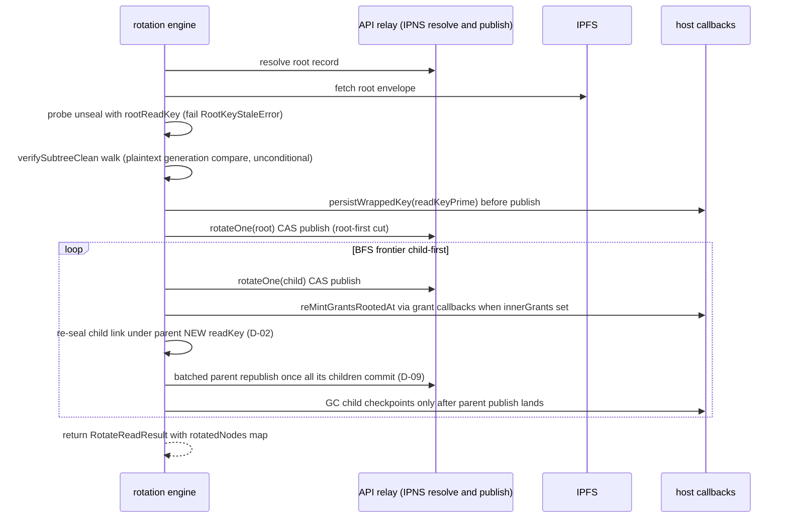

# sdk-core — stateless client capability layer and rotation engine

| | |
| --- | --- |
| **Kind** | part |
| **Sources** | `packages/sdk-core/src/` (index, types, cas, errors, ipns/index, ipfs/index, folder/{load, registration, metadata-ops, merge, tree}, file/index, upload, download, vault/index, share/{grant, navigate, recipient-pins}, rotation/{engine, scope, merge}, tee/wrap, pinning/*), `packages/sdk-core/vitest.config.ts`, `packages/sdk/src/client.ts` (boundary evidence only), `packages/sdk/src/share/owner-reconcile.ts`, `.planning/phases/{63,64,80}-*/…-CONTEXT.md`, `.planning/REQUIREMENTS.md`, `.planning/security/REVIEW-80.md` |
| **Verified against** | cipher-box `27c4abec5` |
| **Status** | draft |

## Purpose and scope

`@cipherbox/sdk-core` is the **stateless, host-agnostic capability layer** of the
TypeScript client stack. It sits between the pure codecs (`@cipherbox/core`, which
seals/unseals but never talks to a network) and the stateful client
(`@cipherbox/sdk`'s `CipherBoxClient`, which owns the `FolderTree` cache and user
session). Every sdk-core function takes explicit key material, an explicit
`SdkContext` (API URL + token getter + optional axios instance), and injected
transport callbacks; none holds durable state, fetches grants on its own
authority, or caches anything between calls. The design intent (phase 63 D-02/D-08)
is that the same code drives web, tests, and — via a Rust twin — the desktop
FUSE client.

This spec owns: the IPNS CAS-publish discipline as sdk-core drives it, folder
registration and child-ref mutation primitives, read-chain navigation, grant
issuance / invite-claim crypto, the recipient-pin helpers, and — the heart of the
package — the resumable read-rotation engine (`rotation/engine.ts`) with its
crash-resume, concurrent-add, and grant re-mint machinery, plus the dormant
write-rotation driver.

Adjacent ground: `Node` / `SealedChildRef` / `PublishedNode` / `NodeWriteBody`
field tables and seal semantics → [parts/core-codecs.md](core-codecs.md); the
AES-GCM-AAD seal primitive, ECIES `wrapKey`/`unwrapKey`, and the AAD byte layout
→ [parts/crypto.md](crypto.md); the server-side publish gates (sequence CAS,
forward-only `generation`, tombstone 409/410) → [parts/api.md](api.md); the
stateful `FolderTree` / `SharedFolderTree` / `RotationHighWater` layer and the
`CipherBoxClient` methods that feed this package → [parts/sdk.md](sdk.md); the
end-to-end rotation *story* (who triggers it, UX, cross-client effects) →
[flows/rotation.md](../flows/rotation.md) — this spec owns the engine's
mechanics, that flow owns the narrative; TEE enrollment and record liveness →
[flows/republish-liveness.md](../flows/republish-liveness.md); grant delivery →
[flows/sharing-grants.md](../flows/sharing-grants.md).

## Vocabulary

- **`readKey` / `writeKey`** — per-node 32-byte AES-256 keys sealing the node's
  read-body and write-body respectively. Independent planes: read rotation never
  touches the write plane and vice versa.
- **The three counters** (never conflate): **`generation`** — per-node rotation
  counter inside the node plane; **`sequenceNumber`** — per-IPNS-name publish
  counter (the CAS clock); **`keyEpoch`** — TEE wrap epoch. sdk-core threads all
  three but only mints `generation` bumps.
- **Parent-mirror generation** — `SealedChildRef.generation` on the parent, the
  reader's AAD source for unsealing the child's `readKeySealed`. The child's own
  envelope `generation` is the authority; the mirror is a staleness witness.
- **Dirty edge** — a child whose published envelope `generation` exceeds the
  parent's mirror: evidence of a rotation that committed the child but crashed
  before the parent republished.
- **Frontier** — the BFS queue of nodes still to rotate in a walk.
- **Checkpoint plane** — host-persisted ECIES ciphertexts of freshly minted
  `readKey'` values, wrapped under the owner's own public key, used to repair
  dirty edges on resume (`KeyCheckpointCallbacks`).
- **`encryptedReadKey`** — the ECIES-wrapped share-root `readKey` stored on a
  grant row (design docs also call this `readDescriptorRef`; the shipped name is
  `encryptedReadKey`, phase 71 D-10 rename).
- **`recipientPins`** — owner-sealed list of recipient public keys inside a
  folder's `NodeWriteBody`; the anti-relay trust anchor for re-mint (phase 80
  D-03).
- **Scope-exit** — a delete/move/rename that removes a node from a grantee's
  reachable subtree; the only mutation class that triggers rotation (ROT-02).
- **Terminal owner (D-09)** — the one function/layer responsible for zeroing a
  key buffer. Callees never zero caller-supplied buffers; minters zero their own
  mints on failure paths only.
- **First-publish rule** — every first IPNS publish must embed sequence exactly 1
  (server strict gate): `createAndPublishIpnsRecord` embeds its argument verbatim
  (pass `1n`), `publishWithCas` embeds base+1 (pass `sequenceNumber: 0n`).

## Actors and trust boundaries

sdk-core executes entirely inside the client process (browser or Node); its
trust boundaries are about which *inputs* it may trust, not where it runs.

| Actor / input | sdk-core's stance |
| --- | --- |
| Caller (packages/sdk client, tests) | Trusted. Supplies plaintext keys, owns their lifecycle (D-09), owns all durable state. sdk-core assumes the caller's key/state snapshot may be stale and fails closed (AEAD, `RootKeyStaleError`) rather than guessing. |
| CipherBox API (relay) | Untrusted for integrity. Every IPNS resolve is client-verified (Ed25519 signature, name↔key binding, signed-CBOR field binding, EOL); relay-fed `recipientPublicKey` on grant rows is never a wrap target without a pin match; the relay-supplied active-grant-root set is a completeness aid, never the sole rotation authority (T-63-17). |
| IPFS content | Untrusted bytes until an AEAD unseal under the expected key + AAD succeeds. |
| TEE (via `teeKeys` from vault responses) | Trusted as a wrap target only: sdk-core ECIES-wraps IPNS private keys under `teeKeys.currentPublicKey` and validates the config fail-closed before any side effect. It never receives anything from the TEE. |
| Host callbacks (`GrantRemintCallbacks`, `KeyCheckpointCallbacks`, …) | Trusted transport, untrusted data: the callback *plumbing* is assumed honest (it is the caller), but data that round-tripped the relay through it (grant rows) is re-verified against owner-sealed pins. |

Plaintext key material sdk-core sees transiently: node `readKey`/`writeKey`
chains, per-node IPNS Ed25519 seeds, file `fileKey`s, the user's vault keypair
(rotation checkpoint plane only). None of it may be logged, persisted by
sdk-core itself, or sent to the server unwrapped.

## Data structures

Node-plane structures (`Node`, `SealedChildRef`, `PublishedNode`,
`NodeWriteBody`, `NodeContent`, vault blob v3) are owned by
[parts/core-codecs.md](core-codecs.md). sdk-core owns the following in-memory /
wire shapes:

### `SdkContext` and `TeeKeys` (`types.ts`)

`SdkContext = { apiUrl, getAccessToken, axiosInstance? }` — injected per call,
replacing the pre-v3 Zustand-store access pattern. `TeeKeys =
{ currentPublicKey: hex, currentEpoch, previousPublicKey?, previousEpoch? }` —
passed explicitly to every enrollment-capable publish.

### `RotationJobRecord` (`rotation/engine.ts:180`)

Advisory, in-memory job state for one rotation walk: `rootNodeId`, `status`
(`'pending' | 'in-progress' | 'complete' | 'failed'`), `completedNodeIds:
Set<string>` (the per-node idempotency ledger), a `frontier` array (vestigial —
the walk keeps its real queue internally), and an optional host
`persistCallback` invoked after the root commit, after every per-node commit,
and at terminal status. **Write discipline:** published IPNS records are the
source of truth (phase 63 D-10); the job record is a hint. `completedNodeIds.add`
is always the *last* mutation of a node's step — after grant re-mint — so a
failed re-mint is retried on resume (`engine.ts:1244-1263`).

### `RotateReadResult` / `RotatedNodeKey` (`engine.ts:358-394`)

The walk's return: the root's fresh `readKey`/`generation`/`sequenceNumber`
plus `rotatedNodes: Map<ipnsName, RotatedNodeKey>` — every rotated node's
post-rotation key, LOCKED field-for-field with the Rust twin
(`crates/sdk/src/rotation/engine.rs`). Every `readKey` stored in the map is a
**defensive 32-byte copy**, never an alias of engine-internal buffers
(`engine.ts:2128-2133`, `:2302-2307`, `:1885-1890`; phase 80 D-04 / T-80-08 —
a future zeroization of `parentNewReadKey` cannot zero the returned key).
`sequenceNumber` is `bigint` throughout (Rust `u64` ↔ TS `bigint`, never
`number`).

### Callback bundles (transport seams)

- **`GrantRemintCallbacks`** (`engine.ts:80-93`) — `queryGrantsFn(nodeId)`,
  `updateGrantFn(shareId, encryptedReadKey, newGeneration)`,
  `deleteGrantFn(shareId)`, `getPinsFn?(nodeId)`. `getPinsFn` is REQUIRED on the
  enforced (surviving-folder-grant) path; its absence is a hard throw, never a
  skip.
- **`WriteRevocationCallbacks`** (`engine.ts:113-122`) — write-grant query /
  persist / delete plus `teeUnenrollFn(oldIpnsName)`.
- **`KeyCheckpointCallbacks`** (`engine.ts:147-151`) —
  `persistWrappedKey` / `getWrappedKey` / `deleteWrappedKey` for the ECIES
  checkpoint plane. Ciphertexts are wrapped under the owner's own public key and
  never routed through any API endpoint.
- **`ReadGrantPayload`** (`share/grant.ts:37-48`) — `{ recipientPublicKey,
  rootNodeId, shareRootIpnsName, rootGeneration, encryptedReadKey: base64 }`
  handed to the injected `insertShareFn`.
- **`CoverageParams` / `ScopeExitDeps`** (`rotation/scope.ts:48-73`) — inputs to
  the pure scope-exit predicate: leaf-first ancestry `ipnsName` chain, the
  relay-supplied grant-root set, and the client's own `localGrantRecord`.

### `DirtyFrontierItem` (`engine.ts:878-900`)

A dirty edge found by `verifySubtreeClean`: `{ ipnsName, nodeId,
parentIpnsName, nodeReadKey: always undefined, childPubKind,
enqueuedGeneration }`. `nodeReadKey` is deliberately never populated (plan
70.1-10): a dirty edge's `readKeySealed` may be sealed under a key that no
longer matches the current chain, so the detector compares **plaintext
generations only** and never decrypts a dirty edge.

### IPNS publish/resolve wire shapes (`ipns/index.ts`)

Client-signed IPNS records: 24-hour lifetime (`:72`), marshaled protobuf,
base64 on the wire, published through `ipnsControllerPublishRecord` /
`publishBatch` with optional enrollment fields (`encryptedIpnsPrivateKey` hex +
`keyEpoch`), `expectedSequenceNumber` (CAS guard) and `generation` (TEE-07
forward-only gate — both string-encoded bigints). The server-side gate
semantics belong to [parts/api.md](api.md); sdk-core's constraint on that
plane: **it always publishes first records with embedded sequence 1 and always
supplies `expectedSequenceNumber` on CAS-guarded paths**. A 410 on publish is
translated to `{ success: false, tombstoned: true }` rather than a raw axios
error (`:110-122`).

### Merge policies (the write discipline of every CAS retry)

Four distinct merge policies exist; which one runs is a security property, not
a style choice:

| Data | Function | Policy | Why |
| --- | --- | --- | --- |
| Read-children, non-rotation | `folder/merge.ts mergeChildren` | union by `ipnsName`, **remote wins**, base-only-both-sides-absent pruned | concurrent adds never dropped (HIGH-4) |
| Read-children, rotation | `rotation/merge.ts mergeRotatedChildren` | three-way, **local wins** | the rotation's re-seal must survive; a remote stale (pre-rotation) seal is never re-adopted (T-70-01). A separate function, not a flag, so local-wins is syntactically unreachable from non-rotation sites |
| `writeChildren` (write-plane) | inline in `folder/registration.ts:393-442` | base-aware symmetric prune: base∧absent-from-either-side ⇒ deleted; absent-from-base ⇒ concurrent add, kept | a racing writer's stale snapshot must not resurrect a committed delete (T-72-03-01, F5); falls back to naive union when no `baseWriteChildren` supplied |
| `recipientPins` | inline in `registration.ts:444-450` | monotone dedup **union** | a pin is a permanent trust anchor, never pruned by a CAS race (T-80-11) |

Known accepted residual: `mergeRotatedChildren`'s local-wins resurrects a child
concurrently deleted on remote (base∧local present, remote absent) — documented
self-healing tradeoff, T-70-02 (`rotation/merge.ts:24-29`).

## Interface

Public surface = the root barrel (`src/index.ts`); the package publishes only
the `.` export path (`package.json` `exports`), so anything the barrel omits is
unreachable outside the repo.

| Capability | Functions | Module |
| --- | --- | --- |
| CAS publish skeleton | `publishWithCas`, `ConflictError`, `is409` | `cas.ts`, `errors.ts` |
| IPNS record plane | `createAndPublishIpnsRecord`, `batchPublishIpnsRecords`, `resolveIpnsRecord`, `verifyIpnsSignature` | `ipns/index.ts` |
| IPFS bytes | `addToIpfs`, `fetchFromIpfs`, `unpinFromIpfs`, `registerCid` | `ipfs/index.ts` |
| Folder load | `loadFolderMetadata`, `fetchAndDecryptMetadata` | `folder/load.ts` |
| Folder registration/publish | `createSubfolder`, `updateFolderMetadataAndPublish` | `folder/registration.ts` |
| Child-ref mutations | `addFilePointerToFolder`, `renameInFolder`, `deleteFromFolder`, `moveItem`, `mergeChildren` | `folder/metadata-ops.ts`, `folder/merge.ts` |
| Tree math (id/parentId shaped) | `getDepth`, `calculateSubtreeDepth`, `isDescendantOf` | `folder/tree.ts` |
| File node lifecycle | `createFileMetadata`, `resolveFileMetadata`, `updateFileMetadata`, `downloadFileContent` | `file/index.ts` |
| Content transfer | `uploadFile`, `downloadAndDecrypt`, `selectEncryptionMode` | `upload/`, `download/`, `encryption-mode.ts` |
| Vault key plane | `publishVaultKeyBlob`, `loadVaultKeyBlob`, `publishEmptyRootNode` | `vault/index.ts` |
| Sharing crypto | `issueReadGrant`, `claimInviteReadKey`, `navigateReadChain` | `share/grant.ts`, `share/navigate.ts` |
| Recipient pins | `assertRecipientPinned`, `appendRecipientPin`, `extractRecipientPins` | `share/recipient-pins.ts` |
| Rotation engine | `rotateReadFromNode`, `rotateOne`, `mintFileKeyOnRotate`, `reMintGrantsRootedAt`, `mergeConcurrentChildren`, `verifySubtreeClean`, `rotateWriteFromNode`, `RootKeyStaleError`, `DirtyNodeUnrecoverableError` | `rotation/engine.ts` |
| Scope-exit gate | `hasCoveringGrant`, `maybeRotateOnScopeExit` | `rotation/scope.ts` |
| TEE wrap | `wrapIpnsKeyForTee` | `tee/wrap.ts` |
| BYO-pinning providers | `KuboProvider`, `PsaProvider`, `PinataProvider`, `DualPinProvider`, `testConnection` | `pinning/*` |

Consumers: `packages/sdk` (the only production consumer — `CipherBoxClient`
and `share/owner-reconcile.ts`), `tests/sdk-e2e`, and `apps/web` only via
type-only imports (SDK-READ-04 boundary: zero runtime web→sdk-core calls,
grep-gated in CI).

## Dependencies

- `@cipherbox/core` — node/v3 codec: `sealNode`/`unsealNode`,
  `sealChildReadKey`/`unsealChildReadKey`, `sealChildWriteKey`/`unsealChildWriteKey`,
  `createIpnsRecord`/`marshalIpnsRecord`, vault blob v3 serializers. Called,
  never reimplemented.
- `@cipherbox/crypto` — ECIES `wrapKey`/`unwrapKey`/`reWrapKey`, Ed25519
  keygen/verify/derive, `deriveIpnsName`, AES helpers, encoding helpers.
- `@cipherbox/api-client` — orval-generated typed API functions
  (`ipnsController*`); the only path to the relay.
- `cborg` — decoding the signed IPNS CBOR `data` field on resolve
  (duplicate-map-key rejecting).
- Host callbacks — everything else (grant rows, checkpoints, persistence) is
  injected; sdk-core has no DB, no storage API, no framework import.

## Behaviors

### CAS publish (`publishWithCas`, `cas.ts:38`)

- **Trigger** — every folder/file/rotation publish that is not a first publish.
- **Steps**
  1. `encodeAndUpload(localData)` (injected) → CID.
  2. `createAndPublishIpnsRecord` with embedded sequence `current + 1` and
     `expectedSequenceNumber = current` (string) — the server-side CAS guard.
  3. On non-409 error: rethrow immediately. On 409: re-resolve authoritatively
     (ignoring any hint in the error body), `decodeRemote(cid)`, run the
     injected three-way `merge(base, local, remote)` (sync or async), adopt the
     merged data, back off (100 ms · 2^attempt capped 1500 ms, ±50% jitter) and
     retry.
  4. After `maxAttempts` (3 everywhere in this package) → `ConflictError`.
- **Postconditions** — returns `{ cid, newSequenceNumber, publishedData,
  prunedCids }`; the caller must adopt `publishedData` (and, on the
  write-plane path, `publishedWriteChildren`) into its own state or the next
  publish reseals a stale chain.
- **Security contract** — `publishWithCas` NEVER zeroes key material (T-47-01);
  buffers are caller-owned and reused across retries. A previous callee-zeroes
  bug broke 48/89 sdk-e2e runs with 400 "publicKey does not correspond".

### IPNS resolve, strict client verification (`ipns/index.ts:336-497`)

Every resolve through `resolveIpnsRecord` fail-closes unless ALL of the
following hold: complete signature triple present (partial fields → throw, all
absent → throw — the legacy soft-allow path was removed), Ed25519 signature
valid over `"ipns-signature:" + data`, returned pubKey derives to the requested
`ipnsName` (key-substitution guard — the key comes from the name, never from a
DB column), signed CBOR `Value` equals `/ipfs/<response.cid>` and `Sequence`
equals the response sequence (strict, no first-publish skew disjunct),
duplicate CBOR map keys rejected (verdict parity with the Rust decoder),
`ValidityType === 0`, and `Validity` parses under a strict hand-written RFC3339
parser (`parseRfc3339ToUnixSecs`, branch-for-branch mirror of
`crates/api-client/src/ipns.rs` — leap-aware, fixed-width fields, no
`new Date()` superset) with a 5-minute skew buffer. A 404 returns `null`; all
other failures throw. Note this is signature/binding verification only — the
durable ROT-07 generation/sequence floor lives one layer up in
[parts/sdk.md](sdk.md) (`RotationHighWater.enforceResolved`).

### Folder creation and publish

- **`createSubfolder`** (`folder/registration.ts:47-148`) — mints Ed25519 IPNS
  keypair + `readKey` + `writeKey`, derives the k51 name, builds a
  `generation: 0` folder Node, seals, uploads, first-publishes at `1n`. When
  `teeKeys` is supplied it validates fail-closed (empty pubkey or epoch < 1 →
  throw **before** any upload side effect) and attaches the hex ECIES-wrapped
  IPNS key + epoch to the same publish (enrollment). All minted keys are
  returned raw to the caller (terminal owner); on any failure path before
  return they are zeroed in the catch.
- **`updateFolderMetadataAndPublish`** (`registration.ts:175-473`) — the
  workhorse republish: seals the caller's `SealedChildRef[]` (read plane) and,
  when a real `writeKey` is supplied, a write-body carrying `ipnsPrivateKey`,
  `writeChildren`, and `recipientPins`, then runs `publishWithCas`. Contracts:
  - `nodeId` and `nodeGeneration` are REQUIRED with no fallback (phase 64
    D-06): a fresh UUID breaks AAD binding; generation reset to 0 corrupts the
    rotation convergence witness (`:318-341`).
  - When sealing a write-body, an explicit `recipientPins` snapshot is REQUIRED
    (`[]` allowed, `undefined` rejected, `:298-303`): a conflict-free publish
    never runs the CAS-409 union, so an omitted snapshot would silently erase
    the node's owner-sealed pins and permanently break fail-closed re-mint
    (thread-80-4; the REVIEW-80 HIGH "routine reseals dropped recipientPins",
    fixed `ddb7082e6`).
  - The CAS-409 merge runs the four policies from the table above; the
    rotation engine's two batched-republish sites override `mergeChildrenFn`
    with the concurrent-add-resealing local-wins wrapper.
  - Returns `publishedWriteChildren` — the write links actually sealed —
    which the caller MUST adopt (`:251-259`).

### Child-ref mutation primitives (`folder/metadata-ops.ts`)

Pure transforms over `SealedChildRef[]`; the parent re-seal + publish happens
afterwards in `updateFolderMetadataAndPublish`:

- `addFilePointerToFolder` — seals the child `readKey` under the parent
  `readKey` **exactly once** (`sealChildReadKey`, role 0x02); no per-recipient
  fan-out exists anywhere in the package (READ-03; `reWrapForRecipients` was
  deleted in phase 63).
- `renameInFolder` / `deleteFromFolder` — synchronous array rewrites (names
  live inside the sealed parent body).
- `moveItem` — pure link rewrite; the `SealedChildRef` moves **as-is**,
  `readKeySealed` unchanged. The FLAG-63-U2 destination re-seal (recover the
  child `readKey` under the source parent, re-seal under the destination
  parent's `readKey`) is a **caller responsibility**, implemented in
  `packages/sdk/src/client.ts` and locked by
  `sdk-core/src/__tests__/folder/move-reseal.test.ts` as a composition test of
  the core primitives. All lookups here key by `ipnsName` (read plane); the
  returned `movedRef` carries no node UUID (NODE-03).

### Read-chain navigation (`share/navigate.ts:96-179`)

- **Trigger** — a grantee opens a shared file (web `downloadSharedFile` path).
- **Steps** — (1) ONE ECIES unwrap of the base64 `encryptedReadKey` with the
  recipient's private key → share-root `readKey`; (2) resolve+fetch the root
  `PublishedNode`; (3) behind-retry check: plaintext envelope
  `generation > rootExpectedGeneration` → `{ status: 'behind-retry' }` (the
  root rotated since the grant; caller re-fetches the re-minted grant); (4)
  unseal the root; (5) per path hop: find the `SealedChildRef` by `ipnsName`,
  fetch the child envelope, `unsealChildReadKey` using the **parent mirror**
  generation (`childRef.generation` — never the child's own envelope
  generation; a stale-CID serve fails GCM closed), unseal the child; (6) leaf
  must be a file with content → `{ status: 'ok', content, nodeId }`.
- **Failure modes** — missing IPNS record, absent child ref, or folder leaf →
  `{ status: 'revoked' }` (typed union, phase 63 D-06 — no ambiguous
  null/boolean); AEAD failures throw. All navigate-minted intermediates
  (share-root key, per-hop child keys) are zeroed in a `finally`; the
  recipient's private key and the returned `content.fileKey` are caller-owned.

### Grant issuance and invite claim (`share/grant.ts`)

- **`issueReadGrant`** — validates 32-byte root key / 65-byte uncompressed
  secp256k1 recipient key, ONE `wrapKey`, base64-encodes, persists one grant
  row via injected `insertShareFn`. Zero node touches, zero republishes;
  a single-file grant is structurally identical to a deep-folder grant
  (READ-01). NOTE the production share-create path in `packages/sdk`
  (`share/index.ts:71`) hex-encodes its own wrap for the API DTO — the two
  encodings diverge at the API boundary and the sdk layer bridges base64↔hex
  (`client.ts:214-226`).
- **`claimInviteReadKey`** — `reWrapKey(inviteWrapped, ephemeralPrivateKey,
  claimerPublicKey)`: unwraps the share-root `readKey` with the URL-fragment
  ephemeral key and re-wraps to the claimer, producing a standard-shape
  `encryptedReadKey`. The intermediate plaintext key is minted and zeroed
  inside `reWrapKey` on all paths (T-63-05). No per-child fan-out exists
  (READ-05; `encryptedChildKeys[]` deleted).
- **`claimInvite`** — the full flow wrapper (fetch invite data → re-wrap →
  persist one grant row), snapshotting key buffers before the first await and
  zeroing its own ephemeral copy in `finally`. **Quirk:** not exported from the
  package barrel (`src/index.ts:74` exports only `claimInviteReadKey`), so it
  is unreachable by consumers; the production invite-claim service lives in
  `apps/web/src/services/invite.service.ts`.

### Scope-exit gating (`rotation/scope.ts`)

`hasCoveringGrant` is a pure predicate: leaf-first ancestry chain ×
(relay-supplied grant-root set ∪ the client's own `localGrantRecord`) — either
source covering any ancestor returns true. The relay set is a completeness aid
only; the local record is the anti-malicious-relay cross-check (T-63-17 —
a relay omitting a grant root must not suppress a required rotation).
`maybeRotateOnScopeExit` composes the predicate with an injected `rotate`
thunk: uncovered → `'no-rotation'`, zero engine invocations, zero publishes
beyond the parent relink (ROT-02/SC#4, spy-tested); covered → exactly one
`rotate()` per mutation. State supply (ancestry, grant sets, reconcile-first
discipline) is the caller's job (phase 63 D-08) — see
[parts/sdk.md](sdk.md).

### rotateOne — per-node CAS-committed rotation (`engine.ts:1051-1288`)

The §4.5 nine-step skeleton, per node:

1. Idempotency fast-path: `completedNodeIds` hit → `{ skipped: true }`.
2. Resolve the node's IPNS record (absent → throw), fetch + unseal the
   envelope under the node's **own** pre-rotation key (the parameter is named
   `parentReadKey` — a legacy misnomer; it carries the node's own key).
3. Fail-closed guards: a real 32-byte non-zero IPNS signing seed is required
   (no placeholder publishes — phase 64 D-01); if the envelope carries
   `writeSealed`, a real non-zero `nodeWriteKey` is required or the write
   plane would silently drop on re-seal (T-65-17).
4. Mint `readKey' = 32 random bytes`, `generation' = generation + 1`.
5. If `keyCheckpointCallbacks` supplied: ECIES-wrap `readKey'` under the
   owner's public key and `persistWrappedKey` **before** the publish — the
   crash window between mint and publish is what the checkpoint plane closes.
6. If `kind === 'file'`: `mintFileKeyOnRotate` zeroes the old decrypted
   `fileKey` and mints a fresh one onto `node.content` so the re-sealed body
   carries it (CRIT-1/ROT-03 — a holder of the old readKey/fileKey cannot
   decrypt the next published version; ADR 0002 keeps already-distributed
   content readable).
7. Re-seal the read-body under `readKey'` at `generation'`; the write-body (if
   any) is re-sealed **unchanged** under the same `writeKey` — read rotation
   never rotates the write plane.
8. Compute `newReadKeySealed = sealChildReadKey(readKey', ownOldKey, …)` —
   legacy return value; the parent-mirror re-seal that actually matters is
   done out-of-band by the walk (D-02, below).
9. `publishWithCas` at the resolved sequence. On CAS-409 the merge callback
   runs `mergeConcurrentChildren`: unseal base and remote under the OLD key,
   `mergeRotatedChildren` (local wins), re-seal merged under `readKey'` — a
   concurrent add is never dropped (ROT-05/HIGH-4) and the CAS-merged children
   are what the BFS enqueues (not the pre-merge snapshot).
10. If `innerGrants` non-empty: `reMintGrantsRootedAt` (below), **then**
    `completedNodeIds.add(nodeId)` — strictly last.

Failure path zeroes the minted `readKey'` (and the minted `fileKey'` if step 6
ran) and rethrows; caller-supplied buffers are never zeroed.

### rotateReadFromNode — the resumable walk (`engine.ts:1323-2474`)

- **Trigger** — a covered scope-exit mutation or explicit read-revoke, driven
  by `performScopeExitRotation` in packages/sdk (web) or the Rust twin (FUSE).
- **Preconditions** — caller supplies the root's current `readKey`, per-node
  IPNS/write keys via `nodeKeySource`, and (for any resumable deployment)
  `ownerPublicKey`/`ownerPrivateKey` + `keyCheckpointCallbacks`.

Normative detail:

1. **Entry probe** — resolve+fetch the root and probe-unseal with the supplied
   `rootReadKey`. Failure against an *existing* published root throws
   `RootKeyStaleError`: the root was rotated by a lost prior run and its key
   was never durably captured (the durable floor stores numbers, never key
   material) — the caller's documented recovery is a top-down re-navigation
   from the vault root (`engine.ts:1353-1367`; the packages/sdk caller does
   exactly that, dropping the stale `folderTree` entry first).
2. **Unconditional dirty scan** — `verifySubtreeClean` recurses the FULL
   subtree comparing plaintext parent-mirror vs envelope generations, never
   decrypting a dirty edge (plan 70.1-10 — decrypting one used to AEAD-crash
   when the parent had also rotated). A missing root ⇒ `isDirty: true`,
   empty frontier (fail-closed, never "converged"). Recursion stops below a
   dirty edge; clean-edge derived keys are zeroed in `finally`.
3. **Root-first** — `rotateOne(root)` is the actual revocation cut (§4.2); a
   root already rotated by a lost run gets a safe double-rotation (extra
   rotation only strengthens revocation; the old no-double-bump guard was
   deliberately removed, plan 70-06).
4. **D-02 out-of-band re-seal + D-09 batched parent publish** — the walk (not
   `rotateOne`) re-seals each committed child's `readKey'` under the
   **parent's new** `readKey'`, updates the parent's mutable children copy,
   and republishes each parent **exactly once** when its
   `pendingChildCount` reaches zero (`decrementPendingAndMaybeRepublish`),
   via `updateFolderMetadataAndPublish` with the local-wins
   concurrent-add-resealing merge. That merge additionally re-wraps any
   remote-only concurrent add's `readKeySealed` under the new parent key,
   trying the old key first then the new (a writer racing the batched
   republish may legitimately have used either), without enqueuing the
   foreign child for a full rotation (it lacks that child's signing key by
   construction).
5. **Bookkeeping soundness** — a missing child record decrements the parent
   counter anyway (fail-closed accounting, T-70-12 — the parent must still
   converge); an idempotency-skipped child also decrements; a deep queue item
   whose parent has not yet seeded tracking is pushed back (bounded by depth);
   a lazily-discovered parent is resolved by walking down from the root with
   the same key-chain primitive (`findParentNodeByIpnsName`).
6. **Dirty repair on resume** — a dirty item routes to `repairDirtyNode`:
   recover `readKey'` from the ECIES checkpoint (`getWrappedKey` +
   `unwrapKey` with the owner's private key), re-seal only the parent mirror,
   surface the recovered key into `rotatedNodes`, mark the node complete, and
   seed its own tracking state so its children still walk. Checkpoints are
   GC'd **only after** the parent's batched republish durably lands
   (`pendingCheckpointNodeIds`, D-04) — earlier GC would destroy the only
   recovery source. No checkpoint (never persisted, or already GC'd) ⇒
   `DirtyNodeUnrecoverableError`; no `keyCheckpointCallbacks` at all ⇒ the
   same error, making the checkpoint plane effectively mandatory for any
   deployment that can crash mid-walk.
7. **Resume/skip outcomes** — root already complete + subtree clean ⇒
   `undefined` (nothing changed); root skipped but dirty tail repaired ⇒ a
   result whose `readKey` is a fresh COPY of the caller's `rootReadKey`
   (never an alias, T-70-10); fresh rotation ⇒ the minted root key. Queue-
   derived per-node keys are zeroed in the loop's `finally` on every exit
   path; `rootReadKey` never.

### Grant re-mint (`reMintGrantsRootedAt`, `engine.ts:587-661`)

- **Trigger** — inside a rotation step, only when the caller passed non-empty
  `innerGrants` AND `grantCallbacks` (both host-fed; no callbacks ⇒ clean
  no-op). Also driven standalone by `runOwnerReconcile`
  (`packages/sdk/src/share/owner-reconcile.ts:126`) for dangling-grant repair.
- **Steps** — query grants rooted at the node; for revoked rows: delete, never
  re-mint (T-64-04b). For surviving rows on a **folder/root** node: fetch the
  owner-sealed pin list ONCE via `getPinsFn` (missing seam ⇒ hard throw), then
  `assertRecipientPinned(grant.recipientPublicKey, pins)` — raw-byte equality
  after hex/base64/bytes normalization, empty list ⇒ hard fail (D-03e
  no-legacy, no TOFU) — **before** wrapping; only then
  `wrapKey(newReadKey, recipientPublicKey)` and persist as **hex**
  (`bytesToHex`, matching `PATCH /shares/:id/grant`'s even-length-hex DTO and
  the Rust twin — base64 here 400s every re-mint; Gap C, fixed on this path).
- **File carve-out (D-03g)** — `nodeKind === 'file'` skips the pin fetch and
  check entirely and re-mints directly: a file leaf has no `NodeWriteBody`, so
  a pin is structurally impossible, and enforcing D-03e would abort every
  rotation of a folder merely *containing* a separately-shared file. This
  accepts the pre-existing file-share recipient-substitution limitation
  (REVIEW-80 / pin-lifecycle todo §5). `nodeKind` is a parameter — a caller
  that fails to thread the real kind silently loses the carve-out.
- **Failure modes** — a pin mismatch is a hard abort of the node's re-mint
  (deliberately not a per-grant skip); the node is then NOT marked complete,
  so resume retries the re-mint.

### Write-plane rotation (`rotateWriteFromNode`, `engine.ts:2779-2855`)

ADR 0001 (c): full Ed25519 rotation. Child-first recursion
(`rotateWriteSubtree`): per node — unseal both bodies (fail-closed if the
envelope has no recoverable write-body / signing seed: never mint write
authority from a read-only envelope), recurse into write children (correlating
`WriteChildRef.childId` UUIDs to `SealedChildRef`s by resolving candidates —
O(n·m)), mint a new Ed25519 keypair + k51 name + `writeKey`, rebuild the
write-body (new seed, children's new write keys re-sealed under the new key,
role 0x04), re-point `SealedChildRef.ipnsName` to the children's new names
**without** touching `readKeySealed` or `generation` (read-plane invariant),
seal, upload, first-publish the new name at `1n` (checking the returned
success flag), and queue the old name for tombstone-intent. Only after the
entire subtree publishes does the driver fire `teeUnenrollFn(oldName)` per old
name and re-wrap the new root `writeKey` to each surviving co-writer
(revoked ⇒ row delete). Minted seeds/keys are zeroed at each terminal-owner
boundary; a rootNodeId mismatch aborts before any grant mutation. See Known
gaps for its dormancy and encoding drift.

### Vault and file planes (summary)

`publishVaultKeyBlob` / `loadVaultKeyBlob` wrap/unwrap the two root keys
(ECIES under the user's own key, v3 blob `0x03|len|ECIES(read)|len|ECIES(write)`)
on a dedicated HKDF-derived IPNS name, first-published at `1n`.
`publishEmptyRootNode` builds the `kind:'root'` Node with the signing seed in
its write-body and first-publishes at `1n`, with the same fail-closed TEE
enrollment gate as `createSubfolder`. `createFileMetadata` mints the file
node's keys, seals (content self-seals under the file's own `readKey`,
NODE-02), uploads, wraps the IPNS seed for the TEE, and **builds but does not
publish** the signed record — the caller batch-publishes (embedded sequence
1). `updateFileMetadata` is single-shot (no CAS retry/merge — latest-wins on
the file plane).

## Invariants

1. **INV-1** — sdk-core MUST remain stateless and host-agnostic: no durable
   storage, no framework imports, no grant fetching on its own authority; all
   state and transport arrive as parameters/callbacks.
2. **INV-2 (D-09)** — a function MUST zero only key buffers it minted, and only
   on its own failure paths or at its documented terminal-owner boundary; it
   MUST NEVER zero a caller-supplied or reused buffer (`publishWithCas`,
   `createAndPublishIpnsRecord`, every navigation/rotation helper).
3. **INV-3** — every first IPNS publish MUST embed sequence 1
   (`createAndPublishIpnsRecord` arg verbatim ⇒ pass `1n`; `publishWithCas`
   embeds base+1 ⇒ pass `0n`); every non-first CAS publish MUST carry
   `expectedSequenceNumber`.
4. **INV-4** — a child `readKeySealed` MUST be unsealed with the **parent
   mirror** generation (`SealedChildRef.generation`) as AAD, never the child's
   own envelope generation.
5. **INV-5** — rotation MUST rotate the scope root first; the walk MUST commit
   each node via CAS before advancing the frontier past it; published IPNS
   records are the source of truth and the job record advisory.
6. **INV-6** — `completedNodeIds.add(nodeId)` MUST be the final mutation of a
   node's rotation step, strictly after grant re-mint.
7. **INV-7** — on any rotation CAS-409 the engine MUST re-fetch and re-merge
   the remote children (never re-seal from a stale in-memory list), and the
   local-wins `mergeRotatedChildren` policy MUST be invocable only from
   rotation call sites (separate function, never a flag on the generic merge).
8. **INV-8** — after a child rotates, its link MUST be re-sealed under the
   parent's NEW `readKey'` and the parent republished exactly once per
   rotation batch; a parent's pending-child counter MUST be decremented on
   every child outcome (success, skip, missing record) so it always converges.
9. **INV-9** — `rotateOne` MUST refuse to publish without a real (32-byte,
   non-zero) IPNS signing seed, and MUST refuse to re-seal a node whose
   envelope has `writeSealed` without a real `writeKey`.
10. **INV-10** — rotating a file node MUST mint a fresh `fileKey` into the
    re-sealed body; read rotation MUST NOT alter the write plane, and write
    rotation MUST NOT bump `generation` or re-seal `readKeySealed`.
11. **INV-11** — a surviving folder/root grant MUST pass
    `assertRecipientPinned` against the owner-sealed pin list before any wrap
    to a relay-fed recipient key; an empty/absent pin list on that path is a
    hard failure (file-rooted grants exempt, D-03g). Pins MUST merge as a
    monotone union on every CAS race and a write-body reseal MUST carry an
    explicit pin snapshot.
12. **INV-12** — when the checkpoint plane is wired, the wrapped `readKey'`
    MUST be persisted before the node's publish, and a repaired child's
    checkpoint MUST be GC'd only after its parent's mirror republish commits.
13. **INV-13** — a dirty edge MUST be detected by plaintext generation
    comparison alone; its `readKeySealed` MUST never be decrypted, and repair
    MUST use only checkpoint-recovered key material (else fail closed with
    `DirtyNodeUnrecoverableError`).
14. **INV-14** — `updateFolderMetadataAndPublish` MUST receive the stable
    `nodeId` and current `nodeGeneration` (no defaults), and callers MUST
    adopt the returned published children/write-children as their new base.
15. **INV-15** — scope-exit coverage MUST consult both the relay grant-root
    set and the client's local grant record; an uncovered mutation MUST
    produce zero rotations and zero publishes beyond the parent relink.
16. **INV-16** — `rotatedNodes` values MUST be defensive copies, never aliases
    of engine-internal key buffers (cross-language parity with the Rust
    `Zeroizing` clone).

## Known gaps and quirks

- **Rotation publishes are never TEE-enrolled.** Neither `rotateOne`'s
  `publishWithCas` (`engine.ts:1197`) nor `rotateWriteSubtree`'s first-publish
  (`:2713`) nor the batched parent republish threads
  `encryptedIpnsPrivateKey`/`teeKeys` — zero references in `rotation/`. Every
  rotated-in name lives on its 24 h client-signed record + DB cache only; old
  names are correctly unenrolled/tombstoned. Shared finding with
  [flows/republish-liveness.md](../flows/republish-liveness.md) Known gaps.
- **`rotateWriteFromNode` is dormant.** No production caller exists
  (`client.ts:5485` references it only in a comment; the phase-65 seam was
  pulled back in the #615 interim — grant-delivery research memory); it is
  exercised by unit tests and a kept-but-skipped e2e. Its co-writer re-wrap
  encodes **base64** (`engine.ts:2842`) while the read-plane re-mint had to be
  fixed to hex for the same PATCH DTO family (`:649-657`, Gap C) — the
  write-plane sibling bug is latent and will 400 the moment the driver is
  wired live.
- **Web never feeds inline re-mint.** `reMintGrantsRootedAt` is conditionally
  reachable only via `innerGrants` + `grantCallbacks`; the packages/sdk
  invocation threads them from an optional
  `callbacks.resolveInlineGrantRemint` (`client.ts:2106-2144`) which **no web
  code implements** — all web re-mint is delegated to the `runOwnerReconcile`
  sweep, which cannot key file leaves. Net effect: a separately-shared FILE
  inside an owner-rotated folder gets its key rotated but its grant re-minted
  by neither path — the recipient silently loses access (pre-existing,
  tracked in `.planning/todos/pending/2026-07-12-recipient-pin-lifecycle-hardening.md`
  §5). Desktop (Rust) re-mints inline and is covered. Details in
  [parts/web.md](web.md) / [flows/rotation.md](../flows/rotation.md).
- **ROT-07 gate history and residual.** Phase 68 shipped `enforceResolved` +
  the IndexedDB floor but left it unreachable — `client.ts ensureFolderLoaded`
  called `sdkCore.resolveIpnsRecord` directly, bypassing the gate (discovered
  in `68-VERIFICATION.md` Gap 1, BLOCKER). The gap-closure + phase 68.2 work
  wired the gate into the sdk read path (`gatedResolveChild`,
  `ensureRootFolderState`, `dfsFindFolder`, `doReresolveFolderInPlace`,
  `reconcileFolderSequence` — five `enforceResolved` sites in `client.ts`).
  Residual at the pinned commit: `rotationHighWater` is an **optional** config
  field — "when omitted, the client performs zero enforcement"
  (`packages/sdk/src/types.ts:183-191`) — and config-blob resolves are
  deliberately ungated (`client.ts:4712-4720`). sdk-core itself contains no
  floor; the gate is a [parts/sdk.md](sdk.md) structure this package merely
  constrains (resolve strictness, INV-4).
- **`RootKeyStaleError` window and Open Question 2.** A crash after a root's
  rotation publish but before any durable key capture leaves the root
  unrecoverable from the stale key alone; the documented fallback is top-down
  re-navigation. But rotation never updates its OWN root's *ancestor*
  `SealedChildRef` mirror, so a pure-revoke root whose ancestor mirror was
  never re-sealed blocks that re-navigation one hop early (residual documented
  at the packages/sdk catch site, `client.ts:2221-2236`).
- **Checkpoint plane is de-facto mandatory.** Since plan 70.1-10 removed the
  (unsafe) decrypt-then-double-rotate fallback, any resume that meets a dirty
  non-root node without `keyCheckpointCallbacks` fails with
  `DirtyNodeUnrecoverableError` (`engine.ts:2241-2252`) — "optional" in the
  type, required in practice.
- **`parentReadKey` misnomer.** The `rotateOne` parameter carries the node's
  OWN pre-rotation key, not the parent's (`engine.ts:267-281`); the rename was
  left at planner discretion in phase 64 and never happened.
- **Delete-resurrection residual (T-70-02).** `mergeRotatedChildren`'s
  local-wins re-adds a base∧local child concurrently deleted on remote;
  accepted as self-healing (`rotation/merge.ts:24-29`).
- **`claimInvite` is unexported.** Present and tested in `share/grant.ts:244`
  but absent from the package barrel; production invite-claim is a parallel
  implementation in `apps/web`.
- **Grant-key encoding split.** sdk-core `issueReadGrant` emits base64;
  the production share-create path and the re-mint PATCH use hex; the sdk
  layer bridges (`client.ts:214-226`). Three encodings (hex API DTOs, base64
  sdk-core grant/checkpoint plane, hex TEE enrollment) coexist by
  site-specific convention.
- **Comment drift** — `ipns/index.ts:67` still says records are "republished
  by TEE every 3 hours" (it is 6). `engine.ts:2634` says
  `generateEd25519Keypair` is synchronous while `registration.ts:61` awaits
  it (harmless — awaiting a non-promise).
- **File plane has no CAS.** `updateFileMetadata` is single-shot
  latest-wins (`file/index.ts` module doc) — the legacy CAS+merge behavior of
  the quarantined v1 `file.test.ts` was deliberately not carried over.
- **`folder/tree.ts` is a legacy-shaped helper** — pure `id`/`parentId` tree
  math serving the web's `FolderNode` shape, not the `ipnsName`-keyed node
  plane the rest of the package speaks.
- **Coverage/CI context.** sdk-core unit tests gate the main CI `Test` job
  (with api/crypto/core/sdk/api-client; web unit tests are excluded from that
  job). Vitest coverage enforces 80% lines/branches/functions/statements and
  **excludes `src/**/index.ts` barrels** (`vitest.config.ts`) — the reason
  `engine.ts`/`scope.ts`/`merge.ts` are named files (Pitfall 14: engine code
  in a barrel passes the gate uncovered), and the reason splitting a fat
  barrel can abruptly drop measured coverage below the gate. The only real
  client→API round-trip coverage is `tests/sdk-e2e` (106/106 at REVIEW-80),
  which is not run on PRs by default.

## Rewrite notes

- **The engine is one 2 855-line file carrying five overlapping recovery
  mechanisms** (advisory job record, unconditional dirty scan, checkpoint
  plane, safe double-rotation, lazy parent re-resolution) plus manual
  `pendingChildCount` bookkeeping with four distinct decrement sites. Each
  mechanism was a sound patch (phases 63→64→70→70.1→74→80), but the
  composition is now the hardest-to-reason-about code in the repo — the
  parent-tracking state machine alone has three seeding paths. A redesign
  should make per-node commit + parent-mirror update a single atomic unit
  (publish child and parent link together, or make the mirror derivable), which
  would delete most of the bookkeeping and the dirty-edge concept with it.
- **Grant awareness is bolted on, not intrinsic.** Whether re-mint runs
  depends on a host passing `innerGrants` (a boolean in disguise) and a
  callback bundle; the web host passes neither inline, producing the silent
  file-grant loss above. If grants were first-class engine inputs (the engine
  queries "grants rooted in this subtree" through one mandatory seam), the
  reachability class of bug — seam built, host never feeds it — could not
  exist. The same lesson applies to `nodeKind` threading for the pin
  carve-out and to `rotationHighWater` being optional: security gates that
  hosts may simply not wire are gates that ship unwired.
- **Encoding conventions should be a type, not a comment.** hex-vs-base64 has
  now caused one shipped breakage (Gap C) and one latent one
  (`engine.ts:2842`); the fix each time was a longer comment. Branded
  string types or bytes-everywhere-until-the-DTO would end the class.
- **Statelessness was pushed one layer too far.** sdk-core owning zero state
  is what forced packages/sdk + web to co-own folder state, which spawned the
  desync / "Folder not loaded" bug class and the 68.2 re-architecture that
  moved listings into the sdk. A rewrite should pick one state owner from day
  one (the sdk layer, with sdk-core as pure functions over snapshots it
  returns) — which is where the codebase converged anyway, expensively.
- **The zeroization discipline works but is hand-enforced** — dozens of
  D-09 comments, one historical 48/89-test incident, and a defensive-copy
  parity fix (phase 80 D-04) that existed only because TS lacks Rust's
  `Zeroizing`. A rewrite should wrap key material in a non-copyable handle
  type so ownership transfers are visible in signatures instead of prose.
- Worth keeping as-is: the typed navigation results (`'ok' | 'behind-retry' |
  'revoked'`), the parent-mirror-generation AAD rule, the four-policy merge
  table with local-wins syntactically quarantined, fail-closed-everywhere
  resolve verification, and the seam-with-named-owner discipline that let
  four phases fill the engine without re-architecting it.
