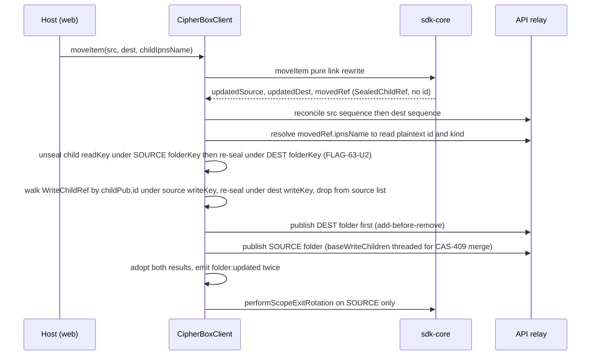

# SDK client-orchestration layer (`packages/sdk` + `crates/sdk`)

| | |
| --- | --- |
| **Kind** | part |
| **Sources** | `packages/sdk/src/` (client.ts, types.ts, index.ts, events.ts, error.ts, folder-listing.ts, write-body-params.ts, bin/index.ts, share/{index,context,shared-write,owner-reconcile,key-cache}.ts, state/{folder-tree,shared-folder-tree,key-cache,rotation-high-water,rotation-idb-store}.ts), `packages/sdk/vitest.config.ts`, `packages/sdk/package.json`, `crates/sdk/src/` (lib.rs, client.rs, state.rs, sync.rs, queue.rs, registry.rs, listing.rs, emit.rs, adapter.rs, floor_store.rs, rotation/{mod,scope,engine,high_water}.rs), `crates/sdk/Cargo.toml`, `packages/sdk-core/src/folder/metadata-ops.ts` (moveItem contract), `packages/sdk-core/scripts/*.mts`, `tests/sdk-e2e/`, `.github/workflows/ci.yml`, `apps/web/src/hooks/useAuth.ts` (production wiring), `.planning/phases/63-*/63-CONTEXT.md`, `.planning/design/2026-06-26-sharing-read-keychaining-design.md`, `.planning/REQUIREMENTS.md`, `.planning/phases/77-*/77-RESEARCH.md` |
| **Verified against** | cipher-box `27c4abec5` |
| **Status** | draft |

## Purpose and scope

This spec covers the **client-orchestration pair**: the TypeScript package
`@cipherbox/sdk` and the Rust crate `cipherbox-sdk`. Both are the stateful layer
between an app host and the stateless engine below them — they own in-memory key
state, sequencing of engine calls, publish ordering, conflict/reconcile policy,
caches, and event emission. They are deliberately host-framework-free: no
React/Zustand/browser dependency in TS (`packages/sdk/src/client.ts:8-13`), no
FUSE/Tauri/WinFsp import in Rust (`crates/sdk/src/rotation/engine.rs:34-36`).

**They are not 1:1 twins.** The TS side is a single god-object client
(`CipherBoxClient`, 6465 lines) that hosts folder CRUD, file/version ops, bin,
shares, shared-write, and a "full-boundary facade" (D-07) so `apps/web` never
imports `@cipherbox/core`/`@cipherbox/sdk-core` at runtime. The Rust side is a
toolkit crate — sync daemon, durable write journal, gated listing, node-emit,
rotation engine host — whose *orchestration* role is played by its consumers
(`crates/fuse` for the data plane, `apps/desktop/src-tauri` for the control
plane). See [Where the TS and Rust layers diverge](#where-the-ts-and-rust-layers-diverge).

Out of scope, linked instead: engine internals — TS `@cipherbox/sdk-core`
([sdk-core.md](sdk-core.md)) and the Rust FUSE runtime that consumes this crate
([desktop.md](desktop.md)); node/v3 schemas and seal primitives
([core-codecs.md](core-codecs.md)); server-side publish/resolve gates
([api.md](api.md)); the web host that wires this client
([web.md](web.md)); rotation semantics as a system flow
([../flows/rotation.md](../flows/rotation.md)); TEE enrollment/republish
([../flows/republish-liveness.md](../flows/republish-liveness.md)); grant
delivery ([../flows/sharing-grants.md](../flows/sharing-grants.md)).

## Vocabulary

- **`FolderState`** — the TS client's per-folder in-memory record: `folderKey`
  (read key), `writeKey`, `ipnsKeypair`, `sequenceNumber`, `children`
  (`SealedChildRef[]`), decrypted `metadata` Node mirror, `nodeId` (UUID),
  `nodeGeneration` (`packages/sdk/src/types.ts:200-236`). Held in `FolderTree`,
  keyed by `ipnsName`.
- **`SharedFolderState`** — sibling record for a *shared* folder depth, keyed by
  `shareId` (never `ipnsName` — two shares can collide on the same name), with
  owner+recipient pubkeys and the raw `publishedNode` envelope
  (`types.ts:249-270`). Held in `SharedFolderTree`.
- **read plane / write plane** — the two sealed bodies of a node
  ([core-codecs.md](core-codecs.md)). Read plane is keyed by **`ipnsName`**
  (`SealedChildRef` has no `id` — NODE-03); write plane is keyed by the node's
  **UUID** (`WriteChildRef.childId === Node.id`). Conflating them is this
  layer's signature bug class.
- **zero-fallback writeKey** — a 32-byte all-zero sentinel meaning "no write
  capability known"; `hasRealWriteKey` is the single test
  (`packages/sdk/src/write-body-params.ts:33-35`).
- **generation-source rule (§2.6)** — every unseal AAD takes the **parent
  mirror's** `SealedChildRef.generation`, never the child's own envelope
  `PublishedNode.generation` (a stale relay serve would otherwise fail or,
  worse, pass with attacker-chosen values).
- **reconcile-before-publish (SC#3/D-04)** — re-resolve the network sequence and
  defer (`ReconcileStaleError`) on any mismatch before any owned mutation
  publish (`client.ts:1867-1949`).
- **sequence-as-clock (#489)** — IPNS `sequenceNumber` is the freshness clock
  for every cache and adopt decision; a read at or below the in-memory sequence
  never overwrites state.
- **ROT-07 high-water** — durable monotonic-max generation+seq floors gating
  every trusted resolve (`state/rotation-high-water.ts`, Rust
  `rotation/high_water.rs`).
- **scope-exit rotation (ROT-02)** — rotate a node's read chain iff a covering
  grant exists on its ancestry; pure relink otherwise
  (`sdk-core` `maybeRotateOnScopeExit`, Rust `rotation/scope.rs`).
- **D-09 terminal owner** — exactly one owner zeroes each key buffer; borrows
  are never zeroed by callees.
- **`movedRef`** — the `SealedChildRef` returned by `sdkCore.moveItem`; it
  carries `ipnsName` but **no `id`**
  (`packages/sdk-core/src/folder/metadata-ops.ts:132-142`).
- **`bin/`** — inside `packages/sdk/src`, the **recycle-bin operations module**
  (`src/bin/index.ts`); there is no CLI. `package.json` declares no `bin` entry.

## Actors and trust boundaries

| Actor | Sees | Must never see |
| --- | --- | --- |
| This layer (TS client / Rust crate in-process) | ALL plaintext key material for the account: vault keypair, root read/write keys, per-folder read/write keys, per-node Ed25519 IPNS seeds, raw file keys (transiently) | nothing withheld — this is the maximal-trust tier; discipline is zeroization + no logging, not access restriction |
| Host app (web / desktop) | whatever the layer's API returns; the TS facade deliberately keeps raw item writeKeys inside the SDK (`resolveShareEncryptedWriteKey` returns only ECIES ciphertext, `client.ts:3860-3864`) | — |
| CipherBox API relay | sealed envelopes, IPNS records, encrypted grant rows | any plaintext key; it is also **not trusted for integrity**: signature verification + ROT-07 floors + the local-grant-record cross-check (T-63-17) all assume a malicious relay |
| IPFS/IPNS network | sealed bytes | — |
| Durable local stores (IndexedDB `cipherbox-rotation-state`, Rust JSON sidecar / cb-journal) | floors (plain integers) and the rotation key-checkpoint **ciphertext only** (`state/rotation-idb-store.ts:22-28`); the Rust journal stores ciphertext + seals, never plaintext (`crates/sdk/src/queue.rs` module doc) | plaintext keys |

Trust nuances this spec's behaviors depend on:

- The relay-supplied active-grant-root set is a *completeness aid*; the client's
  own `LocalGrantRecord` is the anti-malicious-relay cross-check — either source
  covering an ancestor triggers rotation (`crates/sdk/src/rotation/scope.rs:96-112`,
  TS twin in sdk-core).
- Recipient identity for grant re-mint is **never** taken from the relay: it is
  checked against the node's owner-sealed `recipientPins`, and the seam has no
  permissive default (`share/owner-reconcile.ts:107-114`; Rust
  `rotation/engine.rs:201-217`).

## Data structures

### `FolderTree` / `FolderState` (TS, memory only)

`packages/sdk/src/state/folder-tree.ts:20-75`. Map `ipnsName → FolderState`.
`set()` defensively clones all key buffers; `delete()`/`clear()` zero
`folderKey`/`writeKey`/`ipnsKeypair.privateKey` first — the tree is the terminal
owner of its copies.

**Write discipline** (who mutates a `FolderState`, and under what clock):

| Writer | Condition |
| --- | --- |
| `loadFolder` / `doReresolveFolderInPlace` / `refreshFolderStateFromNetwork` | adopt only a **strictly newer** resolved sequence (`client.ts:765-780`, `1757-1759`, `1972`); a write-key-less unseal must never strip an already-populated `writeBody` mirror (`client.ts:1978-1986`) |
| `adoptPublishedFolderState` (after every successful owned publish) | unconditional — the publish result IS the new truth; also syncs the `metadata.writeBody` mirror (writeChildren + recipientPins) or *creates* it, because `getWriteBodyParams` prefers the mirror and a stale mirror silently drops WriteChildRefs on the next publish (`write-body-params.ts:127-171`) |
| `performScopeExitRotation` post-rotation refresh | replaces `folderKey`/`sequenceNumber`/`nodeGeneration` with the rotation result and zeroes the old key (`client.ts:2255-2272`) |
| `reconcileFolderSequence` D-04 self-heal | on network-AHEAD only, and only when the entry still matches the reconciled sequence (`client.ts:1939-1946`) |

### `SharedFolderTree` / `SharedFolderState` (TS, memory only)

`state/shared-folder-tree.ts`. Keyed by `shareId` (D REQ-3/A4). `set()` clones
`folderKey`/`ipnsPrivateKey`/`writeKey` (the writeKey clone is load-bearing —
storing the caller's reference once left the tree holding an all-zero key after
the caller's own D-09 zeroing, silently downgrading every write share to
read-only, `shared-folder-tree.ts:78-91`). A **monotonic per-share seed
generation** (`seedGenerations`, `:29-63`) guards descent-vs-navigation races:
`loadSharedFolder(shareId, state, seedGeneration)` rejects a seed whose captured
generation was superseded (`client.ts:5189-5198`); `delete()`/`clear()` bump the
counter so an in-flight seed racing an unload is recognized as stale
(`shared-folder-tree.ts:104-105`, `118-127`).

### Listing cache + `ResolvedChild` (TS)

`client.ts:298-299` — `Map<ipnsName, { sequenceNumber, children: ResolvedChild[] }>`,
invalidated by sequence (the clock, D-02). `ResolvedChild` =
`{ ipnsName, name, kind, size?, createdAt, modifiedAt, sequence }`
(`folder-listing.ts:37-45`) — the single per-child display answer the web
renders from. A **partial** listing (any skipped child) is never cached
(`client.ts:967-977`), so transient failures self-heal. File-only content edits
don't bump the parent's sequence, so those paths delete the cache entry
explicitly (`client.ts:4109-4111`, `5638-5640`).

### `CombinedFloorRecord` / `HighWaterStore` (TS durable seam)

`state/rotation-high-water.ts:56-80` — ONE record per nodeId:
`{ generation?, seq?, wrappedKeyCheckpoint? }`, written in a single `put` so
both floors move atomically (the pre-70.1-02 two-store sequencing window is
closed). `enforceResolved` is a pure pass/throw pre-unseal gate: input
validation fail-closed (NaN/negative/unsafe ints rejected), generation floor,
then seq floor — with the owner-vouched `versionFloor` applied only on first
contact (`:213-250`). The browser adapter is `state/rotation-idb-store.ts`
(DB `cipherbox-rotation-state` v2, one `rotation-floor` store, migration folds
the v1 two-store layout, in-memory latch on IndexedDB failure `:37-44`),
published on its **own** export path `@cipherbox/sdk/state/rotation-idb-store`
so Node consumers never pull IndexedDB (`package.json:14-18`).

### `RotationClientCallbacks` (TS injection seam)

`types.ts:73-111`. The client never imports the shares API or a job store;
hosts inject `getActiveGrantRootIpnsNames`, `getLocalGrantRecord`, `persistJob`,
plus optional `progress`, `keyCheckpoint` (ECIES key-checkpoint plane) and
`resolveInlineGrantRemint` (inline per-node grant re-mint during rotation —
the only path that can re-mint FILE grants, which the reconcile sweep cannot
reach). Unconfigured → `NOOP_ROTATION_CALLBACKS` (`client.ts:274-278`): zero
coverage, zero rotation.

### `SharedWriteContext` (TS)

`share/shared-write.ts:70-108`. Carries readKey/writeKey/publishedNode/
sequence/children plus two injected transport seams: `addToIpfsFn` (BYO-aware
content pinning via `pinWithMode`) and `publishNodeFn` (node blob always via the
CipherBox relay + `createAndPublishIpnsRecord`; `{tombstoned: true}` →
`CannotWriteUntilRefetchError`, the WRITE-03 revoked-co-writer signal,
`client.ts:5337-5372`, `shared-write.ts:123-130`). Invariant stated in the
module header: **`ipnsPrivateKey` is never a top-level parameter** — it lives
inside the sealed write-body and is only reachable by unsealing with `writeKey`
(`shared-write.ts:8-11`).

### `BinState` (TS)

`bin/index.ts:53-57` — `{ entries: BinEntry[], sequenceNumber, ipnsName }`; the
bin blob itself is ECIES-encrypted to the owner and published on a
`deriveBinIpnsKeypair(userPrivateKey)`-derived name. Write discipline:
**bin-save-before-destructive-folder-publish** (`bin/index.ts:280-283`,
`393-403`) so a crash never orphans an item without its restore key; the
deleted child's WriteChildRef is deliberately **retained** in the original
parent's write-body at addToBin time and released only at
permanent-delete/empty/purge (`bin/index.ts:379-391`, `dropLingeringWriteChildRef`
`:771`).

### Rust structures

- **`KeyState`** (`crates/sdk/src/state.rs:37`) — shared `Arc` of all in-memory
  key/auth state, zeroized on `clear()`; handed to FUSE + Tauri commands.
- **`WriteQueue` / `JournalEntry` / `JournalOp`** (`queue.rs:222/:200/:48`) —
  durable fsync-before-ack write journal (cb-journal) replayed on mount;
  ciphertext + seals only.
- **`RotationHighWater<S>`** (`rotation/high_water.rs:160-181`) — the Rust gate.
  **Divergence:** it still takes TWO stores (`generation_store`, `seq_store`)
  and `enforce_resolved` bumps them with two sequential writes
  (`high_water.rs:326-327`) — the non-atomic sequencing the TS layer collapsed;
  the concrete `JsonSidecarFloorStore::for_generation`/`for_seq` compensate by
  pointing both at the SAME combined sidecar file guarded by one Mutex
  (`floor_store.rs:82-84`, `:259-264`).
- **`ResolvedChild` / `ResolvedOwnedChild`** (`listing.rs:105-149`) — the
  display projection and its owned-materialization twin carrying
  `node_id` + `Zeroizing` read/write/IPNS keys + `recipient_pins`; `Debug`
  redacts key fields (`listing.rs:151-165`).
- **`RotationJobRecord`** (`rotation/engine.rs:290-321`) — advisory resume
  checkpoint; the caller must seed `completed_node_ids` from the crash-time
  record or resume double-bumps generations (documented M1 hazard,
  `engine.rs:277-288`).
- **`FolderEmission` / `FileEmission`** (`emit.rs:72-123`) — mint results for a
  fresh node/v3 node (raw keys returned to the terminal-owner caller, Debug
  redacted).

## Interface

### `@cipherbox/sdk` (TS)

One class, `CipherBoxClient` (`client.ts:280`), plus stateless satellites. All
public methods run through `withOperation` (start/end/error events +
`onOperationStart/End/Error` callbacks, `client.ts:6440-6456`). Capability
surface:

- **State bootstrap** — `loadFolder`, `registerFolder` (bridge for
  externally-loaded folders), `ensureFolderLoaded` (self-bootstrap from root),
  `hasFolder`, `getFolderSequenceNumber`, `getFolderIpnsPrivateKey`.
- **Gated reads** — `listFolder`, `listSharedFolder`, `getFolderMetadata`,
  `resolveChildIdentity`, `resolveNodeIdentity`, `resolveShareRoot`,
  `descendSharedChild`, `downloadSharedFile`, `resolveFileMetadata`,
  `downloadFromIpns`, `downloadFile`.
- **Owned mutations** — `createFolder`, `renameItem`, `moveItem`, `deleteItem`,
  `uploadFile`, `uploadFiles`, `replaceFile`, `restoreFileVersion`,
  `deleteFileVersion`, `resolveFileIpnsPrivateKey`.
- **Bin** — `loadBin`, `deleteToBin`, `restoreFromBin`, `permanentDelete`,
  `emptyBin`, `purgeExpired`.
- **Shares** — `shareFolder` (mint recipient-wrapped readKey), `revokeShare`,
  `resolveShareEncryptedWriteKey` (write-grant mint; raw writeKey never crosses
  the boundary), `addRecipientPubkeyPin` / `getRecipientPubkeyPins` (D-03
  pin plane).
- **Shared-write (recipient side)** — `loadSharedFolder`/`unloadSharedFolder` +
  seed-generation helpers, `uploadToSharedFolder`, `createSharedSubfolder`,
  `renameInSharedFolder`, `deleteFromSharedFolder` (requires `childNodeId`
  UUID), `updateSharedFile`, `updateSharedSingleFile`, `moveInSharedFolder`,
  `refreshSharedFolder`, `enumerateSharedSubtree`,
  `resolveSharedSubfolderWriteKey`.
- **D-07 full-boundary facades** — vault bootstrap (`bootstrapVaultKeys`,
  `serializeVault`, `deserializeVault`, `publishEmptyRootNode`), device
  registry (`deriveRegistryIpnsKeypair`, `encryptRegistry`, `decryptRegistry`),
  raw transport (`uploadBytes`, `downloadBytes`, `unpin`), BYO-pinning
  config-blob passthroughs (`testConnection`, `resolveConfigBlob`,
  `publishConfigBlob` — deliberately **not** ROT-07-gated, `client.ts:4711-4723`).
- **Events** — `on`/`off` over the `SdkEvent` union (`events.ts:21-58`):
  `folder:loaded|updated|deleted`, `sharedFolder:updated`, `file:uploaded`,
  `files:batchUploaded`, `file:downloaded`, `bin:updated`,
  `pin:secondaryFailed`, `ipns:batchPublishFailed`, `operation:*`, `error`.
- **Barrel extras** (`index.ts`) — `createRotationHighWater` + regression error
  types, `SharedFolderTree`, shared-write stateless fns, owner-reconcile driver
  (`buildGrantRemintCallbacks`, `runOwnerReconcile`), retry helpers
  (`withRevocationGuard`, `withConflictRetry`, `error.ts:81-129`), and
  re-exports of pure sdk-core/core utils (`getDepth`, `isDescendantOf`,
  `selectEncryptionMode`, `assertRecipientPinned`, vault-settings validators)
  so the web imports only this facade.

Sole production consumers: `apps/web` (singleton wired in
`apps/web/src/hooks/useAuth.ts:345-349` with real `rotationCallbacks` +
`rotationHighWater`) and `tests/sdk-e2e` (`tests/sdk-e2e/src/fixtures/test-harness.ts:11-16`).
The desktop app does **not** consume this package.

### `cipherbox-sdk` (Rust)

Public modules (`crates/sdk/src/lib.rs:7-17`): `adapter`, `client`, `emit`,
`error`, `floor_store`, `listing`, `queue`, `registry`, `rotation`, `state`,
`sync`. Capabilities:

- **Control plane** (consumed by `apps/desktop/src-tauri`) —
  `CipherBoxSdkClient` (owns `KeyState`, starts/stops `SyncDaemon`,
  `client.rs:22-100`), `SyncDaemon` (30 s IPNS poll, sequence-number change
  detection, offline-write drain, `sync.rs:29`), `registry::register_device`
  (ECIES device registry, `registry.rs:51`).
- **Data plane** (consumed by `crates/fuse`) — gated listing
  (`list_folder`, `list_shared_folder`, `list_folder_owned`,
  `fetch_node_gated`; the raw resolve is `pub(crate)` so FUSE **cannot**
  bypass the gate, `listing.rs:20-23`, `:201-229`), node emit
  (`build_folder_emission`/`build_file_emission` pure mint+seal,
  `create_folder_node`/`create_file_node` mint+publish-at-seq-1,
  `build_child_refs` dual-plane child linking, `emit.rs`), the write journal
  (`WriteQueue`), floors (`JsonSidecarFloorStore`, `new_journal_high_water`
  factory, `adapter.rs:83-90`), and the read-plane rotation engine
  (`rotate_one`, `rotate_read_from_node[_with_root_children]`,
  `verify_subtree_clean`, scope predicate).

## Dependencies

- `@cipherbox/sdk` → `@cipherbox/sdk-core` (all stateless engine ops),
  `@cipherbox/core` (seal/unseal + vault/registry/bin codecs),
  `@cipherbox/crypto` (ECIES wrap/unwrap, AES, Ed25519, byte codecs),
  `@cipherbox/api-client` (axios instance + unenroll/revoke endpoints),
  `p-limit` (`package.json:29-35`).
- `cipherbox-sdk` → `cipherbox-core`, `cipherbox-crypto`,
  `cipherbox-api-client` (`crates/sdk/Cargo.toml:8-10`). Consumed only by
  `crates/fuse` and `apps/desktop/src-tauri`.

## Behaviors

### ensureFolderLoaded — the self-bootstrap chokepoint

- **Trigger** — every folderTree-dependent operation routes through
  `requireFolder` → `ensureFolderLoaded` (`client.ts:1833-1837`); also called
  directly by `listFolder` with `{ forceResolve }`.
- **Preconditions** — for self-bootstrap: `rootIpnsKeypair` AND `rootWriteKey`
  configured (`types.ts:139-153`); otherwise a cache miss returns `null` and
  callers surface "Folder not loaded".
- **Steps** (`client.ts:1662-1685`)
  1. Cache hit + no `forceResolve` → run `recoverWriteKeyIfNeeded` (a
     read-only-seeded entry gets its real writeKey + writeBody mirror recovered
     via a root DFS, adopting ONLY the write-plane fields, `client.ts:1796-1815`)
     and return the entry as-is — **no network resolve, no gate**.
  2. Cache hit + `forceResolve` → `reresolveFolderInPlace`: per-name in-flight
     dedup (`client.ts:1693-1703`), gated re-resolve of the folder's own record
     (fail closed on unverified signature BEFORE any floor mutation, generation
     sourced from the locally-trusted `existing.nodeGeneration`), strictly-newer
     adopt in place (`client.ts:1730-1777`).
  3. Cache miss → `ensureRootFolderState` (resolve + gate the root — generation
     from the in-memory entry or 0, `versionFloor` 0; unseal with the internal
     root read+write keys, fail closed on a wrong key, `client.ts:1388-1450`),
     then `dfsFindFolder`: DFS from root with early exit, per hop —
     ROT-07 gate (parent-mirror generation/versionFloor, `client.ts:1533-1553`)
     → `unsealChildReadKey` (parent-mirror generation, `:1555-1563`) →
     `walkChildWriteKey` in `'skip'` mode (no write link → not self-writable,
     skip subtree) → `unsealNode` with read+write keys (validates the recovered
     writeKey before the recovered `ipnsPrivateKey` is trusted, `:1588`) →
     register the full `FolderState` (ipnsKeypair derived from the write-body
     seed). A cached child with a real writeKey short-circuits, but only
     descends through it when its `metadata.writeBody` mirror exists
     (`:1499-1516`).
- **Postconditions** — every folder on the path is registered with real
  read+write+IPNS keys; later calls are cheap.
- **Failure modes** — structurally-absent hops (no IPNS record, no write link)
  soft-skip to siblings; AEAD failures and gate rejections throw (fail closed,
  T-68.1-01-02). All gating in steps 2–3 is **conditional on
  `config.rotationHighWater` being injected** — an unconfigured client performs
  zero floor enforcement (`types.ts:183-192`).

### Reconcile-before-publish (SC#3/D-04)

- **Trigger** — start of every owned mutation that will publish:
  `createFolder:2442`, `renameItem:2672`, `moveItem:2764-2773` (both folders),
  `deleteItem:3045`, `deleteToBin:4848`, `addRecipientPubkeyPin:3984`.
- **Steps** (`client.ts:1867-1949`)
  1. Resolve the current network sequence. A null/failed resolve is
     *inconclusive* → skip (the server-side publish CAS remains the
     authoritative conflict detector).
  2. When `rotationHighWater` is configured: fail closed on unverified
     signature, guard `Number.MAX_SAFE_INTEGER`, then fetch+unseal the resolved
     CID with the folder read key to recover the record's **actual sealed
     generation** (the in-memory `nodeGeneration` is deliberately not trusted
     here — it can equivocate against a self-inflicted lower-generation
     republish) and `enforceResolved`. Unseal failure here fails closed, never
     "nothing to reconcile" (`:1909-1926`).
  3. Any sequence mismatch throws `ReconcileStaleError` carrying both
     sequences (`client.ts:244-264`) so the host's classifier can distinguish
     network-AHEAD (legit concurrent update → retry) from network-BEHIND
     (stale/replayed record → fail). On network-AHEAD the client first
     self-heals by adopting the fresher state (`refreshFolderStateFromNetwork`,
     strictly-newer, write-body-preserving, `client.ts:1968-2009`) so the
     host's bounded retry loop can succeed without waiting for the 30 s poll.
- **Postconditions** — the mutation proceeds only against network-current
  state ("defer, never skip").

### Owned mutations and write-body preservation

Every owned publish threads `getWriteBodyParams(folder)` into
`updateFolderMetadataAndPublish` (`write-body-params.ts:65-112`). Sourcing
order: zero-fallback writeKey → `{}` (publish stays write-body-less); else the
in-memory `metadata.writeBody` mirror; else unseal the current on-wire node
once. Two deliberate failure postures live here: a **transient IPNS resolve
miss fails closed** (`:87-91` — sealing an empty write-body would silently
discard the whole write chain), while a structurally never-write-capable folder
(`!published.writeSealed`) seals a fresh empty chain going forward (`:96`).
`recipientPins` is always threaded as a concrete array (an omitted snapshot
would erase pins server-side; D-03e), and the transient `ipnsPrivateKey`
materialized by the unseal is zeroed as this function's own terminal buffer
(`:104-111`). After the publish, `adoptPublishedFolderState` syncs children,
sequence, writeChildren, and pins into both the `FolderState` and its
`metadata.writeBody` mirror — creating the mirror if the publish sealed the
folder's first real write chain (`write-body-params.ts:127-171`).

#### createFolder (owned add-item)

`client.ts:2428-2647`. Reject duplicate sibling name → reconcile → require a
real parent writeKey (fail closed) → mint child readKey/writeKey/Ed25519
keypair → build the child Node with `writeBody: { ipnsPrivateKey,
writeChildren: [] }` → compute TEE enrollment fields **before** any IPFS side
effect, failing closed on a present-but-malformed `teeKeys`
(`:2488-2508` — a wholly absent `teeKeys` silently skips enrollment, see
[../flows/republish-liveness.md](../flows/republish-liveness.md)) → first
publish with embedded sequence `1n` (`:2520`) → insert `SealedChildRef` into
the parent read-body AND `WriteChildRef` into the parent write-body, one parent
republish (`:2552-2574`) → adopt → `registerFolder` the child (immediately
usable) → scope-exit rotation on the parent. Minted keys zeroed on every path.

#### moveItem (owned move) — link rewrite + re-seal + write-link re-homing

- **Trigger** — host move; `moveItem(sourceIpnsName, destIpnsName, childId)`
  where **`childId` is actually the child's `ipnsName`** (the read-plane key —
  the parameter name is a historical trap; `sdkCore.moveItem` matches on
  `SealedChildRef.ipnsName`, `metadata-ops.ts:132-142`).
- **Preconditions** — BOTH folders already in `folderTree`; `moveItem` is the
  one owned mutation that does **not** self-bootstrap (`client.ts:2746-2749`).
- **Steps** (`client.ts:2742-3017`)

  1. `sdkCore.moveItem` is a pure link rewrite — zero re-encryption (READ-04);
     `movedRef` still carries a `readKeySealed` bound to the SOURCE parent key.
  2. **Read-plane re-seal** (`:2775-2822`): resolve the child's envelope for
     its plaintext `id`/`kind` (AAD inputs; never stored in `SealedChildRef`,
     NODE-03), unseal the readKey under the source key, re-seal under the dest
     key at the unchanged parent-mirror generation.
  3. **Write-plane re-homing** (`:2840-2914`): the write plane is keyed by the
     node UUID `childPub.id`, "NEVER the ipnsName-based `childId` param" —
     the conflation trap is called out in the code itself (`:2866-2869`). Only
     when BOTH folders are write-capable: unseal the moved `WriteChildRef`
     under the source writeKey, re-seal into the dest write-body, filter it
     from the source's list, and thread the pre-drop snapshot as
     `baseWriteChildren` so a CAS-409 retry's base-aware merge cannot resurrect
     the dropped link (`:2895-2901`). A read-only side degrades to a
     read-plane-only move with a warning, never a throw.
  4. Publish DEST before SOURCE (`:2916-2924`) — a crash between the two
     duplicates the item (recoverable) instead of orphaning it.
  5. Fire-and-forget descendant enumeration (D-12, bounded BFS of 2000 nodes,
     `client.ts:2306-2379`) logs unreadable descendants; observability only.
  6. Scope-exit rotation on the **source** only (moving in is a scope entry).
- **Failure modes** — a missing dest entry after the rewrite, an unresolvable
  child record, or an AEAD failure on the re-seal all throw before any
  publish; a source-publish failure after the dest publish leaves the item
  present in both folders.

#### deleteItem / uploads

- `deleteItem` (`client.ts:3029-3145`): pure read-plane removal by `ipnsName`,
  then a write-chain trim that must first resolve the removed item's **UUID**
  (`:3049-3083`) — this trim **fails open** (a resolve miss logs and skips the
  trim; the read-plane delete already succeeded), the mirror image of
  `getWriteBodyParams`' fail-closed posture. Pre-trim snapshot threaded as
  `baseWriteChildren`. Afterwards: scope-exit rotation + fire-and-forget
  subtree IPNS unenroll (best-effort DFS collection, batches of 200,
  `client.ts:400-418`, `461-516`).
- `uploadFile` (`client.ts:3162-3365`): `sdkCore.uploadFile` mints the file
  node; the parent seals `fileReadKey` (the file node's own readKey — NOT the
  content `fileKey`, D-07/NODE-02) into the read-body and `fileWriteKey` into
  the write-body keyed by `fileNodeId` (`:3209-3248`). Folder publish and the
  per-file IPNS batch publish run concurrently; the folder publish is the
  critical leg, the batch publish failure is non-critical and surfaced as
  `ipns:batchPublishFailed` (`:3253-3310`). All three file keys zeroed in
  `finally`.
- `uploadFiles` (`client.ts:3382-3684`): p-limit(3) encrypt+pin pipeline,
  one folder publish for all successes; re-reads the folder (read-body AND
  write-body mirror) first to avoid clobbering concurrent devices' entries
  (`:3491-3503`); per-file `WriteChildRef` insertion was retrofitted (68.1-29 —
  this batch path is the only one the web upload UI calls, `:3549-3573`).

#### File version ops

`replaceFile` / `restoreFileVersion` / `deleteFileVersion` share
`runFileVersionOp` (`client.ts:4151-4207`): requireFolder →
`resolveFileWriteChainKeys` (read-body unseal + `'require'`-mode write-chain
walk keyed by the file's UUID; returns raw fileRead/fileWrite/fileIpns keys to
the terminal-owner caller, `client.ts:3715-3809`) → `sdkCore.updateFileMetadata`
publish on the file's OWN IPNS → `maybeRepublishFolderForFileMigration`
(`client.ts:4064-4126`): invalidates the parent's listing-cache entry when the
live content actually changed (file-only publishes never bump the parent's
sequence) and, when `migratedIpnsPrivateKeyEncrypted` is supplied, republishes
the parent's unchanged children purely to persist a lazy TEE key migration —
a dormant, broken seam (see Known gaps). Per locked decision the caller
pre-resolves `fileIpnsPrivateKey` via `resolveFileIpnsPrivateKey`
(`client.ts:3837-3845`) because NODE-03's frozen `SealedChildRef` gives the web
no independent derivation path.

### Scope-exit rotation (performScopeExitRotation)

- **Trigger** — after a successful publish in exactly five call sites:
  `createFolder`, `renameItem`, `moveItem` (source only), `deleteItem`,
  `deleteToBin` (`client.ts:2026-2031`).
- **Steps** (`client.ts:2065-2285`)
  1. Build `CoverageParams` from the injected callbacks; `ancestorIpnsNames`
     carries only the directly-mutated folder's own name — the client tracks
     no parent chain, so coverage detects only a grant rooted **at** the
     mutated node (`:2019-2024`; see Known gaps).
  2. `sdkCore.maybeRotateOnScopeExit`: uncovered → zero rotation. Covered →
     exactly one `rotateReadFromNode` with: `nodeKeySource` fed from
     `folderTree` (real per-node IPNS+write keys), the inline grant-remint seam
     resolved lazily via `resolveInlineGrantRemint` (only when actually
     covered, `:2106-2144`), and the owner-keypair-wrapped ECIES key-checkpoint
     seam (`:2148-2154`).
  3. Recovery ladder on failure: `DirtyNodeUnrecoverableError` → actionable
     error (a never-persisted/GC'd child checkpoint has no cryptographic
     recovery, `:2157-2182`); `RootKeyStaleError` → drop the stale folderTree
     entry and re-navigate top-down from the vault root, re-deriving the
     current key via the parent chain (`:2183-2243`); other errors propagate.
  4. On a committed rotation, refresh the folderTree entry with the rotated
     readKey/generation/sequence (zeroing the old key) and zero
     `rotationResult.readKey` as its terminal owner (`:2255-2284`).
- **Postconditions** — the next same-session mutation reconciles cleanly
  instead of permanently deferring.
- **Failure modes** — a pure `revokeShare` never rotates (rotation is deferred
  to the next direct mutation of that folder), and rotation never re-seals its
  own root's mirror inside the root's real parent — the accepted Open Question
  2 residual that can block the top-down recovery one hop early
  (`:2026-2063`, `:2219-2234`).

### Shared-write plane (recipient side)

- **Seeding** — the host resolves the grant and seeds `loadSharedFolder`
  keyed by `shareId`, guarded by the seed generation (stale descents rejected,
  `client.ts:5189-5213`). Only the share ROOT depth is seeded with a real
  writeKey by the web today; `resolveSharedSubfolderWriteKey`
  (`client.ts:6289-6323`) recovers a subfolder's writeKey one hop at a time on
  descent (validate-before-trust: the recovered key must unseal the child's
  own write-body).
- **The five ops** (`client.ts:5426-5496`) delegate to stateless
  `share/shared-write.ts` functions through `buildSharedWriteContextFromState`;
  results are adopted via `adoptSharedFolderResult` (`client.ts:5379-5416`),
  which re-reads live state after the await (never resurrects an unloaded
  share) and adopts the freshly-published **envelope** too — a stale
  `publishedNode` would republish an outdated write chain and silently drop
  same-session WriteChildRefs (`shared-write.ts:275-284`).
- **Keying discipline** — creation ops mint a UUID and insert
  `SealedChildRef` (read, by ipnsName) + `WriteChildRef` (write, by UUID) in
  one parent reseal (`shared-write.ts:300-412`, `422-557`);
  `deleteFromSharedFolder` requires the caller to supply BOTH `itemId`
  (ipnsName) and `childNodeId` (UUID) and fails closed on a missing UUID at the
  public boundary — removing only the read-body entry would leave a stale
  write link that later breaks `rotateWriteFromNode`
  (`client.ts:5482-5495`, `shared-write.ts:614-644`).
- **`updateSharedFile`** (`client.ts:5512-5666`) — resolves the parent's
  CURRENT on-wire envelope (not the cached one), walks the file's
  `WriteChildRef` by UUID, and recovers `fileIpnsPrivateKey` from the file's
  own write-body; a missing write link falls back to the caller-supplied
  `getFileIpnsKeyFn` legacy lookup before failing closed (`:5599-5609`; the
  live web wiring of that fallback is structurally dead — see Known gaps).
  Publishes the file's own IPNS only; parent children/sequence unchanged;
  parent listing-cache entry invalidated.
- **`updateSharedSingleFile`** (`client.ts:5685-5785`) — direct single-file
  share: both keys ECIES-unwrapped from the grant, generation
  behind-retry witness (`published.generation > rootExpectedGeneration` →
  "please reopen"), validate-before-trust unseal, publish at resolved
  sequence + 1.
- **`moveInSharedFolder`** (`client.ts:5909-6094`) — resolves the destination's
  read/write keys by walking ONE hop of the source folder's write-body;
  a destination that is not a direct child of the active depth fails closed
  with the documented 68.1-20 blocker error (`:5979-5990`). Dest published
  before source (dup-not-orphan, `shared-write.ts:881-900`); only the source
  result is adopted.
- **`refreshSharedFolder`** (`client.ts:5807-5869`) — the poll leg; #489
  sequence-as-clock guard, plus a separately-resolved envelope adopted only
  when at least as fresh as the adopted children.
- **`enumerateSharedSubtree`** (`client.ts:6124-6247`) — DFS listing all
  reachable subfolders with a per-node `writable` flag (write-chain walk in
  `'skip'` mode); writability never re-appears below a read-only node.

### Owner-reconcile driver

`share/owner-reconcile.ts:21-136`. Drives sdk-core's `reMintGrantsRootedAt`
after rotation: `buildGrantRemintCallbacks` assembles callbacks from an
injected `OwnerReconcileTransport` (web supplies the api-client wrapper),
memoizing the sent-grants fetch per pass (`:85-97`). `getPinsFn` **throws when
the transport lacks `getRecipientPubkeyPins`** — the re-mint never trusts the
relay-fed recipient key (D-03d/e fail-closed, `:107-114`). Revoked grants are
deleted, never re-minted (T-64-04b, enforced inside sdk-core).

### Grant issuance and pins

- `shareFolder` → `createShareKey`: one ECIES wrap of the item's readKey to the
  recipient (O(1) read grant; no fan-out) (`share/index.ts:63-72`,
  `client.ts:5127-5141`).
- `resolveShareEncryptedWriteKey` (`client.ts:3882-3942`): walks the owned
  write chain (`'require'` mode) and returns hex ECIES ciphertext only.
- `addRecipientPubkeyPin` (`client.ts:3969-4022`): reconcile-gated
  CAS-republish appending the recipient's pubkey to the node's owner-sealed
  `recipientPins` (generation unchanged; only the sequence advances). Every
  owned republish path and the shared-write reseal chokepoint copy pins
  verbatim — a pin-less republish would hard-fail later re-mints
  (`shared-write.ts:250-265`).
- Delete-to-bin **awaits** `POST /shares/revoke-for-items` fail-closed before
  the destructive mutation (batches of 5000, retries, non-retryable 4xx
  rethrown immediately — `client.ts:426-432`, `share/index.ts:111-152`,
  `bin/index.ts:342-345`).

### Rust behaviors (summary — runtime detail in [desktop.md](desktop.md))

- **Sync cycle** — `SyncDaemon` polls every 30 s, compares IPNS sequence
  numbers (not CIDs), refreshes inodes, drains the `WriteQueue`, surfaces
  `SyncStatus` (incl. `WriteParked` for failed journal entries) via a callback
  (`sync.rs:29`, `client.rs:50-85`).
- **Gated listing** — `list_folder`/`list_shared_folder`/`list_folder_owned`/
  `fetch_node_gated` are the only public read entrypoints; every resolve runs
  `enforce_resolved` BEFORE bytes are decoded, sourcing generation/versionFloor
  from the parent mirror for cold children (`listing.rs:8-23`, `:201-229`).
  A regressed child fails the WHOLE listing closed (`Err`) — stricter than the
  TS listing's per-child skip (`folder-listing.ts:70-87`). `list_folder_owned`
  additionally unseals the parent write-body and pairs each child's
  `WriteChildRef` by `child_id == published.id` (the D-07 pairing key the FUSE
  mount must persist on the inode, `listing.rs:124-149`, `:583-668`); an owned
  walk with no `write_sealed` body fails closed (`:636-641`).
- **Emit** — `build_folder_emission`/`build_file_emission` mint keys + seal
  both bodies at generation 0 (`recipient_pins` always starts empty,
  `emit.rs:196`); `create_*_node` add the first publish at sequence 1 with
  optional TEE enrollment (`TeeEnrollment`, `emit.rs:55-60`); `build_child_refs`
  produces the `SealedChildRef` + `WriteChildRef` pair.
- **Rotation host** — `rotate_read_from_node` is the same resumable
  CAS-commit BFS engine as sdk-core's TS engine (per-node
  `PublishAttempt::Conflict` merge on CAS-409, `verify_subtree_clean` dirty
  frontier reconstruction on resume, ECIES key-checkpoint seams,
  fail-closed pin verification with **no default** on
  `get_recipient_pubkey_pins` — `engine.rs:97-255`, `:1246`, `:1560`). The
  scope predicate (`scope.rs:96-161`) is the pure TS twin. The caller-seeded
  `completed_node_ids` resume contract is the M1 double-bump hazard
  (`engine.rs:277-288`).

### Where the TS and Rust layers diverge

They mirror **concepts**, not structure:

| Concern | TS (`@cipherbox/sdk`) | Rust (`cipherbox-sdk`) |
| --- | --- | --- |
| Orchestrating client | `CipherBoxClient` owns everything (folder CRUD, shared-write, bin, shares, facades) | `CipherBoxSdkClient` owns only state+sync+registry; folder CRUD / write orchestration lives in the consumer (`crates/fuse` write_ops → [desktop.md](desktop.md)) |
| Engine location | rotation engine + scope predicate live one layer DOWN in `@cipherbox/sdk-core`; this package only hosts them via `performScopeExitRotation` | rotation engine + scope predicate live IN this crate (`rotation/engine.rs`, `rotation/scope.rs`) — there is no Rust "sdk-core"; the layer split is core→sdk→fuse |
| High-water | one combined `HighWaterStore` record, single atomic put (`rotation-high-water.ts:56-80`) | two-store seam with two sequential bumps (`high_water.rs:160-162`, `:326-327`); atomicity restored only by both stores aliasing one Mutex-guarded sidecar file (`floor_store.rs:82-84`) |
| Write-plane rotation | `rotateWriteFromNode` exists in sdk-core (`packages/sdk-core/src/rotation/engine.ts:2779`) but has **no production caller** in this layer (sdk-e2e only) | absent entirely (`grep rotate_write` → none); write-plane durability is `crates/fuse`'s `reconstruct_write_body` |
| Shared-write / bin / owner-reconcile / share issuance | full implementations | none — no shared-write ops, no bin, no grant re-mint driver beyond the engine seams |
| Offline durability | none (in-memory only; the browser has no write journal) | fsync-committed `WriteQueue` journal + replay |
| Listing failure posture | per-child skip, partial listing rendered (`folder-listing.ts:70-87`) | whole-listing fail-closed `Err` |
| Read cache | `listingCache` + `FolderTree` in the client | none in the crate; the FUSE `InodeTable` is the cache (consumer-owned) |

Parity is maintained by doc-comment cross-references (`rotation/mod.rs:4-8`,
`listing.rs:2-4`) and shared KAT vectors at the codec layer — there is no
cross-language test that runs these two orchestration layers against each other.

## Runtime variants

- **`rotationHighWater` injected or not** — every ROT-07 gate in the TS client
  is a no-op without it (`types.ts:183-192`). Production web injects the
  IndexedDB-backed instance (`apps/web/src/services/rotation-state.service.ts:31`,
  `useAuth.ts:349`); bare clients (scripts, some tests) run ungated.
- **`rotationCallbacks` injected or not** — NOOP default = zero rotation ever
  (`client.ts:267-278`).
- **`teeKeys` present/absent** — absent silently skips TEE enrollment on every
  publish; present-but-malformed fails closed (`client.ts:2486-2508`).
- **Pinning mode** — `cipherbox` (relay), `external` (Kubo/Pinata direct,
  no relay; PSA via relay-then-pin-then-unpin), `dual` (relay primary,
  external best-effort with `pin:secondaryFailed`) (`pinWithMode`,
  `client.ts:6339-6408`). Node-metadata blobs ALWAYS go via the relay — they
  are the IPNS resolution target (`client.ts:5325-5335`).
- **Rust features** — the crate builds under both `fuse` (Linux/macOS) and
  `winfsp` (Windows) workspace feature sets; behavior in this crate is
  identical, only consumers differ (`.github/workflows/ci.yml:593-683`).

## Invariants

1. **INV-1** — The write plane MUST be keyed by the node UUID
   (`WriteChildRef.childId === Node.id`) and the read plane by `ipnsName`
   (`SealedChildRef` carries no id). Any operation touching both planes MUST
   resolve the node's envelope to obtain the UUID; it MUST NOT use an
   ipnsName-shaped handle for a write-plane match.
2. **INV-2** — Every child unseal (read or write) MUST use the PARENT mirror's
   `SealedChildRef.generation` as the AAD generation, never the child's own
   envelope generation.
3. **INV-3** — When a `RotationHighWater` is configured, every trusted resolve
   MUST pass `enforceResolved` BEFORE its bytes are unsealed/adopted, and MUST
   fail closed on an unverified-signature record BEFORE any floor mutation.
4. **INV-4** — No adopt path may accept a resolved record at or below the
   in-memory sequence (sequence-as-clock); owned mutations MUST reconcile the
   network sequence and defer on any mismatch before publishing.
5. **INV-5** — A republish MUST preserve the node's existing write chain and
   `recipientPins` verbatim unless the operation explicitly changes them; a
   transient resolve miss while sourcing the write-body MUST fail the publish
   (never seal an empty chain); pins MUST be threaded as a concrete array.
6. **INV-6** — Write-chain removals/moves MUST thread the pre-change snapshot
   as `baseWriteChildren` so a CAS-409 merge prunes the drop instead of
   resurrecting it.
7. **INV-7** — A first publish embeds sequence 1; shared-write parent
   republishes target exactly `sequenceNumber + 1` via `publishOrThrow`; a
   tombstoned target MUST surface `CannotWriteUntilRefetchError`, never a
   silent skip.
8. **INV-8** — `ipnsPrivateKey` MUST never appear as a top-level parameter of
   a shared-write operation; it is only recoverable by unsealing a write-body
   with its `writeKey`.
9. **INV-9** — D-09: callees never zero borrowed/caller-owned buffers; every
   minted key has exactly one terminal owner that zeroes it on every exit
   path; tree stores clone on `set` and zero on `delete`/`clear`.
10. **INV-10** — Scope-exit rotation fires iff a covering grant exists
    (relay set OR local grant record), exactly once per mutation; an uncovered
    mutation performs zero rotations and zero extra publishes.
11. **INV-11** — Grant re-mint MUST verify the recipient against the node's
    owner-sealed `recipientPins` (fail closed when the pin source is unwired
    or empty); a revoked grant is deleted, never re-minted.
12. **INV-12** — Destructive orderings: bin-save before the destructive folder
    publish; share revocation awaited before the delete; destination published
    before source on every move (owned and shared).
13. **INV-13** — In the Rust crate, the raw resolve primitive stays
    `pub(crate)`; consumers can only read through the gated
    `list_folder`/`list_shared_folder`/`list_folder_owned`/`fetch_node_gated`
    entrypoints.
14. **INV-14** — Durable floors are monotonic-max, fail-closed on malformed
    values on BOTH read and write, and (TS) both floors commit in one combined
    record write; the Rust concrete store MUST alias both seam handles to one
    lock-guarded sidecar.
15. **INV-15** — A shared-folder seed carrying a superseded seed generation
    MUST be rejected; unload/clear MUST bump the generation so late seeds
    cannot re-insert key material after teardown.

## Known gaps and quirks

- **The ROT-07 gate is configuration-dependent, and several read paths bypass
  it even when configured.** `resolvePublishedNode` (`client.ts:827-841`) does
  sdk-core signature verification but no floor gating. Four of its call sites
  add the gate immediately after (`gatedResolveChild:864`,
  `ensureRootFolderState:1394`, `dfsFindFolder:1518`,
  `doReresolveFolderInPlace:1731`); the other thirteen never gate — among them
  `enumerateSharedSubtree`'s whole walk (`:6167`),
  `moveItem`'s re-seal resolve (`:2794`), `updateSharedFile` (`:5534`,
  `:5546`), `updateSharedSingleFile` (`:5715`), `moveInSharedFolder` (`:5962`,
  `:6034`), `resolveShareEncryptedWriteKey` (`:3905`),
  `resolveFileWriteChainKeys` (`:3731`), `deleteItem`'s UUID trim (`:3062`),
  and the unenroll-collection walks (`:477`, `:535`). `enumerateMoveDescendants`
  and `addToBin` similarly use raw `resolveIpnsRecord` (`client.ts:2334`,
  `bin/index.ts:309`). The Rust crate structurally forbids this
  (`pub(crate)` resolve); the TS client does not.
- **Coverage detection is one node deep.** `performScopeExitRotation` passes
  only the mutated folder's own ipnsName as the "ancestry" — a mutation deep
  inside a shared subtree does not rotate unless the mutated folder is itself
  the grant root; full ancestor-chain tracking is explicitly deferred
  (`client.ts:2019-2024`). Pure `revokeShare` triggers no rotation at all
  (`:2026-2038`), and rotation never re-seals its own root's mirror in the
  root's real parent (Open Question 2 residual, `:2040-2063`).
- **`moveItem` does not self-bootstrap** — it throws `'Source/Destination
  folder not loaded'` on a cold tree (`client.ts:2745-2749`) while every other
  mutation routes through `requireFolder`.
- **Parameter-name traps** — `moveItem`/`deleteItem`/`renameItem` take
  `childId: string` that is actually an `ipnsName`; `resolveFileWriteChainKeys`
  takes `fileId` that is an ipnsName. The UUID/ipnsName confusion is documented
  in-code (`client.ts:2866-2869`, `:3049-3055`) but survives in the public
  signatures.
- **Lazy TEE-migration seam is dormant and half-wired.**
  `maybeRepublishFolderForFileMigration` forwards `encryptedIpnsPrivateKey`
  **without `keyEpoch`** (`client.ts:4085`), so the API's both-fields guard
  drops it; no production caller supplies `migratedIpnsPrivateKeyEncrypted`.
  Cross-referenced in
  [../flows/republish-liveness.md](../flows/republish-liveness.md).
- **Write-plane rotation is unreachable from this layer.** sdk-core's
  `rotateWriteFromNode` (WRITE-02/03/04) is exercised only by
  `tests/sdk-e2e/src/suites/write-chain-rotation.test.ts`; no `CipherBoxClient`
  or web path invokes it. The interim decision after the grant-delivery
  research sprint (PR #615) kept the seam dormant.
- **`updateSharedFile`'s legacy fallback is structurally dead.** The
  `getFileIpnsKeyFn` fallback is live-wired in the web to `fetchShareKeys`,
  which is a stub that always returns `[]`
  (`apps/web/src/services/share.service.ts:193`,
  `apps/web/src/hooks/useSharedWriteOps.ts:51-58`) — the `share_keys` table was
  deleted in phase 66. Only the write-chain path actually works.
- **`moveInSharedFolder` one-hop blocker** — cross-subtree destinations fail
  closed by design (68.1-20); there is no write-tree DFS for shares
  (`client.ts:5885-5896`).
- **Vestigial state** — `KeyCache` is constructed and cleared but never read
  or written (`client.ts:307/366/603`); `ShareKeyCache`
  (`share/key-cache.ts`) is exported but orphaned with the `share_keys` model.
- **Stale doc-comments** — `addShareKeys` still appears in prose at
  `client.ts:5165`, `:5247` and `shared-folder-tree.ts:8` although phase 77
  removed `ShareCallbacks`/`addShareKeysFn` entirely; `uploadFile`'s docstring
  still speaks pre-v3 `FilePointer`/`FileMetadata` (`client.ts:3149-3160`).
- **`versionFloor` inconsistency** — `uploadFile` and `createFolder` embed
  `versionFloor: 1n` (`client.ts:3225`, `:2538`) but `uploadFiles` embeds `0n`
  (`:3527`) and `restoreFromBin` rebuilds with `0n` (`bin/index.ts:513`);
  the cold-device first-contact floor is therefore weaker for batch-uploaded
  and restored items.
- **Rust high-water seam shape** — the two-store constructor survives
  (`high_water.rs:160-181`) with two sequential floor writes
  (`:326-327`); safety rests entirely on the concrete sidecar aliasing.
- **Test gating** — the packages/sdk unit suite (52 active files) gates the CI
  `Test` job at `.github/workflows/ci.yml:341-342` with coverage thresholds
  lines 65 / branches 80 / functions 60 / statements 65
  (`packages/sdk/vitest.config.ts:11-16`). Exactly ONE suite is quarantined:
  `src/__tests__/integration.test.ts` is **unconditionally** `describe.skip`'d
  (`integration.test.ts:36`) — it is a live-API suite meant for manual runs and
  never executes in CI. Live-stack coverage instead comes from the separate
  `@cipherbox/sdk-e2e` job (17 suites, real API+IPFS+TEE stack,
  `ci.yml:371-561`, run at `ci.yml:546`). `crates/sdk` tests gate CI via the
  three workspace cargo jobs but ONLY when the `desktop` path filter fires
  (`crates/**`, `ci.yml:40`, `:593-804`).
- **Helper scripts** — the SDK-adjacent `.mts` helper scripts
  (`packages/sdk-core/scripts/edit-filepointer.mts`, `rename-folder.mts`,
  `verify-filepointer.mts`) drive **sdk-core directly**, bypassing
  `CipherBoxClient` entirely (no reconcile, no rotation, no adopt). They are
  typechecked via `tsconfig.scripts.json:15` but unit-test-free and not run by
  any CI workflow — behavior drift after sdk-core API changes is only caught
  manually. There is no CLI in `packages/sdk`; `src/bin/` is the recycle-bin
  module.

## Rewrite notes

- **The identity split is the root defect.** One node has three names —
  `ipnsName` (read plane / display), UUID (write plane / AAD), and, in Rust,
  the FUSE inode — and this layer spends enormous effort re-resolving
  envelopes purely to translate between the first two, with `childId`
  parameters that mean different things per method. A rewrite should carry ONE
  node identity end-to-end in every ref (or make the translation a typed,
  single-owner service), eliminating the conflation trap and half the resolve
  traffic.
- **`client.ts` is a 6.5k-line accretion log.** Each phase's fix
  (write-body mirror sync, listing-cache clock, envelope adoption,
  seed generations, D-04 self-heal) added another mutable copy of partially
  overlapping state — `FolderState.children`, `metadata.children`,
  `metadata.writeBody`, `listingCache`, `SharedFolderState.publishedNode` —
  each with its own freshness rule. Most Known-gaps bugs were desyncs among
  these mirrors. A redesign should have ONE canonical per-node record with a
  single adopt function and derived (not stored) projections.
- **Security posture should not be a constructor option.** The ROT-07 gate,
  rotation callbacks, and TEE enrollment are all optional config; a bare
  client silently runs with zero anti-rollback, zero rotation, zero liveness
  enrollment. The Rust crate's `pub(crate)` raw resolve is the right shape —
  make the gated path the only path and make degraded modes explicit.
- **The zero-filled writeKey sentinel** encodes "absent" inside a value type,
  requiring `hasRealWriteKey` at every use and enabling the "sealed under a
  zero key" failure class. Model write capability as a type
  (`ReadOnly | Writable`) instead.
- **TS/Rust parity is by prose.** The two layers share vocabulary and cite
  each other in comments, but structure, failure postures (per-child skip vs
  fail-closed listing), store shapes (combined vs two-store floors), and
  feature coverage (shared-write, bin, write-plane rotation) all diverge with
  no cross-language harness at this tier. Either commit to a real shared core
  (more Rust, TS bindings) or specify the orchestration contract as
  conformance vectors both must pass.
- **Fail-open vs fail-closed is decided per call site** (write-chain trim
  fails open, write-body sourcing fails closed, share revocation fails closed,
  unenroll is fire-and-forget). The individual choices are defensible and
  documented, but the matrix lives in comments; a rewrite should state the
  policy per plane (integrity: closed; hygiene: open; liveness: best-effort +
  auditable) once, centrally.
