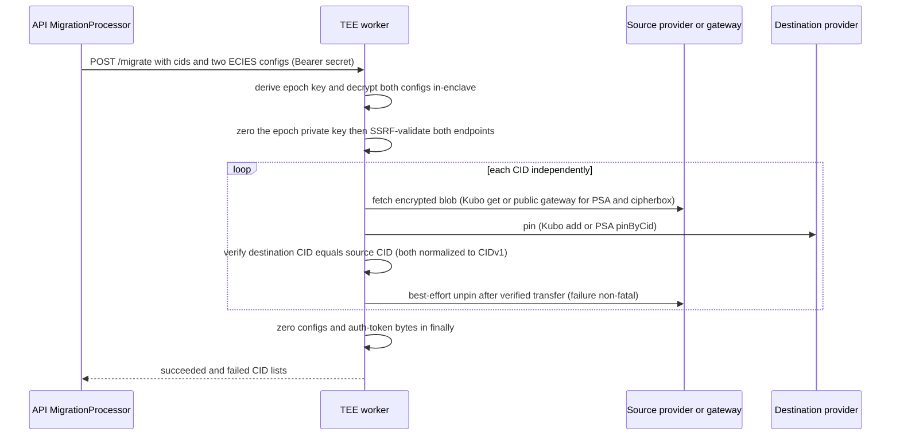

# TEE worker

| | |
| --- | --- |
| **Kind** | part |
| **Sources** | `apps/tee-worker/src/` (index, middleware/auth, middleware/metrics, routes/health, routes/metrics, routes/public-key, routes/republish, routes/migrate, routes/connection-test, services/tee-keys, services/key-manager, services/ipns-signer, services/migration-worker, services/ssrf-validation, services/logger), `apps/tee-worker/README.md`, `apps/tee-worker/Dockerfile`, `apps/tee-worker/docker-compose.yml`, `apps/tee-worker/docker-compose.phala.yml`, `apps/tee-worker/package.json`, `docker/docker-compose.yml`, `docker/docker-compose.staging.yml`, `apps/api/src/tee/` (tee.service, tee.controller, dto/connection-test.dto), `apps/api/src/migration/migration.processor.ts`, `docs/DEPLOYMENT.md`, `docs/CONFIGURATION.md`, `docs/ARCHITECTURE.md`, `.planning/phases/67-tee-lease-renewer-contract-rewrite/67-CONTEXT.md`, `.planning/REQUIREMENTS.md` (TEE-01..07), `.planning/security/REVIEW-2026-07-12-phase76.md`, `.github/workflows/ci.yml` |
| **Verified against** | cipher-box `27c4abec5` |
| **Status** | draft |

## Purpose and scope

The TEE worker (`apps/tee-worker`, package `cipherbox-tee-worker`) is the only server-side
component permitted to hold plaintext secrets that the zero-knowledge API must never see.
It is a standalone Express HTTP app, deployed as a Phala Cloud CVM in production and as a
plain Docker container (simulator mode) locally and in staging. It owns three
capabilities:

1. **IPNS lease renewal** — decrypt an ECIES-wrapped `ipnsPrivateKey` in-enclave, re-sign
   an existing IPNS record with only a later end-of-life, and discard the key. The
   renewal *protocol* — enrollment, the 6-hour cycle, CAS write-backs, epoch rotation and
   grace, lapse behavior — is owned end-to-end by
   [flows/republish-liveness.md](../flows/republish-liveness.md) and is not restated
   here; this spec covers the worker's side of the wire only.
2. **Key-derivation authority** — every per-epoch secp256k1 `teePublicKey` in the system
   originates here (`GET /public-key`); the matching private keys are derived on demand
   and never persisted.
3. **Enclave-shielded provider-credential operations** — batch CID migration between IPFS
   providers (`POST /migrate`) and server-side IPFS endpoint probing
   (`POST /connection-test`), both of which exist so that user provider credentials are
   decrypted only inside the enclave, never in the API.

This spec covers the app as a deployable part: route surface and auth, the key-derivation
modes and the epoch clock(s), the enclave trust boundary and zeroization discipline,
config/env surface, batch limits and timeouts, and deployment rules. The API-side
counterpart surfaces (`TeeService`, `tee_key_state`, the republish scheduler) belong to
[api.md](api.md) and the flow spec. The ECIES and IPNS primitives the worker calls belong
to [crypto.md](crypto.md) / [core-codecs.md](core-codecs.md).

## Vocabulary

- **`teePublicKey`** — 65-byte uncompressed (0x04-prefixed) secp256k1 public key, one per
  `keyEpoch`, derived deterministically by this worker.
- **`keyEpoch`** — small sequential integer (valid range 1–10 000) identifying which TEE
  key a ciphertext was wrapped for. Nominal duration 4 weeks (`EPOCH_DURATION_MS`).
- **Internal current epoch** — the epoch the worker computes from its own clock:
  `floor((now − EPOCH_ZERO_TIMESTAMP_MS) / 4 weeks) + 1`, clamped to ≥ 1
  (`services/tee-keys.ts getInternalCurrentEpoch`). The republish path's only epoch
  authority.
- **`TEE_CURRENT_EPOCH`** — an *unrelated* env-var epoch (default 1) reported by
  `GET /health` and used as the `/migrate` fallback epoch. Disconnected from the internal
  current epoch — see Known gaps.
- **`TEE_MODE`** — `'simulator'` (default) or `'cvm'`; selects the key-derivation backend
  and toggles SSRF protection.
- **dstack / `app_id`** — Phala's in-CVM key-derivation service
  (`@phala/dstack-sdk`, socket `/var/run/dstack.sock`). Derived keys are bound to the
  CVM's application identity; a new `app_id` means all epoch keys change.
- **`TEE_WORKER_SECRET`** — shared bearer secret; the only authentication the worker has.
- **Provider config** — `{ endpoint, authToken?, protocol }` JSON describing a
  user-configured IPFS provider (`kubo` RPC, `psa` pinning service, or `cipherbox`),
  delivered to the worker as ECIES ciphertext under a `teePublicKey`.

## Actors and trust boundaries

| Actor | Sees | Must never see |
| --- | --- | --- |
| CipherBox API | `TEE_WORKER_SECRET`, everything on the worker's wire (ciphertexts, signed records, results) | plaintext `ipnsPrivateKey`, TEE epoch private keys, plaintext provider credentials |
| TEE worker | transient plaintext: `ipnsPrivateKey` (republish), provider endpoint + auth token (migrate, connection-test), per-epoch secp256k1 private keys; opaque encrypted content blobs (migrate) | the database (no access of any kind), user JWTs, folder/file keys, any content plaintext |
| Phala dstack (cvm mode) | key-derivation requests `('cipherbox/ipns-republish', 'epoch-N')` | nothing else — the worker never sends it user data |
| External IPFS providers / gateway (migrate, connection-test) | HTTP requests bearing the user's own provider auth token, encrypted content blobs | TEE keys, IPNS keys |
| Prometheus scraper | `GET /metrics` counters/histograms (unauthenticated) | any per-user or key-bearing label |

The worker is **stateless**: no database connection, no persisted keys, no on-disk state.
Everything durable lives behind the API. Its only inbound trust relationship is the
bearer secret; the API is trusted to relay but *not* to influence signing — on the
republish path the worker verifies the existing record's signature and derives its own
epoch before anything else (see the flow spec's
[trust-boundary section](../flows/republish-liveness.md#actors-and-trust-boundaries)).

Plaintext lifetime per route:

| Route | Plaintext material | Lifetime and disposal |
| --- | --- | --- |
| `POST /republish` | `ipnsPrivateKey` (32 B), epoch private key | key zeroed (`fill(0)`) on every exit path — success, binding failure, re-enroll, catch (`routes/republish.ts`); epoch private key zeroed in `finally` (`key-manager.ts decryptIpnsKey`) |
| `POST /migrate` | epoch private key, provider configs, auth tokens (as `Uint8Array`) | all zeroed in one `finally` block (`services/migration-worker.ts migrateBatch`); tokens also flow briefly as immutable JS strings to provider constructors (cannot be zeroed — noted in code) |
| `POST /connection-test` | epoch private key, provider config, auth token | config/token bytes zeroed in `finally`; epoch private key zeroed inline on the success path only (see Known gaps) |
| `GET /public-key` | epoch private key (derived, discarded) | **not zeroed** (see Known gaps) |

## Data structures

### Republish wire contract (`RepublishEntry` / `RepublishResult`)

Owned by [flows/republish-liveness.md](../flows/republish-liveness.md#republishentry--republishresult-apitee-json-post-republish);
the worker's copy of the types is `apps/tee-worker/src/routes/republish.ts:57-74` (the
API mirrors them in `apps/api/src/tee/tee.service.ts`). Constraint this part owns: the
request deliberately carries **no** `latestCid`, `sequenceNumber`, `currentEpoch`, or
`previousEpoch` fields — the worker must not read them even if sent (phase 67 D-01/D-03,
`67-CONTEXT.md`).

### Migrate request/response (API→worker JSON, `POST /migrate`)

No DTO layer — shapes are inline in `routes/migrate.ts`.

| Request field | Type | Notes |
| --- | --- | --- |
| `cids` | string[] | 1–50 entries, each a parseable CIDv0/CIDv1, ≤ 200 chars |
| `sourceConfigEncrypted` | hex string | ECIES-wrapped provider config, ≤ 10 000 chars |
| `destConfigEncrypted` | hex string | same |
| `currentEpoch` | number, optional | epoch used to decrypt the configs; falls back to `TEE_CURRENT_EPOCH` (default 1). The API's `MigrationProcessor` never sends it, so the env fallback is what runs in practice (`apps/api/src/migration/migration.processor.ts:72-80`) |

Response: `{ succeeded: string[], failed: string[] }` (CIDs partitioned by outcome), or
`400` on validation failure, `500` with `{ error }` if the whole batch throws.

### Connection-test request/response (`POST /connection-test`)

Request `{ encryptedConfig: hex, epoch: number }`; the plaintext config is
`{ endpoint: string, authToken?: string }`. The API fronts this route with a
JWT-authenticated, rate-limited proxy (`POST /tee/connection-test`, 10 req/min,
`apps/api/src/tee/tee.controller.ts`) whose DTO validates only `@IsInt() @Min(0)` on
`epoch` — the client sends `teeKeys.currentEpoch` and wraps under
`teeKeys.currentPublicKey` (`apps/web/src/components/settings/ConnectionTest.tsx`).

Response is always HTTP 200 once past field validation (missing fields → 400):
`{ success, protocol?: 'kubo' | 'psa', version?, latencyMs, error? }` — probe failures,
SSRF rejections, and decrypt errors all surface as `success: false` with a message.

### Provider config (memory only)

`services/migration-worker.ts ProviderConfig`:
`{ endpoint: string, authTokenBytes: Uint8Array, protocol: 'psa' | 'kubo' | 'cipherbox' }`.
Auth tokens are deliberately kept as `Uint8Array` so they can be zeroed; `'cipherbox'`
protocol entries skip SSRF validation and are pinned/unpinned by the API-side
`MigrationProcessor`, not the worker.

### Health and public-key responses

- `GET /health` → `{ healthy: true, mode, epoch, uptime }` where `epoch` is
  `parseInt(TEE_CURRENT_EPOCH || '1')` (`routes/health.ts` — env-sourced, *not* the
  internal clock; a malformed env value serializes as `null` since `NaN` has no JSON
  representation).
- `GET /public-key?epoch=N` → `{ epoch, publicKey: <130-char hex> }`; `epoch` must be an
  integer in `[MIN_EPOCH, MAX_EPOCH]` = `[1, 10000]` (400 otherwise), 500 on derivation
  failure.

### Per-epoch public-key cache (memory only)

`services/tee-keys.ts publicKeyCache`: `Map<epoch, publicKey>`, bounded to 100 entries
with oldest-inserted eviction (memory-DoS guard). Public keys only — private keys are
never cached and are re-derived on every use.

### Derivation constants

| Constant | Value | Where |
| --- | --- | --- |
| `MIN_EPOCH` / `MAX_EPOCH` | 1 / 10 000 | `tee-keys.ts` |
| `EPOCH_DURATION_MS` | 4 weeks | `tee-keys.ts` |
| simulator HKDF inputs | seed `'cipherbox-tee-simulator-seed'`, salt `'cipherbox-dev'`, info `epoch-<N>`, HKDF-SHA256 → 32 B | `tee-keys.ts` |
| dstack derivation path | `getKey('cipherbox/ipns-republish', 'epoch-<N>')`, first 32 B of the result | `tee-keys.ts` |
| `TEE_RECORD_LIFETIME_MS` | 48 h (renewed-record validity window) | `ipns-signer.ts` |

## Interface

Single Express app (`src/index.ts`), JSON body limit **10 MB**, listening on `PORT`
(default 3001). Auth = `Authorization: Bearer <TEE_WORKER_SECRET>`, length-checked then
constant-time compared (`middleware/auth.ts`); an unset secret fails closed with 500 on
every protected route. There is no worker-side rate limiting.

| Route | Auth | Caller | Capability |
| --- | --- | --- | --- |
| `GET /health` | no | API `TeeService.getHealth` (boot-time `tee_key_state` seeding), compose healthchecks | liveness + mode + env-epoch report |
| `GET /metrics` | no | Prometheus | request-duration histogram, republish/migration counters |
| `GET /public-key?epoch=N` | yes | API `TeeService.getPublicKey` (seeding `tee_key_state`) | serves the per-epoch `teePublicKey` |
| `POST /republish` | yes | API `RepublishService` via `TeeService.republish` (BullMQ 6 h cycle, ≤ 100 entries/batch, 30 s API-side timeout) | batch IPNS lease renewal |
| `POST /migrate` | yes | API `MigrationProcessor` (BullMQ, batches of 10, 300 s API-side timeout) | batch CID migration between IPFS providers |
| `POST /connection-test` | yes | API `TeeService.connectionTest`, proxying the JWT-authenticated `POST /tee/connection-test` | server-side IPFS endpoint probe |

## Dependencies

- **`@cipherbox/crypto`** — ECIES `wrapKey`/`unwrapKey`; `parseIpnsRecord`,
  `verifyIpnsRecordSignature`, `publicKeyFromIpnsName`, `deriveEd25519PublicKey` (the
  verify-in-enclave primitives bundled per phase 67 D-01).
- **`@cipherbox/core`** — `createIpnsRecord` + `marshalIpnsRecord` (the renewal re-sign).
- **`@cipherbox/sdk-core`** — `KuboProvider` / `PsaProvider` for migrate, with injected
  SSRF-safe fetch.
- **`@phala/dstack-sdk`** — cvm-mode key derivation (dynamically imported; only resolvable
  inside a CVM).
- **`@noble/hashes` / `@noble/secp256k1`** — simulator HKDF and public-key derivation.
- **`express`, `prom-client`, `undici`, `multiformats`** — HTTP, metrics, DNS-pinned
  fetch agent, CID parsing.

## Behaviors

### Epoch keypair derivation

- **Trigger** — any route needing an epoch key (`getKeypair(epoch)` /
  `getPublicKey(epoch)` in `services/tee-keys.ts`).
- **Steps**
  1. Production guard: if `TEE_MODE=simulator` and the environment is production
     (`CIPHERBOX_ENVIRONMENT === 'production'`, or `NODE_ENV === 'production'` when
     `CIPHERBOX_ENVIRONMENT` is unset), throw typed `TeeKeyUnavailableError`. Note this
     fires at **derivation time**, not process start — the server boots fine and fails on
     first key use (docs claim "blocked at startup"; see Known gaps).
  2. simulator: `privateKey = HKDF-SHA256(seed, salt, 'epoch-<N>')` — deterministic and
     **public** (the seed is a string constant in the repo); anyone can derive simulator
     epoch keys, which is why the production guard exists.
  3. cvm: `DstackClient.getKey('cipherbox/ipns-republish', 'epoch-<N>')`, accepting both
     the v0.5+ `{ key }` and legacy `{ asUint8Array() }` return shapes; any other shape →
     `TeeKeyUnavailableError`. Keys are hardware-backed and bound to the CVM `app_id`.
  4. `publicKey = secp256k1(privateKey)` uncompressed (65 B); public key cached
     (bounded 100).
- **Postconditions** — deterministic per `(mode, app identity, epoch)`: the same epoch
  always yields the same keypair, which is what makes the worker safely stateless and
  restartable.
- **Failure modes** — `TeeKeyUnavailableError` is a config/infra signal and is rethrown
  typed through `decryptWithFallback` so it is never masked as a corrupted user key
  (`key-manager.ts`; verdict in `.planning/security/REVIEW-2026-07-12-phase76.md`).

### The epoch clock — two disconnected sources

The worker has **two** notions of "current epoch" that never consult each other:

1. **Internal current epoch** (`getInternalCurrentEpoch`) —
   `max(1, floor((Date.now() − EPOCH_ZERO_TIMESTAMP_MS) / 4 weeks) + 1)`, read from the
   env **at call time**; unset/malformed/non-positive anchors all collapse to epoch 1.
   This is the sole epoch authority for the republish path: the stale floor
   (`keyEpoch < internal − 1` → `ReEnrollRequiredError` before any decrypt attempt), the
   trial-2 decrypt fallback, and the re-wrap target
   (flow spec [INV-6/INV-7](../flows/republish-liveness.md#invariants)).
2. **`TEE_CURRENT_EPOCH` env** (default 1) — reported by `GET /health` and used as the
   `/migrate` epoch fallback. The API seeds `tee_key_state` from the *health* epoch at
   boot, so the epoch clients wrap under descends from this env var, not the clock.

At the pinned commit, no deploy config sets either variable
(`EPOCH_ZERO_TIMESTAMP_MS` appears only in `apps/tee-worker` source/tests and phase-67
planning docs; `TEE_CURRENT_EPOCH` is read only by `routes/health.ts` and
`routes/migrate.ts` and set nowhere), so both clocks sit at epoch 1 and the divergence is
latent. The failure shape if they diverge is documented in the flow spec's
[Known gaps](../flows/republish-liveness.md#known-gaps-and-quirks).

### IPNS lease renewal (`POST /republish`)

The per-entry pipeline — parse, verify-signature-before-decrypt, stale-floor decrypt with
fallback, name↔key binding via the *decrypted* key, same-CID/same-sequence re-sign with a
strictly-later 48 h EOL, optional re-wrap to the internal epoch, zeroize — is specified
normatively in
[flows/republish-liveness.md § Six-hour republish cycle](../flows/republish-liveness.md#six-hour-republish-cycle)
and its INV-1..INV-8. Worker-local facts this spec owns:

- **Batch cap** — `MAX_BATCH_SIZE = 100`; a larger batch is rejected whole with 400
  (matching the API's send-side batch size).
- **Per-entry isolation** — entries are processed sequentially and independently; a
  `null`/non-object entry yields a per-entry failure result (`ipnsName: 'unknown'`)
  rather than a batch crash (phase 76 hardening, T-76-08).
- **Renewal primitive** — `renewIpnsRecord(privateKey, existingRecordBytes)` takes no CID
  or sequence argument; both come exclusively from parsing the existing record, and an
  equal-or-earlier on-wire EOL throws `EolRollbackError` (never compared against wall
  clock — `services/ipns-signer.ts`).
- **Error surface** — per-entry `error` strings are sanitized (typed errors carry epoch
  integers or config context, never key bytes); a stale key yields
  `error: 'RE_ENROLL_REQUIRED'` + `requiresReEnroll: true`.
- **Metrics** — `cipherbox_tee_republish_entries_total{result}` incremented per entry;
  batch summary logged as counts only.

### Serving the epoch public key (`GET /public-key`)

- **Trigger** — API boot (`TeeService.initializeFromTee`) when `tee_key_state` is empty;
  the fetched key (validated API-side as 65-byte 0x04-prefixed) becomes the
  `teePublicKey` every client wraps under.
- **Steps** — validate `epoch ∈ [1, 10000]` → `getPublicKey(epoch)` (cache or derive) →
  hex-encode. 500 with a generic message on derivation failure (the epoch is logged,
  never key material).
- **Postconditions** — this response is the origin of all `encryptedIpnsPrivateKey` and
  encrypted provider-config ciphertexts in the system.

### Health (`GET /health`)

Unauthenticated; returns `{ healthy: true, mode, epoch, uptime }`. `healthy` is
unconditionally `true` — the endpoint proves only that Express is serving; it does not
probe key derivation, so a CVM with a broken dstack socket still reports healthy.
Consumers: the API's boot-time seeding and epoch-drift warning (logged only, never
auto-rotation), Docker healthchecks (`wget /health`), and the admin republish-health
surface via `TeeService.getHealth`.

### Batch CID migration (`POST /migrate`)

Moves a user's pinned, already-encrypted blobs between IPFS providers without the API
ever seeing the provider credentials. Content is opaque ciphertext throughout — the
worker gains no plaintext access.

- **Trigger** — API `MigrationProcessor` (BullMQ), batching the user's `pinned_cids` 10
  at a time with a 5-minute per-batch client timeout.
- **Preconditions** — the client wrapped both provider configs under the current
  `teePublicKey`; the request passes validation (1–50 valid CIDs, hex configs ≤ 10 000
  chars).

- **Steps (normative detail)** — epoch = request `currentEpoch` ?? `TEE_CURRENT_EPOCH`
  (in practice always the fallback — the API never sends it); configs are decrypted with
  that epoch's key (`migrateBatch`, `services/migration-worker.ts`); endpoints with
  protocol `'cipherbox'` skip SSRF validation and are handled API-side; source fetch for
  non-Kubo protocols goes through `IPFS_GATEWAY_URL` (default `https://ipfs.io`); every
  provider operation carries a 60 s timeout (`MIGRATION_TIMEOUT_MS`); a CID whose
  destination CID mismatches is counted failed (integrity gate).
- **Postconditions** — per-CID partition returned; Prometheus
  `cipherbox_tee_migration_cids_total{result}` incremented; summary logged as counts,
  never credentials.
- **Failure modes** — batch-level throw (undecryptable config, SSRF rejection) → 500;
  per-CID failures are swallowed into `failed`; the API pauses the whole migration on a
  401 from the worker.

### Connection test (`POST /connection-test`)

- **Trigger** — a user testing a custom provider in web settings; the API proxies the
  ECIES payload verbatim.
- **Steps** — derive the requested epoch's keypair → decrypt the config → zero the
  private key → SSRF-validate the endpoint → probe Kubo (`POST <endpoint>/api/v0/id`,
  Basic auth) then PSA (`GET <endpoint>/pins?limit=1`, Bearer auth) sequentially, 10 s
  each — first recognized protocol wins; 401/403/422 from a probe is reported as
  "endpoint speaks the protocol but auth failed".
- **Postconditions** — `{ success, protocol?, version?, latencyMs, error? }`; config and
  token bytes zeroed in `finally`.
- **Failure modes** — every error after field validation returns HTTP 200 with
  `success: false` (the probe result *is* the payload); unlike `/public-key`, the epoch
  is not range-checked here (API DTO allows any int ≥ 0).

### Observability

`GET /metrics` (unauthenticated) exposes
`cipherbox_tee_http_request_duration_seconds{method,route,status_code}` (self-scrapes
excluded), plus the republish/migration counters. Logging is a dependency-free NDJSON
logger (`services/logger.ts`) with an explicit no-key-material rule; error messages from
typed errors carry epoch integers and config context only.

## Runtime variants

| | `TEE_MODE=simulator` (default) | `TEE_MODE=cvm` |
| --- | --- | --- |
| Key derivation | HKDF from a fixed **public** seed — deterministic, reproducible by anyone | Phala dstack `getKey`, hardware-backed, bound to the CVM `app_id` |
| Production allowed | no — `TeeKeyUnavailableError` at first derivation when the env is production | yes (required) |
| SSRF protection (`services/ssrf-validation.ts`) | **entirely disabled** — `validateEndpointUrl` returns early, `ssrfSafeFetch` is a plain `fetch` (redirects still refused) | HTTPS-only, private/link-local/CGN/metadata/`.internal`/`.local` blocks, DNS resolution check, and TOCTOU-safe DNS pinning via a custom undici `Agent` lookup (hostname preserved for TLS SNI) |
| Used by | local dev (`docker/docker-compose.yml`), staging (`docker/docker-compose.staging.yml`), CI (`ci.yml` boots the worker for the sdk-e2e tee-republish suite) | production Phala CVM (`apps/tee-worker/docker-compose.phala.yml`) |

Deployment facts:

- **Never recreate the CVM.** Production deploys must *update* the existing Phala CVM
  (`phala deploy` with the same name) — deleting and recreating changes the `app_id`,
  which silently invalidates **every** epoch key ever derived, making all stored
  `encryptedIpnsPrivateKey` ciphertexts permanently undecryptable
  (`apps/tee-worker/docker-compose.phala.yml` header, `docs/DEPLOYMENT.md`).
- The Docker image bakes `NODE_ENV=production` (`Dockerfile`), so every simulator deploy
  of the image **must** set `CIPHERBOX_ENVIRONMENT` to a non-production value or key
  derivation throws; local compose sets `development`, staging sets `staging`, and the
  Phala config sets `staging` too (despite being the "production-mode" cvm config — the
  deployed CVM is named `cipherbox-tee-staging`).
- **Local port trap** — in `docker/docker-compose.yml` the worker binds host
  `127.0.0.1:3002` (host 3001 is `mock-ipns-routing`), while the API's `TEE_WORKER_URL`
  defaults to `http://localhost:3001`; an unset URL silently "initializes" against the
  mock router.
- `apps/tee-worker/docker-compose.yml` is a stray near-duplicate of the Phala config
  (cvm mode, dstack socket, no `CIPHERBOX_ENVIRONMENT`) with no referencing workflow or
  doc — apparently a legacy direct-Docker CVM deploy file.

Environment surface (as built — contrast with the documented tables in Known gaps):

| Variable | Default | Read by | Effect |
| --- | --- | --- | --- |
| `PORT` | `3001` | `index.ts` | listen port |
| `TEE_MODE` | `simulator` | `tee-keys.ts`, `ssrf-validation.ts`, `index.ts`, `health.ts` | derivation backend, SSRF on/off |
| `TEE_WORKER_SECRET` | — (500 on protected routes when unset) | `middleware/auth.ts` | bearer auth |
| `CIPHERBOX_ENVIRONMENT` | — | `tee-keys.ts` | production guard (overrides `NODE_ENV` when set) |
| `NODE_ENV` | — (`production` in the image) | `tee-keys.ts` | production guard fallback |
| `TEE_CURRENT_EPOCH` | `1` | `health.ts`, `migrate.ts` | health-reported epoch, migrate fallback epoch — **not** the republish epoch |
| `EPOCH_ZERO_TIMESTAMP_MS` | — (→ internal epoch pinned to 1) | `tee-keys.ts` | anchor of the internal epoch clock |
| `IPFS_GATEWAY_URL` | `https://ipfs.io` | `migration-worker.ts` | migrate source-fetch gateway |

## Invariants

Renewal-contract invariants (verify-before-decrypt, same-CID/same-sequence, strictly
later EOL, name↔key binding, internal-epoch authority, re-wrap target) are owned by
[flows/republish-liveness.md](../flows/republish-liveness.md#invariants) INV-1..INV-8 and
are not renumbered here. Part-level invariants:

1. **INV-1** — The worker MUST be stateless: no database access, no persisted key
   material, no state that survives restart beyond the deterministic derivation inputs.
2. **INV-2** — Every route except `GET /health` and `GET /metrics` MUST require
   `Authorization: Bearer TEE_WORKER_SECRET`, compared in constant time; an unset secret
   MUST fail closed (500), never open.
3. **INV-3** — Plaintext secrets (IPNS private keys, epoch private keys, provider
   credentials) MUST exist only transiently in worker RAM, MUST never be persisted,
   logged, or included in any response except as ECIES ciphertext, and MUST be zeroed
   after last use on the republish and migrate paths.
4. **INV-4** — Simulator-mode key derivation MUST be refused when the environment is
   production (`CIPHERBOX_ENVIRONMENT`, falling back to `NODE_ENV`).
5. **INV-5** — Epoch key derivation MUST be deterministic per
   `(mode, app identity, epoch)`; the in-memory cache MUST hold public keys only.
6. **INV-6** — In cvm mode, every fetch to a user-supplied endpoint MUST be HTTPS, MUST
   NOT resolve to a private/internal/metadata address, MUST pin the validated IP for the
   actual connection (DNS-rebinding defense), and MUST refuse redirects.
7. **INV-7** — A migrated CID MUST be reported succeeded only after the destination
   provider's returned CID equals the source CID (both normalized to CIDv1).
8. **INV-8** — Batch caps MUST be enforced request-wide (400): 100 entries for
   `/republish`, 50 CIDs for `/migrate`; within an accepted batch, one entry's failure
   MUST NOT affect the others.
9. **INV-9** — Config/infra failures (`TeeKeyUnavailableError`) MUST propagate typed and
   MUST never be masked as user-data corruption; stale-key refusals
   (`ReEnrollRequiredError`) MUST carry epoch integers only.

## Known gaps and quirks

- **README fallback-order drift.** `apps/tee-worker/README.md` ("Key Epoch Rotation")
  describes decryption as current-epoch-then-previous-epoch fallback. The code
  (`key-manager.ts decryptWithFallback`) tries the `keyEpoch` *hint* first, then the
  internal current epoch, behind a hard stale floor (`keyEpoch < internal − 1` refused
  before any unwrap). The README's "increments roughly every 4 weeks" is also only true
  if `EPOCH_ZERO_TIMESTAMP_MS` is set — it is set nowhere, so the epoch is pinned at 1.
- **README claims `TEE_CURRENT_EPOCH` is required with no default.** The code defaults
  it to `1`, and only `GET /health` and `/migrate` read it at all. `docs/CONFIGURATION.md`
  compounds this: it says the worker "exposes the `teePublicKey` for this epoch on
  `GET /public-key`" — `/public-key` takes an explicit `epoch` query param and never
  reads the env var.
- **"Blocked at startup" is wrong in both docs.** README and `docs/CONFIGURATION.md`
  say simulator-in-production "throws at startup"; the guard lives in `getKeypair` and
  fires on first key derivation. A misconfigured worker boots, reports healthy, and
  fails on first use.
- **`EPOCH_ZERO_TIMESTAMP_MS` is undocumented.** Absent from `docs/CONFIGURATION.md`,
  the README, and every compose/deploy config — the internal epoch clock that governs
  the stale floor and re-wrap target is invisible to operators. The wider two-clocks
  divergence (health/DB epoch vs signing authority) is analyzed in the
  [flow spec's Known gaps](../flows/republish-liveness.md#known-gaps-and-quirks).
- **`docs/ARCHITECTURE.md` describes the pre-phase-67 worker** (request carrying
  `latestCid`/`sequenceNumber`, upgraded keys persisted to `ipns_republish_schedule`) —
  see the flow spec's Known gaps for the full delta.
- **Un-zeroed epoch private key on the `/public-key` path.** `getPublicKey` cache misses
  call `getKeypair` and drop the derived private key without `fill(0)`
  (`tee-keys.ts:147-155`). Likewise `/connection-test` zeroes the epoch private key
  inline on the success path only — a throw inside `unwrapKey` skips it (`finally`
  covers config/token bytes but not the keypair, `routes/connection-test.ts:44-105`).
  Contrast the republish path, where `decryptIpnsKey` zeroes it in `finally`.
- **Auth tokens leak into immutable strings.** Provider auth tokens are handled as
  zeroable `Uint8Array`s but must be re-decoded to JS strings for provider constructors
  and probe headers — those copies cannot be zeroed (acknowledged in code comments,
  `migration-worker.ts`, `connection-test.ts`).
- **SSRF protection is keyed to `TEE_MODE`, not the environment.** Simulator mode
  disables *all* endpoint validation and DNS pinning (`ssrf-validation.ts:67,100`), and
  staging runs simulator — so the staging worker will happily probe/fetch private and
  internal addresses supplied via `/connection-test` and `/migrate`.
- **Epoch validation is asymmetric across routes.** `/public-key` enforces
  `[1, 10000]`; `/connection-test` accepts any int ≥ 0 (API DTO) and `/migrate` any
  number in the body — both feed `getKeypair` unchecked, which will derive keys for
  arbitrary epochs (e.g. `epoch-0`) that no client ever wraps under. Harmless today,
  but the range invariant lives in only one route.
- **`/health` is a liveness check only** — `healthy: true` unconditionally; it does not
  exercise key derivation, so a CVM with a broken dstack socket looks healthy while
  every protected route fails. A malformed `TEE_CURRENT_EPOCH` surfaces as
  `epoch: null` (NaN → JSON null).
- **EOL guard no-ops on `Invalid Date`** — if either parsed validity is `NaN`, the
  `<=` comparison is false and `EolRollbackError` is not thrown. Assessed not
  exploitable (signature verified upstream, fresh record trusted-minted) and discarded
  as below the materiality bar in `.planning/security/REVIEW-2026-07-12-phase76.md`.
- **`TeeKeyUnavailableError.message` is returned verbatim to the relay** in per-entry
  `error` fields — deployment-posture information (no key material) crossing to the
  API; accepted at the trusted-relay boundary (same review, INFO).
- **Stray `apps/tee-worker/docker-compose.yml`** — an unreferenced cvm-mode compose file
  shadowing the Phala config; nothing in workflows or docs uses it.

## Rewrite notes

- **One epoch authority, attested.** The part's worst incidental complexity is the
  four-way epoch split (env var, internal clock, `tee_key_state`, `ipns_records.key_epoch`)
  with the worker itself contributing two mutually unaware clocks. A rewrite should have
  the worker publish a single self-derived, ideally attested epoch (and its public key)
  and delete `TEE_CURRENT_EPOCH` entirely; `/health` reporting a config value the
  signing path ignores is a trap that already misled the docs.
- **Zeroization should be structural, not per-call-site.** The codebase's discipline is
  good where it was security-reviewed (republish, migrate) and absent where it wasn't
  (`getPublicKey`, connection-test error path) — classic evidence that manual
  `fill(0)`-at-every-exit does not scale. A `withEpochKey(epoch, fn)` /
  `withSecret(bytes, fn)` scoped-borrow helper that zeroes in `finally` would make the
  gaps impossible rather than findable.
- **Two products share one enclave.** Lease renewal (system-critical, invariant-heavy)
  and provider-credential operations (user-facing convenience, SSRF surface, outbound
  fetches to arbitrary endpoints) cohabit one process and one bearer secret. The migrate/
  connection-test surface drags in sdk-core providers, undici, gateway fetches, and the
  whole SSRF apparatus — none of which the signing path needs. Splitting them (or at
  least separating secrets/ports) would shrink the audit surface of the component whose
  compromise forges nothing but whose availability everything depends on.
- **Gate SSRF on capability, not mode.** Tying SSRF protection to `TEE_MODE` conflates
  "no hardware TEE" with "trusted network"; staging gets zero protection. Gate it on an
  explicit allow-insecure flag that defaults safe.
- **The docs drifted within weeks of the phase-67 rewrite** (fallback order, required
  env vars, startup semantics). The renewal contract survived because it is locked by
  tests and invariants; the operational surface had no such anchor. A rewrite should
  treat the env-var table and route list as generated-from-code or contract-tested.
