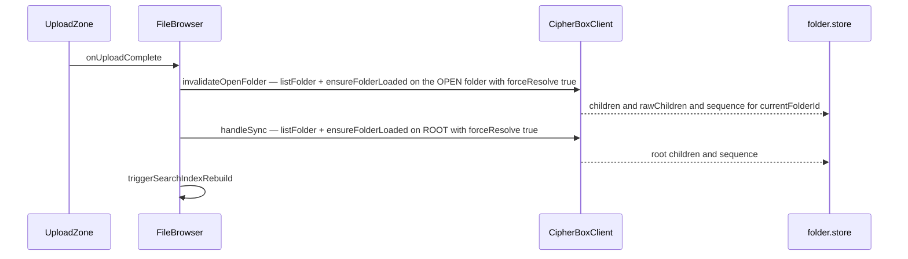

# Web app

| | |
| --- | --- |
| **Kind** | part |
| **Sources** | `apps/web/src/` (routes, stores, hooks, components/file-browser, components/layout, services, lib, utils, workers), `apps/web/vitest.config.ts`, `apps/web/package.json`, `tests/web-e2e/playwright.config.ts`, `.github/workflows/ci.yml`, `.github/workflows/ci-e2e.yml`, `.github/workflows/web-e2e.yml`, `docs/DEVELOPMENT.md`, `docs/ARCHITECTURE.md`, `.planning/REQUIREMENTS.md` (WEB-01..04, SDK-READ-01..04), `.planning/research/PITFALLS.md`, `.planning/phases/80-rotation-write-plane-and-re-mint-durability/80-CONTEXT.md`, `.planning/phases/68.1-web-client-runtime-integration/68.1-13-SUMMARY.md` |
| **Verified against** | cipher-box `27c4abec5` |
| **Status** | draft |

## Purpose and scope

`apps/web` is the browser client: a React 18 + Vite SPA that renders the vault, drives
uploads/downloads/sharing, and polls IPNS for multi-device sync. It is deliberately
**thin** (D-06): all crypto, metadata construction, IPNS publish/resolve, CAS retry, and
rotation logic live in `@cipherbox/sdk` / `@cipherbox/sdk-core`
([parts/sdk.md](sdk.md), [parts/sdk-core.md](sdk-core.md)); the web layer owns only view
structure, Zustand display/UI state, event-to-store projection, error classification UX,
and a handful of durable browser facilities (IndexedDB rotation floors and job
checkpoints, Web Locks leader election, a Service Worker for streaming decrypt, a Web
Worker for off-main-thread encryption).

This spec covers the web app's structure and state model: routes/views, the Zustand ↔
SDK `folderTree` state split (and the documented desync trap), upload/download UX and the
post-upload refresh discipline, sharing UI, sync polling, kind discrimination,
error/degraded states, and the testing posture. It does not restate the logic the web
calls into: the read/write chains and rotation engine
([parts/sdk-core.md](sdk-core.md), [flows/rotation.md](../flows/rotation.md)), grant
semantics ([flows/sharing-grants.md](../flows/sharing-grants.md)), the metadata publish
plane ([flows/metadata-sync.md](../flows/metadata-sync.md)), content
upload/download/versioning pipelines
([flows/content-storage.md](../flows/content-storage.md)), the Web3Auth Core Kit login
flow ([flows/auth.md](../flows/auth.md)), and the search index internals
([flows/search.md](../flows/search.md)).

## Vocabulary

- **`FolderNode`** — the web folder store's per-folder record
  (`apps/web/src/stores/folder.store.ts:11-47`): id, name, `ipnsName`, `parentId`,
  display `children`, raw `rawChildren`, load flags, `sequenceNumber`, `folderKey`,
  `ipnsPrivateKey`.
- **`ResolvedChild`** — SDK-resolved display listing entry (SDK-READ-02): `ipnsName`,
  `name`, `kind`, `size?`, `modifiedAt`, `sequence` — resolved once per folder load
  inside the SDK, never by the web.
- **`SealedChildRef`** — the raw identity/crypto carrier from the parent's read-body
  (frozen NODE-03 five-field set; no `kind`, no display fields). Owned by
  [parts/sdk-core.md](sdk-core.md).
- **`folderTree`** — the SDK client's in-memory folder state, keyed by `ipnsName`; the
  single owner of raw folder state (SDK-READ-03). The web store is a projection of it.
- **`invalidateOpenFolder`** — the poll-leg freshness helper that re-resolves the
  currently open folder (`apps/web/src/hooks/useSyncPolling.ts:26`).
- **`handleSync`** — the root-only resync callback passed to `useSyncPolling`
  (`apps/web/src/components/file-browser/useFileBrowserActions.ts:135`).
- **`runWithFailureUx`** — the fail-closed mutation-error classifier + bounded-backoff
  retry wrapper (`apps/web/src/hooks/useMutationFailureUx.ts:235`).
- **`'root'`** — the literal string used as the vault root's folder id in the store and
  route param, distinct from the real root `ipnsName` (resolved via
  `resolveParentIpnsName`, `apps/web/src/services/invite.service.ts:44`).
- **kind discrimination** — classifying a child as file vs folder. `isFileRef` on a bare
  `SealedChildRef` is always `false` (folder-safe); real classification goes through
  `isFileRefResolved(ref, resolvedByIpnsName)` (`apps/web/src/utils/fileTypes.ts:150-173`).

## Actors and trust boundaries

The web app runs entirely in the user's browser and holds the highest-trust position of
any client component: after login it has the user's secp256k1 vault keypair, the root
read/write keys, root IPNS signing keypair, and every decrypted folder/file key it has
touched — all memory-only, never persisted (`auth.store.ts:44`, `vault.store.ts:49`,
`folder.store.ts:94`).

| Holds / sees | Where | Never |
| --- | --- | --- |
| Vault keypair (secp256k1), access token | `auth.store` (memory only; refresh token in HTTP-only cookie) | localStorage/sessionStorage for any key or access token |
| `rootReadKey`, `rootWriteKey`, root IPNS keypair | `vault.store` (memory only, zero-filled on logout) | sent to server unencrypted |
| Per-folder `folderKey` + `ipnsPrivateKey` | `folder.store` `FolderNode`s (zero-filled on remove/clear) | persisted anywhere |
| Rotation floors + ECIES-wrapped key checkpoints | IndexedDB via the SDK's `rotation-idb-store` (ciphertext-only at rest, `rotation-state.service.ts:44-52`) | plaintext keys in IndexedDB |
| Rotation job checkpoints | IndexedDB `cipherbox-rotation-jobs` — metadata only (`rootNodeId`, status, node ids), explicitly never key bytes (`rotation-driver.service.ts:50-57`) | key material in checkpoints |
| Search index | IndexedDB, AES-256-GCM-encrypted under an HKDF key from the vault private key (`search-index.service.ts:1-9`) | plaintext index at rest |

Web3Auth Core Kit holds its own session in localStorage (its design, not CipherBox
key material); the CipherBox API sees only ciphertext, wrapped keys, and signed records
([parts/api.md](api.md)). One deliberate exception to memory-only: the DEV build exposes
`window.__ZUSTAND_FOLDER_STORE__` for E2E assertions (`folder.store.ts:294-303`) and an
error ring-buffer `window.__errorLog` (`main.tsx:26-47`) — dev-only, gated on
`import.meta.env.DEV`.

## Data structures

### Zustand store inventory (15 stores, `apps/web/src/stores/`)

All stores are plain `zustand` `create()` stores, memory-only, torn down by
`clearAllUserStores()` on logout/401 (`lib/clear-user-stores.ts:24-44` — SDK client
destroyed first, then key-bearing stores zero-filled, auth cleared last).

| Store | State it owns |
| --- | --- |
| `auth.store` | access token, `isAuthenticated`, vault keypair, `teeKeys`, pending REQUIRED_SHARE auth |
| `vault.store` | decrypted root keys (`rootReadKey`/`rootWriteKey`/`rootIpnsKeypair`), `rootIpnsName`, `vaultId`, `isNewVault` |
| `folder.store` | the folder-tree display projection (below) + navigation (`currentFolderId`, breadcrumbs) + `pendingPublishes` |
| `sync.store` | sync status (`idle\|syncing\|success\|error\|conflict`), `lastSyncTime`, `initialSyncComplete`, `isOnline` |
| `upload.store` | per-file upload rows (`encrypting\|uploading\|complete\|error`, progress, cancel source), `pendingReplacements` for the Replace dialog |
| `download.store` | single-download status/progress for the browser spinner |
| `share.store` | sent + received share grant rows (plaintext `itemName` projections, `rootGeneration`, `rootNodeId`) |
| `bin.store` | recycle-bin entries + sequence, fed by SDK `bin:updated` events |
| `restore.store` | metadata-only restore-in-flight affordance |
| `quota.store` | used/limit/remaining bytes, `canUpload` pre-check, session-versioned fetch |
| `rotation.store` | presentation-only badge state machine `idle\|root-cut\|tail-walk\|resuming` (`rotation.store.ts:13`) |
| `notification.store` | toast queue for `runWithFailureUx` notices |
| `mfa.store`, `device-registry.store`, `vault-settings.store` | MFA enrollment/devices, device registry, vault settings (retention, delete behavior, versioning) |

### `FolderNode` and the two-plane children split

`folder.store.ts:11-47`. The load-bearing structure of the whole web state model:

| Field | Type | Meaning |
| --- | --- | --- |
| `id` | string | store key — the folder's `ipnsName`, except the literal `'root'` for the vault root |
| `ipnsName` | string | IPNS name (also the route param `/files/:folderId`) |
| `parentId` | string \| null | store-tree link (breadcrumbs, subtree purge walks) |
| `children` | `ResolvedChild[]` | **display plane** — SDK-resolved listing (kind/size/modifiedAt pre-resolved); the store "never independently resolves" (SC#3, D-01) |
| `rawChildren?` | `SealedChildRef[]` | **identity/write plane** — same-session mirror of the SDK's raw children, needed wherever `readKeySealed`/`generation`/`versionFloor` are required (e.g. `resolveFileMetadata`); callers guard with `?? []` |
| `sequenceNumber` | bigint | the folder's IPNS sequence — **the clock** every freshness/staleness decision compares against |
| `folderKey`, `ipnsPrivateKey` | Uint8Array | decrypted keys, zero-filled on `removeFolder`/`clearFolders` |

**Write discipline / desync law.** State exists in BOTH the Zustand store and the SDK
`folderTree` — the historically bug-prone split, canonized as Pitfall 13 in
`.planning/research/PITFALLS.md:246-261` ("the web app's `folderTree` and the SDK
client's `folderTree` are separate state stores … the scope-exit check at delete/move
time reads the Zustand store, which is stale"; the `#489`/`#494` "Folder not loaded" /
merge-resurrects-deleted-files bug class). The as-built rules:

1. The SDK `folderTree` is the single owner of raw folder state; the store is a
   projection fed from exactly three writer classes: the `folder:loaded`/`folder:updated`
   event subscription (`folder.store.ts:231-291`), the nav-triggered
   `refreshFolderListing` (`useFolderNavigation.ts:68-81`), and the poll-triggered
   `invalidateOpenFolder` (`useSyncPolling.ts:26-68`).
2. `sequenceNumber` is the monotonic clock: every writer drops its result when the store
   already holds a strictly newer sequence (event guard `folder.store.ts:274`; poll guard
   `useSyncPolling.ts:57-58`). An empty-children event may never blank a loaded,
   non-empty folder at or below the store's sequence (breadcrumb-up empty-flash guard,
   `folder.store.ts:255-265`); a genuine emptying arrives at a newer sequence and is
   adopted.
3. Reconcile-before-mutation lives in the SDK (`reconcileFolderSequence`, 68-05):
   `folderTree` is reconciled against the current IPNS `sequenceNumber` before any
   scope-exit predicate/publish, and a failed reconcile DEFERS the mutation rather than
   skipping the rotation (Pitfall 13's prescription, `PITFALLS.md:255`). The web never
   pre-reconciles — it only classifies the resulting `ReconcileStaleError` in
   `runWithFailureUx` and retries with bounded backoff (see Behaviors).
4. Mutations write nothing back directly: hooks call the SDK client and let the
   `folder:updated` event update the store ("reads NOTHING back", `useSharedWriteOps.ts:1-12`
   for the shared plane; `useFolderMutations.ts:100-108` for the owned plane). The
   exceptions are store-only bookkeeping the SDK cannot know: new-folder store node
   insertion, folder-rename name field, moved-folder `parentId`, and deleted-subtree
   purge (`useFolderMutations.ts:162-174,217-219,262-270,393-403`).

The SDK↔store key mapping is by `ipnsName`, never by node UUID: the event subscription
reverse-looks-up `f.ipnsName === event.ipnsName` (`folder.store.ts:243`), and both
`useFolderMutations.handleCreate` (`:154-161`) and `useFolderNavigation.navigateTo`
(`:320-325`) carry do-not-fix comments recording that UUID-keying created orphaned store
entries that silently swallowed `folder:updated` events.

### Shared-folder state (per-depth, hook-owned)

Shared browsing does not use `folder.store`. `useSharedNavigation` owns a view state
machine (`list | folder | file`), a nav stack of suspended depths (each entry:
children + `folderKey` + `writeKey` + `publishedNode` + `ipnsName` + sequence,
`useSharedNavigation.ts:159-170`), and refs for the active depth's `ipnsPrivateKey` and
`writeKey` (zeroed on every exit path — the zeroization audit is spelled out in
`useSharedNavigationActions.ts:18-39`). On every depth change the hook seeds the SDK's
`sharedFolderTree` (`seedSharedFolder` → `client.loadSharedFolder`, which clones key
buffers; `shared-folder-projection.ts:88-115`), and the `sharedFolder:updated`
subscription is the sole writer of the children/sequence projection — raw children are
re-read from `client.getSharedFolderState` at event time because the event itself now
carries only the resolved display listing (`shared-folder-projection.ts:124-158`).

### Durable browser state (IndexedDB)

- **Rotation high-water floors + wrapped-key checkpoints** — thin wiring over
  `@cipherbox/sdk`'s `rotation-idb-store` (hoisted out of the web in 70.1-02 precisely
  so it would be CI-unit-tested; `rotation-state.service.ts:1-19`). Injected into the
  SDK client as `rotationHighWater` at construction (`useAuth.ts:346-349`). Durability
  is the point: the `{nodeId → highestGeneration}` floor must survive a page refresh or
  the M1 relay-rollback defense evaporates (Pitfall 3, `PITFALLS.md:49-64` — "any
  in-memory-only implementation silently removes the protection after restart"); the
  in-memory fallback exists only as the D-08 degraded mode with its warning toast.
- **Rotation job checkpoints** — `cipherbox-rotation-jobs` DB, metadata-only
  (`rotation-driver.service.ts:46-57`), driving the header badge and resume-on-load.
- **Encrypted search index** — MiniSearch serialized, AES-GCM-encrypted under an
  HKDF-derived key (`search-index.service.ts:1-9`).

## Interface

The web app's "public surface" is its routes (hash-routed, `routes/index.tsx:11-21`):

| Route | View | Purpose |
| --- | --- | --- |
| `/` | `Login` | Core Kit auth (Google / email OTP / SIWE wallet), REQUIRED_SHARE recovery/approval UI |
| `/files/:folderId?` | `FilesPage` → `FileBrowser` | owned vault browsing; `folderId` is an `ipnsName` (absent = root) |
| `/shared` | `SharedPage` → `SharedFileBrowser` | received shares: flat list, then per-share folder/file browsing with `[RW]/[RO]` badges |
| `/bin` | `BinPage` → `BinBrowser` | flat recycle-bin list; restore / permanent delete / empty; auto-purge on mount |
| `/settings` | `SettingsPage` | tabs: linked-methods, security (MFA), storage (BYO pinning), vault; `VaultExport` below |
| `/invite/:token` | `InvitePage` | standalone invite-claim landing page (no AppShell); ephemeral private key read from the URL hash fragment, never sent to the server |
| `/dashboard` | redirect → `/files` | legacy alias |

Authenticated pages wrap in `AppShell` (header with sync indicator + rotation badge +
search trigger, sidebar nav + storage quota, footer, Matrix background, cross-page
overlays: search palette, device-approval modal, MFA enrollment prompt, notification
toasts; `AppShell.tsx:30-46`). There is no route guard component — each page redirects
to `/` itself when `!isLoading && !isAuthenticated` (`FilesPage.tsx:16-21`).

Secondary interfaces: `window.__ZUSTAND_FOLDER_STORE__` (DEV-only E2E hook), the
`/decrypt-stream/{ipnsName}` Service Worker URL scheme for streaming media previews
(`workers/decrypt-sw.ts`, registered in `main.tsx:60-75`), and
`apps/web/public/recovery.html` — a separately-built, server-independent recovery tool
(`recovery-src/`, [flows/vault-export-recovery.md](../flows/vault-export-recovery.md)).

## Dependencies

- **`@cipherbox/sdk`** — everything: the singleton `CipherBoxClient`
  (`lib/sdk-provider.ts`), all read/write/share/bin/rotation operations, error classes,
  `runOwnerReconcile`, the IndexedDB rotation store. [parts/sdk.md](sdk.md).
- **`@cipherbox/api-client`** — Orval-generated typed REST functions sharing ONE axios
  instance with the SDK (`lib/api-config.ts:15-56`: token injection, 401 refresh via
  HTTP-only cookie, forced `clearAllUserStores()` on refresh failure). Share/invite
  endpoints are called directly from components (ShareDialog) — grant plumbing is the
  one area where the web still speaks REST itself.
- **`@cipherbox/crypto`** — browser ECIES/AES primitives for the few web-side wraps:
  share `itemName` encryption, invite ephemeral-key bridge, content decrypt in
  `download.service`/preview paths.
- **`@cipherbox/core` / `@cipherbox/sdk-core`** — **type-only** (D-07/SDK-READ-04): zero
  runtime imports from either package anywhere in `apps/web/src` (grep-verified at the
  pinned commit; all remaining imports are `import type` / inline `type` specifiers).
- **Platform**: Web3Auth Core Kit (login/TSS key export), wagmi (SIWE wallet),
  react-router (hash), react-dropzone, @tanstack/react-query (configured in
  `main.tsx:77-84`; used for health checks — folder state deliberately does NOT use
  it), MiniSearch, Grafana Faro (error boundary + telemetry).

## Behaviors

### Login → SDK client construction

- **Trigger** — Core Kit login success or session restore (`useAuth.ts:715-757`).
- **Steps** (`useAuth.ts initializeOrLoadVault`, module-level-deduplicated `:43-48`)
  1. Export the vault keypair from Core Kit TSS; store in `auth.store`.
  2. Create a **throwaway bootstrap client** (`createBootstrapClient`,
     `sdk-provider.ts:101-114`) — a `CipherBoxClient` with placeholder root
     keys, valid only for facade calls that mint/load the very keys the real client
     needs (vault blob resolve/deserialize, `bootstrapVaultKeys`,
     `publishEmptyRootNode`, config-blob resolve). Destroyed in a `finally` (D-09).
  3. Existing vault: resolve the vault-key IPNS blob, ECIES-unwrap
     `rootReadKey`/`rootWriteKey` (IPNS keypair is derived from the private key, not
     stored); new vault: mint keys, publish v3 key blob (sequence 1) + empty root Node,
     register with the API (zero-crypto: only `ownerPublicKey` + `rootIpnsName` cross
     the wire, `useAuth.ts:222-229`).
  4. Load BYO pinning config (10 s time-boxed, degrade to cipherbox-only) and vault
     settings in parallel.
  5. Construct the real `CipherBoxClient` with root keys, `teeKeys`,
     `rotationCallbacks` (badge/checkpoint/leader-election driver) and the durable
     `rotationHighWater` gate (`useAuth.ts:319-350`); subscribe `folder.store` and
     `bin.store` to its events; wire the opportunistic per-folder owner-reconcile onto
     `folder:updated` (`:363-369`).
  6. Fire-and-forget: device-registry init, bin load, `resumeInterruptedRotation()`,
     `triggerOwnerReconcileOnLogin()` — all non-blocking, login never waits
     (`:378-435`).
  7. Only then set `isAuthenticated` (prevents redirect to `/files` before the SDK is
     usable, `:481-484`).
- **Failure modes** — vault load failure aborts login; every step-6 failure is logged
  and swallowed. Session restore failure clears the Core Kit session to avoid a
  half-logged-in state (`:742-750`). Full auth detail: [flows/auth.md](../flows/auth.md).

### Owned folder navigation

- **Trigger** — route change / row click → `useFolderNavigation.navigateTo`
  (`useFolderNavigation.ts:189-364`).
- **Steps**
  1. `'root'` fast path: navigate immediately, then fire-and-forget
     `refreshFolderListing(rootIpnsName, 'root')` (D-03 nav re-resolve leg).
  2. Already-loaded folder: navigate immediately, background re-resolve (same leg).
  3. Cold folder: find its `ResolvedChild` in any loaded parent, insert a loading
     placeholder `FolderNode` BEFORE navigating (avoids an undefined flash), then
     `client.ensureFolderLoaded(ipnsName, { forceResolve: true })` with up to **8
     retries × 3 s** for IPNS propagation (GAP-2 hardening, `:281-298`), then
     `client.listFolder(..., { forceResolve: true })` so kind/size/modifiedAt are
     resolved before first render. `latestNavTarget` ref guards every await against
     superseded navigations (rapid clicks).
  4. Store the full `FolderNode` (both children planes + sequence + keys), keyed by
     `ipnsName` (see do-not-fix note above).
- **Failure modes** — placeholder removed, navigate back to parent; a superseded
  navigation declines all cleanup. `ensureFolderLoaded` returning null after the retry
  budget throws "IPNS propagation timed out".

### Sync polling and the two freshness legs

- **Trigger** — `useSyncPolling(actions.handleSync)` mounted by `FileBrowser`
  (`FileBrowser.tsx:100`). 30 s interval (`SYNC_INTERVAL_MS`,
  `useSyncPolling.ts:11`), paused while the tab is hidden or offline, immediate tick
  on first mount, visibility regain, and reconnect; a concurrency ref prevents
  overlapping ticks (`:82-170`).
- **Steps per tick** (`doSync`, `:111-137`)
  1. `startSync()` → header `SyncIndicator` spins.
  2. `onSync` = `handleSync`: resolves **the root only** through the SDK's gated read
     path — `client.listFolder(rootIpnsName, { forceResolve: true })` +
     `client.ensureFolderLoaded(...)`, both wrapped in `runWithFailureUx` so a ROT-07
     gate rejection surfaces the D-05 toast instead of failing silently
     (`useFileBrowserActions.ts:135-186`); writes root `children`/`rawChildren`/
     `sequence` to the store and triggers a search-index rebuild.
  3. `invalidateOpenFolder()` — the **poll leg** of D-03 belt-and-suspenders freshness:
     re-resolves the currently OPEN folder (which `handleSync` never touches unless it
     is root), with the sequence-clock monotonicity guard: capture the folder's
     `sequenceNumber` before the await, drop the result if a newer nav-triggered
     sequence landed meanwhile (`useSyncPolling.ts:33-58`; threat-modeled as T-78-12
     in `.planning/phases/78-recovery-tool-v3-vault-load-guards-web-ux-and-ci-guards/78-SECURITY.md:48`,
     with an e2e regression spec). Best-effort — its failure never fails the tick.
  4. `syncSuccess()` / `syncFailure(msg)`; `initialSyncComplete` latches only on
     success. New vaults skip the initial sync entirely (`:99-103`).
- **Postconditions** — a folder left open picks up remote writes within ≤ 30 s; cached
  data stays visible on sync error (indicator turns to a subtle error icon titled
  "Sync failed", `SyncIndicator.tsx:57-70`).

The shared plane has its own separate 30 s poll, active only inside a **write**-share
folder view: it re-fetches received shares (detecting revocation → zero the IPNS key,
flip to read-only) and calls `client.refreshSharedFolder(shareId)`
(`useSharedNavigation.ts:424-465`). Read-only shared folders are NOT polled.

### Upload and the post-upload refresh discipline

- **Trigger** — drop/click on `UploadZone`, or external OS drag anywhere over the
  browser content area (`useDropUpload.isExternalFileDrag` distinguishes OS drags from
  internal row drags by the absence of `application/json`, `useDropUpload.ts:19-21`).
- **Steps** (`useDropUpload.handleFileDrop`, `:39-267`)
  1. Client-side gates: 100 MB per-file cap (FILE-01), quota pre-check
     (`quota.store.canUpload`), intra-batch duplicate names.
  2. Split into new files vs name-duplicates against the open folder's children.
  3. New files: register per-file rows in `upload.store`, read bytes, then ONE
     `client.uploadFiles(parentIpnsName, entries, callbacks, { encryptFn })` batch call
     — a single folder publish for the whole batch, encryption pushed to the Web
     Worker (`encrypt-worker.service.ts`), per-file progress/complete/error routed back
     into the store rows.
  4. Duplicates: encrypt + `client.uploadBytes` only (NOT registered in the folder),
     staged as `pendingReplacements` for the `ReplaceFileDialog`; confirmed
     replacements go through `client.replaceFile` via `useFileOperations.updateFile`.
     Orphan CIDs from a failed batch are best-effort unpinned (`:256-261`).
  5. `finally`: re-fetch quota.
- **Post-upload refresh** — the load-bearing discipline
  (`FileBrowser.tsx:172-184`):

  `handleSync` only ever resyncs root, so an upload into a subfolder must FIRST hit
  `invalidateOpenFolder` — otherwise the just-uploaded child would not appear until the
  30 s poll leg happened to fire (shipped as Regression B in 68.2,
  `.planning/phases/68.2-sdk-owned-read-chain-and-resolved-folder-listings/68.2-VERIFICATION.md:49`).
  `forceResolve: true` on both legs
  is equally load-bearing: the freshly-published record may still be inside the SDK's
  ipnsName+sequence listing cache, and an unforced refresh can return the pre-write
  listing (68.2-16 note, `useFileBrowserActions.ts:150-156`).

### Download and preview

- Context-menu/batch download routes through `useFileDownload.downloadFromIpns` →
  `client.downloadFromIpns(fileRef, folderKey, onProgress)`; the hook drives
  `download.store` so the browser spinner reflects real in-flight downloads (D-05),
  then `triggerBrowserDownload` creates and clicks an object-URL anchor
  (`useFileDownload.ts:30-63`, `download.service.ts:69-87`). Download is gated on
  `isFileRefResolved` — there is no folder-archive download
  (`useFileBrowserActions.ts:427`).
- Previews (image/PDF/audio/video/text-editor dialogs) resolve metadata via
  `client.resolveFileMetadata` and decrypt with the raw `fileKey` from the file's
  `NodeContent` (GCM, or CTR for streaming media), zeroing the key at the terminal
  consumer (`download.service.ts:119-140`). CTR media can instead stream through the
  decrypt Service Worker: `useStreamingPreview` registers the file with the SW and
  hands the media element a `/decrypt-stream/{ipnsName}` URL; the SW fetches ranges,
  decrypts, and reports progress/token-expiry back
  (`useStreamingPreview.ts`, `workers/decrypt-sw.ts`). Pipeline detail:
  [flows/content-storage.md](../flows/content-storage.md).

### Mutation failure UX (`runWithFailureUx`)

Every owned and shared mutation call is wrapped (`useMutationFailureUx.ts:235-263`). The
SDK throws; the web only classifies:

| Error | Behavior |
| --- | --- |
| `ReconcileStaleError` with network sequence AHEAD | genuine concurrent update: bounded-backoff retry 2/4/8/16 s (5 attempts ≈ 30 s, D-06), "Syncing latest state…" info toast once, terminal error toast with a manual Retry action on exhaustion — never a durable queue |
| `ReconcileStaleError` with network sequence BEHIND | a stale/relay-replayed record that exactly matched the ROT-07 floor (Gap 4 / 68.1-21): immediate "Stale data from server rejected." — never retried |
| `SequenceRegressionError` / `GenerationRegressionError` | same immediate D-05 rejection toast |
| `CannotWriteUntilRefetchError` | stale/rotated-out shared write key: error toast with a one-tap "Refresh access" action (re-derives the depth's writeKey via `refreshCurrentDepthWriteKey`, retries once), escalating to terminal "Write access revoked." |
| any other error | passes through to the calling hook's own catch/log path |

On every run it also emits the once-per-session degraded-cache warning when the
IndexedDB rotation store has fallen back to in-memory floors (D-08, `:90-99`).

### Sharing UI

- **`ShareDialog`** (`components/file-browser/ShareDialog.tsx`) — direct-share tab:
  paste a recipient `0x04…` pubkey, choose read/read-write. It resolves the item's own
  identity + readKey via one read-chain hop (`resolveChildNodeIdentity`,
  `lib/crypto/key-wrapping.ts`), ECIES-wraps `encryptedReadKey` (+ wrapped
  `itemNameEncrypted`), resolves `encryptedWriteKey` inside the SDK for write grants
  (`resolveShareEncryptedWriteKey` — raw writeKey never leaves the SDK, `:189-201`),
  then — **folders only, pin-FIRST** — commits the recipient pubkey to the node's
  owner-sealed pin list (`addRecipientPubkeyPin`) BEFORE `sharesControllerCreateShare`,
  so a partial failure leaves at most a harmless orphan pin, never an un-pinnable grant
  (D-03c ordering rationale, `:210-241`). Kind is gated on the child's own unsealed
  envelope `identity.kind`, NOT the `kind` prop (which falls back to `'folder'` while
  the listing is still resolving). Upgrade (read→write) fail-closed verifies the
  server-fed recipient against the owner-sealed pins before re-wrapping
  (`assertRecipientPinned`, `:335-365`, folders only); downgrade PATCHes
  `clearEncryptedWriteKey`; revoke hard-DELETEs the grant. Existing recipients are
  found by paging the full `/shares/sent` list and filtering client-side — the API has
  no per-item filter (`:108-144`).
- **`InviteLinkTab`** — link sharing via the ephemeral-key bridge: sharer mints an
  ephemeral secp256k1 keypair, wraps the item key to it, and puts the ephemeral
  PRIVATE key in the URL fragment (never sent to the server); `InvitePage` claims by
  unwrapping with the fragment key and re-wrapping to the recipient's own key
  (`invite.service.ts:1-10`). Non-active invite statuses are collapsed to 404
  server-side to avoid a token oracle (`InvitePage.tsx:18-23`).
- **Owner-reconcile (grant re-mint)** — `owner-reconcile.service.ts` is the thin
  transport for the SDK's `runOwnerReconcile` driver: eager sweep once per login over
  every distinct sent-grant root, plus an opportunistic per-folder pass after each
  `folder:updated`. Both source the CURRENT `folderKey`/`nodeGeneration` from the SDK
  `folderTree` and **skip any root not currently loaded there** (`:197-201,256-257`) —
  see Known gaps for what this means for file shares. The web is "consumer 3 of 3" of
  the phase-80 recipient-pin round-trip (`80-CONTEXT.md:38-41`): the transport's
  `getRecipientPubkeyPins` seam feeds the driver's fail-closed pin comparison so the
  server-fed `recipientPublicKey` is never trusted for a re-wrap (D-03d,
  `owner-reconcile.service.ts:105-125`). Grant semantics:
  [flows/sharing-grants.md](../flows/sharing-grants.md).

### Kind discrimination

Since the 68.2-11 kind-cache removal, a bare `SealedChildRef` carries no `kind`;
`isFileRef(bareRef)` is hard-wired `false` (folder-safe), preserving the always-miss
behavior of the removed cache (`utils/fileTypes.ts:150-153`). Every real classification
site builds `resolvedByIpnsName` — a `Map<ipnsName, ResolvedChild>` from the folder's
display listing — and calls `isFileRefResolved(ref, map)`
(`useFileBrowserActions.ts:126-129`; same pattern in `FileList`, `FileBrowser` dialog
kinds, `SharedFileBrowser`). A map miss (listing still resolving) stays folder-safe
`false`. Consequences: while the listing is unresolved, download/preview affordances for
files are briefly absent, dialogs label items as folders, and `ShareDialog` must gate its
pin logic on the envelope kind instead of the prop (above). Rows and selections are
identified by `ipnsName` throughout; sort order is folders-first-then-alpha computed
against the same map (`FileList.tsx:101-110`, mirrored in shift-select range logic).

### Rotation UX

The web never runs rotation — it observes the SDK's scope-exit rotation
([flows/rotation.md](../flows/rotation.md)) through injected callbacks
(`rotation-driver.service.ts`): the first non-terminal `persistJob` call per root =
root-cut badge, subsequent calls = tail-walk badge, terminal call deletes the durable
checkpoint and resets the badge only when the last active root drains
(`:179-227`). Checkpoints are metadata-only IndexedDB rows. Multi-tab safety is a Web
Locks (`navigator.locks`) exclusive lock, falling back to direct execution where
unsupported — safe because the tail walk is idempotent (`lib/multi-tab-lock.ts`). On app
open, `resumeInterruptedRotation` finds leftover in-progress checkpoints and sets the
badge to `resuming` — it cannot replay the walk (see Known gaps).

### Bin, search, settings

- **Bin** — `useBin` delegates to `client.loadBin`/`restoreFromBin`/`purgeExpired`;
  entries live in `bin.store` fed by `bin:updated` events; delete behavior
  (`bin` vs `permanent`) comes from vault settings, with a hard-delete fallback when
  the bin is not loaded (`useFolderMutations.ts:17-40`).
- **Search** — Cmd/Ctrl+K palette over a client-side MiniSearch index built from loaded
  `folder.store` state, encrypted at rest in IndexedDB, rebuilt after sync
  (`triggerSearchIndexRebuild`, `useFileBrowserActions.ts:179`); index cleared on
  logout. [flows/search.md](../flows/search.md).
- **Settings** — linked auth methods, MFA (enrollment wizard, recovery phrase,
  authorized devices), storage (BYO pinning config → `reconfigurePinning` destroys and
  recreates the SDK client with the new `pinningConfig`, `sdk-provider.ts:76-81`),
  vault settings + `VaultExport`.

## Error and degraded states

- **Crash boundary** — `FaroErrorBoundary` wraps the whole route tree with
  `ErrorFallback` (`App.tsx:8-10`): a deliberately hook-free, state-free card ("works
  even when React state is corrupted") reading `// ERROR` / "Something went wrong" /
  "Your encrypted data is safe — this is a display issue only." with a single
  `> RELOAD` button that calls `window.location.reload()` — no soft reset. Render
  errors are reported to Grafana Faro.
- **Offline** — `useOnlineStatus` tracks `navigator.onLine` + online/offline events
  (interface-level only, not real reachability — noted in the hook itself);
  `useSyncPolling` mirrors it into `sync.store.isOnline`, and `OfflineBanner`
  (mounted in `FileBrowser.tsx:191`, role=alert) renders "You are offline. Uploads and
  downloads are unavailable." The copy is advisory: nothing hard-gates upload/download
  actions on `isOnline` — what actually stops is sync polling and device-registry
  polling (`pollDelay = isVisible && isOnline ? … : null`), with an immediate tick on
  reconnect (`useSyncPolling.ts:150,164-169`); a genuinely offline mutation just fails
  through the normal error paths.
- **API health** — `useHealthCheck` polls the health endpoint via react-query
  (`refetchInterval: 30_000`, `retry: 2`, refetch on window focus);
  `StatusIndicator` shows `[CHECKING]` / `[CONNECTED]` (when `status === 'ok'`) /
  `[DISCONNECTED]` with a colored dot, mounted in `AppFooter` and on the login page.
- **Sync failure** — non-blocking: `SyncIndicator` flips to an error icon with title
  "Sync failed", cached folder data remains rendered; only the initial sync failing
  (before `initialSyncComplete`) rethrows into the sync tick so the user sees the
  error state rather than an empty vault presented as truth
  (`useFileBrowserActions.ts:180-185`).
- **Notifications** — `notification.store` holds
  `{ id, type: 'info'|'warning'|'error', message, action? }`; the store has no timers.
  `NotificationToast` auto-dismisses after 8 s EXCEPT toasts carrying an `action`
  (Retry / Refresh access), which never auto-dismiss; warning/error use
  role=alert/assertive, info status/polite. All rotation-safety UX flows through these
  (see `runWithFailureUx` table), with a replace-don't-stack rule for action toasts.
- **Rotation badge** — `RotationStatusBadge` in the header maps the store states to
  "Revoking access…" (spinner) / "Finishing revocation…" / "Resuming revocation…";
  idle renders nothing. Coarse phase only — no per-item detail (T-68-41).
- **Degraded rotation cache** — IndexedDB unavailable → in-memory session floors +
  once-per-session warning toast (D-08).
- **Shared-write revocation** — a 403 on a shared write zeroes the IPNS key and flips
  the view to read-only, optionally with "Write access revoked. Folder is now
  read-only." (`useSharedNavigation.handleRevocation:205-214`); the write-share poll
  detects revocation between writes.
- **Session expiry** — 401 → single-flight refresh via the HTTP-only cookie; refresh
  failure force-logs-out through `clearAllUserStores()` (`api-config.ts:38-48`), which
  zero-fills every key-bearing store.
- **Staging banner** — `VITE_ENVIRONMENT === 'staging'` renders a persistent
  environment banner above the shell (`AppShell.tsx:48-60`).

## Runtime variants

- `VITE_API_URL` — API base; defaults to `${window.location.origin}/api`
  (`lib/api-config.ts:22-24`). The SW registration path defaults to
  `http://localhost:3000` instead (`main.tsx:62`) — a divergent default.
- `VITE_ENVIRONMENT=staging` — staging banner + compact shell layout.
- `import.meta.env.DEV` — exposes `window.__ZUSTAND_FOLDER_STORE__` and the
  `window.__errorLog` console-error ring buffer; both absent from production builds.
- Web Locks / Service Worker / Web Worker availability all degrade: no locks → direct
  (idempotent) execution; no SW → full-download preview fallback; encryption Worker is
  created lazily per session.

## Testing posture

Facts, per the D-06 doctrine (`docs/DEVELOPMENT.md:125-135`): reusable/business logic →
`packages/sdk` Vitest (CI-gated); UI behavior → Playwright web-e2e; `apps/web` Vitest is
"intentionally NOT in a blocking CI unit-test job … This is a decision, not an
accidental gap" (`DEVELOPMENT.md:131`).

- The web Vitest suite is 10 `*.test.ts` files (~67 tests), `environment: 'node'` (no
  DOM), `include: ['src/**/*.test.ts', 'recovery-src/**/*.test.ts']`, coverage scoped
  to `src/stores/**` (`apps/web/vitest.config.ts:5-13`). A `.spec.ts` file under
  `apps/web/src` is **silently skipped** — Pitfall 15 (`PITFALLS.md:284-299`: "CI
  passes and the tests are never executed") — and WEB-04 SC#5 mandates zero `*.spec.ts`
  files there (holds at the pinned commit: none exist). The suite covers the
  projection/guard logic with no SDK home: `folder.store` event guards,
  `invalidateOpenFolder`, `useSharedWriteOps`, upload-error recovery, logout security,
  delete service, details primitives.
- The blocking CI `Test` job (`.github/workflows/ci.yml:267,319-348`) runs
  api / crypto / core / sdk-core / sdk / api-client / tee-worker only; the sole
  `apps/web` reference in `ci.yml` is a build step (`:591`). A broken web `.test.ts`
  never turns CI red. Logic that must be CI-gated is hoisted into `packages/sdk` (the
  rotation IndexedDB store move in 70.1-02, `rotation-state.service.ts:5-13`, records
  this as the explicit motivation).
- UI behavior is covered by `tests/web-e2e/` (23 Playwright spec files + page
  objects): Chromium-only, `retries: 0`, `fullyParallel: false` with `workers: CI ? 3
  : 1` — parallel at the FILE level (each spec provisions its own wallet identity),
  strictly serial ordered steps within a file, so an early step failure aborts the
  rest of that file's suite (`tests/web-e2e/playwright.config.ts:25-49`). Its
  `webServer` boots the full local stack: mock IPNS routing (:3001), the API (:3000),
  and the Vite dev server (:5173) (`:81-109`).
- Gating: `web-e2e.yml` has only `workflow_dispatch` + `workflow_call` triggers; the
  caller `ci-e2e.yml` runs on **push to `main`** (change-filtered) and manual
  dispatch — web-e2e never runs on PRs (`.github/workflows/web-e2e.yml:3-5`,
  `ci-e2e.yml:3-6,75-82`). A web regression can therefore merge green and only fail
  post-merge.
- WEB-04 (full web-e2e suite green end-to-end) is recorded as **not yet met** in
  `.planning/REQUIREMENTS.md:82` — see Known gaps.

## Invariants

1. **INV-1** — The web MUST NOT resolve IPNS or fetch/decrypt metadata itself: every
   read goes through the SDK's gated `listFolder` / `ensureFolderLoaded` /
   `listSharedFolder` / shared read-chain facades, which enforce the ROT-07
   anti-rollback floor (SDK-READ-01/SC#3).
2. **INV-2** — `apps/web/src` MUST make zero runtime calls into `@cipherbox/sdk-core`
   or `@cipherbox/core` (type-only imports allowed) and no raw IPFS/IPNS access on
   either plane (D-07, SDK-READ-04).
3. **INV-3** — The SDK `folderTree` is the single owner of raw folder state; the
   Zustand folder store is a display projection and MUST NOT independently resolve or
   re-derive children.
4. **INV-4** — Every store write of folder children MUST respect the IPNS
   `sequenceNumber` clock: a result at a sequence strictly below the store's current
   value is dropped; an empty-children update at or below the current sequence MUST
   NOT blank a loaded non-empty folder.
5. **INV-5** — After a mutation, the web reads nothing back from its own call: store
   updates arrive via SDK events (`folder:updated` / `sharedFolder:updated` /
   `bin:updated`), plus the explicitly enumerated store-only bookkeeping writes.
6. **INV-6** — Post-upload refresh MUST hit the currently OPEN folder
   (`invalidateOpenFolder`) before/independently of the root-only `handleSync`, and
   both legs MUST pass `forceResolve: true`.
7. **INV-7** — Key material lives in memory only (Zustand/refs), is zero-filled on
   every removal/logout path, and never enters localStorage, sessionStorage, or
   IndexedDB in plaintext; the only key-shaped durable state is the ECIES-wrapped
   rotation checkpoint ciphertext.
8. **INV-8** — Kind classification for a bare `SealedChildRef` MUST default to folder
   (`false` from `isFileRef`) and only upgrade to file via a `ResolvedChild` lookup;
   security-relevant kind gates (ShareDialog pin logic) MUST use the node's own
   unsealed envelope kind, never the display prop.
9. **INV-9** — A rotation-gate rejection (`SequenceRegressionError`,
   `GenerationRegressionError`, or a behind-the-clock `ReconcileStaleError`) MUST
   surface to the user and MUST NOT be retried; only an ahead-of-the-clock
   `ReconcileStaleError` is retried, with bounded backoff and no durable queue.
10. **INV-10** — Rotation job checkpoints persisted by the web MUST contain metadata
    only — never `parentReadKey`/`ipnsPrivateKey` bytes — and the persist callback MUST
    NOT mutate or zero the SDK's job buffers.
11. **INV-11** — Folder-share issuance MUST write the recipient pin to the owner-sealed
    pin list before creating the server grant (pin-first), and upgrades MUST verify the
    server-fed recipient against those pins before any re-wrap.
12. **INV-12** — Store keys and route params for folders are `ipnsName`s (plus the
    `'root'` sentinel); nothing may re-key a `FolderNode` to the node's write-body
    UUID.

## Known gaps and quirks

- **WEB-04 is open**: the full 208-spec web-e2e suite was never re-confirmed green
  end-to-end (`.planning/REQUIREMENTS.md:82`, `68.1-13-SUMMARY.md`). Named residuals:
  **GAP-1** — `resolveFileMetadata` AEAD "Decryption failed" for CTR/streaming video
  and immediately-post-upload batch downloads (recorded against the pre-68.2 web
  service; that code has since been hoisted into the SDK, and the gap has not been
  re-verified since); **GAP-2** — cold-reload multi-level DFS resolves can outlast IPNS
  propagation, mitigated (not closed) by the 8×3 s retry budget in
  `useFolderNavigation.ts:281-298`. The row also still names SHARE-WRITE-KEY among the
  remaining gaps, but the write-grant wiring has since landed (68.1-18/20
  `resolveShareEncryptedWriteKey` end-to-end; `writable-shares.spec.ts` 29/29 in
  `68.2-VERIFICATION.md:49`) — the REQUIREMENTS row appears stale on that one item.
- **File shares are second-class in re-mint and pinning** (D-03g carve-out,
  `80-CONTEXT.md:57`): a shared FILE is a leaf with no `NodeWriteBody`, so it
  "structurally cannot carry an owner-sealed pin" — issuance and upgrade skip pinning
  for files (`ShareDialog.tsx:227-241,343-365`), the re-mint engines exempt
  `nodeKind === 'file'` from the pin check, and the accepted cost is the pre-existing
  file-share recipient-substitution limitation (tracked in
  `todos/pending/2026-07-12-recipient-pin-lifecycle-hardening.md` §5). On top of that,
  the web owner-reconcile sweep skips any grant root not loaded in the SDK
  `folderTree` — which structurally excludes file-share roots
  (`owner-reconcile.service.ts:197-201`) — so after the owner rotates, file
  recipients' grants are never re-minted by the web (the grant delivery/rotation
  research-sprint charter in cipher-box `.planning/research/` owns the redesign).
- **`fetchShareKeys` is a permanent empty stub** (`share.service.ts:193-201`): the
  per-child `share_keys` fan-out endpoint does not exist under the encrypted-key grant
  model. Its one remaining live caller — `updateSharedFile`'s file-ipns fallback
  (`useSharedWriteOps.ts:54-66`) — therefore always falls through to the write-chain
  path or fails; kept so every caller's empty-array fallback is exercised.
- **`upload.service.uploadFile` is dead code** — no production callers; only its
  `UploadedFile` type is reused (`upload.service.ts:47-54`). Similarly,
  `download.service.downloadFile`/`downloadAndSaveFile` serve only the legacy
  hex-IV/ECIES path retained for the Replace dialog's staged uploads.
- **Duplicate-name detection is kind-blind** in `useDropUpload`: `existingByName`
  treats ALL children as potential file conflicts and `existingFolderNames` is never
  populated (a `phase 63` placeholder comment survives, `useDropUpload.ts:69-77`), so
  uploading a file named like an existing FOLDER is routed into the file-replace
  dialog instead of being rejected.
- **The `'conflict'` sync state is unreachable** — `sync.store.setConflict` has no
  production caller (grep at the pinned commit); the amber conflict spinner in
  `SyncIndicator` is dead UI.
- **Cancel support regressed on the SDK facade**: `client.uploadBytes` accepts no
  cancel token (68.2-03 scope), so duplicate-file staging uploads can no longer be
  aborted mid-flight, unlike the prior raw-IPFS path (`useDropUpload.ts:217-220`);
  `upload.store` still mints per-file `axios.CancelToken` sources that nothing on the
  batch path consumes.
- **Rotation resume is badge-only**: `resumeInterruptedRotation` cannot replay a
  partial walk — the SDK engine does not accept a pre-seeded job record — so the
  `resuming` badge lingers until the next genuine mutation re-triggers an idempotent
  rotation; the checkpoint is deliberately left in place
  (`rotation-driver.service.ts:296-315`). Related: `closeJobDB` exists but is not
  wired into logout (`:107-114`), and `clear-user-stores.ts` clears no IndexedDB
  state (floors intentionally survive logout; job checkpoints just linger).
- **Dual display/identity mirrors persist by design but invite drift**: `rawChildren`
  is only populated at `ensureFolderLoaded`/`listFolder` call sites; a folder that has
  only ever received the display projection has none, and write-path callers'
  `?? []` guards mean "file not found in folder" rather than a type error when the
  mirror is stale (`folder.store.ts:27-36`, `useFileOperations.ts:70-78`).
- **Shared-write seeding still carries phase-65 placeholders**: a read-only depth is
  seeded with a zero `writeKey` and `PLACEHOLDER_PUBLISHED_NODE` sentinel
  (`shared-folder-projection.ts:44-56,105-106`) — write ops trust the seeded envelope
  without re-resolving, which is why nav-stack restore must re-seed the real
  `publishedNode` (`useSharedNavigationActions.ts:65-74`).
- **ShareDialog's recipient list duplicates `share.service` mapping on purpose** — a
  confirmed divergence (itemName seeding + stricter truthy write check) kept rather
  than unified (`ShareDialog.tsx:108-118`, 2026-07-03 todo).
- **The documentation inventories are stale**: `docs/ARCHITECTURE.md`'s web store
  table (`:295-307`) lists 11 stores — missing `mfa`, `notification`, `restore`, and
  `rotation` (the code has 15); `.planning/codebase/ARCHITECTURE.md` (analysis
  2026-03-27, drift review 2026-06-19) says 13 stores — missing `restore` and
  `rotation` — and `STRUCTURE.md`'s hook inventory carries pre-current line counts.
  All structurally useful, stale in detail; this spec supersedes them for the web
  layer.
- **`handleSync` hardcodes rotation-context `generation` to 0** — `useFolderStore`
  carries no root generation field, matching the SDK client's own default
  (`.planning/STATE.md:504`, Phase 68-11 note); the durable ROT-07 floor, not this
  value, is the real defense.
- **Two API-base defaults disagree** (`api-config.ts:22-24` vs `main.tsx:62`): with
  `VITE_API_URL` unset, REST goes to `{origin}/api` while the decrypt SW is pointed at
  `http://localhost:3000`.

## Rewrite notes

- The single most bug-productive decision was **two stores for one truth**: SDK
  `folderTree` + Zustand mirror, then TWO mirrored planes (`children` display vs
  `rawChildren` identity) inside the web copy. Every guard in `folder.store`,
  `useSyncPolling`, and `useFolderNavigation` — sequence clocks, empty-over-populated
  refusals, stale-completion refs, orphaned-key do-not-fix comments — exists to police
  that duplication. A rewrite should render directly from a single subscribable SDK
  state (the store earned its keep only as a React subscription adapter), or make the
  projection mechanically derived with no independent writers.
- **Freshness is three overlapping ad-hoc legs** (nav re-resolve, 30 s poll,
  post-upload refresh) each with its own force-resolve and staleness guard, because
  the SDK cache is keyed by ipnsName+sequence and nothing pushes invalidation. A
  change-notification seam in the SDK (even a local "I just published X" bus) would
  collapse all three into one subscription and delete the `forceResolve` foot-gun.
- **The shared plane is a second, parallel state model** (hook-owned nav stack +
  per-depth key transfer/zeroization choreography) with its own poll, its own
  projection, and its own placeholders. The zeroization audit comment in
  `useSharedNavigationActions.ts` is 20 lines of manual ownership tracking that a
  keys-stay-in-the-SDK design would make unnecessary.
- **Grant plumbing splits across layers**: ShareDialog speaks raw REST + web-side
  ECIES while rotation re-mint lives in the SDK behind a web transport, and the
  file-share carve-outs exist precisely because pins/re-mint assume folders. Sharing
  belongs behind one SDK facade with kind-agnostic grant semantics
  ([flows/sharing-grants.md](../flows/sharing-grants.md) Rewrite notes).
- The **`'root'` sentinel vs real `ipnsName`** dual-keying leaks everywhere
  (`resolveParentIpnsName`, `getRootFolderState`, route params, store lookups). Key
  the root by its real name from day one.
- The testing split (web unit tests non-blocking, UI covered only by a main-push-gated
  E2E suite) makes the web layer the least-verified code in the repo — the
  70.1-02 pattern (hoist logic into the SDK to get it CI-gated) is the posture working
  as designed, but it leaves genuinely web-owned behavior (navigation races, projection
  guards, failure UX) provable only after merge. A rewrite should either make web-e2e
  a PR gate or keep the web thin enough that this stays acceptable — the current app
  drifted well past "thin" (4.6 k lines of hooks/services glue).
